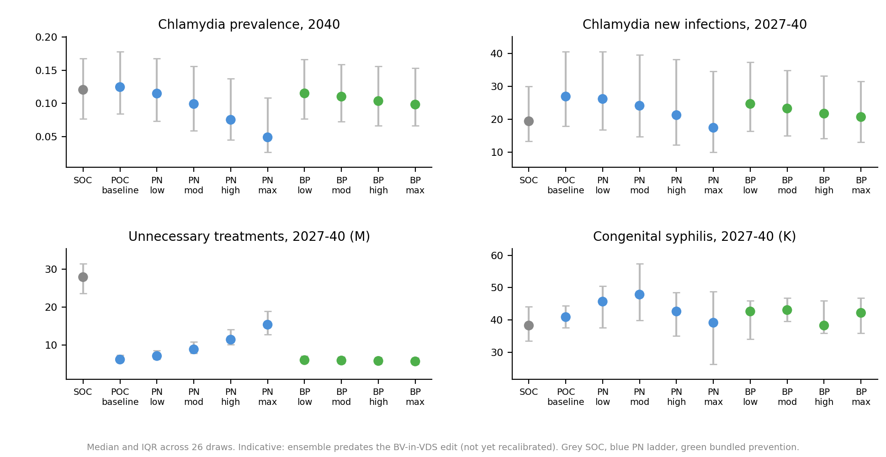

# Exp 08 — PN × bundled-prevention scenario run (ensemble) — SUMMARY

**Scope.** 10 cells (SOC + POC reference + PN ladder + BP ladder) × 26 draws ×
1 seed = 260 sims. Calibration ensemble: exp 04 (per-disease sustainability,
HIV/syph/NG/CT/TV all sustaining). Sweep design in `scenarios.py`
(`PN_INTENSITY`, `BUNDLED_PREVENTION`); driver in `run.py`. POC switch +
bundled prevention activate at 2027; endpoints summed / measured at 2027–2040.

**Run.** 260/260 sims completed, 0 errors, 26 min wall on 60 workers.
Results: `outputs/results.jsonl` (one row per cell × draw × seed).

## Headline result

Slide-style 4-panel summary (CT end-prev, CT incidence, unnecessary tx,
congenital syph) across all 10 cells with IQR error bars; written by
`figures.py`. Tidy median table dumped to
`outputs/cell_summary_median.csv`.

PN coverage, layered on POC dx, drives the prevalence reductions:

| cell             | NG end-prev | CT end-prev | TV end-prev | syph end-prev | LBW per birth |
|------------------|-------------|-------------|-------------|---------------|---------------|
| SOC              | 0.065       | 0.120       | 0.145       | 0.142         | 0.0612        |
| POC_pn_baseline  | 0.064       | 0.125       | 0.123 (−15%)| 0.127 (−11%)  | 0.0632 (+3%)  |
| POC_pn_low       | 0.064       | 0.115 (−5%) | 0.105 (−28%)| 0.124 (−12%)  | 0.0578 (−6%)  |
| POC_pn_moderate  | 0.064       | 0.099 (−18%)| 0.076 (−48%)| 0.115 (−19%)  | 0.0474 (−23%) |
| POC_pn_high      | 0.064       | 0.075 (−38%)| 0.050 (−65%)| 0.104 (−27%)  | 0.0399 (−35%) |
| POC_pn_maximum   | 0.064       | 0.049 (−60%)| 0.030 (−79%)| 0.090 (−36%)  | 0.0328 (−46%) |

Bundled prevention (rel_sus reduction on diagnosed agents, 6-mo window) acts
mainly on NG/TV; weak on CT and syph because the lever only protects already-
diagnosed agents, and bundled prevention does not generate new diagnoses:

| cell             | NG end-prev   | CT end-prev | TV end-prev | syph end-prev | LBW per birth |
|------------------|---------------|-------------|-------------|---------------|---------------|
| POC_pn_baseline  | 0.064         | 0.125       | 0.123       | 0.127         | 0.0632        |
| POC_bp_low (25%) | 0.060 (−8%)   | 0.115 (−5%) | 0.118 (−19%)| 0.130 (−8%)   | 0.0622 (+2%)  |
| POC_bp_moderate  | 0.058 (−12%)  | 0.110 (−9%) | 0.113 (−22%)| 0.133 (−6%)   | 0.0610 (≈0)   |
| POC_bp_high      | 0.054 (−17%)  | 0.104 (−14%)| 0.106 (−27%)| 0.136 (−4%)   | 0.0602 (−2%)  |
| POC_bp_maximum   | 0.053 (−18%)  | 0.098 (−18%)| 0.099 (−32%)| 0.134 (−5%)   | 0.0584 (−5%)  |

### Unnecessary treatments

POC dx alone (no PN ladder, no BP) cuts unnecessary treatment courses by
roughly five-fold relative to SOC, across all four bacterial STIs. Numbers
are window totals over the calibrated ensemble (median, millions):

| cell             | NG unnec | CT unnec | TV unnec | syph unnec |
|------------------|----------|----------|----------|------------|
| SOC              | 11.5     | 7.1      | 3.8      | 5.6        |
| POC_pn_baseline  | 2.2      | 1.4      | 2.2      | 0.4        |
| POC_pn_maximum   | 6.1      | 3.1      | 4.1      | 2.1        |
| POC_bp_maximum   | 1.9      | 1.4      | 2.0      | 0.4        |

The PN-maximum cell still beats SOC on unnecessary tx (NG 6.1M vs 11.5M) — POC
dx + PN scales total tx volume but not at the cost of precision.

## Observations

- **POC dx alone is a small mover on prevalence**, except for TV (−15%) and
  syph (−11%). The headline effect of switching dx is in **treatment
  precision** (−80% unnecessary tx), not in prevalence.
- **PN intensity is the lever for STI prevalence and APO.** End-prevalence of
  CT, TV, and syph fall monotonically with PN; LBW rate per birth drops from
  0.063 → 0.033 (−46%) across the ladder. SGA falls in parallel (−21%).
- **NG is the anomaly:** end-prev is flat across the PN ladder (−1.2% at
  maximum). NG transmission is so fast / re-acquisition so rapid that
  partner-treatment alone doesn't catch up; reduction requires the
  prevention lever. (Confirmed: POC_bp_maximum delivers NG −18%.)
- **Bundled prevention is the lever for NG**, and gives a modest second lift
  on TV. It barely touches CT or syph end-prev, and has near-zero effect on
  APO (LBW −5% at full coverage). This is consistent with the lever being a
  protective window on the already-diagnosed; it shrinks reinfection but
  doesn't generate new diagnoses.
- **HIV barely moves** in either ladder (+1.4% to +1.5%). Expected — neither
  lever changes HIV exposure directly. (Bundled prevention's coverage is
  conditional on STI diagnosis, not on HIV serostatus.)
- **`cumulative new_infections` is a misleading headline for syph under
  high PN.** New_infections rises monotonically (+96% at PN-max) while
  end-prevalence falls (−36%). This is a counting artefact: aggressive
  treatment shortens infected duration, which raises agents' susceptible
  time and accelerates the next reinfection event. **For syph, end-prev
  and APO are the load-bearing outcomes**, not cumulative infections.
  CT/TV don't show this artefact because higher PN also reduces their
  cumulative incidence (CT −10%, TV −47% at PN-max).

## Caveats

- **Calibration predates the BV-in-VDS edit.** The active model (`model.py`)
  now routes symptomatic BV through VDS via the `bv_care` clause in
  `interventions.seeking_care_vds`, but the exp 04 draws were calibrated
  against the pre-BV-in-VDS model. The BV channel adds care-seeking volume
  for some agents who otherwise wouldn't present; this would shift the
  calibrated betas slightly. **Re-fire calibration with the BV-in-VDS model
  and re-run exp 08 before headline numbers are reported externally.** The
  qualitative ladder shape (PN drops STI prev + APO; BP drops NG/TV;
  POC cuts unnecessary tx) is unlikely to invert, but absolute magnitudes
  may shift by a few points.
- **1 seed per (cell, draw).** Uncertainty bands shown in figures are
  across-draw IQRs, not across-seed. A 3-seed re-run would tighten
  estimates at modest cost (3× wall).
- **PN intensity and BP active for the whole sim**, but the POC switch
  happens at intv_year (2027). This matches exps 05–07's convention. A
  strict from-2027 counterfactual would gate PN at 2027 too; deferred
  unless the cumulative-pre-2027 effect is shown to matter.
- **Bundled prevention is parameterised single-axis (coverage).** Fixed
  `eff=0.50`, `dur=6 months`. Sensitivity to eff/dur is not explored here;
  exp 06 already showed those axes are well-behaved.

## Next

1. Re-fire the exp 04 calibration ensemble against the BV-in-VDS model and
   re-run exp 08 with the new draws (`DRAWS=...`) once it lands. Diff the
   ladder shape: if monotonicity and ranking hold, headline numbers can be
   reported from the re-run; otherwise investigate the cause.
2. Pick a small set of "operational" cells for the slides — likely
   POC_pn_moderate and POC_pn_high as the realistic PN-coverage frontier,
   plus POC_bp_moderate for the NG-targeted scenario.
3. Decide whether to add a strict-2027 PN counterfactual or stay with the
   whole-sim PN convention. Probably not worth the extra run unless
   reviewers flag it.
