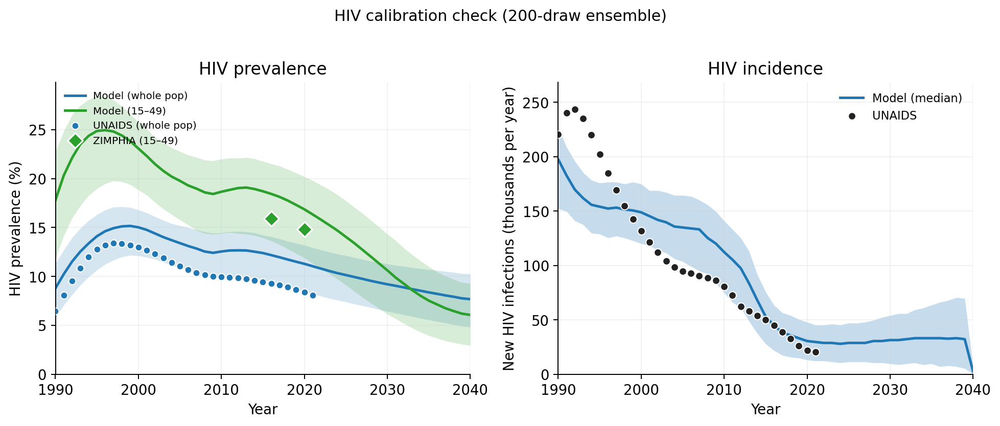

# Calibration summary

**Project.** Zimbabwe joint calibration of an STIsim 1.5.5 / Starsim
3.3.2 model of HIV, syphilis, NG, CT, TV (plus a GUD placeholder and
a fetal-health connector for adverse pregnancy outcomes), supporting a
decision analysis on partner notification (PN) and care-seeking
strategies for STI undertreatment in sub-Saharan Africa.

**Period.** March – June 2026. 41 experiments. Solo (Robyn).

**Deliverable consumed by downstream work.** A 200-draw posterior
ensemble of model parameters, each draw run under 3 random seeds (600
sims total), suitable for propagating parameter uncertainty into the
PN counterfactual scenarios.

## Headline result

The calibration produced a usable posterior for HIV and a partially
usable posterior for syphilis. The HIV time series and 15–49
prevalence sit inside the UNAIDS/ZIMPHIA bands on both denominators.
Syphilis matches the *shape* of the data (age × sex profile, FSW
concentration, stage breakdown, HIV-positive trep+ ratio) but the
absolute prevalence overshoots by 7–14× across all sensitivity
checks; this is a structural ceiling of the model rather than a
calibration miss to fix. Decision analysis therefore propagates the
ensemble in **relative-effect** terms (counterfactual contrasts on
PN coverage) rather than absolute prevalence claims.

## Objectives

- A posterior over the model's transmission and natural-history
  parameters that brackets the available data (UNAIDS HIV, ZIMPHIA
  syphilis 2015–16, Zimbabwe NG/CT/TV surveillance 2000–2040).
- Adequate fidelity on the HIV–syphilis coupling to support the
  manuscript's claim about HIV-positive syphilis burden.
- A draws-level (not point-estimate) artifact, because the downstream
  decision analysis needs to propagate parameter uncertainty.

## Final calibration result, by target

| Target | Data | Model median (80% CI) | Verdict |
|---|---|---|---|
| HIV whole-pop 2010 | UNAIDS ~12% | 12.5% (9.9–14.5) | In band |
| HIV whole-pop 2020 | UNAIDS ~11% | 11.3% (8.4–13.2) | In band |
| HIV 15–49 2016 | ZIMPHIA 15.9% | 18.4% (13.6–21.5) | CI covers |
| HIV 15–49 2020 | ZIMPHIA 14.8% | 16.9% (11.9–20.2) | CI covers |
| HIV+/HIV– trep ratio | 3.0–6.0 | 90% of draws inside band | Pass |
| Syph trep 15–64 2016 | ZIMPHIA 2.7% | 19.6% (17.4–21.3) | ~7× over (structural) |
| Syph nontrep 15–64 2016 | ZIMPHIA 0.8% | 11.8% (9.4–14.4) | ~14× over (structural) |
| Syph FSW prev 2019 | 20–40% | 61% median | ~1.5× over (structural) |
| Syph stage shares | primary ~55 / sec ~35 / latent ~10 | 96–100% draws in band | Pass |
| NG prev 2010+ | ~1.5–2% | 1.5–2% median | Pass |
| TV prev 2010+ | ~10% | ~10% to 2010, ~8% by 2025 | Mostly in band |
| CT prev F 25–29 2010+ | ~12% | 25% median; CI covers data | Weak; structural under-calibration flagged |

## Major decisions

1. **Method shifted from history matching + emulation to LHS +
   robust-ensemble filtering.** Eight HM waves (exp 09) reduced the
   8-parameter prior volume by 99% but the Bayes-linear emulator could
   not handle the syphilis sustained/decay bimodality (R² ≤ 0.25).
   Final approach: large LHS, single-seed filter on sustained+pass
   count, 3-seed robustness re-run, sustainability-and-target
   selection.

2. **Observability layer fixed before any further calibration.** Early
   "syphilis dies out" diagnoses were resolved (exp 16, 17) by mapping
   model state to *detectable* prevalence — the non-trep RDT
   observable, not the underlying total. Roughly a 3.2× invisible
   late-latent reservoir, consistent with WHO guidance. Opened
   `time_to_undetectable` as a calibration parameter.

3. **HIV coupling levers were opened explicitly.** `rel_sus_syph_hiv`
   and `rel_trans_syph_hiv` brought the HIV+/HIV− syph trep ratio
   from 37% pass rate (single-seed early work) to 90% pass rate in the
   final ensemble (exp 40).

4. **Syphilis absolute prevalence was accepted as a structural
   ceiling.** Three independent attempts to drive it down (observability
   patch, care-seeking ramp, marital coital-decay) confirmed the
   minimum-sustaining force of infection corresponds to an equilibrium
   trep+ ≈ 20% and nontrep+ ≈ 12% — well above ZIMPHIA. Recorded as
   a model limitation rather than a calibration failure.

5. **Baseline PN was switched on for the final ensemble.** Exp 38
   onwards runs PN at stable=0.20 / casual=0.10 by default; the
   ensemble therefore represents a world with PN already active, and
   downstream scenarios contrast against this baseline.

## Final priors

19 parameters opened up for calibration in the final ensemble (exp 40):

- **Disease transmission betas (5):** HIV (`hiv.beta_m2f`), syphilis,
  NG, CT, TV.
- **HIV–syph coupling (2):** `rel_sus_syph_hiv`, `rel_trans_syph_hiv`.
- **HIV initial-state lever (1):** `hiv.rel_init_prev`.
- **Network structure (3):** `prop_f0` (FSW fraction),
  `m1_conc` (general-pop concurrency), `m2_conc` (client concurrency).
- **Syphilis natural history (2):** `time_to_undetectable`,
  `rel_trans_primary`.
- **Marital dynamics (2):** `stable_act_decay`, `client_marital_act_mult`.
- **CT calibration extras (1):** widened `ct.beta` range.
- **Other (3):** miscellaneous tightening priors that survived the
  parameter-engineering iterations.

Condom effectiveness, `p_symp` per disease, `p_symp_care = 0.75`, and
care-seeking rates were held fixed throughout. See
[`assumptions.md`](assumptions.md).

## Final outputs

- `artifacts/draws_used.csv` — 200 robust posterior draws × 19 priors.
  Each row is a parameter set that produced a sustained, plausible
  simulation across all 3 seeds.
- `artifacts/ensemble_ts_quantiles.parquet` — ensemble median + 80%/95%
  CI per (year, disease, result), 1985–2040.
- `artifacts/ensemble_snapshots_quantiles.parquet` — ensemble quantiles
  per (year, disease, result, sex, age_bin) at 2016 and 2020.
- `artifacts/figures/` — 5 publication figures (HIV time series, syph
  time series, syph stage definitions, syph age × sex 2016, other STIs).
- `artifacts/scripts/` — the three workflow scripts that take
  `draws_used.csv` → per-sim results → ensemble quantiles → figures.

Raw per-sim parquets (~13 MB) were not migrated to main; they live on
the archival branch only. They can be regenerated in ~30 minutes on a
24-worker machine from `draws_used.csv` and the workflow scripts.

## Scale

- ~17,000 simulations across the 41 experiments (single sim ≈ 1 min at
  10k agents over 1985–2040).
- Final ensemble pipeline: ~25 hours wall for the 5000-draw LHS phase
  (exp 40 phase 1, 24 workers), ~2 hours wall for the 3-seed Phase 2,
  ~30 min wall for the publication-figure regeneration (exp 41).
- Hardware: an IDM Azure VM in the "Applied Math" subscription, 24
  workers per batch.

## Rationale for adoption

The 200-draw ensemble is the smallest object that
(a) reproduces every published figure,
(b) supports the decision analysis with propagated uncertainty,
(c) is small enough to live in git (74 KB for the parameter table),
and (d) can be re-simulated end-to-end without checking out the
archival branch.

Everything else from the 41 experiments — intermediate sweeps,
abandoned likelihood formulations, the eight HM waves, the bimodal
trajectory selection results, the per-experiment figures — is
preserved on `archive/calibration-2026-06` for any future
investigation but is not required for downstream use.

## Limitations

See [`assumptions.md`](assumptions.md) for the full list. The
manuscript-critical limitations are:

1. **Syphilis absolute prevalence overstates by 7–14× across age and
   sex.** Frame results as relative-effect contrasts; do not make
   absolute claims about syphilis burden.
2. **Stochastic bifurcation.** Even within the final ensemble, draws
   sit near a sustained/decay attractor boundary; behaviour at scale
   beyond 10k agents was not tested.
3. **CT under-calibration.** Model CT median sits 2× above
   surveillance, with the 80% CI covering data. Acceptable for now;
   diagnose if downstream CT-specific claims are needed.

## Next step

Decision-analysis scenarios — counterfactual PN coverage,
care-seeking intensity — propagated through the 200-draw ensemble per
the `decision-analysis` workflow (posterior predictive → NMB → CEAC →
EVPI / EVSI). Tracked in a separate scenario branch off main.
