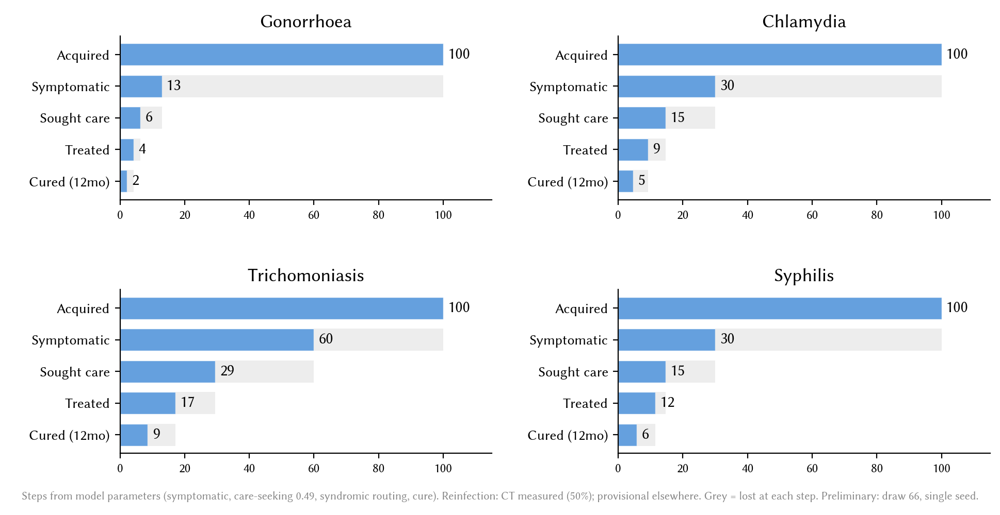
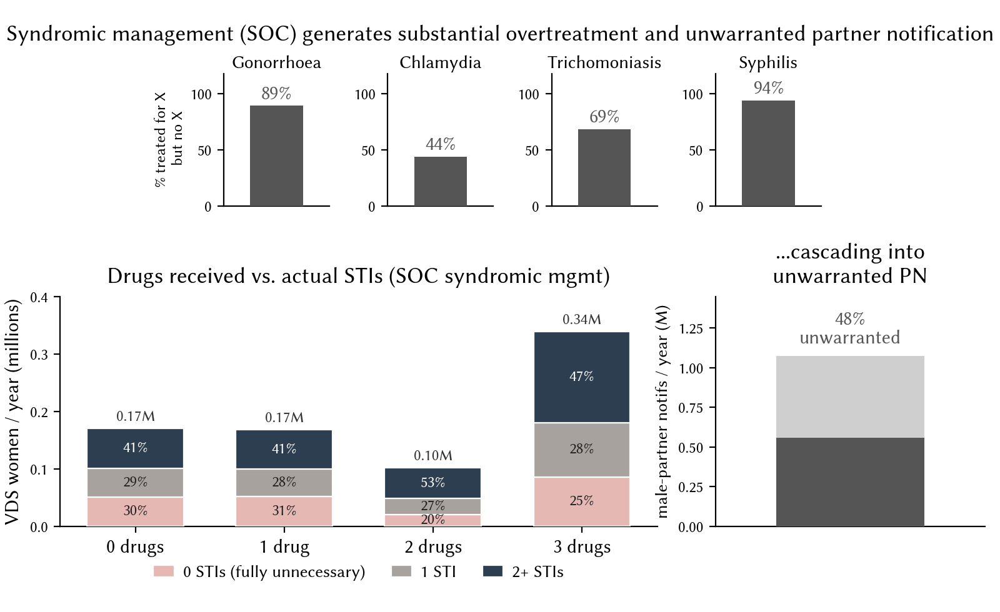
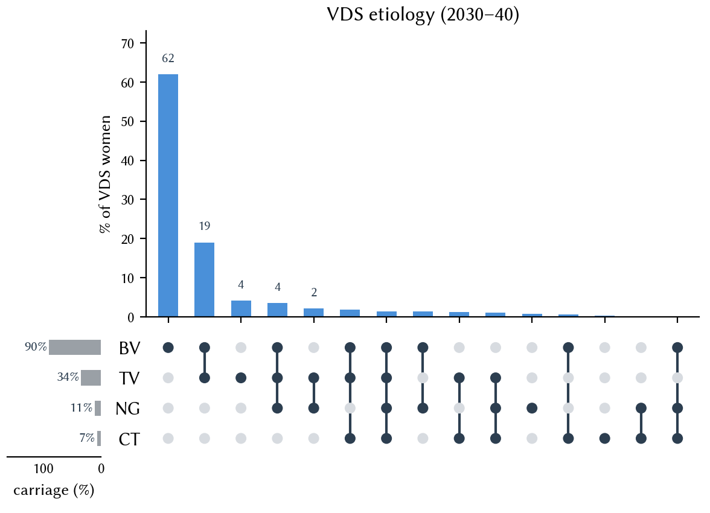
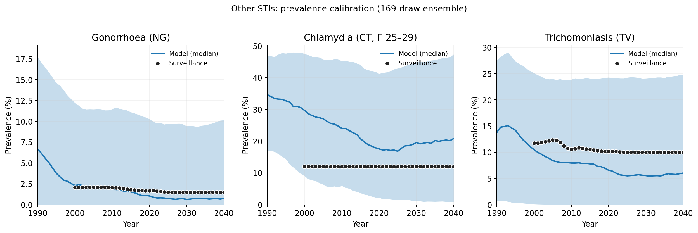
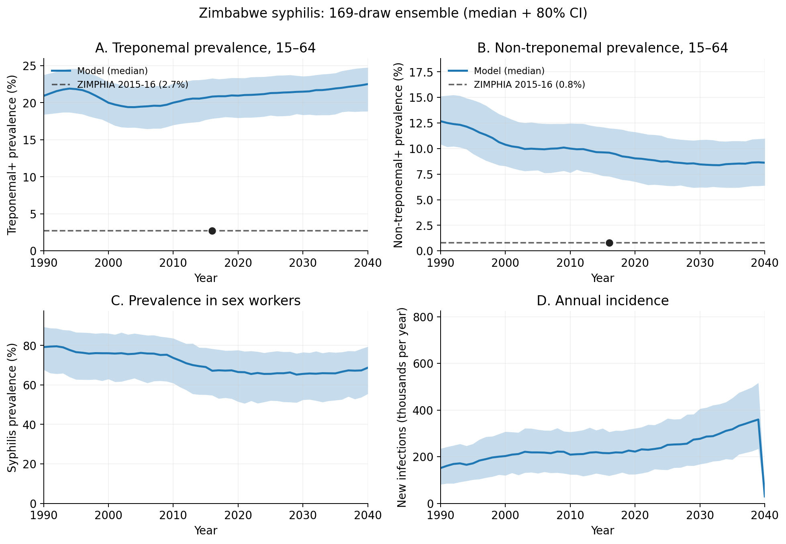

```{python}
# | label: setup
import pandas as pd
from IPython.display import HTML

import prep
import charts

LONG = prep.load_scenarios_long()
TS = prep.load_timeseries()

# Preset comparison sets (ported verbatim from the React section components).
POC_PRESETS = [
    {"key": "soc", "label": "SOC"},
    {"key": "poc", "label": "POC alone", "care": "baseline", "pn": "baseline", "bp": "none"},
]
PN_PRESETS = [
    {"key": "soc", "label": "SOC"},
    {"key": "poc", "label": "POC alone", "care": "baseline", "pn": "baseline", "bp": "none"},
    {"key": "pn_low", "label": "POC + PN low", "care": "baseline", "pn": "low", "bp": "none"},
    {"key": "pn_mod", "label": "POC + PN mod", "care": "baseline", "pn": "moderate", "bp": "none"},
    {"key": "pn_high", "label": "POC + PN high", "care": "baseline", "pn": "high", "bp": "none"},
]
BP_PRESETS = [
    {"key": "soc", "label": "SOC"},
    {"key": "pn_mod", "label": "POC + PN mod", "care": "baseline", "pn": "moderate", "bp": "none"},
    {"key": "bp_low", "label": "+ BP low", "care": "baseline", "pn": "moderate", "bp": "low"},
    {"key": "bp_mod", "label": "+ BP mod", "care": "baseline", "pn": "moderate", "bp": "moderate"},
    {"key": "bp_high", "label": "+ BP high", "care": "baseline", "pn": "moderate", "bp": "high"},
]
CS_PRESETS = [
    {"key": "soc", "label": "SOC"},
    {"key": "cs_base", "label": "POC + PN mod + BP mod", "care": "baseline", "pn": "moderate", "bp": "moderate"},
    {"key": "cs_low", "label": "+ CS low", "care": "low", "pn": "moderate", "bp": "moderate"},
    {"key": "cs_mod", "label": "+ CS mod", "care": "moderate", "pn": "moderate", "bp": "moderate"},
    {"key": "cs_high", "label": "+ CS high", "care": "high", "pn": "moderate", "bp": "moderate"},
]


def preset_compare(presets):
    """Bar + line grids for prevalence and new infections (as PresetTimeseriesCompare)."""
    for metric, bar_label, ts_label in [
        ("prevalence", "End-of-horizon prevalence", "Prevalence"),
        ("new_inf", "New infections (cumulative)", "New infections"),
    ]:
        charts.bar_grid(LONG, presets, metric, bar_label).show()
        charts.ts_grid(TS, presets, metric, ts_label).show()
```

Most curable STIs in women are asymptomatic — the largest drop-off in the cascade from infection to cure. Downstream drop-offs are smaller but more intervenable: symptomatic care-seeking can be increased through demand generation and partner notification; correct treatment rates can be improved by point-of-care (POC) diagnostics; 12-month cure rates can be improved by partner notification and bundled prevention. This dashboard explores the modeled health impact of all four levers, alone and combined, in a Zimbabwe-calibrated STIsim model.



::: fig-note
Steps from model parameters (symptomatic, care-seeking 0.49, syndromic routing, cure). Reinfection: CT measured (50%); provisional elsewhere. Grey = lost at each step. Preliminary: draw 66, single seed.
:::

Syndromic management can't distinguish between STIs, so treatment is symptom-based rather than infection-specific. POC diagnostics improve both sensitivity and specificity, but at the prevalences seen among women presenting with vaginal discharge syndrome, even a highly performant test leaves a meaningful share of false positives — POC narrows the overtreatment gap without closing it.


::: fig-note
The two algorithms this dashboard compares as "SOC" and "POC". (A) Syndromic management: a risk assessment and exam route women toward a spread of treatment outcomes that only loosely track true infection status — whether or not she has a cervical infection, some women are over-treated and some are missed. (B) A POC diagnostic for NG/CT/TV replaces the risk assessment with a test result, so treatment tracks the identified infection directly; presumptive BV treatment is unchanged. Reused from the companion VDS diagnostics analysis (`stisim_vddx_zim`).
:::

But diagnostic accuracy only helps people who reach care. Roughly a third of symptomatic women in sub-Saharan Africa never seek treatment at all, and even treated index cases often don't lead to their partners being notified and treated in turn — the gap this dashboard's demand-generation scenarios (care-seeking, partner notification, bundled prevention) are designed to close.

**Diagnostic performance, SOC vs POC**

```{python}
# | label: diag-table
_pct = ["prev", "sens", "spec", "PPV", "NPV"]
_dp = prep.load_diagnostic_performance()[["disease", "arm"] + _pct].copy()
for c in _pct:
    _dp[c] = (_dp[c] * 100).round(0).astype(int).astype(str) + "%"
_dp.columns = ["Disease", "Arm", "Prevalence*", "Sensitivity", "Specificity", "PPV", "NPV"]
HTML(_dp.to_html(classes="dash", index=False, border=0))
```

::: fig-note
\* Among women presenting with vaginal discharge syndrome.
:::

The poor specificity of syndromic management leads to a sizable number of unnecessary treatments and unwarranted partner notifications.



Despite improvements in sensitivity and specificity, low prevalence means we should temper our expectations around the reduction in overtreatment.



## How do POC diagnostics help? {#results-poc}

POC diagnostics will improve correct treatment rates, but cannot eliminate overtreatment or over-notification.

```{python}
# | label: poc-overtreatment
charts.bar_grid(LONG, POC_PRESETS, "overtreatment", "Overtreatment rate")
```

```{python}
# | label: poc-notification
charts.notif_fig(LONG, POC_PRESETS)
```

Adding POC diagnostics to syndromic management algorithms will not reduce prevalence or incidence.

```{python}
# | label: poc-compare
preset_compare(POC_PRESETS)
```

## What else can help? {#hypothesis}

There are also probably pathways from POC diagnostics to improved demand generation, partner notification, and bundled prevention. The scenarios below explore the roles of demand generation (care-seeking), partner notification, and bundled prevention alongside POC diagnostics, each on a baseline/low/moderate/high intensity ladder.

| Level | Care-seeking (× mult.) | PN — stable: notify / attend f,m | PN — casual: notify / attend f,m | Bundled prevention: coverage |
|---|---:|---:|---:|---:|
| baseline / none | 1.0× | 20% / 80%, 50% | 10% / 50%, 25% | 0% |
| low | 1.25× | 35% / 85%, 60% | 25% / 60%, 40% | 25% |
| moderate | 1.5× | 55% / 90%, 70% | 45% / 70%, 55% | 50% |
| high | 1.8× | 75% / 92%, 80% | 65% / 80%, 70% | 75% |

::: fig-note
Bundled prevention: 50% relative-susceptibility reduction for 6 months while enrolled, fixed across levels — coverage of diagnosed/treated agents enrolled is the only varying parameter.
:::

## Combined strategies {#results-combined}

POC diagnostics + partner notification can decrease prevalence, but incidence remains high due to reinfection.

```{python}
# | label: combined-pn
preset_compare(PN_PRESETS)
```

POC diagnostics + bundled prevention can decrease prevalence and incidence.

```{python}
# | label: combined-bp
preset_compare(BP_PRESETS)
```

POC diagnostics + bundled prevention + care-seeking could effectively quash syphilis, trichomoniasis, and chlamydia.

```{python}
# | label: combined-cs
preset_compare(CS_PRESETS)
```

## Scenario explorer {#explorer}

Check any combination of care-seeking, partner-notification, and bundled-prevention intensity levels to compare them side by side, across all four diseases. SOC (no POC, no added levers) is always shown as the gray reference.

```{python}
# | label: ojs-data
_metrics = ["prevalence", "new_inf", "overtreatment"]
_sc = LONG[(LONG["metric"].isin(_metrics)) & (LONG["disease"].isin([d for d, _ in prep.DISEASES]))].copy()
_sc["disease_label"] = _sc["disease"].map(prep.DISEASE_LABEL)
_sc = _sc[["care", "pn", "bp", "poc", "draw", "disease_label", "metric", "value"]].dropna(subset=["value"])

_nt = LONG[LONG["disease"] == "pn"][["care", "pn", "bp", "poc", "draw", "metric", "value"]].dropna(subset=["value"])

_ts = TS.copy()
_ts["disease_label"] = _ts["disease"].map(prep.DISEASE_LABEL)
_ts = _ts[["care", "pn", "bp", "poc", "year", "value", "metric", "disease_label"]]

ojs_define(scenario_raw=_sc)
ojs_define(notif_raw=_nt)
ojs_define(ts_raw=_ts)
```

::: {.ojs-in-a-box}
```{ojs}
//| label: ojs-inputs
viewof metric = {
  const opts = [["prevalence", "Prevalence"], ["new_inf", "New infections"],
                ["overtreatment", "Overtreatment"], ["notification", "PN over/under-notification"]];
  const root = html`<div class="metric-tabs">`;
  const btns = opts.map(([val, label]) => {
    const b = html`<button type="button">${label}</button>`;
    b.value = val;
    b.onclick = () => set(val);
    return b;
  });
  const set = (val) => {
    root.value = val;
    btns.forEach(b => b.classList.toggle("active", b.value === val));
    root.dispatchEvent(new CustomEvent("input"));
  };
  btns.forEach(b => root.append(b));
  set("prevalence");
  return root;
}
viewof careSel = Inputs.checkbox(["baseline", "low", "moderate", "high"], {label: "Care-seeking", value: ["baseline"]})
viewof pnSel   = Inputs.checkbox(["baseline", "low", "moderate", "high"], {label: "PN intensity", value: ["baseline"]})
viewof bpSel   = Inputs.checkbox(["none", "low", "moderate", "high"], {label: "Bundled prevention", value: ["none"]})
```
:::

```{ojs}
//| label: ojs-derive
scenarios = transpose(scenario_raw)
notif = transpose(notif_raw)
timeseries = transpose(ts_raw)
diseaseOrder = ["Gonorrhoea", "Chlamydia", "Trichomoniasis", "Syphilis"]
metricLabels = ({prevalence: "End-of-horizon prevalence", new_inf: "New infections (cumulative)", overtreatment: "Overtreatment rate"})
tsLabels = ({prevalence: "Prevalence", new_inf: "New infections"})
palette = ["#0E7490", "#B35806", "#2E86C1", "#6A9F58", "#A6449B", "#C2871C", "#D6604D", "#4F6D7A"]

// Cross-product of checked levels. Labels drop any axis with a single level
// selected (redundant), so they stay short; SOC is always the first bar.
combos = {
  const out = [];
  for (const care of careSel)
    for (const pn of pnSel)
      for (const bp of bpSel) {
        const parts = [];
        if (careSel.length > 1) parts.push(care);
        if (pnSel.length > 1) parts.push(pn);
        if (bpSel.length > 1) parts.push(bp);
        out.push({care, pn, bp, label: parts.join("/") || "POC"});
      }
  return out;
}
armLabels = ["SOC", ...combos.map(c => c.label)]
lineColor = ({domain: armLabels, range: armLabels.map((a, i) => a === "SOC" ? "#555555" : palette[i % palette.length])})

stat = vals => {
  const s = vals.slice().sort(d3.ascending);
  return {median: d3.quantile(s, 0.5), p25: d3.quantile(s, 0.25), p75: d3.quantile(s, 0.75)};
}
matchArm = (d, c) => d.poc === true && d.care === c.care && d.pn === c.pn && d.bp === c.bp
```

```{ojs}
//| label: ojs-warning
combos.length > 8
  ? html`<p style="color:#b45309; font-size:0.85em; margin:0.3rem 0">${combos.length} combinations selected — the chart may be hard to read. Consider unchecking a few boxes.</p>`
  : html``
```

```{ojs}
//| label: ojs-charts
diseaseAgg = {
  const rows = scenarios.filter(d => d.metric === metric);
  const out = [];
  for (const dl of diseaseOrder) {
    const soc = rows.filter(d => d.disease_label === dl && d.poc === false).map(d => d.value);
    if (soc.length) out.push({disease: dl, arm: "SOC", isSoc: true, ...stat(soc)});
    for (const c of combos) {
      const v = rows.filter(d => d.disease_label === dl && matchArm(d, c)).map(d => d.value);
      if (v.length) out.push({disease: dl, arm: c.label, isSoc: false, ...stat(v)});
    }
  }
  return out;
}

tsAgg = {
  if (metric !== "prevalence" && metric !== "new_inf") return [];
  const rows = timeseries.filter(d => d.metric === metric);
  const out = [];
  for (const dl of diseaseOrder) {
    for (const r of rows.filter(d => d.disease_label === dl && d.poc === false))
      out.push({disease: dl, arm: "SOC", year: r.year, value: r.value});
    for (const c of combos)
      for (const r of rows.filter(d => d.disease_label === dl && matchArm(d, c)))
        out.push({disease: dl, arm: c.label, year: r.year, value: r.value});
  }
  return out;
}

notifAgg = {
  const out = [];
  const build = (arm, isSoc, filt) => {
    for (const [series, m] of [["Over", "over_notification"], ["Under", "under_notification"]]) {
      const v = notif.filter(d => d.metric === m && filt(d)).map(d => d.value);
      if (v.length) out.push({arm, series, isSoc, ...stat(v)});
    }
  };
  build("SOC", true, d => d.poc === false);
  for (const c of combos) build(c.label, false, d => matchArm(d, c));
  return out;
}

function diseaseBar(dl) {
  const data = diseaseAgg.filter(d => d.disease === dl);
  return Plot.plot({
    title: dl, width: Math.max(405, 80 + armLabels.length * 52), height: 270,
    marginLeft: 58, marginBottom: 84,
    x: {label: null, domain: armLabels, tickRotate: -35},
    y: {label: metricLabels[metric], grid: true, zero: true},
    color: {domain: [true, false], range: ["#555555", "#0E7490"]},
    marks: [
      Plot.barY(data, {x: "arm", y: "median", fill: "isSoc", tip: true}),
      Plot.ruleX(data, {x: "arm", y1: "p25", y2: "p75", strokeWidth: 1.4, stroke: "#333"}),
      Plot.ruleY([0])
    ]
  });
}

function diseaseLine(dl) {
  return Plot.plot({
    title: dl, width: 405, height: 230, marginLeft: 58, marginBottom: 34,
    x: {label: null, tickFormat: "d"},
    y: {label: tsLabels[metric], grid: true},
    color: lineColor,
    marks: [Plot.line(tsAgg.filter(d => d.disease === dl),
                      {x: "year", y: "value", stroke: "arm", strokeWidth: 1.8, tip: true, curve: "monotone-x"})]
  });
}

function notifPlot() {
  return Plot.plot({
    width: Math.max(360, 120 + armLabels.length * 90), height: 340,
    marginLeft: 58, marginBottom: 90,
    x: {axis: null}, fx: {label: null, domain: armLabels, tickRotate: -35},
    y: {label: "Rate", grid: true, zero: true},
    color: {domain: ["Over", "Under"], range: ["#B35806", "#2E86C1"], legend: true},
    marks: [
      Plot.barY(notifAgg, {fx: "arm", x: "series", y: "median", fill: "series", tip: true}),
      Plot.ruleX(notifAgg, {fx: "arm", x: "series", y1: "p25", y2: "p75", strokeWidth: 1.4, stroke: "#333"}),
      Plot.ruleY([0])
    ]
  });
}

metric === "notification"
  ? notifPlot()
  : metric === "overtreatment"
    ? html`<div style="display:flex; gap:16px; flex-wrap:wrap">${diseaseOrder.map(diseaseBar)}</div>`
    : html`<div>
        <div style="display:flex; gap:16px; flex-wrap:wrap">${diseaseOrder.map(diseaseBar)}</div>
        <div style="margin:0.75rem 0 0.25rem">${Plot.legend({color: lineColor})}</div>
        <div style="display:flex; gap:16px; flex-wrap:wrap">${diseaseOrder.map(diseaseLine)}</div>
      </div>`
```

## Methods {#methods}

**Model.** STIsim simulation of HIV, syphilis, gonorrhoea (NG), chlamydia (CT), trichomoniasis (TV), and bacterial vaginosis (BV) in Zimbabwe, with structured sexual networks and partner-notification edges. The custom slot wires a FetalHealth connector for adverse pregnancy and birth outcomes.

**Calibration.** 2000-draw Latin hypercube sample over 19 open parameters (disease betas, HIV–syphilis coupling, network structure, syphilis natural history), single-seed filtered on sustainability and target pass count, then re-run at 3 seeds per surviving draw for robustness. The resulting 169-draw posterior ensemble (507 sims total) is used throughout this dashboard — results always reflect that ensemble's spread, not a single point estimate.

<div style="display:flex; gap:1rem; flex-wrap:wrap; margin:0.75rem 0">


</div>

**Scenario design.** Three intensity ladders (care-seeking, partner-notification, bundled prevention), each with 4 levels, layered on a standard-of-care (SOC) vs point-of-care (POC) diagnostics factorial — 65 cells total (SOC + 4×4×4 POC combinations), each run across the full posterior ensemble. Ladders diverge from SOC-equivalent levels only from the 2027 intervention year onward.
