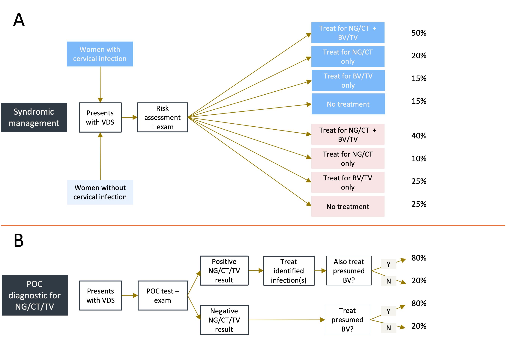
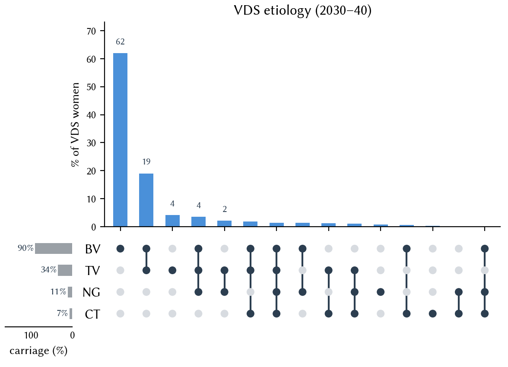
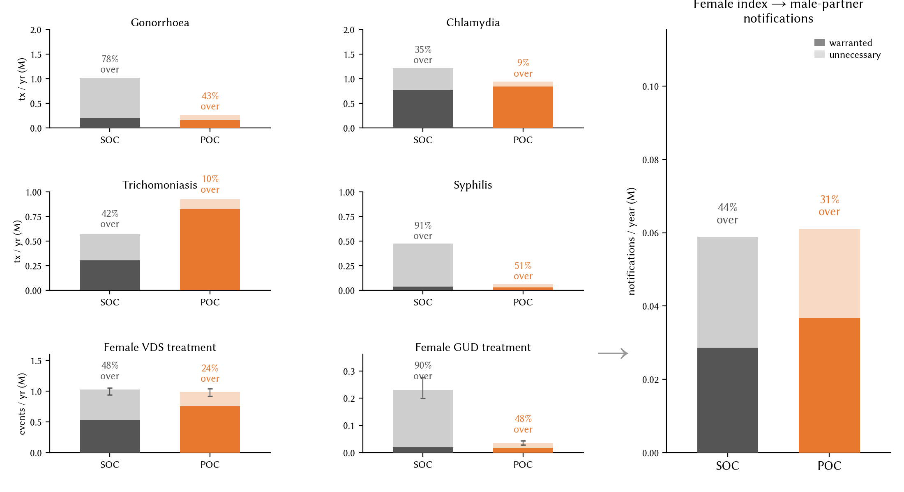
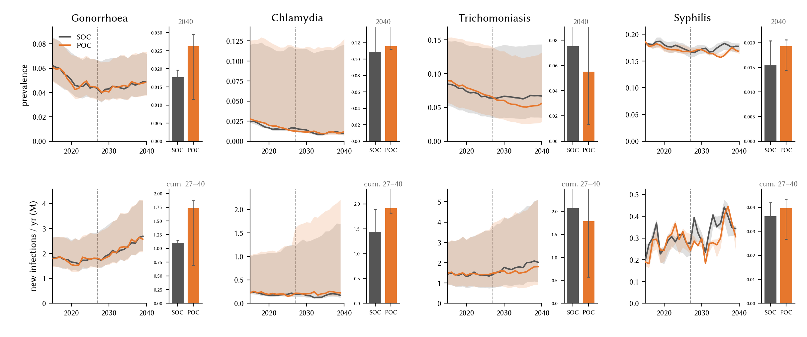
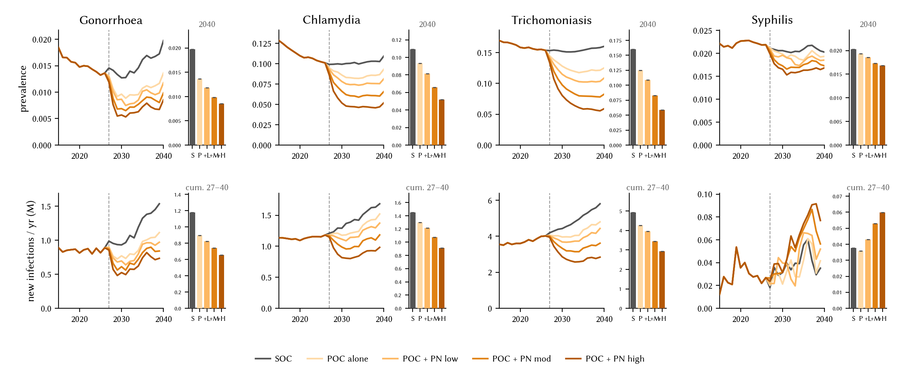
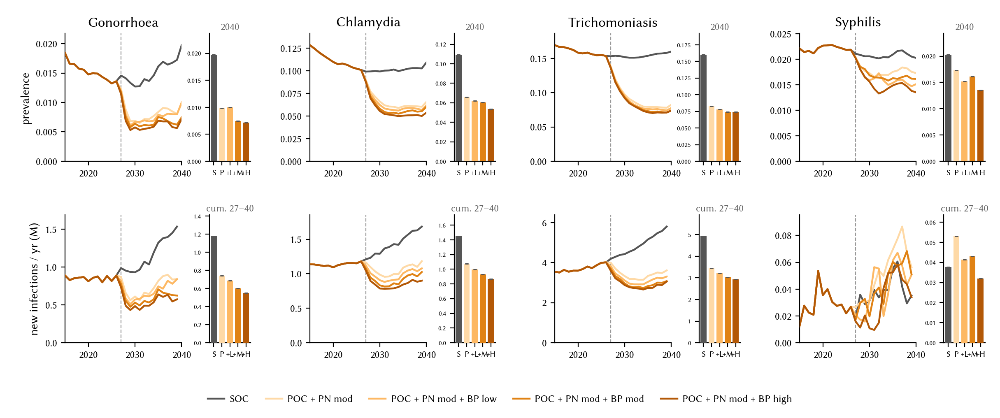
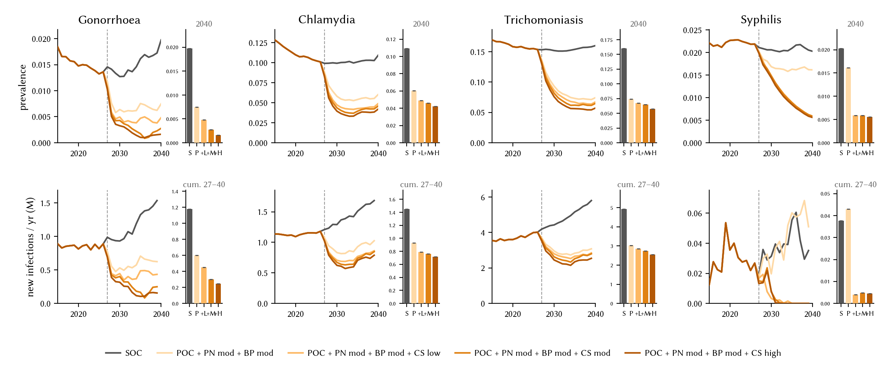
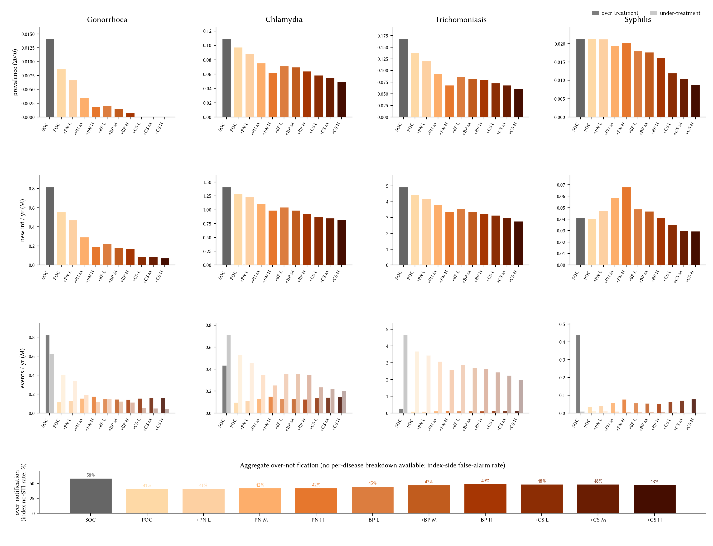

# Closing the undertreatment gap: the health impact of demand-generation and diagnostic strategies for sexually transmitted infections in Zimbabwe

Robyn M. Stuart, Lori M. Newman, Michael Marks, Griffins Manguro, Chido Dziva Chikwari, Remco P.H. Peters, Darcy W. Rao

*Authors TBC.*

# Introduction

Curable sexually transmitted infections (STIs) remain a major cause of preventable morbidity across much of sub-Saharan Africa, contributing to pelvic inflammatory disease, infertility, adverse pregnancy and birth outcomes, and onward HIV transmission \[1,2\]. For women presenting with vaginal discharge symptoms or genital ulcers, the World Health Organization recommends syndromic management — treating a presenting symptom rather than a laboratory-confirmed infection — as the standard of care in settings without diagnostic capacity \[1\]. Women presenting with vaginal discharge syndrome (VDS) can be presumptively treated for gonorrhea (NG), chlamydia (CT), and trichomoniasis (TV), while women and men presenting with genital ulcer disease (GUD) can be presumptively treated for syphilis. First introduced by WHO in 1984 and updated multiple times since, syndromic management has been the operational backbone of STI care in low- and middle-income countries for more than three decades, expanding access to same-visit treatment in settings without laboratory infrastructure and remaining the recommended approach across most of sub-Saharan Africa \[1,3\].

Whilst syndromic management has clear benefits — simplicity, speed, and prioritization of not leaving symptomatic infections untreated — by definition it leads to a substantial excess of treatment relative to need in those presenting for care. This overtreatment has at least three immediate consequences documented in the literature. First, unnecessary antibiotic use adds pressure to already-strained pharmaceutical supplies: benzathine penicillin (the first-line treatment for syphilis) has been in periodic global shortage over the past decade, with presumptive treatment volumes identified as a substantial contributor to demand and to stockouts that have themselves driven undertreatment of pregnant women in some settings \[4,5\]. Second, unnecessary NG antibiotic courses contribute to antimicrobial-resistance (AMR) selection pressure on NG, a pathogen for which WHO's Global Antimicrobial Resistance Surveillance Program has documented reduced susceptibility to first-line ceftriaxone and rising azithromycin resistance across the African region, with limited surveillance coverage compounding the risk of unrecognized spread \[6,7\]. Third, unnecessary treatments impose personal-level harms on the treated patient: STI diagnosis and the associated partner-disclosure decision are documented triggers of anxiety, depression, and stigma \[8\], and disclosure to a sexual partner carries a real risk of intimate-partner violence, particularly for women in casual or already-strained relationships \[9,10,11,12\]. A South African survey of symptomatic STI service attendees found that women reported higher intent to notify partners than men, but that fear of negative partner reactions, including physical and emotional violence, was the most consistently cited reason for anticipated non-disclosure across both sexes \[13\]. Qualitative work with adolescent girls and young women in Cape Town identified stigma-driven shame, confusion about the mode of transmission, and anxiety about reproductive consequences as the emotional sequelae of a positive STI test; participants frequently wished the notification burden could be transferred to a provider or an anonymous channel rather than delivered face-to-face \[10\]. A false-positive diagnosis magnifies all three of these harms: an unwarranted antibiotic course, an added AMR-selection event, and a disclosure decision whose psychological and safety costs are borne by the patient for no clinical or epidemiological benefit.

Alongside overtreatment, many studies have reported substantial undertreatment of curable STIs under syndromic management (SM). This finding requires care in interpretation. SM is not designed to treat asymptomatic infections, which account for the majority of NG and CT cases in women: a systematic review of low- and middle-income settings estimated that ~53% of NG and ~61% of CT infections in women are asymptomatic, with the proportion higher still in African subgroups \[14\]. Undertreatment relative to the overall infected pool is therefore substantial, but this is not the same as undertreatment among symptomatic care-seekers, which SM is specifically designed to eliminate. Several studies nonetheless report the sensitivity of SM by conditioning on all women with infection rather than only those presenting with symptoms; measured this way, sensitivity has been estimated at 11–68% across settings in a systematic review \[15\]. These figures are dominated by studies whose denominator is a screened or general-population sample rather than a symptomatic-care-seeking one: 48% in a general-population cohort in urban Peru \[16\], 68% among female sex workers in two Indian cities \[17\], 35% in a largely pregnant clinic population in rural Haiti \[18\], 16% in Honduras \[19\], and 11% in Bogotá, Colombia \[20\]. Among women actually presenting with vaginal discharge, sensitivity should approach 100% under a treat-all algorithm, but drops substantially where risk assessment triages who receives treatment: Cornier et al reported 62.5% among women presenting with VDS in Sofia, Bulgaria \[21\]. Even where national guidelines specify a treat-all algorithm, in practice their interpretation and implementation are likely to vary substantially — reflecting the subjective nature of risk assessments and physical examinations (with or without speculum), variable clinical training, and the impact of drug stockouts on what a provider is able to dispense on any given visit \[22\]. Our previous companion analysis \[23\] therefore modeled a plausible range of SM operational fidelity — from strict risk-assessment adherence to a treat-most implementation — and reported that adding a highly sensitive point-of-care (POC) diagnostic delivered 85–95% reductions in unnecessary NG/CT antibiotic courses across that range, alongside meaningful gains against the residual symptomatic-care-seeker undertreatment. A parallel analysis of active-syphilis diagnostics reported a comparable ~3-fold reduction in unnecessary syphilis treatments when POC non-treponemal and GUD-specific tests are added to antenatal, key-population, and syndromic-GUD screening \[24\].

This study builds on a growing body of modeling and empirical work (including our own \[23,24\]) that has evaluated the potential for syndromic management algorithms to be strengthened by the addition of POC STI diagnostics. That work has focused on the supply side of the treatment cascade and on the immediate proximal benefits of improved sensitivity and specificity: reductions in overtreatment, gains in correct detection, and the cost thresholds under which the diagnostic pays for itself. Here we broaden the analysis to ask how POC diagnostics operate within the wider treatment-and-prevention ecosystem, and specifically to test whether receiving a definitive, on-the-day diagnosis reshapes outcomes through three demand-side channels beyond the immediate treatment decision. First, the prospect of a definitive result may itself incentivize more symptomatic people to seek care, narrowing the care-seeking gap: across sub-Saharan Africa an estimated 66% of women with STI symptoms seek healthcare, with country-level estimates ranging from 38% to 86% \[25\], leaving a third or more of symptomatic women unreached by any diagnostic pathway. Second, a specific diagnosis enables more targeted and intentional partner notification — the index patient can disclose a named exposure rather than a syndromic label, plausibly increasing both the likelihood that a notified partner presents for testing and the appropriateness of the follow-on treatment. A Cochrane review of partner-notification strategies found no single approach reliably superior across settings, with especially limited evidence from HIV/syphilis and from resource-limited countries \[26\]; provider-delivered alternatives such as expedited or accelerated partner therapy have shown high acceptability where piloted, including among adolescent girls and young women in Kenya \[27,28\], but are not yet part of standard practice in the region. Third, a confirmed diagnosis — rather than an empirical treatment for a suspected condition — may be more strongly associated with post-diagnosis behavioral moderation, particularly consistent and correct condom use during the vulnerable re-acquisition window immediately after treatment. Taken together, we hypothesize that adding POC diagnostics to syndromic management will yield both a higher rate of *warranted* partner notification (through improved case detection and better-targeted disclosure) and a lower rate of *unwarranted* partner notification (through the elimination of the false-positive index cases that syndromic management inevitably generates).

To test these hypotheses, we use a Zimbabwe-calibrated STIsim model \[29\] of co-transmitting HIV, syphilis, NG, CT, TV, and BV. We hold the calibrated transmission parameters fixed while varying three independent, combinable levers alongside the SOC-vs-POC diagnostic step — one for each demand-side channel above: symptomatic care-seeking (the probability that a symptomatic agent presents for VDS or UDS care), partner-notification intensity (notification and attendance rates across sexual-network edges), and bundled prevention (condoms plus counseling for newly-diagnosed agents). Our aims are threefold: (i) quantify how far demand-generation strategies alone can close the residual undertreatment gap left by improved diagnostics; (ii) identify the *minimal* intensities of care-seeking and partner-notification reach needed to meaningfully interrupt onward transmission of curable STIs over 2027–2040; and (iii) assess whether improved diagnostic accuracy reduces the burden of *unnecessary* partner notification and its associated psychological and safety harms, alongside unnecessary treatment. The framing of aim (ii) as *minimal-necessary* rather than *maximally-effective* PN intensity reflects the harm considerations discussed above: given the interpersonal, safety, and mental-health costs that PN can impose on the index patient, we do not advocate for maximally-intensive PN in all cases, and instead seek the intensity beyond which further scaling offers diminishing epidemiological returns.

# Methods

## Study setting

Zimbabwe illustrates the scale of the problem for a country in sub-Saharan Africa. The STICH cluster-randomized trial found that nearly a quarter of young women aged 16–24 had at least one of NG, CT, or TV in 2020 \[30\]; syphilis seroprevalence among adults is estimated at around 1–3% \[31\]; and the country's generalized HIV epidemic (adult prevalence ~11%) compounds the consequences of untreated STIs. We chose Zimbabwe as the analytic setting because these features (moderate curable-STI prevalence, high HIV background, and an established syndromic-management program) are broadly shared across countries in the region, and because we have previously calibrated the STIsim model to Zimbabwean data as part of the companion analyses \[23,24\]. Figure 1 (adapted from \[23\], and referenced throughout Methods and Results) shows the syndromic-management algorithm we implement as SOC (panel A) and the POC-augmented algorithm we implement as the diagnostic-accuracy arm (panel B).

## Model overview

We used STIsim \[29\], an agent-based microsimulator built on the Starsim platform \[32\], to jointly simulate HIV, syphilis, NG, CT, TV, and bacterial vaginosis (BV) among a simulated population of 10,000 individuals representative of Zimbabwe in 1985. The population was scaled to the Zimbabwean national population using UN estimates of age-specific fertility, age- and sex-disaggregated mortality, and overall population size \[33\]. We constructed an age- and risk-structured heterosexual network with three risk groups governing partnership formation rates and concurrency: individuals who marry and do not have extramarital relationships; individuals who marry, may divorce, and may have extramarital relationships; and individuals who never marry. We modeled transactional sex by assigning approximately 10% of women to a high-risk group, within which a smaller fraction engage in sex work at any given time, corresponding to an estimated ~40,000 female sex workers nationally \[34\]. Pregnancy timing was governed by age-specific fertility rates from UN World Population Prospects \[33\].

## Disease dynamics

We modeled HIV as previously described \[23\], including scale-up of antiretroviral therapy (ART) from 2004 onwards, with ART reducing onward transmission probability by ~96% among virally suppressed individuals. NG, CT, and TV natural history followed \[23\]: infections clear naturally in the absence of treatment for NG and CT, while a fraction of TV infections persist in women. A share of infections in each pathogen produces symptoms, with symptomaticity and duration varying by pathogen and sex: NG and CT primarily present as discharge in women and urethral discharge in men, while TV primarily presents as vaginal discharge in women. Symptomatic infections drive presentation for vaginal or urethral discharge syndrome (VDS/UDS). Syphilis natural history and maternal-to-child transmission were parameterized as in \[24\]. Bacterial vaginosis was modeled as an additional contributor to VDS presentation; prevalence was assumed at 40% \[35,36\], with 10% of BV cases producing symptomatic discharge annually. We modeled bidirectional interactions between HIV and syphilis, with the strength of association varying by HIV treatment status.

## Standard of care

Under the standard of care (SOC), women presenting with VDS were routed through the syndromic-management algorithm shown in Figure 1A \[37\]. The algorithm relies on physical exam and risk assessment as imperfect proxies for the presence of a cervical infection, so treatment decisions are made without an etiological diagnosis. We modeled the "treat-most" implementation identified as the most plausible SOC operation in \[23\]: NG/CT antibiotics were prescribed to 70% of women with a cervical infection and 50% of those without; metronidazole (covering BV and TV) was prescribed to 65% of women, alone or in combination; and 15%/25% of women with/without cervical infection received no treatment. Men presenting with UDS received an analogous NG/CT regimen. People presenting with genital ulcer disease (GUD) received presumptive syphilis treatment following WHO guidance, with sensitivity of 80% relative to true syphilitic ulcers, reflecting real-world deviations from guideline adherence \[24\]. Pregnant women attending antenatal care (ANC) were screened for syphilis using a treponemal rapid diagnostic test (RDT); positives triggered maternal and fetal treatment.

***Figure 1.** Standard-of-care syndromic management (panel A) and a hypothetical augmented algorithm with a point-of-care diagnostic for NG/CT/TV (panel B), for women presenting with vaginal discharge syndrome. Adapted from the companion analysis of diagnostic accuracy for VDS management in Zimbabwe \[23\].*

## Point-of-care diagnostics

The POC intervention (Figure 1B) replaces the risk-assessment step of the SOC algorithm with an etiological test. From 2027 onwards, women and men presenting with VDS or UDS were tested using a multiplex POC panel for NG, CT, and TV with 95% sensitivity and 95% specificity per pathogen. Positive results triggered pathogen-specific treatment. Presumptive metronidazole for BV was retained at coverage matched to the SOC implementation. For syphilis, PN attendees received a non-treponemal RDT rather than syndromic treatment, allowing partners of confirmed cases to be tested rather than empirically treated.

## Partner notification

We implemented an edge-stratified partner-notification module that, on each timestep, identifies index cases (people who received treatment for NG, CT, TV, or syphilis on the current timestep), walks their current sexual-network edges, and applies edge-type-specific notification and attendance probabilities. Under SOC, PN attendees are routed through syndromic management by sex (women to VDS, men to UDS). Under POC, PN attendees post-2027 are routed through the POC panel plus the non-treponemal syphilis RDT. They receive the full POC workup regardless of symptoms, so partners of confirmed cases only receive treatment for infections they themselves test positive for. Cycle prevention (a notified partner does not re-notify the index patient) is enforced at the module level.

## Intervention levers

We defined three demand-side and prevention levers, each with a baseline plus three intensity levels (Table 2). The care-seeking (CS) lever scales the per-timestep probability that a person with symptomatic NG, CT, or TV presents to VDS or UDS. Baseline (multiplier 1.0) reproduces the calibrated SOC care-seeking rate; low, moderate, and high correspond to multipliers of 1.25, 1.5, and 1.8, at which female care-seeking approaches saturation. The partner-notification (PN) lever co-varies notification and attendance probabilities across the sexual network: notification rates specify the probability that a treated index patient names a given current partner (stratified by stable versus casual partnership), and attendance rates specify the probability that a notified partner presents for testing (stratified by partnership type and by partner sex). The bundled prevention (BP) lever enrolls a share of newly-treated patients in a 6-month protection window during which their re-acquisition susceptibility for NG, CT, and TV is reduced by 50%, via condom counseling. Coverage ranges from 0% (none) to 75% (high).

**Table 2.** Intensity ladders for the three demand-side and prevention levers. Baseline reproduces the calibrated SOC operation; the POC scenario factorial varies all three levers against these baseline values.

| Lever | Parameter | Baseline | Low | Moderate | High |
|---|---|---:|---:|---:|---:|
| Care-seeking (CS) | Multiplier on symptomatic care-seeking rate | 1.0 | 1.25 | 1.5 | 1.8 |
| Partner notification (PN) | Notification, stable partner | 20% | 35% | 55% | 75% |
| Partner notification (PN) | Notification, casual partner | 10% | 25% | 45% | 65% |
| Partner notification (PN) | Female attendance, stable | 80% | 85% | 90% | 92% |
| Partner notification (PN) | Female attendance, casual | 50% | 60% | 70% | 80% |
| Partner notification (PN) | Male attendance, stable | 50% | 60% | 70% | 80% |
| Partner notification (PN) | Male attendance, casual | 25% | 40% | 55% | 70% |
| Bundled prevention (BP) | Coverage of newly-treated patients | 0% | 25% | 50% | 75% |

## Scenario design and analysis

We ran a full factorial of the three POC-arm levers (4 CS × 4 PN × 4 BP = 64 cells) plus a single SOC baseline cell that holds all levers at baseline, for 65 scenario cells total. Each cell was run with 5 calibrated posterior draws × 5 sim-averaging seeds (K=5) per draw, with paired seeds constructed such that the SOC baseline reproduces the calibration's K=5 mean exactly and each POC cell's K=5 mean is directly comparable across its shared paired seeds. All levers activated at intv_year = 2027; scenarios were run through 2040. Endpoint metrics were summed over the 2027–2040 window; time-series metrics were reported annually.

For each cell we computed: (i) new infections and end-of-window prevalence per pathogen; (ii) treatment volumes disaggregated into successful (the person receiving treatment was truly infected with the treated pathogen) and unnecessary (the person receiving treatment was not infected with the treated pathogen), using treatment-outcome tags fixed at the moment of treatment, before infection clearance; (iii) partner-notification volumes broken out by index and partner sex, with a false-alarm counter marking index patients whose treatment was unnecessary across NG, CT, and syphilis (excluding metronidazole, which treats both TV and BV and therefore does not admit a clean "no-STI" tag). Cross-draw uncertainty was reported as the median and 25–75 interquartile range (IQR); comparisons to SOC were reported as percent reductions relative to the SOC median.

Calibration to Zimbabwe-specific epidemiological data (ZIMPHIA 2015–16 syphilis and HIV, UNAIDS HIV time series, empirical NG/CT/TV prevalence estimates) is documented separately \[38\] and briefly summarized in the Supplementary Materials. The analysis used the 5 highest-goodness-of-fit posterior draws from a 500-draw Latin hypercube ensemble with K=5 sim-averaging. Code is publicly available.

# Results

## VDS etiology under the calibrated model

Figure 2 presents the etiological composition of vaginal discharge syndrome in the calibrated model, aggregated over 2030–2040. The dominant single etiology is bacterial vaginosis alone (~62% of VDS presentations), followed by TV+BV coinfection (~19%) and TV alone (~4%). NG-containing profiles (NG alone or in combination with any of CT/TV/BV) collectively account for ~11% of VDS; CT-containing profiles account for ~7%. Overall, ~90% of VDS presentations involve BV as at least one etiologic contributor, and ~34% involve TV, reflecting the high background prevalence of both conditions among reproductive-age Zimbabwean women. Coinfections are common: among presentations with any curable STI (NG, CT, or TV), roughly a third involve two or more of these pathogens.

Using our calibrated Zimbabwe model, we estimate that BV underlies the majority of VDS presentations while curable cervical STIs (NG, CT) are present in a minority, a pattern that has strong implications for the specificity of syndromic management. Our estimates on the composition of VDS etiology mirror empirical data reported from the Zimbabwe STI Etiology Study (Chirenje et al 2018), which found in 200 women with symptomatic vaginal discharge at six national STI clinics that BV was present in 25%, NG in 24%, TV in 19%, and CT in 14%, with 27% of women having no pathogen identified by the study assays and coinfections observed in 31% of women with any detected STI \[39\]. Community-based estimates from the STICH cluster-randomized trial among youth in Harare and Bulawayo similarly identified any curable STI (CT, NG, or TV) in ~19–20% of young people, dominated by CT (~13%) and TV (~7%), with NG under 3% \[30,40\]. Our co-infection estimates likewise track those reported in Chikwari et al (2023) \[30\] and in earlier meta-analyses of STIs and BV among women in sub-Saharan Africa \[36\], where BV and TV are consistently the most prevalent conditions detected in symptomatic and asymptomatic women alike.

The practical implication is that any VDS-management algorithm that relies on syndromic presentation alone, without an etiological diagnostic step, will treat the large BV/TV-dominant fraction of the cohort for cervical infections they do not have, in order to avoid missing the smaller NG/CT-containing fraction.

***Figure 2.** Etiologic composition of vaginal discharge syndrome (VDS) presentations in the calibrated Zimbabwe model, aggregated over 2030–2040. Bars show the share of VDS presentations attributable to each combination of underlying etiologies (NG, CT, TV, BV; single, dual, triple, or quadruple coinfection). The matrix below identifies the etiology combination for each bar; the side panel gives the marginal share of each etiology across all VDS presentations.*

## Diagnostic performance of syndromic management vs POC

The etiological structure in Figure 2 translates directly into the population-level diagnostic performance of SOC versus POC (Table 1). For each cervical STI (NG, CT) and for TV and syphilis, we computed positive and negative predictive value (PPV, NPV), false-discovery rate (FDR), and false-omission rate (FOR) at each pathogen's model-estimated prevalence among tested individuals, applying the sensitivity/specificity of SOC syndromic management (70%/50% for NG/CT, 65%/35% for TV, 70%/85% for syphilis via syndromic + treponemal RDT) and of a POC diagnostic (95%/95% for NG/CT/TV; 90%/95% for syphilis via non-treponemal RDT).

The POC test produces large improvements in FDR across all four pathogens: NG FDR falls from 85% under SOC to 30% under POC, CT from 91% to 41%, TV from 66% to 9%, and syphilis from 66% to 33%. However, even with a highly performant test (95% sensitivity and 95% specificity per pathogen), the POC panel's FDR remains substantial for the low-prevalence pathogens: at ~11% NG prevalence in tested women, 30% of NG-positive test results remain false positives, driven by the combination of a non-negligible 5% specificity gap and low true prevalence. This is the diagnostic-arithmetic reason why residual overtreatment persists under POC (see subsequent sections), and why claims of "eliminating" overtreatment through diagnostics-alone strategies overstate what specificity ceilings in the 95% range can achieve at Zimbabwe's STI prevalence.

**Table 1.** Diagnostic performance at pathogen-specific prevalence in the tested population, under standard-of-care syndromic management and under a point-of-care diagnostic.

| Pathogen | Arm | Prev. | Sens. | Spec. | PPV | NPV | FDR | FOR |
|---|---|---:|---:|---:|---:|---:|---:|---:|
| Gonorrhea | SOC | 10.9% | 70% | 50% | 14.6% | 93.2% | **85.4%** | 6.8% |
| Gonorrhea | POC | 10.9% | 95% | 95% | 69.9% | 99.4% | **30.1%** | 0.6% |
| Chlamydia | SOC | 7.0% | 70% | 50% | 9.5% | 95.7% | **90.5%** | 4.3% |
| Chlamydia | POC | 7.0% | 95% | 95% | 58.8% | 99.6% | **41.2%** | 0.4% |
| Trichomoniasis | SOC | 34.5% | 65% | 35% | 34.5% | 65.5% | **65.5%** | 34.5% |
| Trichomoniasis | POC | 34.5% | 95% | 95% | 90.9% | 97.3% | **9.1%** | 2.7% |
| Syphilis | SOC | 10.0% | 70% | 85% | 34.1% | 96.2% | **65.9%** | 3.8% |
| Syphilis | POC | 10.0% | 90% | 95% | 66.7% | 98.8% | **33.3%** | 1.2% |

## POC diagnostics reduce over-treatment and over-notification, but cannot eliminate them

Figure 3 shows how the diagnostic-performance gap in Table 1 propagates into treatment and partner-notification outcomes over 2027–2040 under baseline care-seeking, baseline PN, and no bundled prevention. Under SOC, VDS-associated treatment volumes are large and heavily weighted toward unnecessary treatment: 78% of NG antibiotic courses, 35% of CT courses, 42% of TV courses (metronidazole is retained for presumptive BV coverage), and 91% of syphilis courses in women are given to individuals without the treated infection. Under POC, absolute overtreatment falls across all four pathogens: NG courses drop by ~4-fold, unnecessary CT and TV drop sharply, but the residual over-treatment rate remains 43% for NG, 9% for CT, 10% for TV, and 51% for syphilis, driven by the residual false-discovery rates in Table 1 combined with the low true prevalence of NG and syphilis among tested women.

The rightmost panel of Figure 3 shows the propagation of these residual false positives into partner notification, using the same false-alarm definition as the heatmaps in later sections: of women who triggered PN (their NG/CT/syphilis treatment fired), the share whose treatment was unnecessary across all three pathogens (i.e., a truly STI-negative woman notifying her male partner about a positive test that was in fact a false alarm). Under SOC, 44% of female-index-to-male-partner notifications are unnecessary; under POC this falls to 31%, a ~30% relative reduction. In other words, POC diagnostics do reduce the share of partner notifications that involve a false-positive index, but they do not eliminate them: at 95% per-pathogen specificity, the compound false-positive probability for a truly STI-negative woman going through the POC panel plus the non-treponemal syphilis RDT is ~1 − 0.95⁴ ≈ 18%, and when composed with the tested population's true STI prevalence yields the observed ~30% residual false-alarm rate. This ~30% figure is a floor determined by diagnostic specificity, not by demand-generation intensity.

***Figure 3.** POC diagnostics reduce treatment overprescription and partner-notification false alarms but do not eliminate them. Left panels: annual VDS-associated treatment volumes (millions) in women under SOC (grey) and POC (orange), broken into warranted (dark) and unnecessary (light) components, for NG, CT, TV, and syphilis; the two lower-left panels show total female VDS and GUD treatment events. Right panel: annual female-index-to-male-partner notifications (millions), split into warranted and unnecessary components using the same PN false-alarm definition as the factorial heatmaps in Figure 8.*

## POC diagnostics reduce prevalence and incidence

Figure 4 shows the epidemiological consequences of the treatment-accuracy gains from Figure 3, comparing SOC (grey) to POC-alone with baseline care-seeking, baseline PN, and no bundled prevention (orange). For each of the four curable STIs, we plot annual prevalence (top row) and new-infection rate (bottom row) from 2015 through 2040, together with the end-of-window (2040) endpoint bar.

By 2040, POC-alone reduces prevalence relative to SOC across all four pathogens. NG prevalence declines by the largest relative margin, reflecting the combination of a large SOC unnecessary-treatment burden being eliminated (reducing antimicrobial-driven displacement of treatment away from truly infected agents) and the higher sensitivity of the POC panel closing the undertreatment gap for women who present but would have been missed under the syndromic-management algorithm. CT and TV prevalence also decline, though by smaller relative amounts, consistent with the higher SOC undertreatment burden for NG (only 30% of true infections detected under SOC at the treat-most implementation) compared to CT and TV. Syphilis prevalence declines only modestly under POC-alone: the POC intervention modifies only the syndromic-GUD and PN-attendee pathways for syphilis, leaving the dominant ANC screening pathway unchanged.

New-infection rates (Figure 4, bottom row) show corresponding declines, though the trajectories are noisier and, for NG and TV, exhibit a delay: with baseline PN and no bundled prevention, the reduced size of the treated infection pool takes several years to translate into reduced onward transmission through the sexual network. The 2040 endpoint bars confirm that POC-alone secures a modest but consistent epidemiological benefit even without any change in care-seeking, PN intensity, or prevention counseling; that is, purely from the improved specificity and sensitivity of the diagnostic step.

***Figure 4.** Epidemiological impact of POC diagnostics under baseline care-seeking, baseline PN, and no bundled prevention. For each of NG, CT, TV, and syphilis: top row shows annual prevalence 2015–2040; bottom row shows new infections per year (trimmed to 2039 to avoid the end-year artefact). SOC (grey) and POC (orange) are shown as median lines with 25–75 IQR ribbons across five posterior draws. The small right-hand bar in each panel gives the 2040 endpoint (prevalence) or cumulative 2027–2040 total (new infections).*

## Adding partner notification amplifies the epidemiological benefit

Figure 5 layers three PN intensity levels (low, moderate, high) on top of the POC-alone arm from Figure 4, holding care-seeking and bundled prevention at baseline. Increasing PN intensity progressively reduces prevalence and incidence across all four pathogens, with the largest incremental gains between baseline and moderate PN. At moderate PN, the reinfection loop from untreated sexual partners is meaningfully attenuated: annual new NG infections fall by an additional ~20–30% relative to POC-alone; CT and TV show smaller but consistent declines; and syphilis benefits noticeably, since syphilis-positive index cases identified through GUD or ANC now trigger notification and non-treponemal-RDT testing of current sexual partners rather than being managed in isolation. At high PN intensity, the marginal gains become smaller, a diminishing-returns pattern consistent with saturation of the reachable-partner pool, and reflecting that not all transmission occurs in partnerships that a PN system can identify (e.g., transactional or one-off encounters).

***Figure 5.** Adding partner notification to POC. Five arms shown: SOC, POC-alone, and POC layered with low, moderate, or high PN intensity. Care-seeking and bundled prevention held at baseline. Same 2×4 layout as Figure 4.*

## Bundled prevention (condoms and counseling) further reduces the reinfection loop

Figure 6 anchors PN at moderate, the best-of-three point identified in Figure 5, and layers three bundled-prevention intensity levels (low, moderate, high) on top. Bundled prevention enrolls a share of newly-treated agents into a 6-month protection window during which their re-acquisition susceptibility for NG, CT, and TV is reduced by 50%. The mechanism complements PN: whereas PN reduces reinfection by treating the partner, bundled prevention reduces reinfection by protecting the index during the vulnerable post-treatment window when re-exposure risk is elevated.

Across all four pathogens, adding bundled prevention on top of POC + moderate PN produces further declines in prevalence and incidence, with the magnitude of the gain scaling monotonically with coverage. NG shows the largest absolute reduction because it has the shortest untreated duration and the highest per-act transmission probability, so reducing acquisition risk in the treated pool has an outsized impact on onward transmission. TV, whose infections persist longest in women, shows the smallest incremental gain from BP: reducing new acquisitions has limited effect on the existing reservoir of asymptomatic long-duration infections. Syphilis gains are modest, reflecting that condoms and counseling are only partially protective against genital-ulcer transmission and that the intervention's rel_sus reduction is applied to NG/CT/TV only.

***Figure 6.** Adding bundled prevention (condoms and counseling for the diagnosed) on top of POC + moderate PN. Five arms shown: SOC, POC + PN moderate, and the same layered with low, moderate, or high bundled-prevention coverage. Care-seeking held at baseline. Same 2×4 layout as Figure 4.*

## Increasing care-seeking further compounds the demand-side gains

Figure 7 anchors PN and bundled prevention at moderate and layers three care-seeking intensity levels (low, moderate, high) on top. Care-seeking scales the probability that a symptomatic NG/CT/TV agent presents to VDS/UDS, and thus increases the throughput of the diagnostic pathway rather than its accuracy. Given that ~one-third of symptomatic women in sub-Saharan Africa never seek care \[25\], this lever addresses the fraction of the undertreatment gap that even a perfect diagnostic cannot close on its own.

At moderate care-seeking, annual new infections of NG, CT, and TV fall further relative to the POC + moderate PN + moderate BP anchor: more infected agents present, more are correctly diagnosed and treated (aided by POC's higher sensitivity), and the reinfection loop is further attenuated by PN and BP. At high care-seeking, female care-seeking approaches saturation, so the marginal gain is smaller than the low-to-moderate step. Syphilis gains from care-seeking scaling are more limited: the SOC syph_symp_care rate is held at baseline in our scenarios (the intensity multiplier is applied to VDS/UDS only), and syphilis is dominated by asymptomatic and latent infections that are not reached by a symptomatic-care-seeking lever.

***Figure 7.** Adding care-seeking intensity on top of POC + moderate PN + moderate bundled prevention. Five arms shown: SOC, POC + PN moderate + BP moderate, and the same layered with low, moderate, or high care-seeking multipliers. Same 2×4 layout as Figure 4.*

## Full factorial: combining POC with demand-generation levers

Figure 8 summarizes the full 4 × 4 × 4 factorial of care-seeking, PN, and bundled-prevention intensities layered on top of the POC arm, plotted as the median percent reduction in cumulative new NG + CT + TV + syphilis infections over 2027–2040 relative to SOC. Each of the four panels holds bundled prevention constant (none, low, moderate, high); within each panel, care-seeking increases up the rows (baseline at bottom) and PN intensity increases across the columns (baseline at left).

The heatmap surface confirms the pattern already visible in Figures 5–7: reductions scale roughly monotonically with each of the three demand-side levers, and the levers combine near-additively across most of the factorial. POC-alone (bottom-left of the BP=none panel) delivers a modest ~10–15% reduction in cumulative infections relative to SOC. Adding moderate PN alone raises this to ~25–30%; adding moderate bundled prevention to POC + moderate PN raises it further; and the best-case combination (high care-seeking + high PN + high BP) reaches ~50–60% reduction. Care-seeking is the dominant lever for NG, CT, and TV (consistent with these pathogens being driven by symptomatic presentation), while PN is the dominant lever for syphilis (consistent with its screening-based case detection profile). Bundled prevention amplifies the impact of the other two levers across the surface.

Across all cells in Figure 8, two additional metrics move consistently, though we do not display their heatmaps in the main text. First, cumulative unnecessary treatments for NG + CT + TV + syphilis (i.e., antibiotics given to women without the treated pathogen) drop by 75–85% relative to SOC across the factorial, and the reduction is nearly invariant to demand-generation intensity; that is, unnecessary treatments are driven almost entirely by the diagnostic step (POC vs SOC), not by how many people present or how many partners are notified. This is consistent with the findings of the companion diagnostic-accuracy analysis \[23\], which reported 85–95% reductions in NG/CT unnecessary treatments in the treat-most scenario. Second, the rate of unnecessary partner notification (defined as female PN indexes whose treatment was in fact a false alarm across NG, CT, and syphilis, as introduced in Figure 3) drops by ~30% relative to SOC, and this reduction is also largely invariant to demand-generation intensity: the ~30% figure is a floor determined by the POC panel's compound false-positive probability at Zimbabwe's low STI prevalence, not by PN reach. Improving PN reach reduces the *number* of unnecessary notifications by scaling total notifications up together with warranted ones; it does not reduce the *rate* below what diagnostic specificity permits.

***Figure 8.** Percent reduction, relative to SOC, in cumulative new NG + CT + TV + syphilis infections over 2027–2040, across the full 4 × 4 × 4 factorial of care-seeking (rows, baseline at bottom), partner notification (columns, baseline at left), and bundled prevention (panels: none / low / moderate / high). Values are the median across five posterior draws. Color scale sequential from 0 (dark) to the panel-wide maximum (bright).*

# Discussion

Using a Zimbabwe-calibrated STIsim model, we quantify how three demand-generation and prevention levers (care-seeking intensity, partner-notification reach, and bundled condoms-and-counseling coverage) compose with a point-of-care diagnostic for NG/CT/TV to reduce the disease burden of curable sexually transmitted infections. POC diagnostics alone, holding demand-side factors at their calibrated baselines, produce a ~10–15% reduction in cumulative new infections over 2027–2040 by improving both the specificity and sensitivity of the treatment cascade. Layering PN, bundled prevention, and care-seeking on top progressively raises this reduction to ~50–60% at the highest-intensity combination. Care-seeking is the dominant lever for the discharging STIs (NG, CT, TV); PN is the dominant lever for syphilis. Across the full factorial, POC diagnostics also drive a 75–85% reduction in unnecessary treatments (consistent with the 85–95% reduction reported in the companion VDS diagnostics analysis \[23\]), and a ~30% reduction in the rate of unnecessary partner notifications (female PN indexes triggered by a false-positive treatment). Both of these overtreatment-related reductions are largely invariant to demand-generation intensity, which we interpret as evidence that they are properties of the diagnostic step, not the demand side.

The ~30% floor on unnecessary partner notifications warrants particular attention because partner notification is not epidemiologically neutral to the person doing the notifying. A growing evidence base documents that STI disclosure to a sexual partner carries a real risk of adverse interpersonal consequences for women in sub-Saharan Africa, including fear of blame, accusations of infidelity, relationship dissolution, and, in a non-trivial minority of cases, intimate partner violence. In Cape Town, women receiving an STI diagnosis described worry about partner reactions and cited fear of intimate partner violence or accusations of infidelity as a barrier to notification; many wished the notification burden could be transferred to a provider or an anonymous digital channel \[9,10\]. A South African survey of symptomatic STI service attendees found that women reported higher intent to notify partners than men (84% vs 64%), but that fear of negative partner reactions, including violence, was the most consistently cited reason for anticipated non-disclosure across both sexes \[13\]. At a population level, women who have experienced physical, emotional, or sexual intimate partner violence are significantly more likely to have had an STI in the prior 12 months, reflecting both direct transmission risk from a violent partner and indirect risk from reduced ability to negotiate condom use or refuse sex \[11,12\].

Alongside the interpersonal risk, STI diagnosis and the associated disclosure decision carry a documented mental-health cost. Case-control and cross-sectional studies among women receiving STI diagnoses have reported elevated rates of anxiety and depression relative to matched controls, with anticipation of partner reactions cited as a prominent driver \[8\]. Qualitative work with adolescent girls and young women in Cape Town identified denial, confusion about the mode of transmission, anxiety about reproductive consequences, and stigma-driven shame as the emotional sequelae of a positive STI test, all of which are amplified when the trigger is a false-positive diagnosis rather than a true infection \[10\]. In our modeled scenarios, even under high-intensity POC diagnostics, ~30% of female-index-to-male-partner notifications are triggered by a false alarm, a share that, at the population volumes shown in Figure 3, translates into hundreds of thousands of unnecessary disclosures annually in Zimbabwe. Any program scaling up PN as a demand-generation strategy should be paired with (i) a diagnostic step accurate enough to keep the false-alarm rate below a specified ceiling, and (ii) support pathways (provider-delivered notification, expedited partner therapy, safety screening, and mental-health referral) that reduce the burden of the disclosure decision on the index patient. Provider-delivered options such as expedited partner therapy have shown high acceptability where piloted in the region \[27,28\], and merit inclusion in any implementation plan.

Our results identify concrete implementation levers rather than a single optimal strategy. The dominance of care-seeking for NG/CT/TV suggests that investments in outreach (community demand generation, adolescent-friendly service delivery, mobile clinics, integration with HIV testing) may be at least as impactful as, and complementary to, diagnostic upgrades. The near-additivity of the three levers means that partial implementation captures a proportional share of the potential gain: a country implementing POC + moderate PN without bundled prevention would still see a substantial reduction relative to SOC, and further gains would accrue as the remaining levers scaled. Bundled prevention, i.e., condoms plus counseling for the diagnosed, is a low-technology intervention that operates entirely within existing clinical workflows, so its incremental cost is small; our results suggest that even 25% coverage of the newly-diagnosed produces a meaningful epidemiological gain when composed with POC and moderate PN. POC diagnostics themselves face known implementation constraints: cold-chain requirements for molecular assays, training of health-care workers, procurement volumes and prices, and integration with laboratory information systems. Phased rollout, starting in urban clinics with the highest STI throughput and expanding to peri-urban and rural sites as procurement and training scale, is the realistic pathway, and Figure 8 provides the interpolation framework: at intermediate levels of any lever, the reduction lies between the neighboring cells of the factorial. Finally, the ~30% floor on unnecessary partner notification is a diagnostic-specificity constraint, not a demand-side one; improving the constraint further requires POC assays with >99% per-pathogen specificity or a confirmatory-testing step, neither of which is currently on the market at commodity pricing.

Our analysis has several limitations. First, syphilis prevalence in our model exceeds ZIMPHIA 2015–16 empirical estimates by a structural margin that could not be eliminated during calibration; we therefore report relative reductions across scenarios rather than absolute prevalence levels for syphilis, and read the syphilis panels of Figures 4–7 as directional signals rather than calibrated forecasts. Second, we assumed fixed POC test sensitivity and specificity (95%/95% per pathogen for NG/CT/TV; 90%/95% for the non-treponemal syphilis RDT); realized performance in a field setting will depend on sample quality, operator training, and patient characteristics. Third, we did not model behavioral responses to the introduction of POC diagnostics or PN scale-up, such as changes in care-seeking triggered by community awareness of a better testing option. Fourth, we did not model provider-delivered PN alternatives (expedited partner therapy, provider referral) as separate scenarios; the notification and attendance rates in our PN intensity ladder capture the aggregate reach a scaled program might achieve, but not the modality-specific cost or acceptability differences among referral, contract, or provider-referral arms \[26\]. Fifth, our analysis does not include an explicit costing arm or DALY conversion; the disease-burden endpoints we report (infections averted, prevalence reduction) are inputs to a full economic evaluation but do not themselves constitute one. Sixth, our care-seeking lever scales the VDS/UDS pathway only and does not act on syphilis symptomatic testing, ANC screening coverage, or key-population outreach; scenarios extending the care-seeking lever across those pathways are a natural next step. Seventh, adverse pregnancy and birth outcomes, and their disaggregation by disease attribution, are captured in the model but not reported here; a companion analysis focused on the ABO/APO endpoints is under way in a parallel repository. Eighth, the analysis reflects Zimbabwe's specific epidemiological and health-system context, so generalization to settings with different STI prevalence, GUD etiology, or antenatal coverage should account for how those parameters change both the SOC baseline and the marginal impact of each POC/PN/BP lever.

Notwithstanding these limitations, our analysis makes a concrete quantitative case for a demand-plus-diagnostic package: POC diagnostics alone recover a modest share of the potential impact; layered on top of scaled PN, bundled prevention, and improved care-seeking, they can approximately halve cumulative new curable-STI infections over the 2027–2040 window in Zimbabwe. Reducing the burden of unnecessary treatment and unnecessary partner notification is a co-benefit that is delivered by the diagnostic step and is largely independent of demand-side effort, which strengthens the case for including a specificity requirement in any procurement decision for a POC STI test.

# References

1\. World Health Organization. Guidelines for the management of symptomatic sexually transmitted infections. Geneva: WHO; 2021.

2\. Vos T, Lim SS, Abbafati C, et al. Global burden of 369 diseases and injuries in 204 countries and territories, 1990–2019: a systematic analysis for the Global Burden of Disease Study 2019. Lancet. 2020;396(10258):1204–1222.

3\. Wi TE, Ndowa FJ, Ferreyra C, et al. Advancing STI care in low/middle-income countries: has STI syndromic management reached its use-by date? Sex Transm Infect. 2017;93(6):387–388.

4\. Nurse-Findlay S, Taylor MM, Savage M, et al. Shortages of benzathine penicillin for prevention of mother-to-child transmission of syphilis: An evaluation from multi-country surveys and stakeholder interviews. PLoS Med. 2017;14(12):e1002473.

5\. Seghers F, Taylor MM, Storey A, et al. Securing the supply of benzathine penicillin: a global perspective on risks and mitigation strategies to prevent future shortages. Int Health. 2024;16(3):279–282.

6\. Wi T, Lahra MM, Ndowa F, et al. Antimicrobial resistance in *Neisseria gonorrhoeae*: global surveillance and a call for international collaborative action. PLoS Med. 2017;14(7):e1002344.

7\. Kenyon C, Buyze J, Klebanoff MA, et al. A systematic review of antimicrobial resistance in *Neisseria gonorrhoeae* and *Mycoplasma genitalium* in sub-Saharan Africa. J Antimicrob Chemother. 2022;77(9):2411–2427.

8\. Additional references on STI-diagnosis-associated mental health and stigma to be inserted after author review; see the discussion for the current stance and Bondade et al 2021 (ref 25) as an anchor citation.

9\. Mathews C, Kalichman MO, Laubscher R, Hutchison C, Nkoko K, Lurie M, Kalichman SC. Sexual relationships, intimate partner violence and STI partner notification in Cape Town, South Africa: an observational study. Sex Transm Infect. 2018;94(2):144–150.

10\. Bennin F, et al. "I wish someone else could notify the partner": barriers to STI partner notification identified and experienced by young women and health care workers in Cape Town, South Africa. Front Reprod Health. 2025;7:1640282.

11\. Kouyoumdjian FG, Findlay N, Schwandt M, Calzavara LM. A systematic review of the relationships between intimate partner violence and HIV/AIDS. PLoS ONE. 2013;8(11):e81044.

12\. Bondade S, Hosthota A, Karthik KN, Raj R. Intimate partner violence, anxiety, and depression in women with sexually transmitted infections — a hospital-based case-control study. J Psychosexual Health. 2021;3(1):55–61.

13\. Peters RPH, Feucht UD, De Boer L, et al. Factors associated with partner notification intentions among symptomatic sexually transmitted infection service attendees in South Africa. S Afr Med J. [year and volume TBD; full citation to be verified].

14\. Fortas C, Delarocque-Astagneau E, Randremanana RV, Crucitti T, Huynh B-T. Asymptomatic infections with *Chlamydia trachomatis*, *Neisseria gonorrhoeae*, and *Trichomonas vaginalis* among women in low- and middle-income countries: A systematic review and meta-analysis. PLOS Global Public Health. 2024;4(5):e0003226.

15\. Zemouri C, Wi TE, Kiarie J, et al. The performance of the vaginal discharge syndromic management in treating vaginal and cervical infection: A systematic review and meta-analysis. PLoS One. 2016;11(10):e0163365.

16\. Clark JL, Lescano AG, Konda KA, et al. Syndromic management and STI control in urban Peru. PLoS One. 2009;4(9):e7201.

17\. Das A, Prabhakar P, Narayanan P, et al. Prevalence and assessment of clinical management of sexually transmitted infections among female sex workers in two cities of India. Infect Dis Obstet Gynecol. 2011;2011:494769.

18\. Smith Fawzi MC, Lambert W, Singler J, et al. Identification of chlamydia and gonorrhea among women in rural Haiti. Sex Transm Infect. 2006;82(2):175–181.

19\. Moherdaui F, et al. Validación de flujogramas para el manejo sindrómico de flujo vaginal y dolor abdominal bajo en Honduras. Rev Med Hondur. 2005;6(3):263. [Full citation to be verified.]

20\. Tolosa JE, Rodriguez A, Muller E, et al. Accuracy of syndromic diagnosis and management for vaginal discharge and cervicitis in women of reproductive age in Bogotá, Colombia. Int J Gynaecol Obstet. 2012;119(S3):729. [Volume/page numbers to be verified; abstract in conference supplement.]

21\. Cornier N, Petrova E, Cavailler P, et al. Optimising the management of vaginal discharge syndrome in Bulgaria: cost effectiveness of four clinical algorithms with risk assessment. Sex Transm Infect. 2010;86(4):303–309.

22\. Alemayehu A, Godana W. Knowledge and practice of clinicians regarding syndromic management of sexually transmitted infections in public health facilities of Gamo Gofa Zone, South Ethiopia. J Sex Transm Dis. 2015;2015:310409.

23\. Stuart RM, Newman LM, Manguro G, et al. Reduction in overtreatment of gonorrhea and chlamydia through point-of-care testing compared with syndromic management for vaginal discharge: a modeling study for Zimbabwe. Sex Transm Infect. 2026 Feb 5:sextrans-2025-056646.

24\. Stuart RM, Marks M, Dziva Chikwari C, et al. Estimating the value of novel tests for active syphilis in Zimbabwe: how much overtreatment can be avoided? [Companion manuscript, `syph_dx_zim`, in preparation.]

25\. Seidu A-A, Aboagye RG, Okyere J, Adu C, Aboagye-Mensah R, Ahinkorah BO. Towards the prevention of sexually transmitted infections (STIs): healthcare-seeking behavior of women with STIs or STI symptoms in sub-Saharan Africa. Sex Transm Infect. 2023;99(5):296–302.

26\. Ferreira A, Young T, Mathews C, Zunza M, Low N. Strategies for partner notification for sexually transmitted infections, including HIV. Cochrane Database Syst Rev. 2013;(10):CD002843.

27\. Golden MR. Expedited partner therapy for sexually transmitted diseases. Clin Infect Dis. 2005;41(5):630–633.

28\. Omollo V, et al. A pilot evaluation of expedited partner treatment and partner HIV self-testing among adolescent girls and young women diagnosed with *Chlamydia trachomatis* and *Neisseria gonorrhoeae* in Kisumu, Kenya. Sex Transm Dis. 2021;48(10):766–772.

29\. Institute for Disease Modeling. STIsim. 2024.

30\. Chikwari CD, Simms V, Kranzer K, Dauya E, Bandason T, Tembo M, et al. Evaluation of a community-based etiological approach for sexually transmitted infections management for youth in Zimbabwe: intervention findings from the STICH cluster randomized trial. eClinicalMedicine. 2023;62:102125.

31\. Ruangtragool L, Silver R, Machiha A, et al. Factors associated with active syphilis among adults 15 years and older: Zimbabwe Population-based HIV Impact Assessment, 2015–2016. PLOS ONE. 2022;17(3):e0261057.

32\. Institute for Disease Modeling. Starsim. 2024.

33\. United Nations. World Population Prospects 2022. Department of Economic and Social Affairs, Population Division; 2022.

34\. Fearon E, Chabata ST, Magutshwa S, et al. Estimating the population size of female sex workers in Zimbabwe: comparison of estimates obtained using different methods in twenty sites and development of a national-level estimate. J Acquir Immune Defic Syndr. 2020;85(1):30–38.

35\. TURNER AN, CARR REESE P, CHEN PL, KWOK C, JACKSON RD, KLEBANOFF MA, et al. Serum vitamin D status and bacterial vaginosis prevalence and incidence in Zimbabwean women. Am J Obstet Gynecol. 2016;215(3):332.e1–332.e10.

36\. Torrone EA, Morrison CS, Chen PL, Kwok C, Francis SC, Hayes RJ, et al. Prevalence of sexually transmitted infections and bacterial vaginosis among women in sub-Saharan Africa: An individual participant data meta-analysis of 18 HIV prevention studies. PLOS Medicine. 2018;15(2):e1002511.

37\. Zimbabwe Ministry of Health and Child Care. National STI management guidelines for the prevention and control of Sexually Transmitted Infections in Zimbabwe, 2019–2021. 2019.

38\. This analysis, calibration ensemble: `experiments/06_2026-06-24_kseed_calibration/` in the sti_notification repository. See `SUMMARY.md` in that folder.

39\. Chirenje ZM, Dhibi N, Handsfield HH, et al. The etiology of vaginal discharge syndrome in Zimbabwe: Results from the Zimbabwe STI Etiology Study. Sex Transm Dis. 2018;45(6):422–428.

40\. Chikwari CD, Dauya E, Simms V, Kranzer K, Bandason T, Machiha A, et al. Effect of a community-based intervention for sexually transmitted infections on population-level prevalence among youth in Zimbabwe (STICH): a cluster-randomized trial. Lancet Global Health. 2025;13(1):e134–e145.
