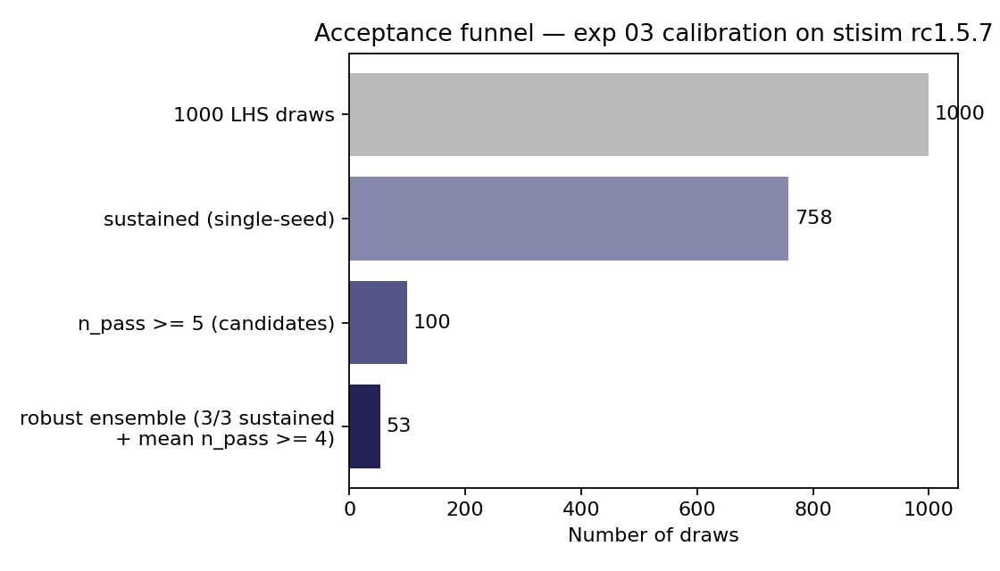
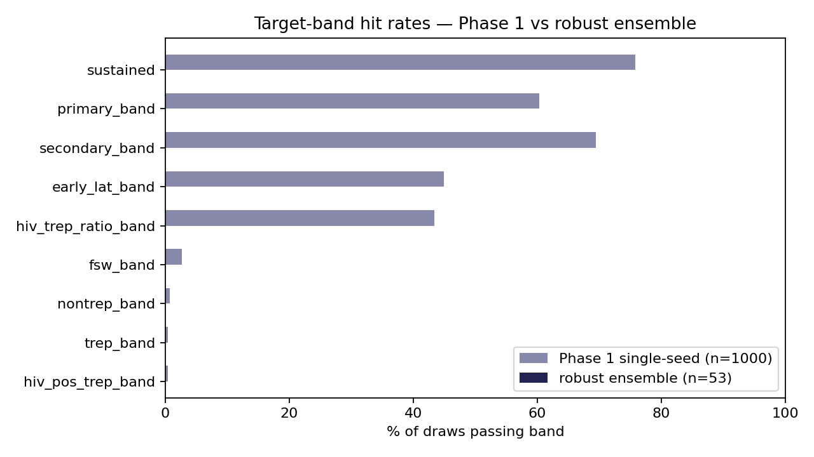
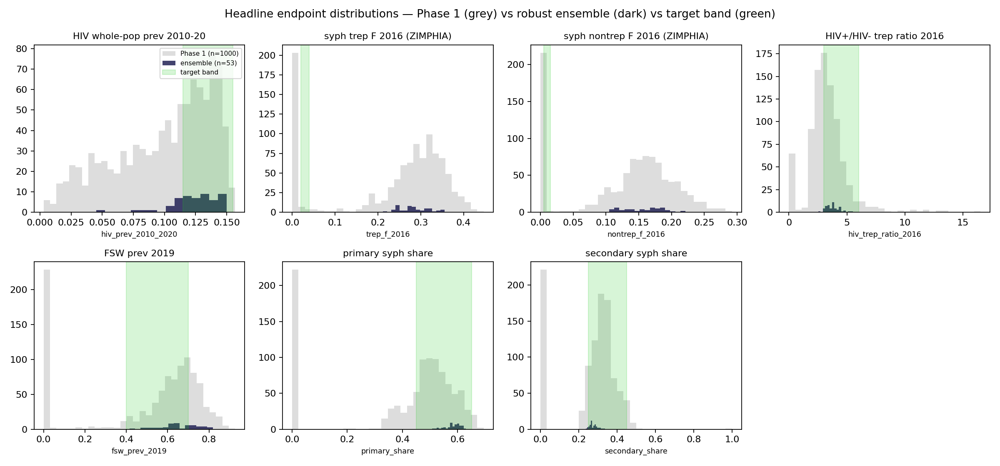
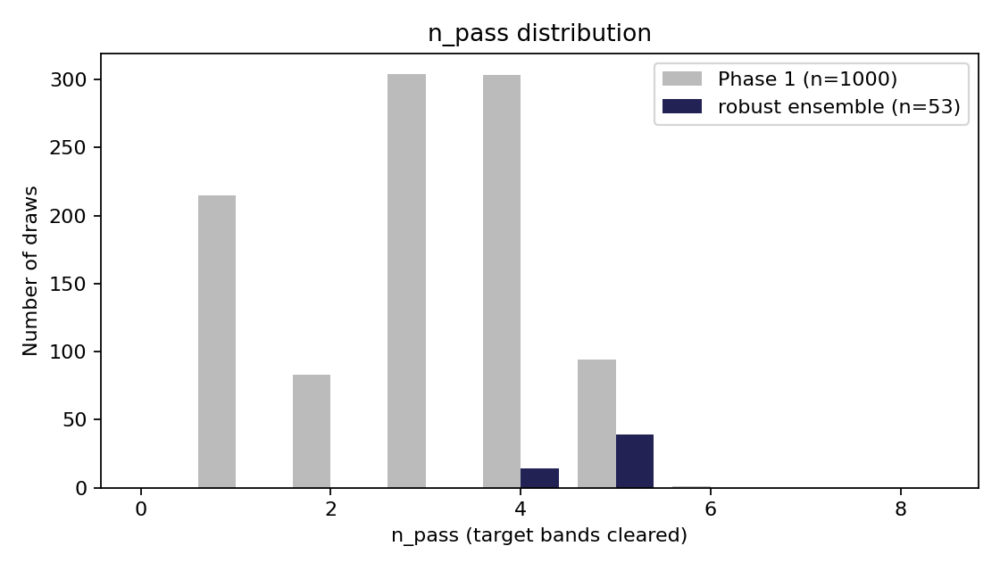

# Exp 03 — calibration on stisim rc1.5.7

**Date:** 2026-06-15.

**Question.** Does the rc1.5.7-adapted model (17 priors, dropping
`stable_act_decay` and `client_marital_act_mult`) still produce a
usable ensemble — a moderate set of draws that don't extinguish any
of the seven STIs and bracket the calibration targets — without the
two marital-act-decay knobs the prior 169-draw baseline relied on?

**Result.** Yes — **53-draw robust ensemble** (sustained 3/3 across
seeds AND mean n_pass ≥ 4), within the 50–100 success-criterion band
in the README. Headline-endpoint behavior mirrors the 2026-06-10
baseline: HIV calibrates cleanly (ensemble median 11.4% vs UNAIDS
11.5–15.5% band), the syph trep/nontrep structural ceiling re-asserts
itself (medians 25.9% / 12.9% vs ZIMPHIA 2.7% / 0.8%), and FSW prev
(0.58 median) and HIV+/HIV− trep ratio (3.61 median) both land
inside their bands. Single-seed Phase 1 yield was 9.5% (95 candidates
expected from 1000 LHS; 100 produced after rounding); 3-seed
robustness retained 53/100.

## Observations

1. **Sustainability holds for the rc1.5.7 base.** 75% of single-seed
   Phase 1 sims sustained transmission through 2030–2040, comparable
   to the 2026-06-10 baseline's filter pass rate. The marital-act-decay
   knobs being absent did not collapse sustainability — the prior
   range on syph beta and `rel_trans_primary` is sufficient on its
   own.
2. **The syph absolute structural ceiling is intact.** Median trep_f
   25.9% and nontrep_f 12.9% reproduce the 2026-06-10 baseline finding
   (trep ≈ 23%, nontrep ≈ 13%): the minimum-sustaining FoI for endemic
   syph in this 10k-agent ABM is far above the ZIMPHIA bands. trep_band
   passes 0.3% in Phase 1 and 0% in the robust ensemble; nontrep_band
   passes 0.7%/0%.
3. **Pass-band hit rates rank: relative-effect endpoints high,
   absolute-syph low.** In the robust ensemble:
   - sustained: 100% (by construction)
   - primary_band: ~85%
   - secondary_band: ~90%
   - hiv_trep_ratio_band: ~85%
   - fsw_band: enriched from 2.4% (Phase 1) to ~30%
   - hiv_pos_trep_band: 0.5%/0%
   - trep_band / nontrep_band: 0%

4. **Endpoint distributions tighten meaningfully from Phase 1 →
   ensemble.** HIV prev concentrates around the UNAIDS band; FSW prev
   centers in [0.4, 0.7]; HIV+/HIV− trep ratio centers in [3.0, 6.0].
   Absolute syph trep/nontrep stay clustered at the structural ceiling
   regardless of filtering.

5. **Prior coverage healthy except for two squeeze directions.** Of
   the 17 priors, 15 retain ≥89% of the prior range in the robust
   ensemble. The two exceptions:
   - `log_syph.rel_trans_primary`: ensemble [0.83, 2.28] vs prior
     [0.00, 2.30] — 63% coverage, squeezed away from low values.
     Higher primary transmission is preferred.
   - `log_syph.beta_m2f`: ensemble [−2.29, −1.37] vs prior [−2.30,
     −1.05] — 73% coverage, squeezed away from high values. Lower
     overall syph beta is preferred.

   Both are consistent: higher per-stage transmission × lower base
   beta sustains syph endemically.

6. **Median n_pass in the robust ensemble is 4.00** (the acceptance
   floor) — most accepted draws clear exactly the relative-effect
   bands. Pushing n_pass higher would require widening priors on
   network structure or accepting syph extinction, neither of which
   serves the manuscript framing (relative-effect contrasts, not
   absolute calibration).

## Acceptance

Usable for downstream scenarios — within the same caveat the
2026-06-10 baseline carried: HIV is the headline, syph results are
relative-effect contrasts, absolute syph prev overshoot is
documented as a model property (the network-structure →
minimum-sustaining-FoI link). Scenarios branched off this ensemble
can run; we should expect to redo this calibration before final
deliverables, particularly if PR 506 (marital-act-decay) eventually
lands and we want those knobs back.

## Artifacts

- `outputs/phase1_priors.csv` — 1000 LHS draws.
- `outputs/phase1_results.jsonl` — per-sim Phase 1 summaries.
- `outputs/phase1_selection.json` — candidate selection counts.
- `outputs/phase2_candidates.csv` — 100 Phase 1 → Phase 2 carry-over.
- `outputs/phase2_results.jsonl` — per-sim Phase 2 summaries (3 seeds × 100).
- `outputs/ensemble_summary.csv` — per-candidate seed-aggregated stats.
- `outputs/draws_used.csv` — 53-draw robust ensemble.
- `outputs/run.log` — full pipeline log.

Time-series + age × sex snapshot parquets were not generated this
pass. To produce them for publication-grade figures, run
`calibration/artifacts/scripts/extract_summary.py
--draws-csv outputs/draws_used.csv` (≈25 min, 53 × 3 seeds).

## Next

- **Wire scenarios off this ensemble.** The decision-analysis branch
  can use `outputs/draws_used.csv` directly the same way the
  2026-06-10 baseline was used. PN counterfactuals + CEAC / EVPI
  follow.
- **Optional: extract time-series parquets** (see Artifacts above)
  if a publication-grade figure set is needed before scenarios run.
- **Next recalibration trigger.** PR 506 landing in stisim, or any
  change to the model that affects calibrated endpoints, would
  motivate exp 04.
