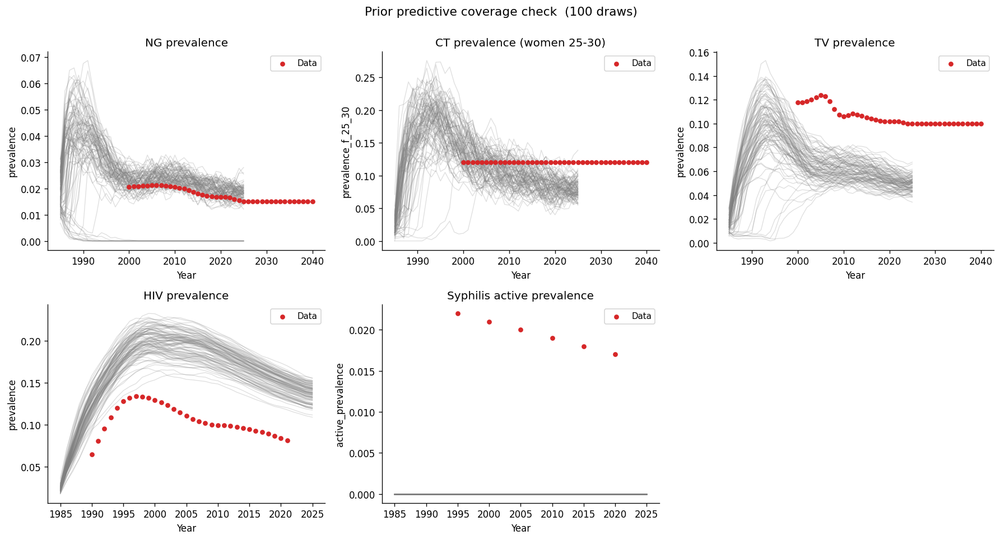

# SUMMARY — 01_coverage_check

**Run:** 100 prior draws, n_agents=5000, 1985–2025, no PN, no FetalHealth.

## Result

Mixed. Three of five targets pass; syphilis is a hard blocker.

| Target | Coverage | Notes |
|---|---|---|
| NG prevalence | Pass | Trajectories bracket all data points |
| TV prevalence | Pass | Trajectories bracket all data points |
| HIV prevalence | Pass | Trajectories bracket all data points |
| CT prevalence (women 25-30) | Pass | Trajectories sit high relative to early data, but we are not calibrating the pre-2000 decline for discharging STIs — data bracketed in the calibration window |
| Syphilis active prevalence | Hard fail | Complete extinction across all 100 draws. Data points float above an empty panel. |

## Root cause — syphilis extinction

`model.py:make_ulcerative_stis()` conditionally loads `data/init_prev_syph.csv`
and `data/init_prev_latent_syph.csv`. Neither file existed in
`sti_notification/data/`, so `init_prev_data=None` was passed to `sti.Syphilis()`.
STIsim seeded near-zero active prevalence; without a meaningful starting
population, syphilis cannot sustain against clearance and goes extinct by ~1990
in every draw.

Root cause is seeding, not transmission rate — the syphilis beta prior
(0.01–0.20, log-uniform) spans a plausible range.

## Next

Open `02_coverage_check_syph_fix`:
- Port `init_prev_syph.csv` and `init_prev_latent_syph.csv` from `syph_dx_zim/data/`
  into `sti_notification/data/`. Set `rel_init_prev=0.2` in `model.py` to match the
  `syph_dx_zim` configuration (fixed, not a calibration parameter there).
- Re-run 100-draw coverage check to confirm syphilis sustains and brackets the data.
- Note: `syph_dx_zim` posterior for `syph.beta_m2f` ran 0.15–0.35; current prior
  ceiling is 0.20. If syphilis is marginal in exp 02, widen to 0.35 in exp 03.
