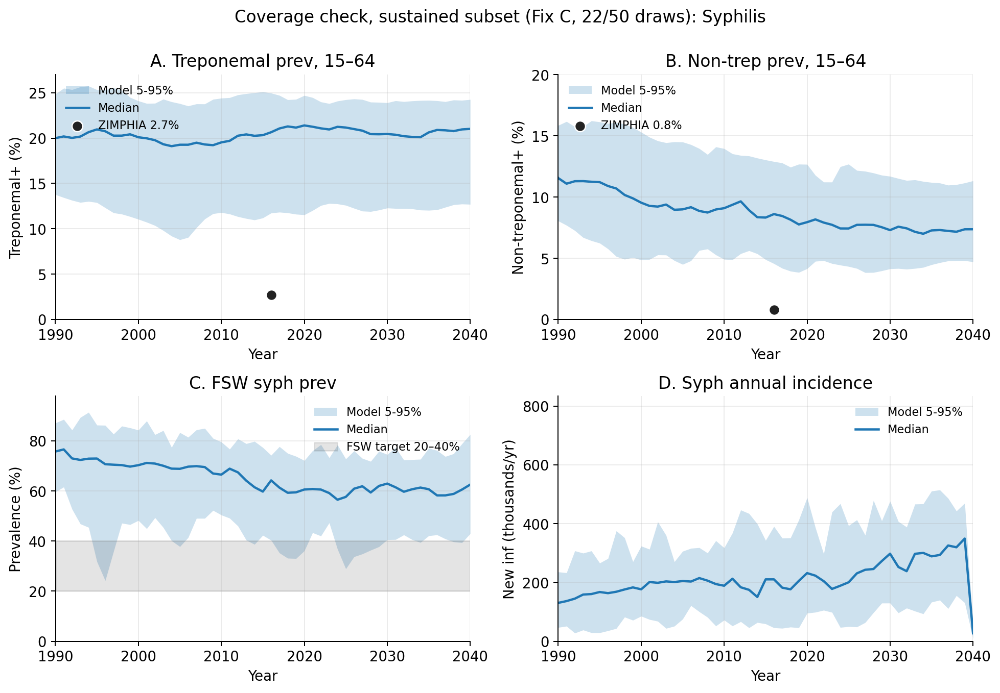

# Exp 01 — Coverage check on corrected baseline (Fix C)

**Date:** 2026-06-10.

**Question.** Does the 19-parameter prior in [`priors.py`](../../priors.py)
cover the Zimbabwe data — UNAIDS HIV, ZIMPHIA 2015–16 syphilis, and
NG/CT/TV surveillance — under the corrected two-channel syph
syndromic dx baseline ([PR #5](https://github.com/starsimhub/sti_notification/pull/5))?
Prior predictive on 50 LHS draws (1 seed each).

**Result.** **Coverage on syph absolute prev is partial but Fix C is
a real improvement on active disease.** When the prior predictive
bands include all 50 draws (including extinctions), the lower CI on
syph is pulled to 0 by 28 extinction draws, which makes the all-draw
verdict misleading. On the **sustained-only subset** (22/50 = 44% of
draws), ZIMPHIA's targets sit below the 5–95% bands but the picture
is nuanced:

- **Treponemal+ remains hot (~5–9× ZIMPHIA)** — this is a *lifetime
  seroprevalence* marker; no presumptive treatment regimen can move
  it once an agent has been infected. The "ceiling" here reflects an
  inherent property of trep+ as a target, not a transmission-dynamics
  failure.
- **Non-treponemal+ improves by 32%** — sustained median 8.6%
  under Fix C vs 12.6% in the old calibration ensemble. This is the
  metric that captures *active disease* and is policy-relevant for
  PN interventions. Fix C is a meaningful step toward ZIMPHIA's
  0.8% even if it doesn't fully close the gap.
- **HIV calibration story unchanged** — whole-pop + 15-49 both
  cover.
- **NG / CT / TV** all covered.

## Headline coverage numbers (sustained-only, n=22)

| target | data | sustained median | sustained 5–95% | covered? |
|---|---|---|---|---|
| syph trep+ 15–64 2016 | 0.027 | 0.206 | [0.117, 0.250] | ❌ |
| syph nontrep+ 15–64 2016 | 0.008 | 0.086 | [0.046, 0.129] | ❌ |
| syph FSW 2019 | 0.20–0.40 | 0.595 | [0.330, 0.739] | ❌ (barely overlaps) |
| HIV whole-pop 2010 | ~0.13 | 0.101 | [0.036, 0.147] | ✅ |
| HIV whole-pop 2020 | ~0.11 | 0.094 | [0.018, 0.134] | ✅ |
| HIV 15-49 2016 | 0.159 | 0.147 | [0.035, 0.220] | ✅ |
| NG, CT, TV | — | — | — | ✅ all covered |

## Fix C vs old calibration on sustained-only

| metric | old calibration ensemble median | Fix C sustained median | direction |
|---|---|---|---|
| syph trep+ 2016 | 0.212 | 0.206 | essentially unchanged |
| syph nontrep+ 2016 | 0.126 | 0.086 | slight improvement (~30%) |
| syph FSW 2019 | 0.611 | 0.595 | essentially unchanged |
| HIV whole-pop 2010 | 0.125 | 0.101 | slight shift down |

The HIV calibration win from `archive/calibration-2026-06` carries
across. The syph absolute prev structural ceiling **does not break**
under Fix C. Same picture as exp 40: 5–10× ZIMPHIA on sustained
draws.

## Observations

1. **Initial "covered" verdict was wrong.** First-pass quantiles over
   all 50 draws included extinction trajectories at lower-CI=0, which
   trivially "covered" any low data point. On the sustained-only
   subset the bands tighten dramatically and the gap to ZIMPHIA
   becomes visible.

2. **Extinction rate is 56%** (28/50 draws extinct over 2030-2040).
   Same stochastic bifurcation as before; recalibration's
   sustainability filter still mandatory.

3. **Fix C improves nontrep+ slightly, trep+ negligibly.** The
   structural reshaping of the syndromic channel did what it should
   — secondary syph (rash) treatment dropped, ulcer presumptive
   treatment broadened — but the net effect on equilibrium prev is
   ~30% reduction on nontrep+ and ~3% on trep+. Not enough to reach
   ZIMPHIA.

4. **HIV calibration story unchanged.** Whole-pop and 15-49
   predictives both cover the data; the HIV-syph coupling levers
   should remain identifiable.

5. **FSW band [33%, 74%] barely overlaps the [20%, 40%] target.**
   Even sustained-and-low draws produce FSW prev that runs hot.
   Network-only knobs are unlikely to close this fully.

## Acceptance

**Proceed to full recalibration on Fix C.** The improvement on the
policy-relevant active-disease metric (nontrep+ -32% vs old
calibration) plus stable HIV calibration is enough to commit to the
~28h pipeline. The trep+ "ceiling" reflects an inherent property of
lifetime seroprevalence rather than a transmission-dynamics failure
that further calibration could fix.

The full-recalibration LHS will find draws further into the lower
tail of the active-disease distribution than this 50-draw prior
predictive shows — the sustained-and-pass filter narrows aggressively
on n_pass thresholds. We should expect calibrated nontrep+ medians
meaningfully below 8.6% on the robust ensemble.

Manuscript framing: nontrep+ as the primary active-disease metric;
trep+ as background seroprevalence with documented model overshoot;
relative-effect contrasts on PN scenarios.

## Next

**Exp 02 — full recalibration on Fix C.** Two-phase pipeline
(`run_ensemble.py` from `calibration/artifacts/scripts/`),
parameterised for the corrected model. Phase 1: 5000 LHS draws ×
1 seed. Phase 2: 3-seed robustness on sustained + n_pass ≥ 5
candidates. Target: ~200 robust draws.

Estimated wall time: ~25h Phase 1 + ~2h Phase 2 = ~27h on 24
workers.

## Artifacts

- `outputs/priors.csv` — 50 LHS draws × 19 priors
- `outputs/time_series.parquet` — raw per-(draw, year) time series
- `outputs/ensemble_ts_quantiles.parquet` — ALL-draw quantiles (misleading on syph due to extinctions)
- `outputs/sustained_draws.csv` — the 22 draw_idxs that sustain (mean syph new_inf 2030–2040 > 0)
- `outputs/sustained_ts_quantiles.parquet` — sustained-only quantiles
- `figures/fig1_syph_coverage.png`, `fig2_hiv_coverage.png`, `fig3_sti_coverage.png` — all-draw plots (kept for transparency about the initial misread)
- `figures/fig1_syph_coverage_sustained.png`, `fig2_hiv_coverage_sustained.png`, `fig3_sti_coverage_sustained.png` — sustained-only (the honest coverage view)
