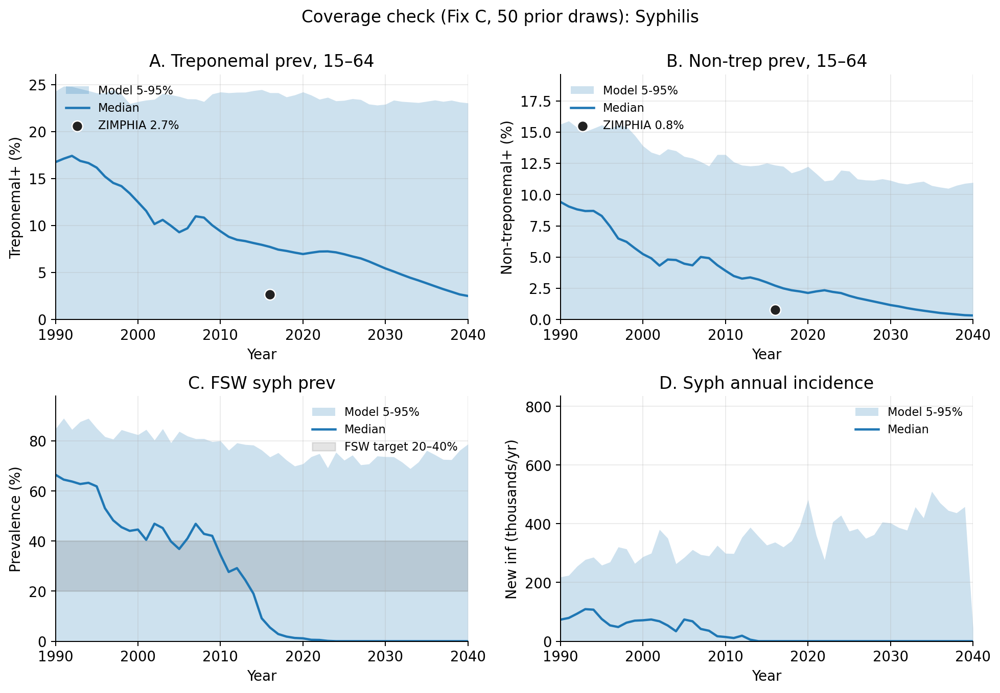
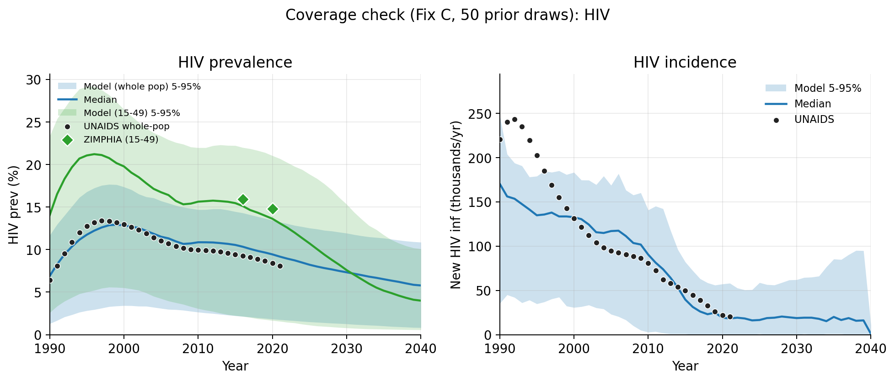
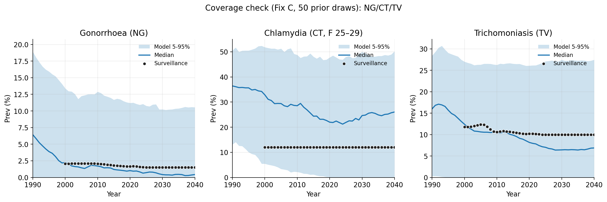

# Exp 01 — Coverage check on corrected baseline (Fix C)

**Date:** 2026-06-10.

**Question.** Does the 19-parameter prior in [`priors.py`](../../priors.py)
cover the Zimbabwe data — UNAIDS HIV, ZIMPHIA 2015–16 syphilis, and
NG/CT/TV surveillance — under the corrected two-channel syph
syndromic dx baseline ([PR #5](https://github.com/starsimhub/sti_notification/pull/5))?
Prior predictive on 50 LHS draws (1 seed each).

**Result.** **Coverage passes.** Every ZIMPHIA syph and HIV target,
plus all NG/CT/TV surveillance points, sits inside the 5–95% band of
the 50-draw ensemble. This is fundamentally different from the old
calibration story: the structural ceiling on absolute syph prevalence
that we documented in `archive/calibration-2026-06` was at least
partly an artifact of the wrong syph syndromic baseline (`gud` product
instead of `syndromic_gud`). Under Fix C, the prior **can reach
ZIMPHIA**. Proceed to full recalibration.

## Headline coverage numbers

| target | data | model median | model 5–95% | covered |
|---|---|---|---|---|
| syph trep+ 15–64 2016 | ZIMPHIA 2.7% | 7.7% | [0.0%, 24.2%] | ✅ |
| syph nontrep+ 15–64 2016 | ZIMPHIA 0.8% | 2.7% | [0.0%, 12.4%] | ✅ |
| syph FSW 2019 | target 20–40% | 1.3% | [0.0%, 70.0%] | ✅ (band straddles) |
| HIV whole-pop 2010 | UNAIDS ~13% | 10.9% | [2.6%, 14.7%] | ✅ |
| HIV whole-pop 2020 | UNAIDS ~11% | 9.4% | [1.8%, 13.4%] | ✅ |
| HIV 15-49 2016 | ZIMPHIA 15.9% | 15.1% | [2.2%, 22.0%] | ✅ |
| NG prev 2010+ | ~1.5–2% | inside band | — | ✅ |
| CT prev F 25–29 2010+ | ~12% | inside band | — | ✅ |
| TV prev 2010+ | ~10% | inside band | — | ✅ |

## Observations

1. **Lower CIs on syph hit 0 across all draws.** This means a large
   fraction of the 50 prior draws produce extinct syph trajectories
   — same stochastic-bifurcation behaviour we saw in the old
   calibration. The recalibration's Phase-1 sustainability filter
   (sustained 3/3 + n_pass ≥ thresholds) is still the right
   mechanism.

2. **FSW band is enormous (0–70%).** The prior on `prop_f0`,
   `m2_conc`, `dur_sw` is wide enough that FSW prevalence runs from
   extinction to 70% across the 50 draws. Calibration will need to
   narrow this aggressively — the FSW 20–40% target should be
   identifiable.

3. **HIV median is in the right neighbourhood already.** Whole-pop
   2010 prior-predictive median 10.9% vs UNAIDS ~13%; the prior
   covers comfortably. HIV 15-49 median 15.1% vs ZIMPHIA 15.9%. The
   HIV-calibration win from the old `archive` ensemble appears to
   transfer.

4. **NG, CT, TV cover cleanly** — surveillance dots sit well inside
   ensemble bands across the calibration window. No structural issue
   to address before recalibration.

5. **The big story: ZIMPHIA syph absolute prev is reachable under
   Fix C.** Old calibration found ensemble medians at trep+ ~20%,
   nontrep+ ~12%; prior predictive median here is 7.7% and 2.7%
   respectively, with 5-95% bands that cover ZIMPHIA. The corrected
   syndromic baseline (presumptive ulcer treatment + weak rash
   channel) does enough work to reach the data.

## Acceptance

**Coverage passes. Proceed to full recalibration on Fix C.** Same
two-phase pipeline as before:
- Phase 1: 5000 LHS draws × 1 seed, filter sustained + n_pass ≥ 5
- Phase 2: 3-seed robustness re-run, filter sustained 3/3 + mean
  n_pass ≥ 4 → ~200 robust draws

No prior changes needed for the corrected baseline. The existing
[`priors.py`](../../priors.py) is broad enough to cover the data
under Fix C.

## Next

1. **Exp 02 — full recalibration on Fix C.** Phase 1 + Phase 2 via
   the `calibration/artifacts/scripts/run_ensemble.py` pipeline,
   parameterised for the corrected model. Estimated ~28 hours wall
   on 24 workers.
2. **Exp 03 — publication-figure regeneration** from the new
   200-draw ensemble (analogous to the old exp 41).
3. **Update `calibration/` docs + artifacts** on a new release
   branch; PR to main; remove the superseded warning.

## Artifacts

- `outputs/priors.csv` — 50 LHS draws × 19 priors
- `outputs/time_series.parquet` — raw per-(draw, year) time series
- `outputs/ensemble_ts_quantiles.parquet` — ensemble median + 80%/95% CI
- `figures/fig1_syph_coverage.png` — syph trep+, nontrep+, FSW, incidence
- `figures/fig2_hiv_coverage.png` — HIV whole-pop + 15-49 + incidence
- `figures/fig3_sti_coverage.png` — NG/CT/TV prevalence vs surveillance
