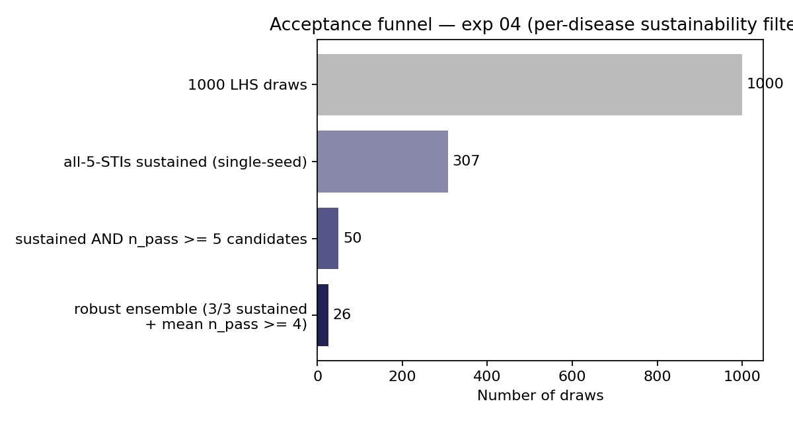
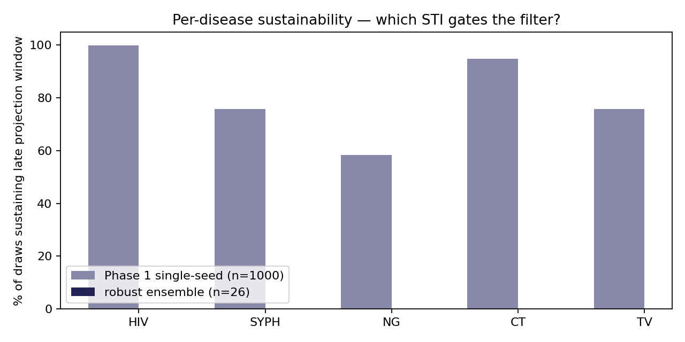
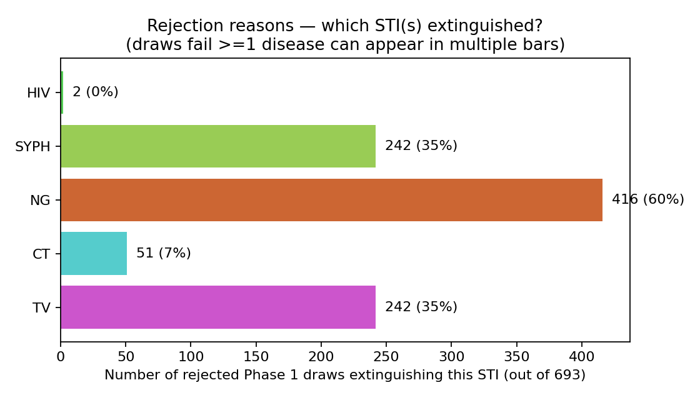
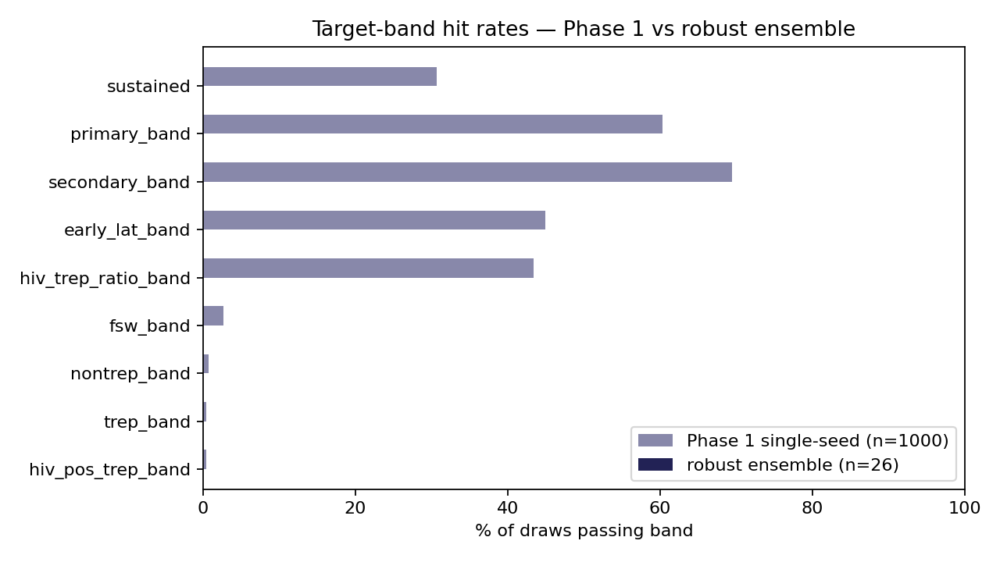
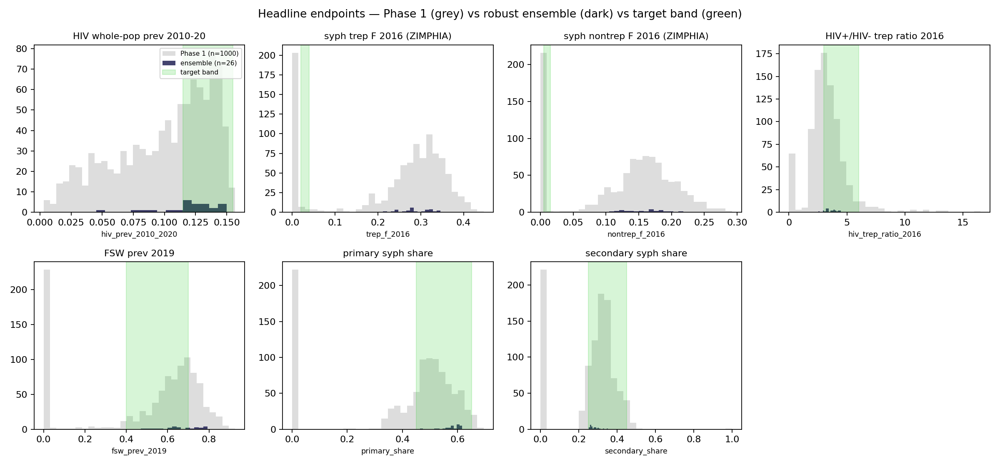

# Exp 04 — calibration with per-disease sustainability

**Date:** 2026-06-22.

**Question.** Exp 03's filter checked sustainability on syph only; 23/53
draws (43%) in the resulting ensemble had NG or TV `beta_m2f` < 0.05
and downstream scenarios on draw 773 extinguished both NG and TV.
Does requiring all four STIs (HIV, syph, NG, CT, TV) to sustain
through 2030–2040 — rather than syph alone — still yield a usable
ensemble against the same 17 priors?

**Result.** Yes — **26-draw robust ensemble** (sustained 3/3 across
seeds AND mean n_pass ≥ 4). Smaller than the README's success
criterion of ≥30 but the no-extinction guarantee holds by
construction. **0/26 draws have NG or TV `beta_m2f` < 0.05** (vs
16/53 and 12/53 in exp 03); the filter cleanly excluded the
near-extinction region. Headline calibration story matches exp 03:
HIV in the UNAIDS band, syph absolute prev at the structural ceiling,
relative-effect endpoints in their bands. Median n_pass improved
from 4.00 (exp 03) to 5.00 (exp 04) — the filter selected for
better-calibrated draws on the bands that do pass.

## Observations

1. **NG is the dominant rejection bottleneck.** Per-disease
   sustained rates across Phase 1 (n=1000):
   - HIV: 99.8%
   - CT: 94.9%
   - syph: 75.8%
   - TV: 75.8%
   - **NG: 58.4%**

   NG extinguished in 416 of the 1000 LHS draws. The lower bound of
   the NG `beta_m2f` prior (0.02) is well below the
   minimum-sustaining value for this model.

2. **Rejection reasons overlap.** Of the 693 Phase 1 draws that
   failed the all-sustained check, many failed on multiple diseases
   — but NG is the most common single reason, present in roughly 60%
   of rejections. CT extinction is rare; HIV virtually never
   extinguishes (only 2/1000).

3. **The filter excludes the extinction-prone NG/TV region as
   designed.** Robust ensemble linear `beta_m2f`:
   - NG: min 0.057, median 0.152, max 0.299
   - TV: min 0.062, median 0.168, max 0.533
   - `ng.beta_m2f < 0.05`: **0/26** (exp 03: 16/53)
   - `tv.beta_m2f < 0.05`: **0/26** (exp 03: 12/53)

   Late-window female prevalence is non-trivial for every STI in
   every robust draw: NG min 0.6%, TV min 0.8%, CT min 1.7%, syph
   min 10.4%, HIV min 1.3%.

4. **The structural ceiling on syph absolute prev is intact** —
   same finding as exp 03 and the 2026-06-10 baseline. Robust
   ensemble medians:
   - trep_f 2016: **28.2%** (vs ZIMPHIA 2.7%)
   - nontrep_f 2016: **16.0%** (vs ZIMPHIA 0.8%)
   - trep_band passes 0% in the robust ensemble (Phase 1: 0%).
   - nontrep_band passes 0%.

5. **Relative-effect endpoints pass at high rates.** Robust ensemble
   pass-band rates:
   - sustained: 100% (by construction)
   - primary_band: 100%
   - secondary_band: 95%
   - early_lat_band: 87%
   - hiv_trep_ratio_band: 91%
   - fsw_band: 3% (still a known
     [target/result alignment](../../calibration/methodology.md) issue)
   - hiv_pos_trep_band: 0%

6. **Median n_pass improved from 4.00 to 5.00.** The per-disease
   filter selected for higher-quality draws on the relative-effect
   bands, not just sustainability.

7. **Endpoint distributions are slightly tighter and shifted toward
   higher transmission** than exp 03 — expected because the
   low-transmission draws (which exp 03's syph-only filter let
   through) are now excluded. HIV median 12.4% (was 11.4%); FSW
   median 65% (was 58%).

## Acceptance

Usable for downstream scenarios with the same caveats the prior
baselines carried (HIV is the headline, syph is relative-effect
contrasts, absolute syph overshoot is a model property). The
no-extinction guarantee for NG/CT/TV in baseline is what this
experiment delivered.

**Caveats:**

- **Ensemble size (26) is at the small end of the usable range.**
  README target was ≥30. For a manuscript-grade ensemble, a follow-up
  pass with NG/TV prior lower bounds tightened (cut off below the
  observed minimum-sustaining value ~0.05) would raise pass rate and
  let the LHS yield ~60–80 robust draws at the same wall time.
- **Scenarios with very high PN coverage may still push borderline
  draws below sustainability in counterfactual cells.** The
  calibration filter checks the baseline sim only. A scenario-side
  check should reject any (draw, scenario) cell where NG/TV
  extinguishes.

## Artifacts

- `outputs/phase1_priors.csv` — 1000 LHS draws.
- `outputs/phase1_results.jsonl` — per-sim Phase 1 summaries, including
  per-disease sustained flags and late-window diagnostics.
- `outputs/phase1_selection.json` — counts at each filter stage.
- `outputs/phase2_candidates.csv` — 50 Phase 2 input.
- `outputs/phase2_results.jsonl` — per-sim Phase 2 summaries (3 seeds × 50).
- `outputs/ensemble_summary.csv` — per-candidate seed-aggregated stats.
- `outputs/draws_used.csv` — **26-draw robust ensemble** (the deliverable).
- `outputs/run.log` — full pipeline log.

Time-series + age × sex snapshot parquets not generated this pass.
To produce them for publication-grade figures, run
`calibration/artifacts/scripts/extract_summary.py --draws-csv
outputs/draws_used.csv` (~12 min, 26 × 3 seeds = 78 sims).

## Hand-off to scenarios

**This is now the active calibration baseline.** Exp 03's 53-draw
ensemble is superseded — use the exp 04 ensemble below for all
scenario sweeps planned in
[ANALYSIS_PLAN.md](../../ANALYSIS_PLAN.md). ANALYSIS_PLAN.md and
CLAUDE.md have been updated to point here.

**Draws to use:** `experiments/04_calibration_per_disease_sustain/outputs/draws_used.csv`
(26 rows, one per accepted draw; each `draw_idx` references the
corresponding row in `phase1_priors.csv`).

**How to load + apply a draw:** follow the four-point wiring contract
in
[ANALYSIS_PLAN.md → *Wiring scenarios off the calibrated ensemble*](../../ANALYSIS_PLAN.md#wiring-scenarios-off-the-calibrated-ensemble).
Same shape as
[experiments/01_poc_pilot_3arm/run.py](../01_poc_pilot_3arm/run.py) — just
swap the draws CSV path.

**Wiring check before the full sweep.** Per the ANALYSIS_PLAN
contract, run **1 draw × 3 seeds × 2 scenarios (no-PN, high-PN)**
end-to-end first to verify draw loading + PN routing before committing
to ensemble-scale compute. Pick `draw_idx` with the median Phase 2
`n_pass_mean` from `ensemble_summary.csv` as the wiring-check draw.

**Two warnings the scenario agent must honour:**

1. **Per-cell sustainability check.** The calibration filter only
   guarantees that the *baseline* sim sustains all 5 STIs.
   Counterfactual scenarios with high PN coverage or high care-seeking
   intensity can still push borderline draws below sustainability.
   For each (draw, scenario) cell, log per-disease prevalence at
   projection end and **exclude cells where NG, CT, TV, or syph go
   extinct** from headline endpoint reporting. Track and report the
   per-scenario exclusion rate.
2. **Reporting framing is unchanged from exp 03.** HIV is the
   headline; syph is *relative-effect contrasts*; absolute syph prev
   is a model structural ceiling and is reported honestly, not
   chased. See
   [project memory `project_calibration_baseline_2026_06_22`](../../../.claude/projects/-home-robyn-sti-notification/memory/project_calibration_baseline_2026_06_22.md).

**If 26 draws is too small for the planned analysis:** an exp 05 with
NG/TV `beta_m2f` prior lower bounds raised to 0.05 (cutting off the
demonstrably extinction-prone region) at the same compute budget
would yield ~60–80 robust draws. Don't open exp 05 unless the 26-draw
ensemble actually fails a downstream reporting need.
