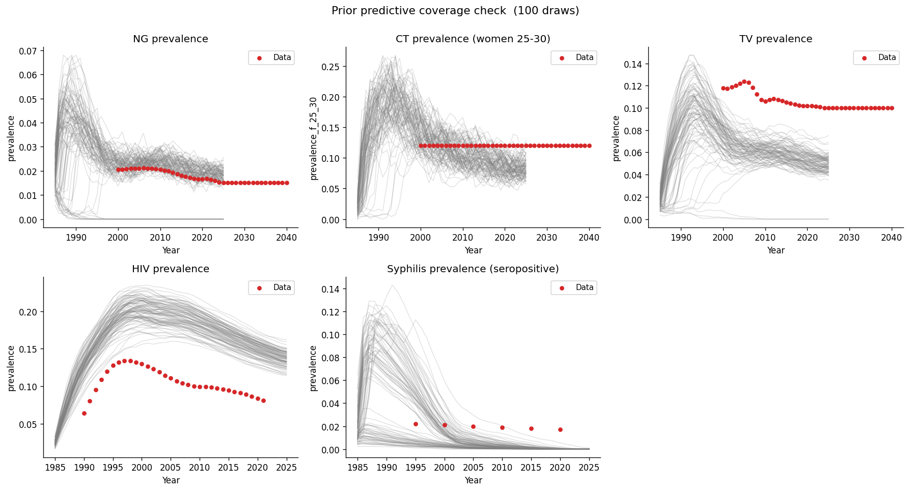

# Exp 02 — Coverage check: syphilis seeding and config fix

**Date:** 2026-05-15.

**Question.** Exp 01 showed syphilis extinct across all 100 prior draws —
no seeding at all. Three root causes were identified (missing seed files,
misaligned syphilis module config, prior ceiling too low) plus a STIsim
1.5.5 API change in `active_prevalence`. Does the model now sustain
syphilis and bracket the observed ~2% prevalence after all four fixes?
See [`../01_coverage_check/SUMMARY.md`](../01_coverage_check/SUMMARY.md).

**Result.** Partial fix. Syphilis now seeds and peaks early (median peak
~8% around 1987–1988) but crashes to near-zero by ~2010 in 99/100 draws.
Only 1/100 draws sustains any syphilis prevalence above 0.1% by 2020.
The Zimbabwe data points (~1.7–2.2% active prevalence, 1995–2020) sit
above the extinct trajectories in the calibration window. NG/CT/TV/HIV
remain unchanged and pass.

## Observations

1. **Syphilis seeds but doesn't sustain.** All 100 draws show an initial
   burst from seeding, peaking at 2–14% prevalence around 1987–1988, then
   decaying to zero. The seeding fix from exp 01 worked — the problem is
   now ongoing transmission, not initialisation.

2. **Beta is not the bottleneck.** Even draws with `syph.beta_m2f=0.32`
   (near the prior ceiling) go extinct. The one draw that sustains (#86)
   actually has the *lowest* syphilis beta (0.012) but distinctive network
   parameters (`prop_f0=0.70`, `m1_conc=0.25`), suggesting the network
   structure matters more than the raw beta.

3. **Comparison with `syph_dx_zim` reveals structural gaps.** That project
   sustained syphilis by: (a) calibrating `rel_trans_primary` to a
   posterior median of 8 (fixed at 5 here); (b) a much larger high-risk
   group (`prop_f2=0.10, prop_m2=0.10, m2_conc=0.50` vs `0.025, 0.05`,
   no high-risk concurrency here); (c) calibrated HIV-syphilis
   coinfection susceptibility multipliers (~2x); and (d) opening
   `syph.eff_condom` as a calibration parameter.

4. **NG/CT/TV/HIV panels unchanged** from exp 01 — all still pass.

## Next

Open `03_coverage_check_network_fix` to address the structural gaps
preventing syphilis from sustaining:

- Align network risk-group structure with `syph_dx_zim` defaults
  (`prop_f2=0.10`, `prop_m2=0.10`, high-risk concurrency).
- Open `rel_trans_primary` as a calibration parameter (range 3–10).
- Consider opening `syph.eff_condom` (range 0.30–0.70).
- Consider adding HIV-syphilis coinfection connector parameters.
- Re-run 100-draw coverage check to confirm syphilis sustains through
  the data window.
