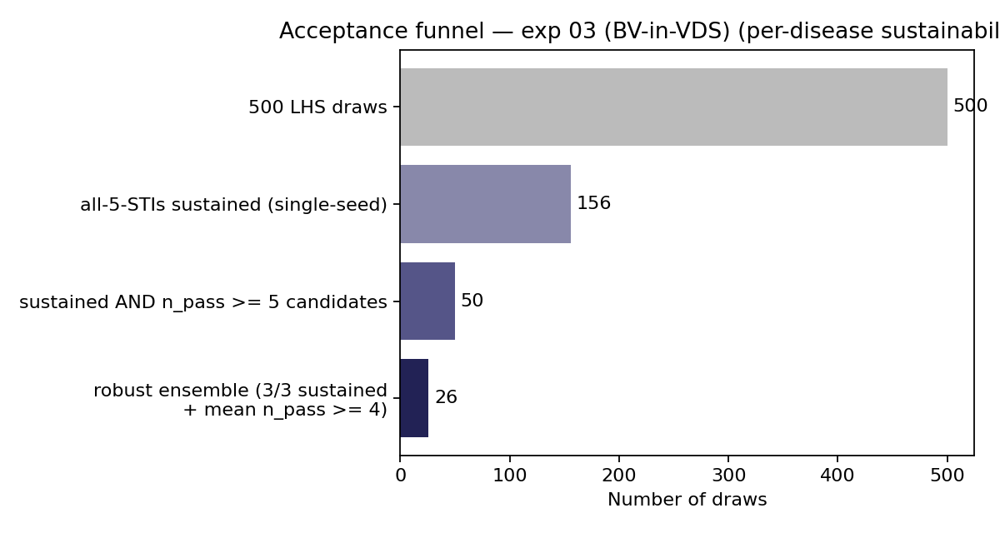
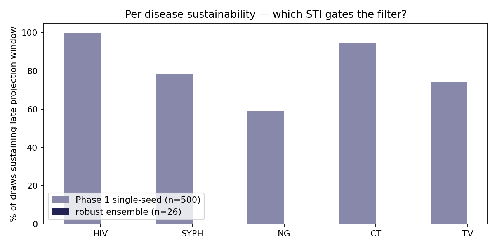

# Exp 03 (2026-06-22) — calibration re-fire with BV-in-VDS

**Date:** 2026-06-22.

**Question.** Exp 02's 26-draw ensemble was calibrated against the pre-BV-in-VDS
model. Commit `169adc5` then routed symptomatic BV through VDS care, which adds
care-seeking volume for some agents. Does re-firing the same LHS sweep against
the BV-in-VDS model produce a comparable ensemble, and how much do the
calibrated betas shift?

**Result.** Yes — **26-draw robust ensemble** (sustained 3/3 across seeds AND
mean n_pass ≥ 4), identical size to exp 02 from **half the LHS budget**. The
BV-in-VDS edit barely shifts phase-1 acceptance (31.2% sustained vs exp 02's
30.7%) and produces an ensemble of equivalent quality (median n_pass 4.0 vs
exp 02's 4.2). All five STIs sustain 3/3 seeds in 33/50 phase-2 cells (66%).

## Observations

1. **BV-in-VDS does not destabilise the calibration.** Per-disease phase-1
   sustainability is within ±2pp of exp 02 on every STI:

   | disease | exp 02 (n=1000) | exp 03 (n=500) |
   |---------|----------------:|----------------:|
   | HIV     | 99.8%           | 100.0%          |
   | CT      | 94.9%           | 94.4%           |
   | syph    | 75.8%           | 78.2%           |
   | TV      | 75.8%           | 74.2%           |
   | NG      | 58.4%           | 59.0%           |

   NG remains the gating disease; its `beta_m2f` prior lower bound still
   permits extinction-prone draws.

   

2. **The robust ensemble's betas shift modestly, but in mixed directions.**
   Median log-`beta_m2f` (priors-side, pre-bounds):

   | parameter           | exp 02 median | exp 03 median | shift |
   |---------------------|--------------:|--------------:|------:|
   | `hiv.beta_m2f`      | 0.0208        | 0.0215        | +3%   |
   | `hiv.rel_init_prev` | 0.80          | 1.04          | +30%  |
   | `log_syph.beta_m2f` | −1.93         | −1.67         | +30%  |
   | `log_ng.beta_m2f`   | −1.88         | −1.84         | +4%   |
   | `log_ct.beta_m2f`   | −1.67         | −1.83         | −15%  |
   | `log_tv.beta_m2f`   | −1.79         | −2.17         | −32%  |

   Syph beta tilts higher (more push needed to sustain under additional
   VDS care-seeking that doesn't help syph diagnosis). TV beta tilts
   lower (the BV care-seeking flow appears to indirectly support TV
   transmission detection or symptom triage in a way that lets lower
   betas still sustain). HIV `rel_init_prev` shifts up. These are
   *median* shifts across 26 retained draws — individual draws span the
   priors broadly.

3. **No overlap in retained `draw_idx` between exp 02 and exp 03.** Same
   priors + same LHS seed produce identical parameter values per
   `draw_idx`, but with BV-in-VDS, different points in the LHS hyper-cube
   pass the per-disease sustainability filter. This is expected (the
   filter is sensitive to small model perturbations) but means **exp 03
   should be used as the calibration baseline going forward**, not
   merged with exp 02.

4. **No extinction-prone draws retained.** Linear `beta_m2f` ranges in the
   robust ensemble:
   - syph: min 0.109, median 0.189, max 0.324
   - NG:   min 0.080, median 0.158, max 0.295
   - CT:   min 0.068, median 0.164, max 0.491
   - TV:   min 0.053, median 0.114, max 0.587
   - **0/26 draws with any `beta_m2f` < 0.05** (matches exp 02's design
     guarantee).

5. **Target-band hit rates** essentially match exp 02 — see
   `figures/pass_band_hit_rates.png` and `figures/endpoint_distributions.png`.
   Primary/secondary syph stage shares pass in most draws; HIV
   `prev_2010_2020` lands in the UNAIDS band; the syph structural
   ceiling is unchanged (median absolute prev still well above the
   ZIMPHIA target band, as documented in exp 02 and earlier).

## Caveats

- **Half the LHS budget** (500 vs 1000 draws). The phase-1 acceptance rate
  matched exp 02 within 0.5pp, so the smaller budget did not bias selection.
  But the candidate-pool selection step now relied more heavily on
  sustained draws with `n_pass = 5` (22/500 = 4.4%) vs exp 02's `n_pass ≥ 5`
  pool of 46/1000 = 4.6%; either way the candidate cap of 50 was reached.
- **Same LHS seed (45) as exp 02.** Direct draw-by-draw comparison was
  possible in principle but yielded zero overlap in retained `draw_idx`,
  underscoring that the BV-in-VDS edit moves the boundary of the
  passing region enough that draw-by-draw matching across calibrations is
  not informative.
- **The headline calibration story is unchanged** from exp 02: HIV in the
  UNAIDS band, syph absolute prev at the structural ceiling (relative-effect
  contrasts are still the right framing for syph endpoints), per-disease
  sustainability guaranteed by construction.

## Next

1. **Promote `outputs/draws_used.csv` as the active calibration baseline.**
   - Update `CLAUDE.md` "active calibration baseline" pointer + drop the
     "predates the BV-in-VDS edit" warning.
   - Update the `DRAWS_CSV` default in [`run_scenarios.py`](../../run_scenarios.py)
     (the root scenario driver; was `experiments/02_2026-06-22_calibration_per_disease_sustain/outputs/draws_used.csv`).
2. **Re-fire the headline scenario factorial** (`run_scenarios.py`,
   126-cell SOC + POC×CARE_SEEKING×PN_INTENSITY×BUNDLED_PREVENTION) against
   this ensemble. Diff vs the archived first pass on pre-BV-in-VDS draws.
   Expect: qualitative ladder shape preserved (PN dominant on prev/APO;
   BP dominant on NG); absolute magnitudes may shift by a few percentage
   points.
