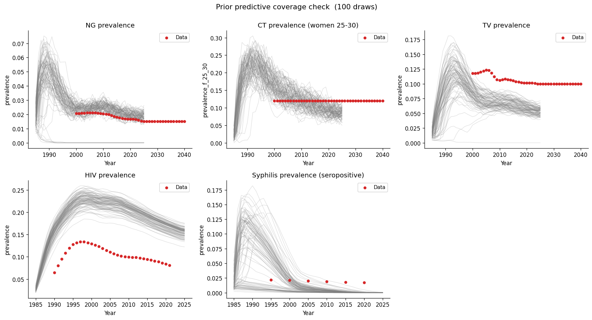

# Exp 03 — Coverage check: network risk structure and syphilis transmissibility

**Date:** 2026-05-15.

**Question.** Exp 02 showed syphilis seeds but crashes to zero. Does
enlarging the high-risk group (`prop_f2` 0.025→0.05, `prop_m2` 0.05→0.15),
adding high-risk concurrency (`f2_conc=0.25`, `m2_conc=0.50`), and opening
`rel_trans_primary` (3–10) and `eff_condom` (0.30–0.70) as calibration
parameters sustain syphilis through the data window?
See [`../02_coverage_check_syph_fix/SUMMARY.md`](../02_coverage_check_syph_fix/SUMMARY.md).

**Result.** No improvement. Syphilis still crashes to near-zero by ~2010
in 98/100 draws (2/100 above 0.1% by 2020, vs 1/100 in exp 02). Median
peak rose slightly (10.4% vs 7.9%) but the decay is unchanged. The
high-risk group is too small a fraction of the population to sustain
chains on its own.

## Observations

1. **High-risk concurrency helps the initial burst but not sustainability.**
   Median peak prevalence rose from 7.9% to 10.4%, but the decay rate
   is unchanged — the high-risk group seeds more infections early but
   cannot maintain chains once the initial susceptible pool is exhausted.

2. **The mid-risk group is the bottleneck.** `f1_conc` remains at 0.05
   (vs 0.15 in `syph_dx_zim`). This is where the bulk of the sexually
   active population sits. Without enough partner turnover in this group,
   syphilis chains die out even with a large high-risk core.

3. **NG/CT/TV/HIV unchanged** — all still pass.

## Next

Open `04_coverage_check_concurrency`: raise `f1_conc` from 0.05 to 0.15
(matching `syph_dx_zim`) to increase mid-risk partner turnover. If this
sustains syphilis, the coverage check is clear and we move to method
selection.
