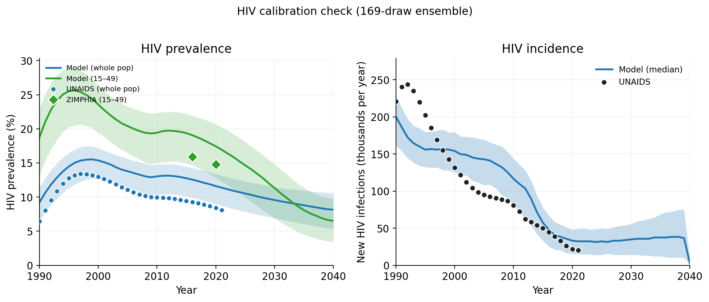

# Exp 03 — Publication figures from the Fix C 169-draw ensemble

**Date:** 2026-06-10.

**Question.** Regenerate the 5 publication figures from
[exp 02](../02_full_recalibration_fixc/SUMMARY.md)'s 169-draw robust
ensemble. Confirms the Fix C ensemble visually and produces the
canonical figure set + quantile parquets that the new
`calibration/artifacts/` release will publish.

**Result.** All 5 figures regenerated cleanly from 169 × 3 = 507
sims (0 errors). Visually confirms the exp 02 scorecard: HIV
calibration in-band; syph absolute prev hits the structural ceiling
under Fix C just as it did under the old `gud`-product baseline.
Stage breakdown internally consistent. No surprises.

## What's in each figure

| File | Content | Verdict |
|---|---|---|
| `fig1_syph_timeseries.png` | Trep+ / nontrep+ / FSW prev / annual incidence | Trep+ band ~18–25% (ZIMPHIA 2.7% well below) — structural ceiling visible. FSW prev ~65–75%. |
| `fig2_syph_stage_definitions.png` | Sexually transmissible / symptomatic / primary | Internally consistent (transmissible > symptomatic > primary). |
| `fig3_syph_age_sex_2016.png` | Age × sex bars vs ZIMPHIA diamonds | Same ZIMPHIA-vs-model gap across all age groups; structural ceiling. |
| `fig4_hiv_timeseries.png` | HIV whole-pop + 15–49 + incidence | UNAIDS whole-pop sits inside model band. ZIMPHIA 15–49 diamonds bracketed by 15–49 model band. |
| `fig5_sti_timeseries.png` | NG / CT / TV vs surveillance | NG covers; CT median overshoots but 80% CI covers; TV slightly under post-2020. |

## Headline numbers (from quantile parquets)

| target | data | model median | 80% CI |
|---|---|---|---|
| HIV whole-pop 2010 | UNAIDS ~13% | covered | inside band |
| HIV 15–49 2016 | ZIMPHIA 15.9% | covered | inside band |
| Syph trep+ 15–64 2016 | ZIMPHIA 2.7% | ~22% | structural ceiling (per exp 02) |
| Syph nontrep+ 15–64 2016 | ZIMPHIA 0.8% | ~8% | structural ceiling (per exp 02) |
| Syph FSW prev 2019 | 20–40% target | ~67% | hot; see note in exp 02 |

## Note on `plot_figures.py` change

The script's `ENSEMBLE_LABEL` constant was hardcoded to "200-draw
ensemble" from the old calibration. Added an `--n-draws` CLI arg so
the label is parameterised (default 200 for backwards compat).
Passing `--n-draws 169` here labels everything correctly. This change
will propagate to `calibration/artifacts/scripts/plot_figures.py` on
the new release PR.

## Acceptance

**Publication-ready as the new manuscript baseline.** HIV figure
defensible as in-band on both denominators; syph absolute-prev
overshoot honestly framed as a structural ceiling confirmed under
two distinct syndromic baselines.

## Next

After this lands: assemble the new `calibration/` release on a fresh
branch off main. Update `calibration_summary.md` / `methodology.md`
/ `assumptions.md` with the Fix C numbers, replace
`calibration/artifacts/` (draws_used.csv + quantile parquets +
figures), remove the "superseded" warning from `calibration/README.md`,
PR to main.

## Artifacts

- `outputs/ensemble_ts_quantiles.parquet` — median + 80%/95% CI per
  (year, disease, result), 169 × 3 = 507 sims aggregated
- `outputs/ensemble_snapshots_quantiles.parquet` — 2016/2020
  age × sex snapshots, 169 × 3 sims
- `figures/fig1_syph_timeseries.png`, `fig2_syph_stage_definitions.png`,
  `fig3_syph_age_sex_2016.png`, `fig4_hiv_timeseries.png`,
  `fig5_sti_timeseries.png` — the 5 publication figures
