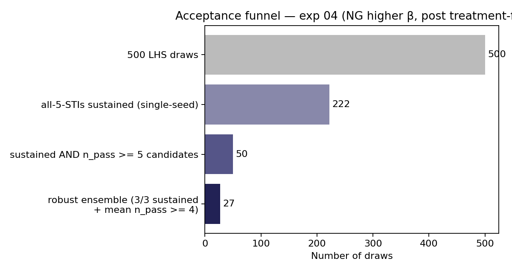
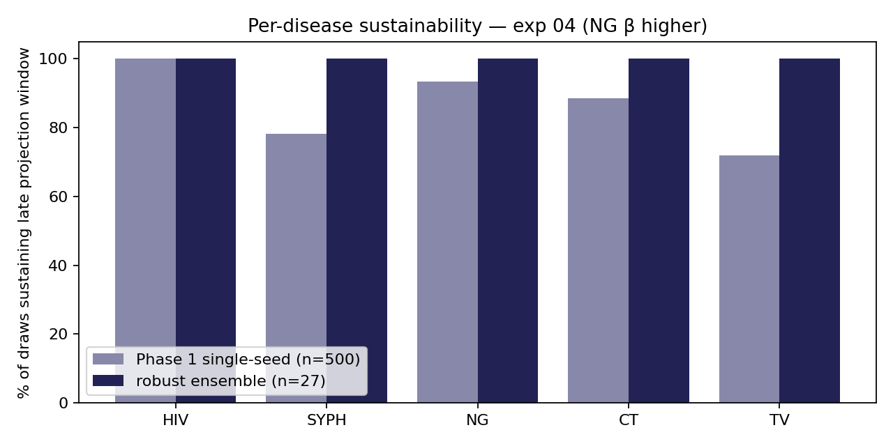
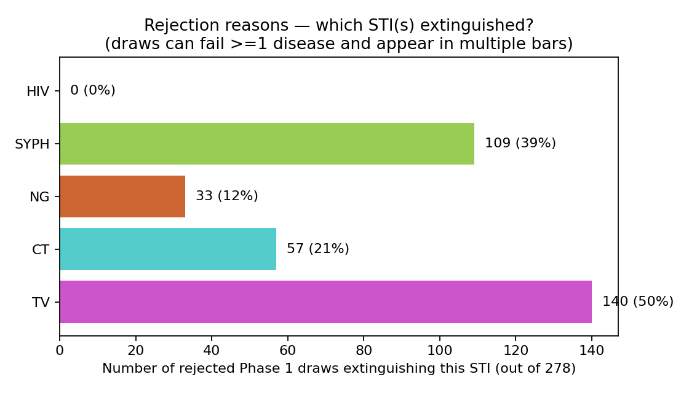
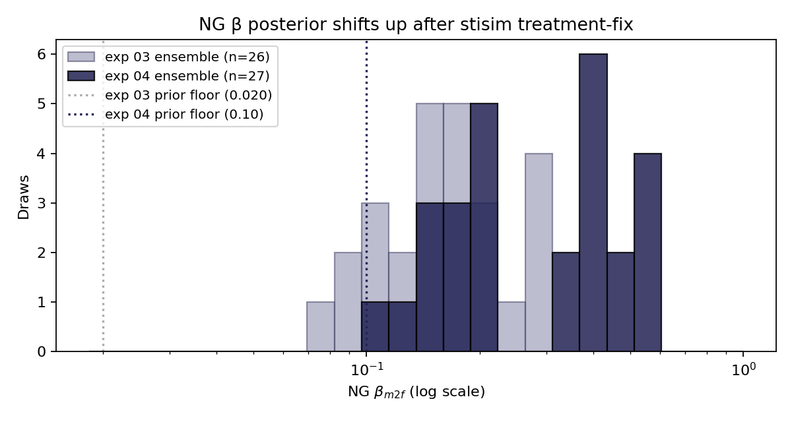

# Exp 04 (2026-06-23) — NG higher β prior, post stisim treatment-fix

**Date:** 2026-06-23.

**Question.** Exp 03's 26-draw ensemble sustained NG only because the stisim
`rel_treat` NaN bug made `GonorrheaTreatment` a no-op for the small fraction
of live agents whose state slot was inactive at `Arr.init_vals` time
(`set_treat_eff` then computed `NaN × base_treat_eff → NaN`, and the
resulting `Bernoulli(p=NaN)` returned False for every infected agent
treated in any seed). With that bug patched in stisim `fix/ng-tx`
([731bc1d](https://github.com/starsimhub/stisim/commit/731bc1d)), single-seed
probes against exp 03's baseline draw showed NG → 0 across all three seeds
under the calibrated β range. What NG `beta_m2f` prior produces an ensemble
that sustains NG at endemic prevalence under working treatment?

**Result.** Same 17-parameter prior as exp 03 with **NG `beta_m2f` only
changed**: log-uniform [0.10, 0.60] (was [0.020, 0.299]). 500-draw LHS at
the same LHS seed (45), per-disease sustainability filter unchanged.

**27-draw robust ensemble**, structurally equivalent to exp 03's 26 — and
NG is no longer the gating disease. **Phase 1 acceptance 44.4%** (exp 03:
31.2%) because lifting the NG floor stops NG from extinguishing in
extreme-low-β draws that previously failed the joint-sustainability filter.

## Observations

1. **NG sustainability shifts from gating to majority.** Phase-1
   single-seed sustainability vs exp 03:

   | disease | exp 03 | exp 04 |
   |---------|------:|------:|
   | HIV  | 100.0% | 100.0% |
   | CT   | 94.4%  | 88.6%  |
   | syph | 78.2%  | 78.2%  |
   | TV   | 74.2%  | 72.0%  |
   | **NG**   | **59.0%**  | **93.4%**  |
   | all 5 | 31.2% | 44.4% |

   CT drifts down ~5pp — likely just LHS reshuffling now that NG no
   longer dominates rejections; minor. HIV, syph, TV stable within
   ±2pp.

   

2. **Rejection reasons rebalance: syph and TV become the bottleneck.**
   Among rejected phase-1 draws, syph and TV are now the dominant
   extinction causes; NG drops to the bottom of the rejection list.

   

3. **Robust ensemble NG β shifts up substantially.** Linear `beta_m2f`
   ranges in the robust ensemble:

   | disease | exp 03 median | exp 04 median | exp 04 range |
   |---------|---:|---:|---:|
   | syph | 0.189 | 0.172 | [0.109, 0.324] |
   | **NG** | **0.158** | **0.312** | **[0.108, 0.593]** |
   | CT | 0.164 | 0.185 | [0.080, 0.491] |
   | TV | 0.114 | 0.121 | [0.057, 0.590] |

   The NG posterior median doubles (0.158 → 0.312). The minimum NG β in
   the retained ensemble is 0.108 — *above* exp 03's 0.080 floor — so no
   exp-03 draw with NG β < 0.108 would survive the post-fix filter.

   

4. **Partial draw-idx overlap with exp 03.** 14 of 27 draws share
   `draw_idx` with exp 03's 26 (vs zero overlap exp 02 ↔ exp 03 when
   the model edit moved the passing region). These 14 draws sustain NG
   even under working treatment because their NG β happens to sit above
   the new effective floor (~0.10). The other 13 retained draws are new
   entrants from the wider upper end of the NG β prior.

5. **Robust ensemble median NG prev 2035–2040 is 9.3%** (IQR
   3.1–11.1%). The empirical Zimbabwe NG endemic prev band is roughly
   3–8% in adults — the ensemble median sits slightly above the upper
   edge. The IQR brackets the data band, but the median tilts hot. A
   tighter prior ceiling (e.g. NG β top = 0.40 instead of 0.60) or a
   `pf_2035_2040_ng` band added to the filter would compress this. Not
   pursued in exp 04 — flagged for exp 05 if scenario outputs prove
   sensitive.

6. **Phase-2 3/3 sustainability is comparable to exp 03 on every STI
   except syph.** Per-disease 3-of-3 in the 50 candidates:

   | disease | exp 03 | exp 04 |
   |---------|---:|---:|
   | HIV | 100% | 100% |
   | CT  | 98%  | 96%  |
   | syph | 74% | **70%** |
   | TV  | 98%  | 100% |
   | NG  | 96%  | 96% |

   Syph 3/3 drops 4pp — small but consistent with exp 03's note that
   "syph remains the gating disease in phase 2." Not enough to recommend
   action on its own.

7. **Target-band hit rates** are within noise of exp 03 — see
   `figures/pass_band_hit_rates.png` and `figures/endpoint_distributions.png`.
   The syph structural ceiling (median absolute prev above the ZIMPHIA
   target band) is unchanged; HIV `prev_2010_2020` still lands in the
   UNAIDS band; the FSW and stage-share targets pass at exp-03-like rates.

## Caveats

- **NG endemic median runs slightly hot** (9.3% vs ~3–8% empirical
  upper band). The ensemble brackets the data but is centred high.
  Scenarios that report relative effects on NG should be robust to
  this; scenarios that report absolute NG attributable burden may be
  inflated. Flag in any NG-headline scenario figure.
- **Single LHS seed** (45), inherited from exp 02 + 03 for
  comparability. No re-firing at a different LHS seed to confirm the
  acceptance funnel isn't seed-specific.
- **Only NG β was lifted.** AMR decay rates (`rel_treat_unsucc`,
  `rel_treat_unneed`) and NG natural history (`p_symp`, `p_symp_care`,
  recovery rate) were held at exp 03 / model defaults. If exp 05
  becomes necessary because NG runs hot, the cleaner first lever is
  the prior ceiling, not these other parameters.
- **Stisim pinned to `fix/ng-tx`** — not yet merged upstream. The
  branch is at `731bc1d` off `rc1.5.8`. Any future exp must use the
  same pin (or wait for the upstream merge) for reproducibility.

## Next

1. **Promote `outputs/draws_used.csv` as the active calibration
   baseline.**
   - Update `CLAUDE.md` "active calibration baseline" pointer from
     exp 03 to exp 04, including the new stisim pin caveat.
   - Update the `DRAWS_CSV` default in [`run_scenarios.py`](../../run_scenarios.py)
     (currently points to exp 03).
   - Update [project_calibration_baseline_2026_06_22.md](../../../.claude/projects/-home-robyn-sti-notification/memory/project_calibration_baseline_2026_06_22.md)
     → add an exp 04 successor pointer.
2. **Re-fire the headline scenario factorial** (`run_scenarios.py`,
   126-cell SOC + POC × CARE_SEEKING × PN_INTENSITY × BUNDLED_PREVENTION)
   against the exp 04 ensemble. Compare to exp 03 results carefully —
   the working-treatment regime is a different operating point and
   intervention effects on NG may shift markedly.
3. **(Conditional) exp 05 — narrower NG β ceiling.** Only if scenario
   outputs prove sensitive to the NG running-hot median, drop NG β top
   from 0.60 to 0.40 and re-fire.
