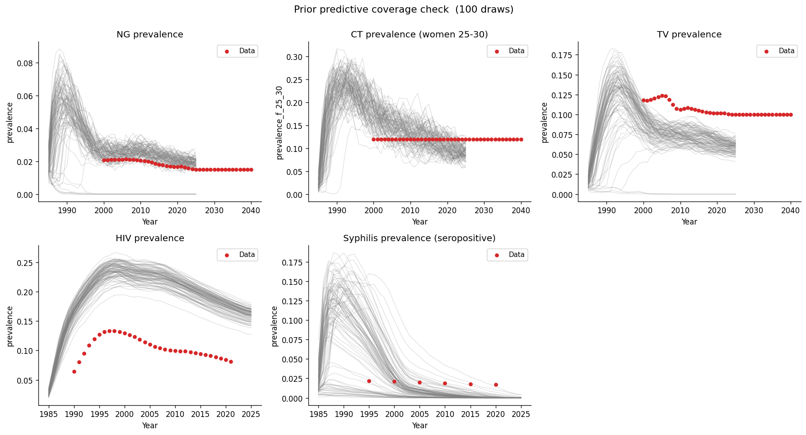

# Exp 05 — Coverage check: tighter syphilis priors

**Date:** 2026-05-15.

**Question.** Exp 04 showed `syph.beta_m2f` was the strongest predictor of
syphilis sustainability (sustaining mean 0.16 vs extinct 0.09). Does
tightening the prior floor (`beta_m2f` 0.01→0.10, `rel_trans_primary`
3→5) concentrate draws in the sustaining region?
See [`../04_coverage_check_concurrency/SUMMARY.md`](../04_coverage_check_concurrency/SUMMARY.md).

**Result.** No meaningful improvement despite doubling the mean beta
(0.19 vs 0.09). 13/100 draws show any syphilis above 0.05% by 2020
(vs 7/100 in exp 04 at 0.1% threshold), but none reach the ~2% data.
73/100 draws have effective transmission force > 0.5, and 23/100 have
force > 1.0 — yet syphilis still goes extinct in the vast majority.

## Observations

1. **High transmission force does not prevent extinction.** Draw #23 has
   the highest effective force (beta=0.33, rel_trans=7.7, eff_cond=0.32 →
   force=1.73) and still goes extinct. The problem is not the per-contact
   transmission probability.

2. **`prop_f0` is a strong predictor.** Extinct high-beta draws
   consistently have `prop_f0 > 0.75` — more women in the low-risk group
   means fewer potential chain links in the higher-risk groups that drive
   syphilis.

3. **Stochastic extinction may dominate at n_agents=5000.** At 2%
   syphilis prevalence, ~100 agents are infected. In the high-risk
   groups that drive transmission, that's ~5–10 agents — stochastic
   extinction is near-certain at these numbers regardless of
   transmission parameters.

4. **NG/CT/TV/HIV unchanged** — all still pass.

## Next

Test whether the extinction is a small-population artifact by running at
higher agent counts (10k–20k). If syphilis sustains at larger population
sizes, the coverage check passes and the issue is model resolution, not
model specification. If it still crashes, the network or natural history
parameters need further investigation.
