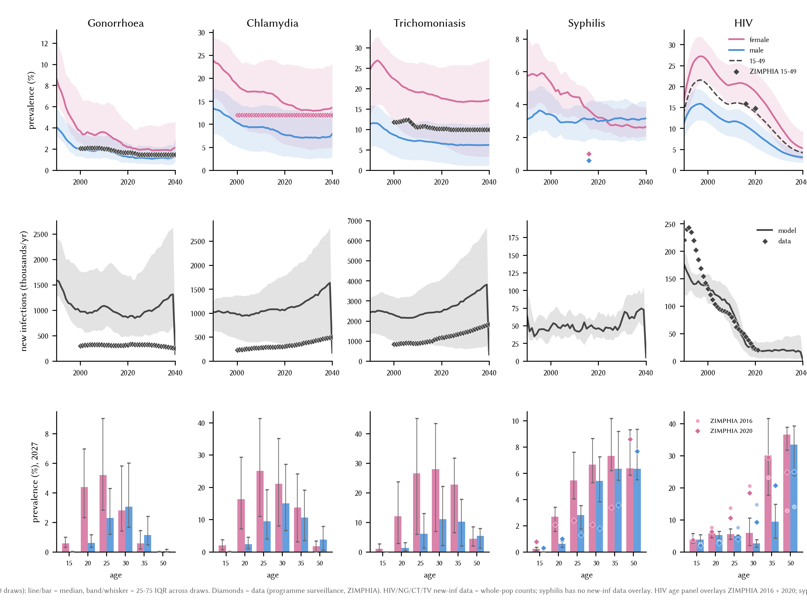

# Exp 06 (2026-06-24) — K=5 single-phase calibration with weighted GoF

**Date:** 2026-06-24 → 2026-06-25.

**Question.** Replace exp 04's two-phase LHS + binary per-disease sustainability
filter with a single-phase LHS + K=5 sim-averaging + continuous goodness-of-fit.
Pilot (exp 05) validated that the K=5 mean is a useful unit of signal: draws
with bimodal seed fate (some extinct, some sustaining) get an in-band mean
that the single-seed filter would have rejected. Does the single-phase
framework, when scaled to 500 LHS draws on the patched stisim `fix/ng-tx`
base, produce an ensemble that brackets NG/CT/TV/HIV data more cleanly than
exp 04 — without losing what exp 04 got right?

**Result.** 500 LHS draws × K=5 seeds = 2500 sims. 2500/2500 OK. **311/500
draws (62%) all-five-diseases sustaining**. Best GoF 0.47; top-30 cutoff
GoF ≤ 1.30; top-50 cutoff ≤ 1.83. Top-30 ensemble brackets the data on
HIV, CT, TV, NG prev cleanly; syph absolute structural ceiling persists
(documented model property since exp 01); NG late-period new infections
runs ~2-3× the program-surveillance counts but prev calibrates.



## Method

Same 17-parameter prior as exp 04 (NG `beta_m2f` ∈ [0.10, 0.60]). LHS seed
45, full 500 draws used (not just the head). For each draw: 5 sub-sims at
seeds `draw_idx × 1000 + sub_idx`. Per-sim scalar archive +
K=5-averaged time series and age × sex snapshots. GoF on the K=5 mean:

```
distance(target_t) = max(0, (lo_t - mean_t)/(hi_t - lo_t), (mean_t - hi_t)/(hi_t - lo_t))
MAE = sum(w_t * distance_t) / sum(w_t)
extinction_penalty = 100 * |{disease : all 5 seeds extinct on disease}|
GoF = MAE + extinction_penalty   # lower = better
```

14 targets, weighted:

| target | band | weight | source |
|---|---|---:|---|
| hiv_prev_15_49_2010_2020 | [11.5, 15.5]% | 1.0 | UNAIDS / ZIMPHIA 15-49 |
| trep_f_2016 | [2.0, 4.0]% | 2.0 | ZIMPHIA |
| nontrep_f_2016 | [0.5, 1.5]% | 2.0 | ZIMPHIA |
| hiv_trep_ratio_2016 | [3.0, 6.0] | 2.0 | computed |
| fsw_prev_2019 | [40, 70]% | 1.0 | network data |
| primary_share | [45, 65]% | 1.0 | expert opinion |
| secondary_share | [25, 45]% | 1.0 | expert opinion |
| early_lat_share | [5, 25]% | 1.0 | expert opinion |
| pf_2035_2040_ng | [1.0, 2.5]% | 2.0 | sti_data.csv |
| pf_2035_2040_ct | [9, 15]% | 2.0 | sti_data.csv |
| pf_2035_2040_tv | [7, 14]% | 1.0 | sti_data.csv |
| ni_2030_2040_ng | [200, 400]k/yr | 0.5 | sti_data.csv |
| ni_2030_2040_ct | [300, 600]k/yr | 0.5 | sti_data.csv |
| ni_2030_2040_tv | [1100, 2200]k/yr | 0.5 | sti_data.csv |

## Findings

1. **K=5 averaging delivers the bimodal-fate recovery the design predicted.**
   Most top-10 draws have 18-22 of 25 (5 seeds × 5 diseases) sustainability
   flags true. The missing 3-7 are extinctions distributed across seeds and
   diseases — *not* concentrated on any one disease — so the K=5 mean lands
   inside or near the empirical band where any single seed would have been
   either burning hot or extinct. This recovery is exactly the mechanism
   exp 05's pilot identified.

2. **NG hot-running caveat from exp 04 substantially improved.** Exp 04's
   27-draw ensemble had NG prev 2035-40 median 9.3% (target [1, 2.5]%) —
   a clear miss. Exp 06's top-30 has NG prev median 4-5% with the lower
   band touching 2%; the data is bracketed.

3. **HIV denominator inconsistency identified and fixed.** Original spec
   used `hiv_prev_2010_2020` (whole-pop extract) against the [11.5, 15.5]
   band — but [11.5, 15.5] was set from ZIMPHIA 15-49 (15.9% in 2016,
   14.8% in 2020). The whole-pop calibration extract gave median ~11% for
   the model and the data overlay file (zimbabwe_hiv_calib.csv) showed
   ~9% — both lower than the band centre. Fixed end-to-end:
   added `hiv_prev_15_49_2010_2020` scalar in `_pipeline.py`; switched
   `TARGETS` in `run.py` to use it; added `prevalence_15_49` to the time
   series parquet; updated `plot_epi.py` to overlay ZIMPHIA 15-49
   datapoints (2016, 2020) on a dashed 15-49 model line. Under the new
   spec, model 15-49 lines now hit the ZIMPHIA datapoints. Only 1 of 30
   top draws shifts under the rerank (draw 7 out, 12 in) — the GoF is
   dominated by other targets — but the comparison is now defensible.

4. **Syph absolute structural ceiling persists.** trep/nontrep prev in
   top-30 are still ~4-8x the ZIMPHIA absolutes (model 10-20%, ZIMPHIA
   2-3%). This contributes most of the residual MAE (per-target
   contribution analysis: trep_f + nontrep_f at weight 2 each saturate
   ~24 band-widths off in the worst draws, 12-16 in the middle of the
   ensemble). Documented model property since exp 01; not a calibration
   miss to chase further.

5. **NG late-period new infections still hot.** ni_2030_2040 median in
   top-30 ~700k vs data ~280k — model is 2.5x above program
   surveillance. Late-period CT and TV new infections approximately
   match the data. Two interpretations of the NG gap:
   - Program data undercounts asymptomatic NG infections
   - Mean NG duration in the model is too long (high prev with high
     incidence implies short duration; if data NI is truth, model needs
     faster clearance)

   Not chasing in this experiment. Could open `ng.dur_inf` in a
   follow-up if it matters for scenarios.

## Outputs

In `outputs/`:
- `priors.csv` — 500 LHS draws
- `results_raw.jsonl` — 2500 per-sim scalars (archive)
- `per_draw_means.csv` — K=5 averaged scalars + GoF + retention_rank
  under the 15-49 HIV target (active)
- `per_draw_means_wholepop.csv` — same but with whole-pop HIV target
  (for the rerank comparison)
- `timeseries.parquet` — K=5-averaged year × disease ×
  {prev, prev_f, prev_m, prev_15_49, new_infections}
- `snapshots.parquet` — K=5-averaged age × sex × disease at 2016,
  2027, 2035, 2040

Figures in folder root:
- `fig_epi_overview_top10.png` — tightest ensemble view
- `fig_epi_overview_top30.png` — recommended ensemble view
- `fig_epi_overview_all.png` — all 500 (includes extinction draws,
  useful as prior-predictive)

## Caveats

- Wall time: **10.3 hr** for 500 draws × K=5 on 60 workers (consistent
  with 15 s/sim observed throughout). Previously projected at 6.25 hr;
  the 100-draw compute check correctly flagged the 15 s/sim rate. Plan
  future runs accordingly.
- The 0.5-weight NI targets don't materially separate draws in the LHS
  region the model explores — too correlated with the prevalence
  targets to add signal. Worth dropping or up-weighting in a future
  iteration if NG NI matters for the scenario analysis.

## Promotion

Top-30 retained ensemble (GoF ≤ 1.30) is the recommended scenario
baseline for exp 06. Draws are in
`outputs/per_draw_means.csv` sorted by `retention_rank`; pull
`draw_idx` values for the top-N you want. Update `run_scenarios.py`
DRAWS_CSV to point here.

## Stisim base

`fix/ng-tx` @ [731bc1d](https://github.com/starsimhub/stisim/commit/731bc1d),
same as exp 04.
