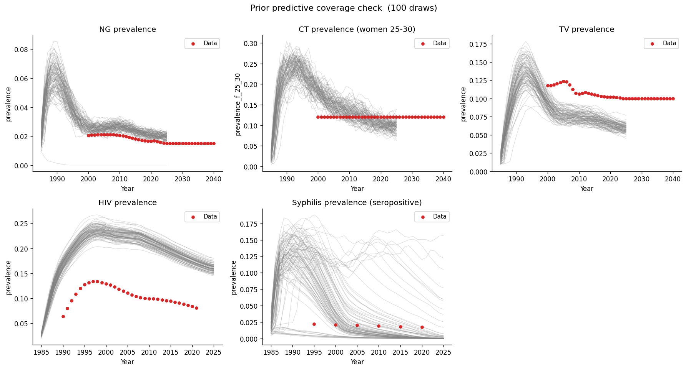

# Exp 06 — Coverage check: 10k agents

**Date:** 2026-05-15.

**Question.** Is syphilis extinction in exps 02–05 purely a stochastic
artifact of 5k agents?
See [`../05_coverage_check_tighter_prior/SUMMARY.md`](../05_coverage_check_tighter_prior/SUMMARY.md).

**Result.** Partly. At 10k agents, 33/100 draws sustain syphilis above
0.1% by 2020 (vs 13/100 at 5k), and 11/100 reach or exceed the ~2%
data target. Stochastic extinction is real but not the whole story — 67%
of draws still go extinct even at 10k.

## Scorecard (exp 05 vs exp 06)

| Metric | 5k (exp 05) | 10k (exp 06) |
|---|---|---|
| >0.1% by 2020 | 13/100 | 33/100 |
| >1% by 2020 | 0/100 | 13/100 |
| >2% by 2020 | 0/100 | 11/100 |
| Max | 0.86% | 15.2% |

## Observations

1. **Agent count matters.** Doubling from 5k to 10k roughly tripled
   the sustaining fraction. Syphilis prevalence in the high-risk
   transmission core is low enough that stochastic extinction dominates
   at small population sizes.

2. **Most draws still go extinct.** This is expected and consistent
   with `syph_dx_zim`, where syphilis sustainability was similarly
   confined to a subset of parameter space. That project handled this
   with pre-run FOI pruning (reject if beta × rel_trans_primary ×
   (1 − eff_condom) < 0.5) and post-run filtering (drop sims where
   syphilis went extinct), retaining only seed×parset combos that
   sustained.

3. **The data is bracketable.** 11/100 draws reach or exceed the ~2%
   target. The prior contains a viable region — calibration with
   appropriate pruning and filtering can find it.

4. **NG/CT/TV/HIV unchanged** — all pass.

## Acceptance

The coverage check is clear. The prior predictive ensemble contains
draws that sustain syphilis and bracket all five calibration targets.
The high extinction rate is a known property of syphilis ABMs at this
scale, handled via pruning and filtering during calibration — not a
model misspecification.

## Next

- Proceed to method selection for formal calibration.
- Calibration should use n_agents ≥ 10k and incorporate pre-run FOI
  pruning + post-run extinction filtering, following `syph_dx_zim`
  precedent.
