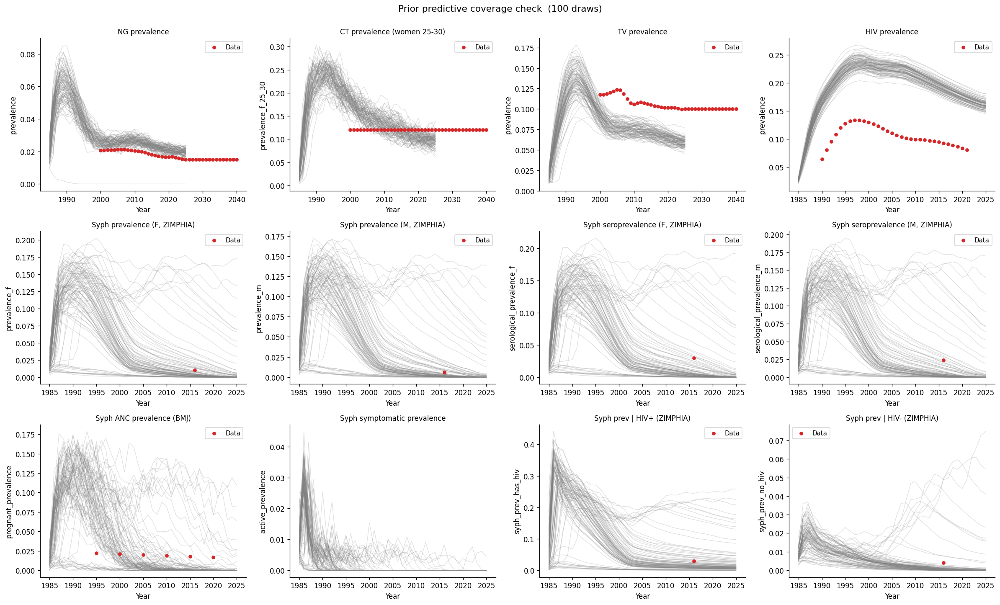

# Exp 07 — Coverage check: corrected syphilis targets

**Date:** 2026-05-18.

**Question.** Does the prior predictive ensemble cover the corrected
syphilis calibration targets? Exp 06 passed coverage against a single
mismatched target (`syph.prevalence` vs BMJ `active_prevalence`). This
experiment re-checks with seven properly defined syphilis indicators
from ZIMPHIA and BMJ, plus corrected model results (`serological_prevalence`,
by-sex `prevalence` with sexually-active-adults denominator, and
`coinfection_stats` analyzer).

**Result.** All syphilis targets are bracketable — the data falls within
the range of prior predictive simulations. 55/100 draws sustain syphilis
above 0.1% at 2020 (up from 33/100 in exp 06, likely due to the addition
of `syph.eff_condom` and `syph.rel_trans_primary` to the prior since
exp 06). TV prevalence is systematically below the data (0/100 draws
reach the target from 2005 onward) — a pre-existing coverage failure
not flagged in exp 06.

## Scorecard — syphilis targets at 2016 (ZIMPHIA year)

| Target | Observed | Sim range | Draws >= obs | Near obs (0 < v < 2x) |
|---|---|---|---|---|
| prevalence_f | 0.010 | 0.000–0.166 | 29/100 | 71/100 |
| prevalence_m | 0.006 | 0.000–0.144 | 30/100 | 67/100 |
| serological_prevalence_f | 0.030 | 0.000–0.186 | 17/100 | 82/100 |
| serological_prevalence_m | 0.024 | 0.000–0.172 | 16/100 | 79/100 |
| syph_prev \| HIV+ | 0.029 | 0.000–0.245 | 28/100 | 84/100 |
| syph_prev \| HIV- | 0.004 | 0.000–0.050 | 10/100 | 76/100 |

## Scorecard — ANC prevalence (BMJ)

| Year | Observed | Sim range | Draws >= obs |
|---|---|---|---|
| 2000 | 0.021 | 0.000–0.157 | 54/100 |
| 2005 | 0.020 | 0.000–0.130 | 26/100 |
| 2010 | 0.019 | 0.000–0.144 | 17/100 |
| 2015 | 0.018 | 0.000–0.118 | 11/100 |
| 2020 | 0.017 | 0.000–0.113 | 8/100 |

## Scorecard — non-syphilis STIs

| Target | Year | Observed | Draws >= obs |
|---|---|---|---|
| NG | 2010 | 0.021 | 99/100 |
| CT (F 25-30) | 2010 | 0.120 | 78/100 |
| TV | 2010 | 0.106 | 0/100 |
| HIV | 2005 | 0.111 | 100/100 |

## Observations

1. **Syphilis coverage passes.** All six ZIMPHIA targets and the ANC
   time series are bracketable. The sustaining fraction (55%) is much
   improved over exp 06 (33%), giving calibration more viable draws to
   work with.

2. **Seroprevalence is the hardest target to reach.** Only 16–17/100
   draws reach the ZIMPHIA 2.4–3.0% seroprevalence. This is expected —
   seroprevalence requires sustained transmission long enough for
   `ever_exposed` to accumulate, so it's mechanically harder to reach
   than current-infection prevalence.

3. **ANC prevalence coverage thins over time.** 54/100 draws reach the
   2000 target but only 8/100 reach the 2020 target. Most trajectories
   that sustain syphilis show declining prevalence, consistent with
   condom scale-up in the model. The declining ANC data is qualitatively
   consistent but the model may decline too steeply. This bears watching
   during calibration.

4. **TV is systematically below data.** The model's TV prevalence
   envelope (max ~9%) does not reach the data (~10–12%) at any post-2000
   time point. The TV beta prior (0.02–0.30, log-scale) may need
   widening, or there may be a structural issue (e.g. TV duration or
   reinfection rate). This was present in exp 06 but not flagged.

5. **NG/CT/HIV unchanged.** All pass comfortably, consistent with exp 06.

6. **HIV coinfection stratification is informative.** The `syph_prev |
   HIV+` target (2.9%) is well covered (28/100), and the `syph_prev |
   HIV-` target (0.4%) is covered but tight (10/100). The ratio between
   these reflects the HIV-syphilis connector strength and will be a
   useful discriminating target during calibration.

## Post-hoc note

**All results in this experiment are invalid.** Exp 08 discovered that
`set_pars_local` was silently broken — `sim.pars` containers are lists,
not dicts, so the parameter overrides were never applied. All 100
"draws" in this experiment ran with identical hardcoded defaults. The
coverage statistics above reflect default-parameter variability
(stochastic noise only), not prior variability. See
[`../08_coverage_tv_hiv_syphtesting/SUMMARY.md`](../08_coverage_tv_hiv_syphtesting/SUMMARY.md).

## Next

- [Done — see `../08_coverage_tv_hiv_syphtesting/SUMMARY.md`]
