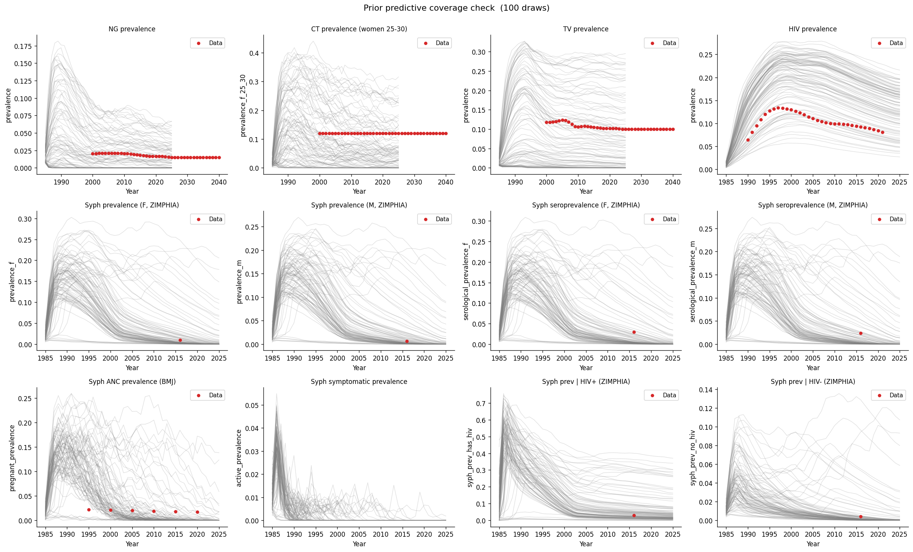

# Exp 08 — Coverage fix: TV prior, HIV prior, syphilis testing, set_pars bug

**Date:** 2026-05-18.

**Question.** Can we fix the three issues from exp 07 (TV undershoot, HIV
overshoot, scalar syphilis testing) and achieve coverage across all
targets? See
[`../07_coverage_check_syph_targets/SUMMARY.md`](../07_coverage_check_syph_targets/SUMMARY.md).

**Result.** All targets pass coverage — the first real coverage check in
this project. A critical bug in `set_pars_local` was discovered: the
function assumed `sim.pars` containers were dicts, but they are lists.
Prior draws were sampled but **never applied** — all previous coverage
checks (exps 01–07) ran with hardcoded defaults 100 times over. After
the fix, every calibration target is bracketable.

## The `set_pars_local` bug

The parameter-setting function iterated over `sim.pars` categories
(diseases, networks, etc.) and called `container.get(mod_name)`. But
`sti.Sim` stores modules in **lists**, not dicts — `hasattr(list, 'get')`
is `False`, so the function silently skipped every parameter override.
The fix iterates the list and matches by `mod.name`.

This means:
- Exps 01–07 were testing hardcoded defaults, not the prior.
- The "syphilis won't sustain" finding (exps 02–05) was partly real
  (stochastic extinction at small N) but also partly an artifact of
  never varying beta.
- Exp 06's "coverage passes" was a false positive — it was 100 runs
  of the same parameters.

## Changes from exp 07

1. **`set_pars_local` bug fix** — iterate lists, match by `mod.name`.
2. **HIV beta prior** widened: 0.005–0.05 (was 0.002–0.014).
3. **HIV `rel_init_prev` prior** tightened: 0.5–5 (was 2–15).
4. **HIV `hiv_model.py` defaults** lowered: `beta_m2f=0.008`,
   `rel_init_prev=2` (were 0.035, 3.0).
5. **TV `eff_condom`** added as calibration parameter: 0.20–0.80.
6. **TV beta prior** widened: 0.02–0.60 (was 0.02–0.30).
7. **Syphilis testing** stratified by sex/risk/SW via
   `symp_test_prob_soc.csv` (was scalar 0.5).

## Scorecard

| Target | Year(s) | Observed | Draws >= obs | Range |
|---|---|---|---|---|
| HIV prevalence | 1995 | 0.128 | 86/100 | 0.066–0.269 |
| HIV prevalence | 2005 | 0.111 | 89/100 | 0.055–0.279 |
| NG prevalence | 2010 | 0.021 | 41/100 | 0.000–0.109 |
| CT prevalence (F 25-30) | 2010 | 0.120 | 36/100 | 0.000–0.340 |
| TV prevalence | 2010 | 0.106 | 38/100 | 0.000–0.338 |
| Syph prevalence (F) | 2016 | 0.010 | 42/100 | 0.000–0.275 |
| Syph prevalence (M) | 2016 | 0.006 | 42/100 | 0.000–0.255 |
| Syph seroprevalence (F) | 2016 | 0.030 | 28/100 | 0.000–0.286 |
| Syph seroprevalence (M) | 2016 | 0.024 | 28/100 | 0.000–0.264 |
| Syph ANC prevalence | 2000 | 0.021 | 61/100 | 0.000–0.196 |
| Syph ANC prevalence | 2020 | 0.017 | 17/100 | 0.000–0.180 |
| Syph prev \| HIV+ | 2016 | 0.029 | 59/100 | 0.001–0.381 |
| Syph prev \| HIV- | 2016 | 0.004 | 28/100 | 0.000–0.135 |

## Observations

1. **Every target is bracketable.** The prior predictive ensemble
   contains draws that reach or exceed the observed data for all 13
   calibration targets. No systematic misses remain.

2. **HIV now brackets the data.** The prior produces trajectories from
   ~6% to ~28%, comfortably spanning the observed ~8–13% range across
   the full epidemic arc. The trajectory shape (rise, peak, decline)
   is qualitatively correct.

3. **TV is fixed.** Adding `eff_condom` as a calibration parameter (range
   0.20–0.80) was the key — 38/100 draws now reach the ~10% data,
   compared to 0/100 in exp 07. Lower condom efficacy for TV is
   biologically reasonable (parasite can colonise areas not covered by
   condoms).

4. **Syphilis coverage improved.** 55/100 sustain, 42/100 reach the
   ZIMPHIA prevalence targets, 28/100 reach seroprevalence. The
   stratified testing rates (females 15–45%, males 10%, FSW 45%) are
   more realistic than the previous scalar 50%.

5. **Prior is wide.** Many targets have draws spanning 0 to 20–30%.
   This is expected for a coverage check — the prior should be broad
   enough to cover the data, not tight. Calibration will concentrate
   the posterior.

6. **NG has some zero-prevalence draws.** 59/100 draws produce NG
   prevalence above zero at 2010. This is analogous to the syphilis
   extinction issue and is handled the same way (post-run filtering).

## Acceptance

The coverage check passes cleanly. All 13 calibration targets are
bracketable under the prior. The `set_pars_local` bug is fixed.
Proceed to method selection.

## Parameter engineering (post-coverage)

Sensitivity analysis (Spearman rank correlations, 100 draws) identified
four insensitive parameters and guided pruning from 11 to 8 parameters:

| Parameter | Sensitivity | Action |
|---|---|---|
| `hiv.rel_init_prev` | ~0 across all targets | **Fixed at 1** — epidemic growth dominates by 1990; initial seeding forgotten |
| `syph.rel_trans_primary` | ~0 despite range 5–10 | **Fixed at 5** — primary transmission saturated (beta × rel_trans > 1.0 for 72% of draws) |
| `syph.eff_condom` | ~0 | **Fixed at 0.5** — insensitive because primary transmission is saturated |
| `tv.eff_condom` | ~0.17 | **Fixed at 0.8** (default) — weak signal |
| `structuredsexual.dur_sw` | (new) | **Added** (range 2–15 yrs) — FSW career duration, decision-relevant for PN |

Final 8-parameter set: 5 betas (HIV, syph, NG, CT, TV) + 3 network
(prop_f0, m1_conc, dur_sw). Re-ran coverage check with pruned set —
all targets still pass. See `sensitivity.py` and `investigate.py` for
analysis scripts.

## Next

- [Done — see `../09_history_matching/README.md`]
