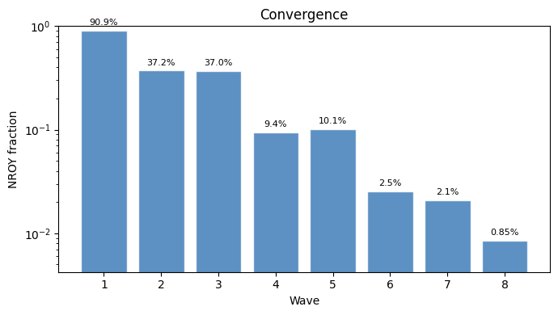
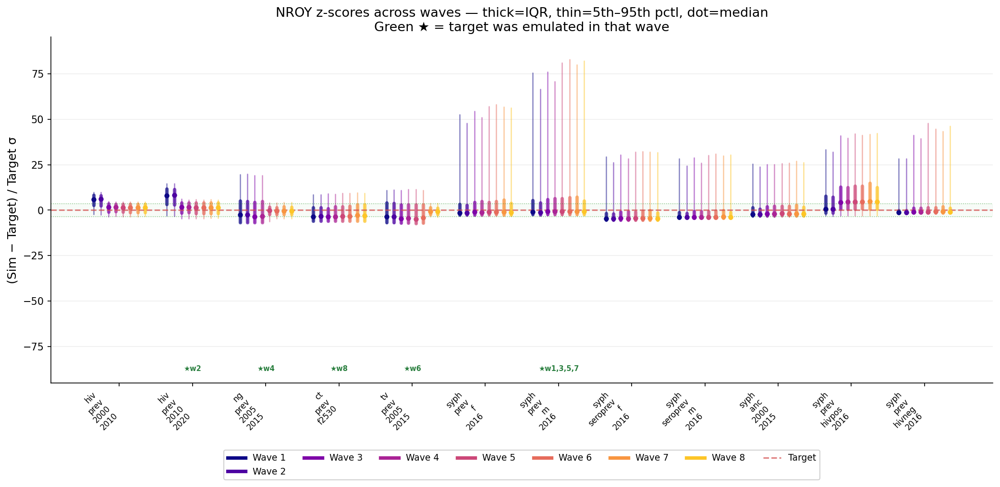
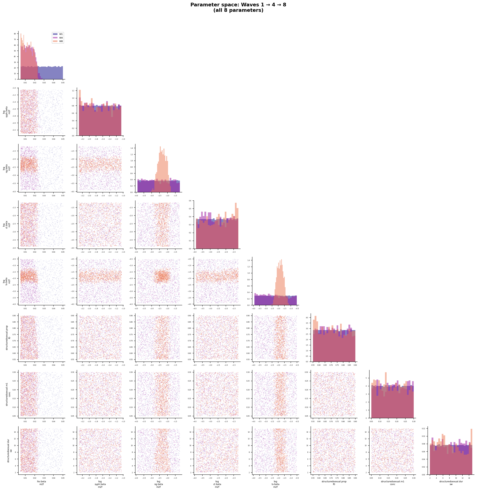
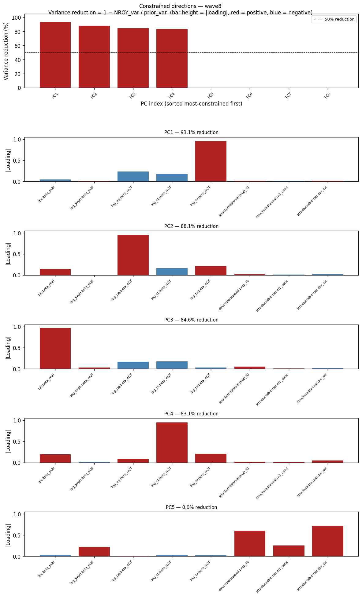

# Exp 09 — History matching: 8 waves

**Date:** 2026-05-19.

**Question.** Can history matching narrow the 8-parameter prior to a
NROY region consistent with all calibration targets? See
[`../08_coverage_tv_hiv_syphtesting/SUMMARY.md`](../08_coverage_tv_hiv_syphtesting/SUMMARY.md)
for the coverage check and parameter engineering that preceded this.

**Result.** NROY narrowed from 91% to 0.85% of the prior volume over
8 waves — a ~100x reduction. The five disease betas are tightly
constrained (83–93% variance reduction). The three network parameters
(`prop_f0`, `m1_conc`, `dur_sw`) are unconstrained by the data, as
predicted by sensitivity analysis. Syphilis targets remain poorly
fitted: the bimodal sustain/extinct dynamics defeat the Bayes linear
emulator, producing z-scores of 10–80σ despite `syph_prev_m_2016`
being selected in 4 of 8 waves.

## Wave-by-wave

| Wave | NROY % | Feature emulated | Notes |
|---|---|---|---|
| 1 | 90.9% | syph_prev_hivpos_2016 | Coinfection target; initial cut |
| 2 | 37.2% | hiv_prev_2010_2020 | HIV prevalence; big reduction |
| 3 | 37.0% | syph_prev_m_2016 | Minimal further cut — emulator struggles with bimodal surface |
| 4 | 9.4% | ng_prev_2005_2015 | NG beta constrained; NROY drops to <10% |
| 5 | 10.1% | syph_prev_m_2016 | Slight NROY expansion (sampling noise) |
| 6 | 2.5% | tv_prev_2005_2015 | TV beta constrained |
| 7 | 2.1% | syph_prev_m_2016 | Incremental |
| 8 | 0.85% | ct_prev_f2530 | CT beta constrained; final NROY |

## Observations

1. **Beta parameters are well-identified.** HIV, NG, CT, and TV betas
   all show tight NROY marginals with >83% variance reduction. These
   are the parameters the data can speak to — each has a dominant,
   near-orthogonal target.

2. **Syphilis beta is partially constrained** but the emulator can't
   fully resolve it. The sustain/extinct bimodality means most of the
   parameter space produces zero syphilis, and the Bayes linear emulator
   fits the mean of this bimodal surface poorly (high sigma², low R²).

3. **Network parameters are unconstrained.** `prop_f0`, `m1_conc`, and
   `dur_sw` show 0% variance reduction — the calibration data doesn't
   discriminate between network structures. This is expected: these
   parameters showed rho < 0.2 in the sensitivity analysis. They remain
   open for uncertainty propagation in the decision analysis.

4. **8000 model evaluations total** (1000/wave × 8 waves) in ~105
   minutes. Efficient given the ~24s/sim cost and 75-worker
   parallelization.

## Acceptance

The NROY is usable. The disease betas are constrained; the network
parameters carry prior uncertainty forward to the decision analysis.
The syphilis bimodality is a known property best handled at the
trajectory selection stage, not by more HM waves.

## Next

- Trajectory selection within NROY: draw ~1000 parameter sets from the
  NROY region, run with multiple seeds, filter extinct syphilis runs,
  weight by data fit to produce the posterior predictive distribution.
