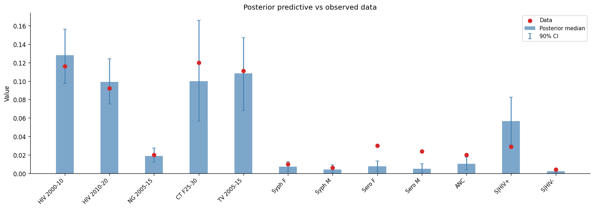
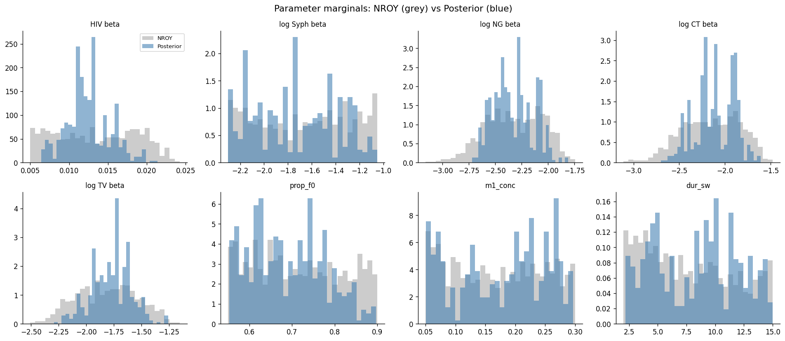
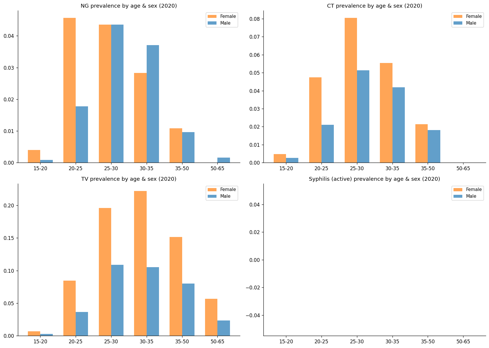
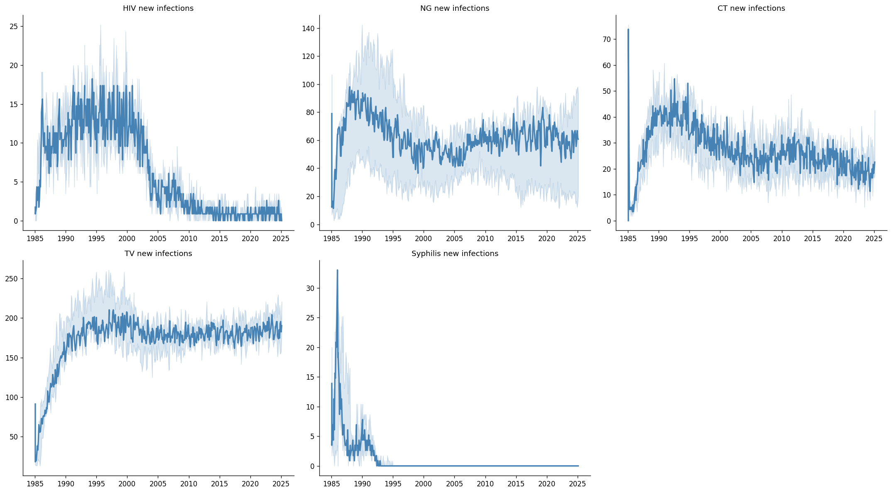
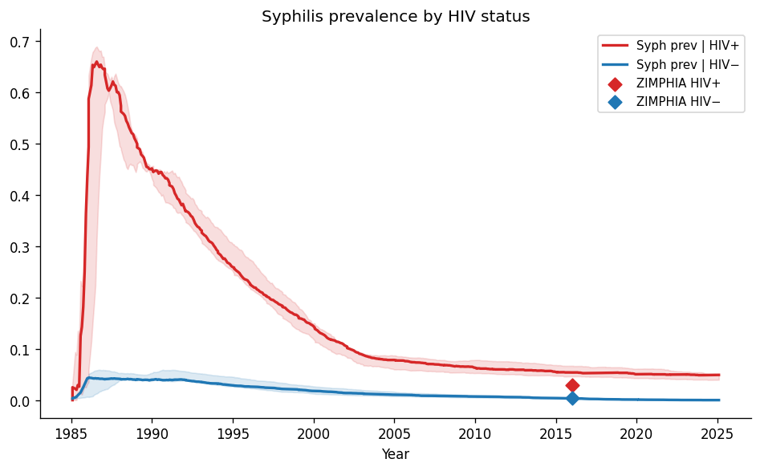
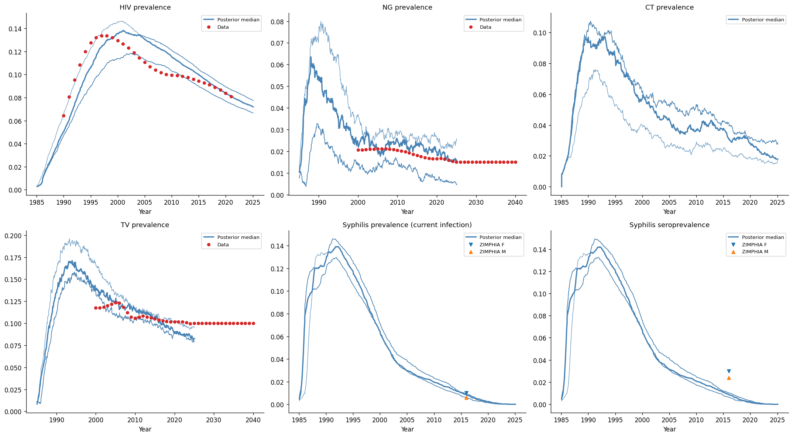

# Exp 10 — Trajectory selection within NROY

**Date:** 2026-05-20.

**Question.** Can we produce a usable posterior predictive distribution
by resampling within the NROY region from exp 09? See
[`../09_history_matching/SUMMARY.md`](../09_history_matching/SUMMARY.md).

**Result.** Partially. 1000 sims from the NROY region, filtered for
syphilis sustainability (908 survive, 91%), weighted by a Gaussian
pseudo-likelihood with widened stds, yield ESS = 75.6 (8.3% efficiency).
The posterior covers HIV/NG/CT/TV targets well. **Syphilis is
structurally broken:** the model generates a massive early epidemic
(~14% overall prevalence, ~65% among HIV+ at peak ~1987) that burns
through susceptible partnerships and decays to near-zero active
prevalence by 2005. By 2020, age-stratified active syphilis prevalence
is effectively zero in all age/sex bins, and new syphilis infections
have ceased. This is not a calibration problem — it is a model dynamics
failure that blocks decision analysis.

## Key numbers

| Metric | Value |
|---|---|
| NROY draws | 1000 |
| Seeds per draw | 1 |
| After syphilis filter (prev_f > 0.001) | 908 (91%) |
| ESS | 75.6 |
| ESS / N | 8.3% |
| Draws with weight > 1% | 21 |
| Draws with weight > 0.1% | 162 |

## Pseudo-likelihood stds

Initial stds (from exp 09) produced ESS = 1.7 (0.2%) — the joint
product of 12 narrow Gaussians concentrated weight on a single draw.
Widened stds (2x for non-syphilis, 3x for syphilis targets) brought
ESS to 75.6. The widened stds are justified: they reflect stochastic
model noise at 10k agents on top of data uncertainty, particularly for
syphilis where sustain/extinct bimodality inflates run-to-run variance.

## Observations

1. **HIV, NG, CT, TV fit well.** Posterior medians are close to data,
   90% CIs cover the observations. HIV slightly overshoots (median
   0.128 vs data 0.116 for 2000–2010), consistent with the beta
   posterior concentrating at the higher end of the NROY.

2. **Syphilis dynamics are structurally wrong — burn-through, not
   endemic equilibrium.** The epi diagnostic plots reveal the full
   picture: syphilis prevalence peaks ~1987 then declines monotonically.
   By 2020, active prevalence by age and sex is zero in every bin
   (age_prevalence.png, bottom-right). New syphilis infections are
   ~30/timestep in the late 1980s but near-zero after 2000
   (new_infections.png). Congenital syphilis cases cease after ~2005.
   The syphilis sustainability filter (prev_f > 0.001 at 2016) is too
   permissive — it passes draws where syphilis technically persists at
   negligible levels rather than maintaining endemic transmission.

3. **Syphilis beta posterior concentrates at the lower bound.** Posterior
   median syph.beta_m2f = 0.17, range [0.10, 0.18] in the top 50
   draws — the prior floor. Higher betas would cause even more
   aggressive burn-through. The problem is not that beta is wrong; it
   is that the network cannot sustain endemic syphilis regardless of
   beta.

4. **Coinfection target (S|HIV+) overshoots.** Posterior median 0.056
   vs ZIMPHIA 0.029. The HIV-syphilis connector amplifies syphilis
   prevalence among HIV+ beyond observed levels — but this too is
   concentrated in the early epidemic period.

5. **Parameter marginals show clear learning for betas.** HIV beta
   concentrates around 0.012, NG/CT/TV betas are tightly peaked.
   Network parameters (prop_f0, m1_conc, dur_sw) remain broad — the
   data doesn't constrain them.

6. **91% syphilis sustainability in the NROY** is a major improvement
   over the 55% from the full prior (exp 08). The HM waves
   successfully concentrated on the region where syphilis sustains —
   but "sustains" ≠ "maintains endemic equilibrium."

## Acceptance

**Blocked for decision analysis.** The posterior is valid for
HIV/NG/CT/TV but syphilis dynamics are structurally broken. If active
syphilis prevalence is ~0 by 2020, partner notification interventions
have nothing to find and treat. The entire project premise depends on
ongoing syphilis transmission at the time the intervention is deployed.

ESS = 75.6 (8.3%) is technically adequate, and the non-syphilis
parameters are usable. But the syphilis component must be fixed before
the posterior can be propagated through PN/care-seeking scenarios.

## Diagnosis

The syphilis burn-through pattern points to a structural mismatch
between syphilis natural history and network dynamics:

- **Primary stage saturates available partners.** Syphilis is most
  infectious during primary (~9–90 days). In a finite network, the
  initial seed rapidly infects all reachable partners during primary,
  generating the massive early peak.
- **Recovery + immunity outpace new susceptible partnerships.** After
  primary, agents recover or enter latency. By the time new
  susceptible agents enter the sexual network, the infectious pool has
  already collapsed.
- **Beta cannot fix this.** Lower beta delays the peak but still
  produces burn-through; higher beta accelerates it. The posterior
  pushes beta to the prior floor (0.10) because that produces the
  least-bad dynamics, but it is still not endemic.

Candidate fixes (in order of structural preference):
1. **Exogenous force of infection (FOI floor).** Add a small background
   importation rate so syphilis cannot go extinct. Standard ABM
   practice for low-prevalence STIs.
2. **Waning immunity.** If syphilis immunity wanes (seroreversion →
   re-susceptibility), the recovered pool recycles into susceptible,
   sustaining transmission.
3. **Open additional network parameters.** Increase partner turnover or
   concurrency to provide more susceptible contacts during primary.
4. **Re-seeding.** Periodically re-introduce syphilis to mimic
   importation from outside the modelled population.

## Next

- **Do not proceed to decision analysis.** Fix syphilis dynamics first.
- Open exp 11 to test FOI floor and/or waning immunity as structural
  fixes, then re-run trajectory selection.
- The HIV/NG/CT/TV posterior from this experiment is reusable — no
  need to redo history matching for those parameters.
