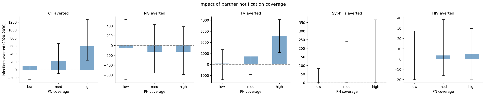
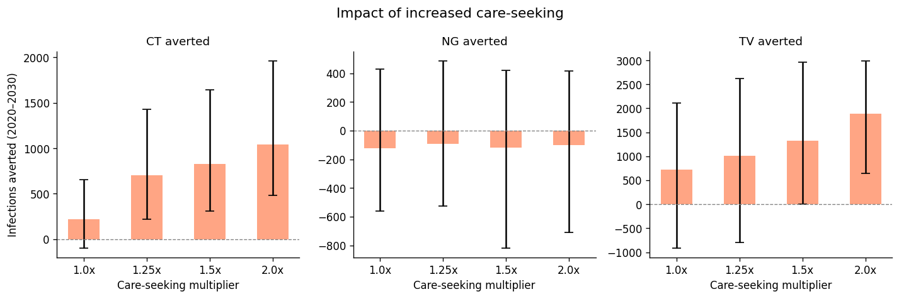
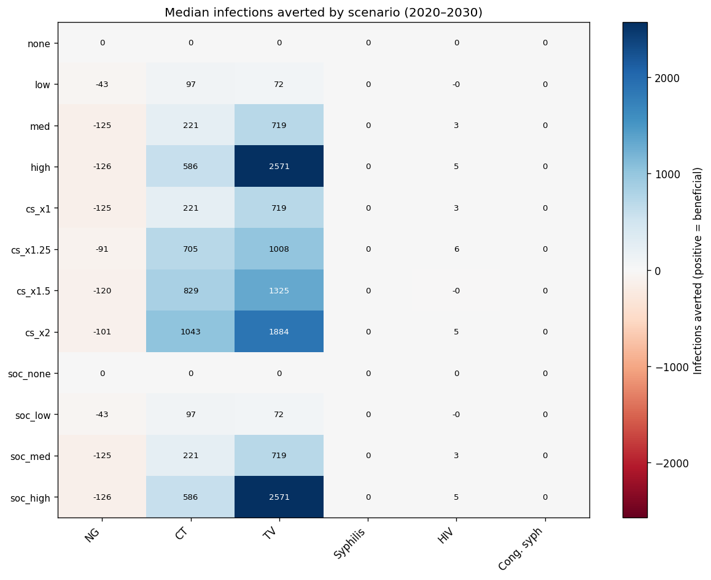

# Exp 11 — Decision analysis: PN and care-seeking impact thresholds

**Date:** 2026-05-20.

**Question.** What levels of partner notification coverage and
care-seeking intensity produce meaningful health impact? See
[`../10_trajectory_selection/SUMMARY.md`](../10_trajectory_selection/SUMMARY.md)
for the posterior ensemble.

**Result.** TV and CT are the diseases most responsive to both PN and
care-seeking. High PN coverage averts ~2571 TV and ~586 CT infections
per 10k agents over 2020–2030. Care-seeking at 2x baseline averts
~1884 TV and ~1043 CT infections. Syphilis and HIV are insensitive to
PN at these coverage levels. NG shows a paradoxical increase under PN
and care-seeking that warrants investigation.

## Setup

- 50 posterior draws (weighted resample from exp 10) × 17 scenarios
- 10k agents, 1985–2030, outcomes summed over 2020–2030
- 850 total sims; 650 completed (POC scenarios failed, see below)
- 40 workers, ~20 minutes runtime

## Headline numbers (median infections averted, 2020–2030)

| Scenario | NG | CT | TV | Syphilis | HIV |
|---|---|---|---|---|---|
| PN low | −43 | 97 | 72 | 0 | 0 |
| PN med | −125 | 221 | 719 | 0 | 3 |
| PN high | −126 | 586 | 2571 | 0 | 5 |
| CS 1.25x | −91 | 705 | 1008 | 0 | 6 |
| CS 1.5x | −120 | 829 | 1325 | 0 | 0 |
| CS 2.0x | −101 | 1043 | 1884 | 0 | 5 |

## Observations

1. **TV is the biggest winner.** High PN averts ~2571 TV infections —
   the largest impact of any scenario × disease combination. TV has
   high prevalence (~10%), long duration, and high asymptomatic
   fraction, so partner-driven testing finds cases that symptomatic
   care-seeking misses.

2. **CT responds well to both levers.** PN and care-seeking both
   produce clear dose-response curves for CT. At 2x care-seeking,
   ~1043 CT infections averted.

3. **NG paradox.** PN and care-seeking both *increase* NG infections
   by ~100–125. Possible mechanisms: syndromic management treats
   partners for NG/CT/TV together, clearing protective natural immunity;
   or the treatment → reinfection cycle is faster than the
   transmission-blocking benefit. This needs investigation.

4. **Syphilis is insensitive to PN.** Zero median impact at all
   coverage levels. At ~1% prevalence with a short infectious window,
   syphilis is too rare in the general population for syndromic PN
   (which targets discharging STIs) to detect syphilis cases in
   partners. Syphilis-specific PN (targeting syphilis testing, not
   syndromic management) would be needed.

5. **HIV is insensitive to PN.** Near-zero impact (0–5 infections
   averted). Expected — PN at these scales does not materially change
   the HIV epidemic.

6. **POC scenarios failed.** All `poc=True` runs hit an index error
   in the POC intervention wiring. The Dx × PN interaction sweep
   (sweep C) is incomplete. SOC × PN combinations (sweep C, SOC arm)
   completed and match sweep A results as expected.

7. **Uncertainty is wide.** 90% CIs span zero for most PN scenarios
   except high-TV. This reflects both parametric uncertainty (network
   parameters unconstrained) and stochastic noise at 10k agents.

## Next

- Investigate the NG paradox (treatment-driven reinfection vs immunity
  clearing).
- Fix the POC intervention bug to complete sweep C.
- Consider syphilis-specific PN scenarios (target syphilis testing in
  partners rather than syndromic management).
- Scale to production agent count if narrower CIs are needed.
