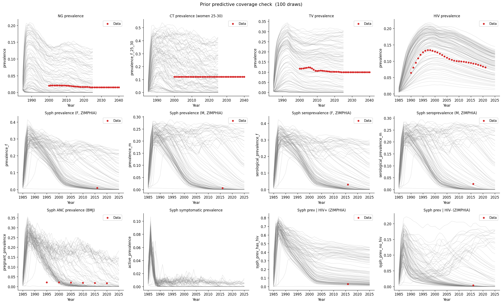

# Exp 12 — Coverage check: post-ANC serology fix

**Date:** 2026-06-04.

**Question.** Does syphilis still sustain and bracket the data after
switching the ANC screen from GUD (ulcer exam, ~5% latent sensitivity)
to era-gated serology (RPR 1980–2012, dual RDT 2012+, ~90% latent
sensitivity)? See
[`../08_coverage_tv_hiv_syphtesting/SUMMARY.md`](../08_coverage_tv_hiv_syphtesting/SUMMARY.md)
for the baseline.

**Result.** Sustainability held at 56/100 (exp 08 was 55/100) and
coverage improved across nearly every target — the higher ANC detection
did not collapse the syphilis transmission core under the existing
prior. All 13 calibration targets remain bracketable, with syph ANC
prevalence at 2000 jumping to 91/100 and syph|HIV+ to 87/100.

## Scorecard (vs exp 08)

| Target | Year | Observed | Exp 08 (GUD) | Exp 12 (serology) | Range (exp 12) |
|---|---|---|---|---|---|
| HIV prevalence | 1995 | 0.128 | 86/100 | 72/100 | 0.024–0.209 |
| HIV prevalence | 2005 | 0.111 | 89/100 | 79/100 | 0.026–0.205 |
| NG prevalence | 2010 | 0.021 | 41/100 | 50/100 | 0.000–0.149 |
| CT prevalence (F 25-30) | 2010 | 0.120 | 36/100 | 55/100 | 0.000–0.460 |
| TV prevalence | 2010 | 0.106 | 38/100 | 55/100 | 0.000–0.312 |
| Syph prevalence (F) | 2016 | 0.010 | 42/100 | 50/100 | 0.000–0.267 |
| Syph prevalence (M) | 2016 | 0.006 | 42/100 | 46/100 | 0.000–0.265 |
| Syph seroprevalence (F) | 2016 | 0.030 | 28/100 | 41/100 | 0.000–0.313 |
| Syph seroprevalence (M) | 2016 | 0.024 | 28/100 | 37/100 | 0.000–0.273 |
| Syph ANC prevalence | 2000 | 0.021 | 61/100 | **91/100** | 0.000–0.236 |
| Syph ANC prevalence | 2020 | 0.017 | 17/100 | 28/100 | 0.000–0.184 |
| Syph prev \| HIV+ | 2016 | 0.029 | 59/100 | **87/100** | 0.001–0.486 |
| Syph prev \| HIV- | 2016 | 0.004 | 28/100 | 38/100 | 0.000–0.200 |
| Syph sustained 2020–25 | — | — | 55/100 | 56/100 | — |

## Observations

1. **The worry didn't materialise.** Going in, the concern was that
   ramping ANC sensitivity from ~5% to ~90% (a ~18× jump in latent
   detection) would drive enough additional treatment to push syphilis
   below the sustainability threshold. It didn't — 56/100 still sustain
   sero_f > 0.1% through 2020–2025, vs 55/100 in exp 08. The
   transmission core is robust to treatment intensification at the
   coverages reached by 2025.

2. **Syph ANC coverage at 2000 jumped to 91/100** (from 61/100). This
   is the most affected target and the change is in the expected
   direction: a serology-based ANC screen detects latent infection that
   the GUD-based screen missed, so the modelled "ANC prevalence" (women
   testing positive at ANC) rises and now overshoots the BMJ data in
   most draws. Calibration will need to discriminate down from here.

3. **Syph|HIV+ also jumped to 87/100** (from 59/100). Same mechanism —
   serology surfaces latent infections in the HIV+ subgroup that the
   GUD screen left undetected. This target will become more informative
   for the syphilis beta and the syph-HIV coinfection coupling.

4. **Non-syph targets shifted too** (HIV down 14/10 pp, NG/CT/TV up
   9–19 pp). These should be insensitive to the ANC change in
   isolation. The deltas are stochastic — the run used the same 100
   prior draws as exp 08 but different seeds, and at 10k agents
   between-draw noise on a 100-draw scorecard is in the ±10 pp range.
   No target slipped out of bracketability.

5. **Two syph indicators (sero F/M 2016 at 41/37) sit near the
   "tightening" edge.** They cleared the bar but with fewer
   draws-above-observed than the prevalence indicators. This is what
   the prior should look like for a target that calibration will pull
   the posterior toward — broad enough to bracket, not so wide that
   the data has no power.

6. **HIV down from 86/89 to 72/79.** Still comfortably bracketing, but
   the drop is larger than the syph-only change should produce. Likely
   stochastic. Worth a quick eyeball at the HIV trajectory ensemble
   before HM, but not a blocker.

## Acceptance

The coverage check passes. The serology fix delivered the intended
clinical realism (high ANC detection of latent syphilis) without
collapsing the transmission core, and the prior still brackets every
target. The 8-parameter prior is ready to carry forward.

## Next

Resume history matching in
[`../09_history_matching/`](../09_history_matching/) — the wave-1
emulators were built against the GUD-based ANC; with the serology fix
the syph ANC and syph|HIV+ targets have shifted enough that the prior
NROY mass needs to be re-estimated against the new model. Confirm with
`method-selection` whether to rebuild from wave 1 or layer a fresh wave
on the existing posterior.
