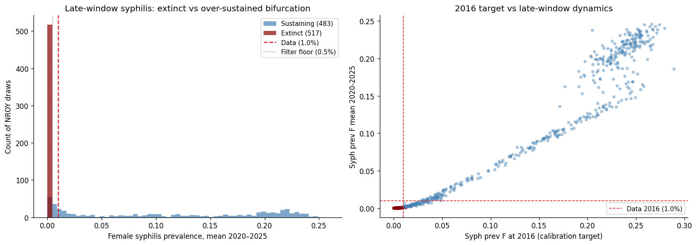
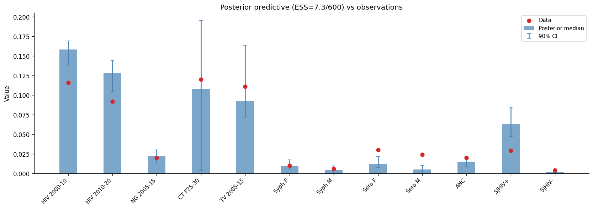
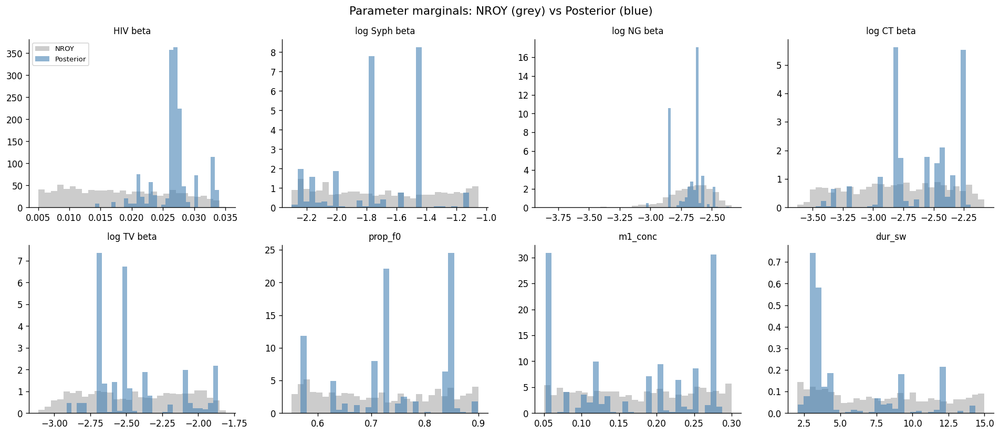

# Exp 13 — Trajectory selection, post-ANC-fix re-run

**Date:** 2026-06-05.

**Question.** Re-do exp 10's trajectory selection against the post-ANC-fix
NROY from exp 09 wave 8, and check whether syphilis now sustains endemic
transmission through 2025 inside the *weighted* posterior — not just on the
prior. See [`../10_trajectory_selection/SUMMARY.md`](../10_trajectory_selection/SUMMARY.md)
for the pre-fix baseline and
[`../12_coverage_post_anc_fix/SUMMARY.md`](../12_coverage_post_anc_fix/SUMMARY.md)
for the coverage check that motivated this retry.

**Result.** **Posterior unusable; structural fix still required.** 1000
sims at 10k agents from the wave-8 NROY ran clean (1000/1000 ok, 28 min
on 24 workers). 60% of draws sustain syphilis through 2016 — down from
91% pre-fix — but the surviving draws bifurcate sharply into "extinct"
and "over-sustained at 5–25%" with almost no mass at the data's 1%.
Gaussian importance weighting collapses onto the ~7 lucky draws sitting
near the 0.5% filter floor: **ESS = 7.3 / 600 = 1.2%**, well below the
5% acceptability bar. The posterior median for active syph matches the
data (forced by the filter), but seroprevalence undershoots by ~2.5×
(0.012 vs 0.030 for F), S|HIV+ overshoots by ~2× (0.064 vs 0.029), and
HIV prevalence sits ~35% above the data — none of which is fixable by
re-weighting.

## Headline numbers

| Metric | Exp 10 (pre-fix) | Exp 13 (post-fix) |
|---|---|---|
| Sims ok | 1000/1000 | 1000/1000 |
| Wall-clock (workers) | ~22 min (40) | 28 min (24) |
| Syph sustain @ 2016 (prev_f > 0.005) | 908 / 1000 (91%) | 600 / 1000 (60%) |
| ESS / N (after lik filter) | 75.6 / 908 (8.3%) | **7.3 / 600 (1.2%)** |
| Mean syph_prev_f_2020-2025, alive pool | (not reported) | 0.092 |
| Mean syph_prev_f_2020-2025, posterior | (not reported) | 0.001 |

## Observations

1. **The ANC serology fix hardened the bifurcation rather than
   softening it.** Pre-fix, exp 10 saw 91% sustain at 2016 but with
   burn-through to ~0 by 2020. Post-fix, 60% sustain at 2016 and
   roughly half of those *keep* sustaining through 2020–2025 — but at
   5–25% prevalence, an order of magnitude above the data. The other
   ~40% are pushed all the way to extinction by the higher latent
   detection. The model now produces two stable regimes (dead / hot)
   with almost nothing at the calibration target's 1%.

2. **The 2016 calibration target IS informative about the
   2020–2025 window** — `syph_bifurcation.png` (right panel) shows a
   tight near-linear relationship between syph_prev_f_2016 and
   syph_prev_f_2020-2025 across all 1000 sims. Once a sim is on the
   hot branch at 2016, it stays hot; once extinct, it stays extinct.
   So the structural issue is not "late-window dynamics drift"; it is
   that the model's stable transmission level on the hot branch sits
   far above the observed prevalence.

3. **The posterior degenerates because the likelihood selects what the
   model can't produce.** The Gaussian likelihood with widened
   syph std (0.006 for syph_prev_f) requires draws within ~2σ of 1%,
   i.e. roughly 0–2.2%. The histogram has at most ~30 of the 483
   sustaining draws in that band, and several of those are also being
   pulled by HIV / sero / coinfection targets in incompatible
   directions. ESS = 7.3 is the consequence: importance weight pools
   onto the ~7 draws that happen to satisfy multiple targets at once.

4. **Sero F/M undershoot is the most diagnostic posterior bias.**
   Posterior median sero F is 0.012 vs data 0.030 (40% of observed),
   sero M is 0.005 vs 0.024 (20%). Seroprevalence accumulates
   lifetime exposure, so it can only be this low if the posterior is
   built from draws where syph has been near-extinct for the bulk of
   the simulation window — exactly the floor-of-the-filter draws.
   This is structural confirmation of the ESS verdict, not a separate
   problem.

5. **S|HIV+ overshoots even with the posterior at the filter floor.**
   Median 0.064 vs data 0.029. The syph-HIV coinfection connector
   amplifies syph among HIV+ regardless of overall syph prevalence;
   the few near-extinct draws still produce ~6% syph among HIV+
   because that population is small and the connector boosts
   relative risk. This will need attention even after the syph
   dynamics are fixed.

6. **HIV pushed high because the NROY's HIV beta concentrates at
   ~0.027 (upper third of the prior).** Posterior medians 0.158
   (2000–10) and 0.128 (2010–20) vs data 0.116 and 0.092. The HM emulator
   built around the over-sustained syph branch will have correlated HIV
   beta upward; this should relax once syph dynamics are corrected and
   HM is re-run.

7. **24 workers + JSONL writes worked exactly as planned.** Peak
   memory ~40 GB out of 314 GB. Run was resumable at any point. No
   sim errors. The bottleneck is now scientific, not infrastructural.

## Acceptance

**Blocked for decision analysis, same as exp 10 — for the same root
cause.** Exp 10 closed with a diagnosis of structural burn-through and
proposed FOI floor / waning immunity / wider network turnover /
re-seeding as candidate fixes. The ANC serology fix changed treatment
intensity but did not address those structural mechanisms, so the
underlying bimodality has shifted in distribution but not in kind. The
HIV/NG/CT/TV posterior from this experiment is not usable either —
the degenerate weighting contaminates every marginal, not just the
syphilis-coupled ones. Exp 11's pre-fix decision analysis remains
the most recent usable posterior for non-syph diseases.

## Next

- **Exp 14 — implement a structural syph fix, starting with the
  lightest-weight candidate from exp 10's diagnosis: a small exogenous
  FOI floor (background importation rate) that prevents extinction
  without changing the endemic equilibrium.** Re-run the coverage
  check first; if the bifurcation collapses to a single broader mode
  spanning 0.5–3%, proceed to a fresh HM wave on the corrected model.
  If FOI floor alone is insufficient, layer in waning syph immunity.
- **Question for `method-selection` once exp 14's coverage passes:**
  Is the existing Gaussian importance-sampling likelihood the right
  fitting strategy for a model that still has residual bimodality, or
  should we switch to a likelihood form that explicitly allocates
  mass across modes (e.g. a Student-t observation model with heavier
  tails, or a mixture likelihood)? Defer to that skill — don't pre-decide
  here.
- **The non-syph parameters do not need a fresh HM.** Exp 09's NROY
  for HIV/NG/CT/TV betas remains tight (R² = 0.69–0.96); the issue is
  the syph branch, not those parameters. Whatever fix happens in exp
  14, the HM re-wave can start from the existing wave-8 NROY rather
  than from scratch.

## Artifacts

- `outputs/results.jsonl` — one JSON record per sim with all 12 target
  values, status, draw_idx, and seed. Resumable raw input.
- `outputs/weighted_results.csv` — 600 surviving draws with log_lik
  and importance weight columns.
- `outputs/posterior_ensemble.csv` — 500-draw weighted resample (used
  for marginals; degenerate at ESS=7.3).
- `outputs/summary.json` — ESS, sustainability counts, late-window
  diagnostic means.
- `figures/syph_bifurcation.png` — the diagnostic figure for this
  experiment's central finding.
- `figures/posterior_predictive.png` — bar chart of medians + 90% CI
  vs data across all 12 targets.
- `figures/parameter_marginals.png` — NROY vs degenerate posterior
  marginals across the 8 calibrated parameters.
