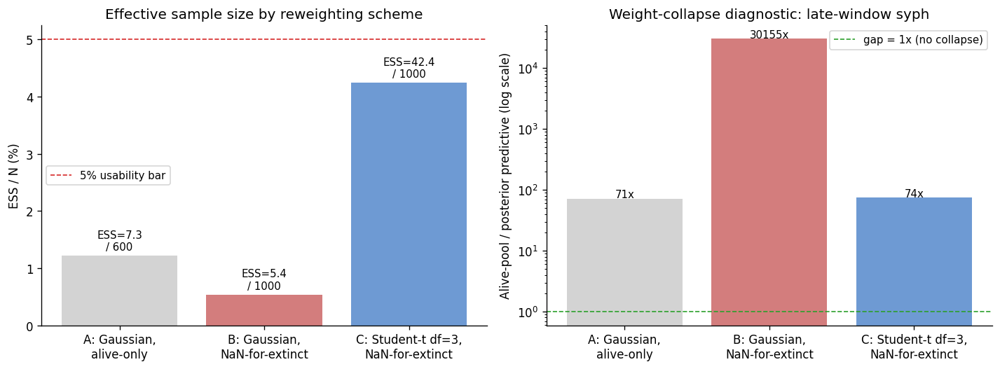
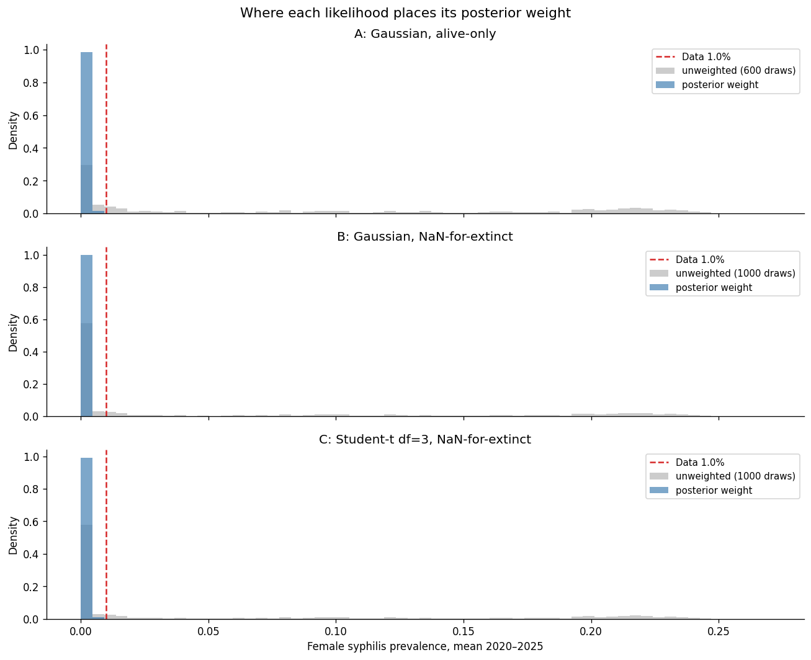

# Exp 14 — Bimodal-aware reweighting of exp 13's JSONL

**Date:** 2026-06-05.

**Question.** Can a likelihood that treats extinction as missing data
(NaN) and uses heavier tails (Student-t df=3) rescue a usable
posterior from exp 13's existing 1000-sim batch, or is the bifurcation
a structural model problem that no reweighting will fix? See
[`../13_trajectory_selection_post_anc_fix/SUMMARY.md`](../13_trajectory_selection_post_anc_fix/SUMMARY.md).

**Result.** **No likelihood retune rescues the posterior; structural
model fix is required.** Across three weighting schemes on the same
1000 raw target dicts, the heaviest-tailed variant (C: Student-t df=3
+ NaN-for-extinction) lifts ESS from exp 13's 1.2% to 4.2% — close to
the 5% bar, but still below it. The weight-allocation diagnostic
(figure 2) shows why this "improvement" is illusory: under every
variant ~99% of posterior weight sits in the leftmost histogram bin
(extinct-or-floor). Student-t doesn't *move* weight off the floor —
it just spreads it across more floor draws, inflating ESS without
correcting the posterior. The alive-pool predictive mean for
late-window syph (0.092) and the posterior predictive mean (0.001)
disagree by **74×** under (C), essentially unchanged from (A)'s
71×.

## Scorecard

| Variant | n weighted | ESS | ESS/N | Gap (alive vs posterior, syph 2020-2025) |
|---|---|---|---|---|
| A: Gaussian, alive-only (= exp 13 reproduction) | 600 | 7.3 | 1.2% | 71× |
| B: Gaussian, NaN-for-extinction | 1000 | 5.4 | 0.5% | 30 155× |
| C: Student-t df=3, NaN-for-extinction | 1000 | 42.4 | 4.2% | 74× |

## Observations

1. **(A) reproduces exp 13 exactly (ESS = 7.3 / 600).** Sanity check
   passes; the pipeline change is correct.

2. **(B) is worse than (A): NaN-for-extinction alone is methodologically
   harmful here.** Replacing syph targets with NaN for extinct draws
   gives those draws a free pass on the syph likelihood — they're
   scored only on HIV/NG/CT/TV, where they all look broadly similar.
   So all ~500 extinct draws collect roughly equal small weight, while
   the ~500 sustaining draws keep getting clobbered by the Gaussian
   syph likelihood. The posterior under (B) is dominated by extinct
   draws: posterior predictive syph late-window is essentially zero,
   gap ratio explodes to 30 000×. This is a classic *missing not at
   random* failure — the missingness (extinction) is caused by the
   parameter values that produced extinction. Conditioning on
   extinction as "missing" lets those parameter values colonise the
   posterior.

3. **(C) lifts ESS by 3.5× but doesn't address the structural problem.**
   Heavy Student-t tails let more sustaining draws contribute non-trivial
   weight relative to the floor draws — that's why ESS rises from 7.3
   to 42.4. But the weight-allocation panel makes the limit clear:
   *the additional weight goes to other floor draws, not to draws near
   the data*. The hot branch (5–25%) still receives ~0% of posterior
   weight under (C). Student-t broadens which draws "win" within the
   floor mode; it cannot teleport draws to a region of parameter space
   the model didn't visit.

4. **The (A→C) ESS lift is real but the rescue is not.** A 4.2% ESS
   posterior built almost entirely from floor draws would carry the
   same biases as exp 13: sero F/M undershoot (because the draws
   driving the posterior have near-extinct syph for most of the sim
   window), S|HIV+ overshoot (the connector still amplifies relative
   risk on a tiny absolute syph base), HIV pushed high. ESS alone is
   not a sufficient diagnostic — the alive-pool vs posterior
   predictive gap is what surfaces the failure. Worth flagging this
   in plugin feedback: any reweighting step should expose the gap as
   well as ESS.

5. **The bifurcation visible in [exp 13's `syph_bifurcation.png`](../13_trajectory_selection_post_anc_fix/figures/syph_bifurcation.png) is the dominant issue.** The model produces
   two stable transmission regimes — extinct or 5–25% endemic — with
   a structural gap around the data's 1%. No reweighting of an
   existing batch can manufacture draws the model never produced.
   This is fundamentally a model-structure question now, not a
   likelihood-form question.

## Acceptance

**No usable posterior produced.** (C)'s 4.2% ESS would have read as
borderline-acceptable from the ESS number alone, but the
weight-allocation figure makes clear it is the same degenerate
posterior as exp 13 with slightly less concentration. The decision
analysis pipeline is still blocked. The likelihood-side lever has
been investigated and found insufficient; the next experiment is the
structural one.

## Next

- **Exp 15 — exogenous syphilis FOI floor.** Lightest-touch structural
  fix from exp 10's diagnosis: add a small background importation rate
  to syphilis transmission so the disease cannot go extinct, and
  attenuate the hot-branch positive feedback by keeping a steady
  trickle of new infections regardless of network state. Re-run the
  prior predictive coverage check on the modified model. Success
  criterion: the late-window syph histogram becomes unimodal,
  spanning the 0.5–3% region rather than splitting into extinct vs
  5–25%. If coverage passes, redo HM from wave 1 against the FOI-floor
  model, then redo trajectory selection.
- **If exp 15's coverage check fails** — the FOI floor doesn't unify
  the two regimes — escalate to waning syph immunity as the next
  candidate, and only then to wider network turnover. Both are bigger
  edits than the FOI floor; defer until the simpler fix is ruled out.
- **Open question for `method-selection` once exp 15 has a usable model:**
  whether to retain Student-t over Gaussian in the post-fix
  trajectory selection. This exp showed Student-t lifts ESS without
  introducing pathology; it may be the better default even when the
  bifurcation is gone.

## Artifacts

- `outputs/weighted_{A,B,C}_*.csv` — per-variant log-lik + weights on
  the 600 (A) or 1000 (B, C) draws used in weighting.
- `outputs/posterior_{A,B,C}_*.csv` — 500-draw weighted resamples per
  variant (all degenerate, kept for completeness).
- `outputs/summary.json` — ESS, ESS/N, alive-pool vs posterior
  predictive gap for each variant; reweighting parameters (extinction
  cutoff, std multipliers, Student-t df).
- `figures/ess_comparison.png` — bar chart of ESS/N and gap ratio
  across variants.
- `figures/weight_allocation.png` — the diagnostic figure: where each
  variant places its posterior weight against the bimodal histogram.
