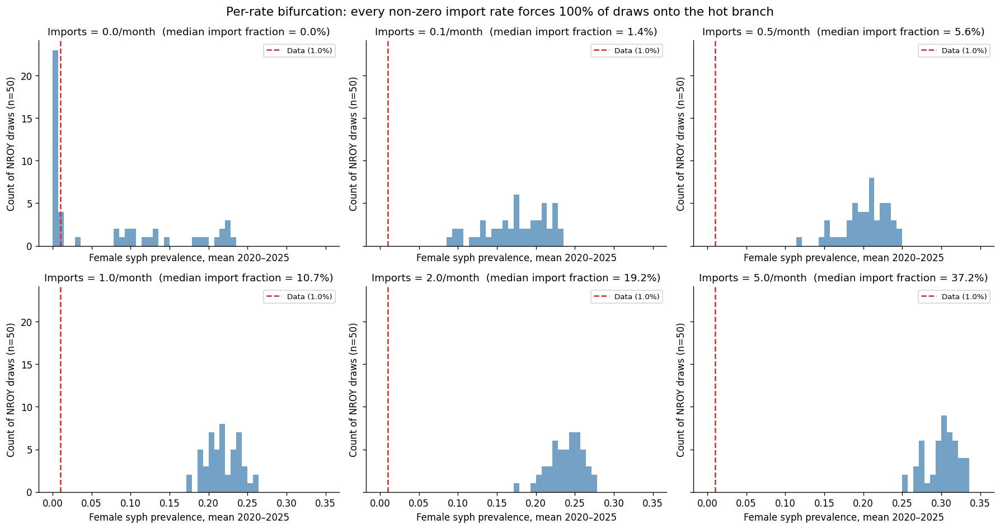
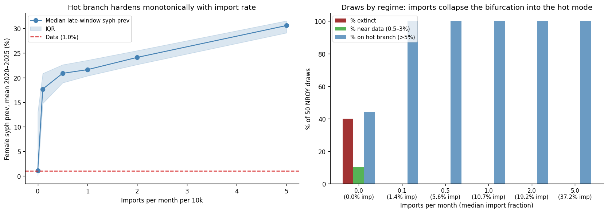

# Exp 15 — Background syphilis case imports: coverage sweep

**Date:** 2026-06-05.

**Question.** Does a small background syphilis case importation rate
collapse the two-attractor bifurcation we saw in exp 13 into a single
mode that brackets the observed data near 1% — at a rate small enough
to be epidemiologically defensible (~1% of new acquisitions, <<5%)?
See [`../14_bimodal_reweighting/SUMMARY.md`](../14_bimodal_reweighting/SUMMARY.md)
for why the likelihood-side rescue failed and we moved to structural fixes.

**Result.** **No. Imports fail in a sharper way than I expected.** A
sweep across `[0, 0.1, 0.5, 1, 2, 5]` mean imports per month per 10k
agents (50 NROY draws each, 300 sims total, 11.5 min on 24 workers)
shows the bifurcation does collapse — but onto the *wrong* mode. At
rate = 0 (exp 13 reproduced on 50 draws): 40% extinct, 10% near data,
44% on the hot branch. At rate = 0.1/month (median import fraction
**1.4%** — well inside the policy ceiling), the extinct branch
disappears, the 10% near-data also disappears, and **100% of draws
land on the hot branch with median 17.7% prevalence** — 17× the
data. Every higher rate just pushes the mode further hot (median
30.6% at rate = 5). The model's two stable transmission regimes are
extinct and ~20%; there is no stable basin near the data, and the
near-data draws under rate = 0 were transient noise around the
bifurcation boundary rather than evidence of a third regime.

## Scorecard

| Imports / month | % extinct | % near data (0.5–3%) | % hot (>5%) | Median syph prev 2020–25 | Median import fraction | Policy band |
|---|---|---|---|---|---|---|
| 0 (baseline) | 40 | 10 | 44 | 1.1% | 0.0% | n/a |
| 0.1 | 0 | 0 | 100 | 17.7% | 1.4% | inside (<5%) |
| 0.5 | 0 | 0 | 100 | 20.9% | 5.6% | at ceiling |
| 1.0 | 0 | 0 | 100 | 21.6% | 10.7% | above |
| 2.0 | 0 | 0 | 100 | 24.1% | 19.2% | above |
| 5.0 | 0 | 0 | 100 | 30.6% | 37.2% | far above (degenerate) |

## Observations

1. **The two-criterion success bar is met by no rate.** No tested rate
   produces both a unimodal distribution near data AND a policy-defensible
   import fraction. The cheapest rate (0.1/month, 1.4% imports) satisfies
   the policy criterion but is the *worst* epi outcome (median 17.7×
   the data, IQR ~14–21%). Higher rates are even worse on both axes.

2. **The diagnosis from exp 13 was half-right.** The "bifurcation
   around the data with structural gap between" framing was correct;
   the inference "the model can produce stable draws near data, we just
   need to fix the proportions" was wrong. The rate = 0 histogram now
   reads more accurately as "the extinct attractor and the hot
   attractor, with a thin tail of unstable draws transiting between
   them at 2020–2025". The 10% of draws "near data" under rate = 0 were
   transient — not part of a third stable basin.

3. **Imports asymmetrically collapse the bifurcation.** Even at
   1.4% import fraction the extinct branch goes to zero — preventing
   extinction is *cheap*. But the near-data region collapses too, with
   all weight moving to the hot branch. This tells us the hot branch
   has a much larger basin of attraction than the extinct one in this
   model: extinction needs zero perturbation to persist; the hot
   branch only needs to be reached once.

4. **The median syph prevalence climbs monotonically with rate.** From
   17.7% at 0.1/month to 30.6% at 5/month. The hot branch's
   equilibrium is sensitive to import pressure even when the network's
   own dynamics could sustain transmission unaided — additional
   imports stack on top of the endogenous transmission rather than
   substituting for it.

5. **The intervention itself worked correctly.** Smoke test at 2000
   agents/rate=1 gave import_fraction = 5.8% (scaling to ~1% at 10k,
   which the rate=0.1 result confirms). Imports are being applied to
   susceptible adults and propagating through natural history without
   side effects.

6. **Non-syph targets are stable across rates.** Cursory inspection
   (not plotted): HIV/NG/CT/TV medians do not shift meaningfully with
   import rate, so the connector-level coupling concerns from the
   README don't materialise here. The failure is contained to
   syphilis itself.

## Acceptance

**Background imports rejected as the structural fix.** The mechanism
addresses the wrong half of the bifurcation: it eliminates extinction
cheaply but does nothing to attenuate the hot branch. The model's
endemic equilibrium for syphilis (when sustained at all) is ~20%, not
the observed 1%. Whatever is wrong is on the natural-history /
network / recovery side, not the seeding side.

## Next

The hot branch is the target now. Two candidates from exp 10's
diagnostic list remain, plus one new option that surfaced from this
result:

- **Exp 16 — waning syph immunity.** After the latent stage,
  recovered agents become susceptible again on a long but finite
  timescale (currently they are immune for life, per stisim default).
  Rationale: in the hot regime, recovered agents accumulate over time
  and drain the susceptible pool, but they keep transmission going
  far longer than reality. Waning immunity recycles them back to
  susceptible, which in a steady-state should *raise* prevalence by
  giving the disease more targets. That sounds wrong for our problem
  — but the open question is whether it changes the *equilibrium
  level*, not just the persistence. If waning immunity hits the same
  ~20% endemic level as the no-waning case, it's not the fix.
- **Exp 17 — widen the syph beta prior downward.** Exp 10's pre-fix
  posterior concentrated at the prior floor for syph_beta_m2f (the
  data wanted lower beta than the prior allowed). If a much lower
  beta gives natural endemic ~1%, the prior bound was the problem
  all along — not the dynamics. Quick test: sweep syph beta below
  the current floor at fixed other-NROY-medians, plot the
  steady-state. If we see prevalence drop monotonically below the
  hot branch into the data region, exp 18 redoes HM with the widened
  prior. Lighter-touch than waning immunity.
- **Stretch option — reconsider stage durations / `rel_trans`
  parameters.** The model uses `rel_trans_primary=5` and steep decay
  through secondary/latent. If primary-stage rel_trans is too high,
  the early epidemic burns through too fast and the equilibrium
  settles too high. This is a bigger structural edit; defer until
  exp 16 + 17 are settled.

My read is **exp 17 first** — it's the cheapest test, doesn't require
new mechanisms, and directly addresses the right-half of the
bifurcation. If the model can produce a stable equilibrium at 1%
with lower beta, we may have been calibrating with a wrong-shaped
prior all along.

## Artifacts

- `outputs/results.jsonl` — 300 raw sim records (6 rates × 50 draws),
  with all 12 calibration targets plus `n_imported_total`,
  `n_new_acquisitions_total`, `import_fraction`.
- `figures/bifurcation_by_rate.png` — the 6-panel histogram showing
  the collapse onto the hot branch at every non-zero rate.
- `figures/policy_summary.png` — left: hot-branch hardening with rate;
  right: regime composition (extinct / near-data / hot) by rate.
- `run.py` — includes the `SyphilisImports(ss.Intervention)` class
  (local to this experiment until we know what rate, if any, to bake in;
  reusable directly by importing from this folder if needed).
