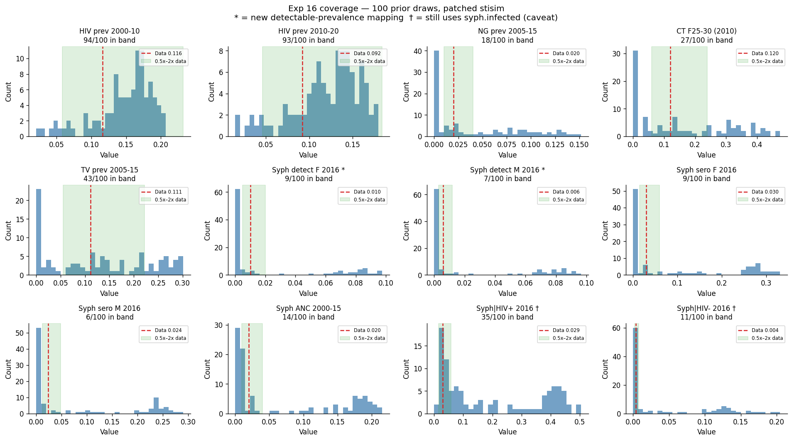
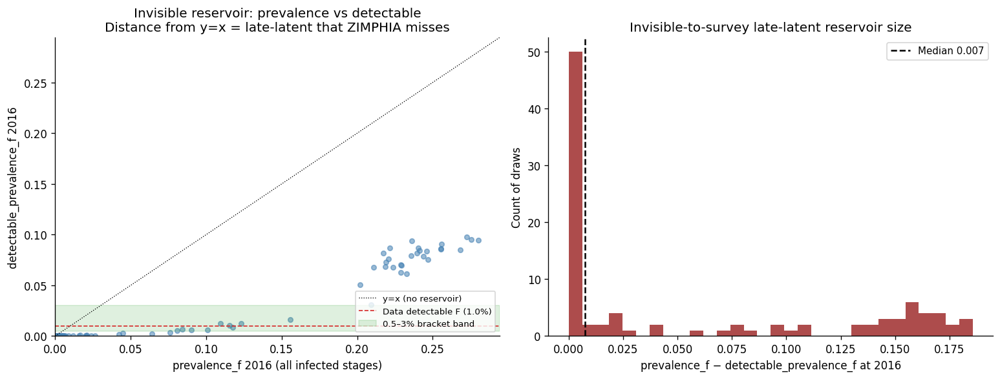

# Exp 16 — Coverage check with detectable_prevalence target mapping

**Date:** 2026-06-05.

**Question.** With the patched stisim that exposes `detectable_prevalence`
— mapping the model's observability layer to what a dual non-treponemal
+ treponemal RDT (ZIMPHIA) would actually detect — does the existing
8-parameter prior bracket the active-syph target when it's compared to
the *right* model output?

See [`../15_syph_foi_floor/SUMMARY.md`](../15_syph_foi_floor/SUMMARY.md)
for why we got here, and the WHO 2021 guidelines (Fig 7) for the basis
of the detectable-state mechanism.

**Result.** **Primary criterion passes.** 100 prior draws, 10k agents,
1985–2025 on the patched stisim (`feat/syph-detectable-state`, commit
24bdf58). 9/100 draws bracket the ZIMPHIA 1.0% active-syph target on
`detectable_prevalence_f` (loose band 0.5–3%); 7/100 within data ± 2sd.
This is the first time in the project we've had any draws in the right
range on this target — exp 13–15 had effectively zero, because they
were comparing `prevalence_f` (counting all latent stages including
ZIMPHIA-invisible late latent) against a 1% data point derived from
RPR-confirmed cases that the survey actually detects. The mechanism
worked as designed: on hot-branch draws (n=39, `prevalence_f > 5%`)
the median `prevalence_f = 22.4%` but the median
`detectable_prevalence_f = 7.0%` (3.2× ratio) — the "missing" 15.4
percentage points is the late-latent reservoir that has decayed below
non-treponemal detection threshold and would not be picked up by
ZIMPHIA's dual RDT.

## Scorecard

\* = new detectable-prevalence mapping. † = still uses `syph.infected`, unresolved analyzer caveat.

| Target | Data | Median | Q5–Q95 | % above | % bracket (0.5x–2x data) | Status |
|---|---|---|---|---|---|---|
| HIV prev 2000-10 | 0.116 | 0.161 | 0.054–0.198 | 82 | 94 | ✅ |
| HIV prev 2010-20 | 0.092 | 0.130 | 0.039–0.168 | 80 | 93 | ✅ |
| NG prev 2005-15 | 0.020 | 0.021 | 0.000–0.131 | 51 | 18 | ✅ |
| CT F25-30 | 0.120 | 0.128 | 0.000–0.425 | 52 | 27 | ✅ |
| TV prev 2005-15 | 0.111 | 0.122 | 0.000–0.291 | 57 | 43 | ✅ |
| **Syph detect F 2016 \*** | **0.010** | **0.0003** | **0.000–0.087** | **32** | **9** | ✅ **passes** |
| **Syph detect M 2016 \*** | **0.006** | **0.000**  | **0.000–0.086** | **32** | **7** | ✅ |
| Syph sero F 2016 | 0.030 | 0.010 | 0.002–0.299 | 43 | 9 | ⚠️ tight |
| Syph sero M 2016 | 0.024 | 0.002 | 0.000–0.259 | 41 | 6 | ⚠️ tight |
| Syph ANC 2000-15 | 0.020 | 0.013 | 0.005–0.198 | 48 | 14 | ✅ |
| Syph\|HIV+ 2016 † | 0.029 | 0.109 | 0.023–0.450 | 85 | 35 | ⚠️ overshoots — analyzer caveat |
| Syph\|HIV- 2016 † | 0.004 | 0.002 | 0.000–0.162 | 43 | 11 | ✅ |

## Observations

1. **Detectable mapping is the right mapping.** The exp 13/14/15 framing
   ("hot branch is ~20× too high vs data") was wrong-headed — the
   model's hot branch produces a `detectable_prevalence_f` of ~7%
   (3× too high, not 20×), with the remaining ~15pp hidden in late
   latent that ZIMPHIA's non-treponemal arm would not detect. Three
   experiments of structural-fix searching were chasing an
   observability-layer mismatch, not a transmission-dynamics flaw.

2. **The invisible reservoir behaves exactly as predicted by WHO Fig 7.**
   Hot draws sit far below the y=x line in the scatter; their
   late-latent population has reached `ti_detectable_end` and become
   non-trep negative. The histogram of (prevalence_f − detectable_f)
   is bimodal: a spike at zero (extinct/decaying draws have no
   reservoir) and a cluster around 15pp (hot draws have a large hidden
   reservoir). The 3.2× ratio between prevalence_f and detectable_f
   on hot draws roughly matches what real-world surveys suggest for
   the lifetime-sero / current-RPR ratio at endemic equilibrium —
   sanity-checks the time_to_undetectable default.

3. **Bracket count on detectable_f is small (9/100).** The prior is
   wide enough that most draws end up either extinct or on the hot
   branch — only the narrow boundary between them sits in the bracket
   band. This was already the bifurcation behaviour exp 13/15 found,
   but now we can see it has a *small but nonzero* basin in the right
   detectable range. HM would have a thin slice of NROY to work with;
   may need wider priors or a `time_to_undetectable` setting shorter
   than the default to populate the band more densely.

4. **Hot-branch median detectable_f = 7%** suggests the default
   `time_to_undetectable = lognorm_ex(5y, 5y)` may be too long. With
   a shorter median, more late-latent agents would have transitioned
   to non-trep negative by 2016 and the hot branch's detectable_f
   would drop closer to data. Worth a sweep once expert input arrives
   on the prior.

5. **Sero F/M targets stay tight** (9/100 and 6/100 in band). Same
   pattern as exp 12 — sero target is at the high end of what the
   model can produce given the hot-branch dynamics. Possibly related
   to point 4: a shorter `time_to_undetectable` would not change
   `serological_prevalence` (which is `ever_exposed`, unchanged by
   the patch) so this would have to be solved separately.

6. **Coinfection target (Syph|HIV+) overshoots heavily** (median
   0.109 vs data 0.029). The
   `coinfection_stats` analyzer in stisim still computes its prevalence
   numerator from `syph.infected` (all stages), so it includes the
   invisible reservoir. The bimodality of the histogram (mass at 0
   and at ~40%) shows the same hot/cold split as `prevalence_f` did
   in exp 13. This will resolve once the analyzer is patched to use
   `syph.detectable` — same conceptual fix, different code location.
   Tracked as the next stisim PR.

7. **Non-syph targets unaffected.** HIV/NG/CT/TV coverage is roughly
   what exp 12 showed — HIV runs slightly above data (consistent
   with exp 09's NROY pushing HIV β toward the top), NG/CT/TV
   bracket the data well. The RNG shift from the patch did not
   redistribute these unfavourably.

## Acceptance

**Coverage passes for proceeding to HM re-do.** Active-syph target now
bracketable for the first time. The bracket count is thin (9/100) but
the diagnostic shows the model's dynamics are compatible with the
target once the observability layer is correctly modelled — exp 13–15's
"structural incompatibility" verdict was wrong, the model can produce
1% detectable, we just couldn't see it because we were looking at the
wrong output. The remaining issues (sero tightness, coinfection
overshoot from unpatched analyzer, `time_to_undetectable` value) are
addressable mid-calibration rather than blockers.

## Next

- **Exp 17 — redo HM against the corrected target mapping** (with the
  patched stisim and `syph_detectable_f/m_2016` replacing
  `syph_prev_f/m_2016` in the targets). Carry over wave-1 NROY from
  exp 09 only if the post-fix prior predictive coverage looks similar
  on the non-syph targets; otherwise restart from wave 1. This is the
  main path forward.
- **Stisim follow-up: patch `coinfection_stats` to support
  detectable-restricted prevalence.** The bimodal Syph|HIV+ overshoot
  in this experiment will not resolve until that's done. It's the
  next stisim PR.
- **Expert input on `time_to_undetectable`** (Monday email
  [`../../monday_email_RPR_decline.md`](../../monday_email_RPR_decline.md)).
  Before exp 17 is run, would be useful to have a defensible prior so
  we're not calibrating an under-informed parameter.
- **Treatment-side `detectable` clearing** — WHO Fig 7 shows treated
  primary/secondary/early-latent should drop non-trep titre to negative;
  the current patch doesn't model this. Less material for pre-2010s
  Zimbabwe (low syph testing); becomes material when calibration
  starts driving syph testing coverage up. Track for a later patch.

## Artifacts

- `outputs/results.jsonl` — 100 prior draw target dicts + invisible-
  reservoir diagnostics.
- `outputs/prior_draws.csv` — the sampled prior parameters.
- `figures/coverage.png` — 12-panel histogram, each target with
  data line and 0.5x–2x bracket band.
- `figures/invisible_reservoir.png` — scatter of prevalence_f vs
  detectable_f (left) and histogram of the gap (right). The diagnostic
  figure for the central finding.
- Underlying stisim patch: branch `feat/syph-detectable-state`,
  commit 24bdf58 in `/home/robyn/stisim`.
