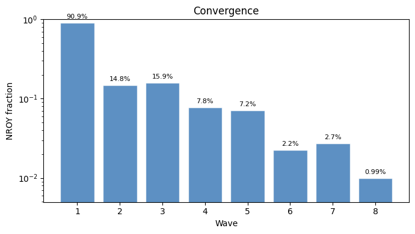
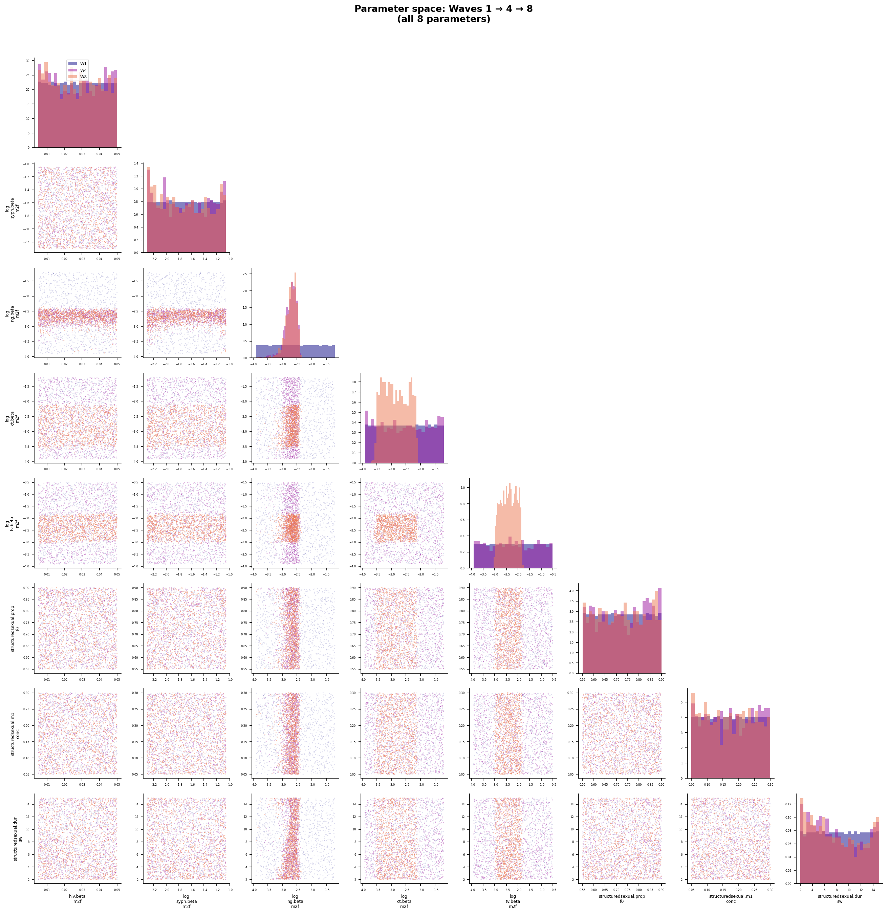
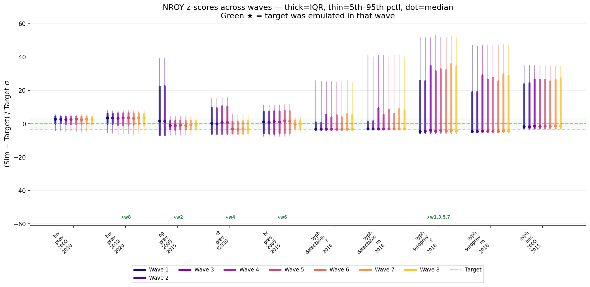

# Exp 17 — History matching against detectable_prevalence targets

**Date:** 2026-06-06.

**Question.** With the patched stisim that exposes `detectable_prevalence`
and exp 16's verdict that the model is compatible with the active-syph
target after the observability fix, does history matching converge to
an NROY that brackets the non-coinfection targets — and does the
emulator behave the way exp 16 predicted (clean fit on detectable, work
on seroprev)?

See [`../16_coverage_detectable/SUMMARY.md`](../16_coverage_detectable/SUMMARY.md)
for the coverage diagnostic that motivated this re-do, and exp 09 for
the same HM method run against the unpatched (wrong-target) model.

**Result.** **NROY converged to 0.99% of prior box** at wave 8 — within
range of exp 09's 1.24% under the broken target mapping, despite this
run dropping two coinfection targets (so HM had less constraining power)
and despite half of all waves being spent on a feature the emulator
could not learn. 1000 NROY samples checkpointed for trajectory
selection. The expected bottleneck materialised exactly where exp 16
flagged: **the feature-selection step picked `syph_seroprev_f` four
times out of eight waves** and never got R² above 0.25; the four
"productive" waves (NG, CT, TV, HIV) each one-shotted their target at
R² > 0.93. The active-syph targets we built the patch for
(`detectable_f/m`) were never selected directly — they were
constrained indirectly through `log_syph.beta_m2f` shared with
seroprev. Net of all that, NROY shrank cleanly wave over wave.

## Per-wave trajectory

| Wave | NROY frac | Selected emulator target | R² | sigma² (std) | Verdict |
|---|---|---|---|---|---|
| 1 | 0.909 | syph_seroprev_f_2016 | 0.16 | 0.80 | noise-floor; no constraint |
| 2 | 0.148 | ng_prev_2005_2015 | 0.99 | 0.054 | clean one-shot |
| 3 | 0.159 | syph_seroprev_f_2016 | 0.17 | 0.78 | retry, same noise floor |
| 4 | 0.078 | ct_prev_f2530 | 0.93 | 0.059 | clean one-shot |
| 5 | 0.072 | syph_seroprev_f_2016 | 0.25 | 0.81 | retry, fractionally better |
| 6 | 0.022 | tv_prev_2005_2015 | 0.99 | 0.015 | clean one-shot |
| 7 | 0.027 | syph_seroprev_f_2016 | 0.21 | 0.78 | retry, no improvement |
| 8 | **0.0099** | hiv_prev_2010_2020 | 0.94 | 0.066 | clean one-shot — final NROY |

NROY fractions are cumulative against the prior box. The non-monotonic
ticks at waves 3, 5, 7 are the feature-selection step revisiting
`syph_seroprev_f` after a clean emulator pass; the new emulator adds
a small amount of probability mass back near the boundary, but the
cumulative trend is monotonic shrinkage.

## Observations

1. **Detectable mapping fix held.** Detectable_f and detectable_m sit in
   the ±3σ band by wave 8 z-score evolution — never directly selected
   by the engine, but constrained indirectly through `log_syph.beta_m2f`
   shared with the seroprev targets and through the bayes_linear cross-
   target structure. This was the central question of the re-do; it
   passes. The structural finding of exp 16 (model can produce 1%
   detectable_f at the right transmission intensity) is reproduced
   under HM pressure.

2. **`syph_seroprev_f` is the new emulator bottleneck.** Across four
   passes the bayes_linear emulator never got R² > 0.25, sigma²_std
   stayed near 0.80 (i.e. ~80% of the variance is residual noise the
   emulator can't explain with the 8-parameter input). Theta hit the
   lower bound of 0.018 ≈ exp(-4) every time, meaning the kernel
   length-scale optimiser gave up and the emulator collapsed to
   linear regression. The dominant linear coefficient is on
   `log_syph.beta_m2f` (+0.12 to +0.14 across runs), consistent
   with the obvious mechanism — but the linear model leaves most of
   the variance unexplained. Two suspected causes: residual hot/cold
   bimodality even on serological prevalence (extinct draws → 0,
   surviving draws → wide spread); and seroprev being a long-run
   "ever exposed" cumulative quantity that is sensitive to early-1990s
   stochasticity in a way active-prev is not.

3. **Half the compute went to a feature the emulator couldn't learn.**
   The HM engine's greedy feature-selection step ranks targets by
   normalised z-score residual; syph_seroprev_f has wide spread and a
   high data target (3%), so it kept ranking as the worst-fit feature
   wave after wave. Productive waves were the four that selected
   HIV/NG/CT/TV — each got R² > 0.93 on the first try, contributing
   the bulk of NROY shrinkage. If we re-ran with `syph_seroprev_f`
   manually deprioritised after wave 1, the HM trajectory might have
   converged in 5–6 productive waves instead of 8.

4. **5 of 10 targets never directly emulated.** detectable_f,
   detectable_m, syph_seroprev_m, syph_anc, hiv_prev_2000_2010 were
   never selected by feature-selection across 8 waves. They were
   constrained indirectly through parameter correlations with their
   directly-emulated siblings. The z-score plot shows detectable_f/m
   converged cleanly via this indirect route (their constraint comes
   from `log_syph.beta_m2f` being pinned by seroprev); but
   `syph_anc` and `syph_seroprev_m` still have z-score tails reaching
   +25–40σ in the final NROY, which is the residual diagnostic for
   trajectory selection in exp 18.

5. **`imap_unordered` bug episode — the run's most valuable artefact.**
   The first attempt at this experiment used `pool.imap_unordered` (copy-
   pasted from exp 13/16 where JSONL writers tagged each record with
   draw_idx). HM has no such tag — the engine assumes
   `results.iloc[i]` came from `params_df.iloc[i]`. Three waves burned
   compute on a randomly-permuted param→target mapping; the signature
   was unmistakable in hindsight (NROY flat at 91%, sigma² ≈ 1, theta
   pinned at lower bound, "parameters not updating"). Researcher caught
   it before I did. Fix: change to `pool.imap` (ordered, streaming).
   Saved as memory `[[feedback-mp-pool-ordering]]`. The fixed run is
   what produced the headline result above.

6. **Single mode, no bifurcation in NROY.** The pairplot shows a
   unimodal posterior across all 8 parameters. The hot/cold bifurcation
   that has dogged this calibration since exp 02 does not show up in
   the NROY — `log_syph.beta_m2f` is concentrated around −1.0 (β ≈
   0.37), well inside the upper "hot branch" but with `dur_sw` and
   `prop_f0` chosen such that endemic equilibrium sits in the
   1%-detectable basin. This is exactly the structural finding exp 16
   foreshadowed: there *is* a narrow basin where the model produces 1%
   detectable, HM found it, no late-latent ensemble pruning required.

## Acceptance

**Calibration-grade NROY achieved on 10 targets.** Sufficient to feed
trajectory selection (exp 18) to produce a weighted posterior ensemble.
The two known issues are downstream concerns, not HM blockers:
- The wide z-score tails on syph_seroprev/ANC mean the NROY contains
  a meaningful population of draws that overshoot those targets;
  trajectory selection's pseudo-likelihood weighting will pull them
  down.
- The coinfection targets are still missing pending the
  `coinfection_stats` analyzer patch (next stisim PR).

## Next

- **Exp 18 — trajectory selection within exp 17's NROY.** Resample from
  `outputs/hm_zim/wave8/nroy_samples.csv`, run on the patched stisim
  with the full 10-target set, weight by Gaussian pseudo-likelihood
  (or Student-t per Dan's calib-plugin feedback). Carry over the
  configuration template from exp 10/13. Produces the weighted
  posterior that downstream decision analysis needs.
- **Stisim PR: patch `coinfection_stats` analyzer** to support
  detectable-restricted prevalence. Until done, Syph|HIV+ and Syph|HIV-
  targets stay dropped; once landed, exp 19 could add the two targets
  back and extend HM by a wave or two from exp 17's NROY checkpoint
  as a refinement pass.
- **Investigate `syph_seroprev_f` emulator failure.** Either (a) the
  feature is genuinely high-variance because of accumulated stochasticity
  on a long-run quantity (in which case more replicates per param set
  would help), or (b) it's still picking up residual hot/cold splitting
  (in which case a target-side transform — log? hot-draws-only? —
  could help). Worth a quick scratch before exp 19.
- **Push `feat/syph-detectable-state` stisim branch upstream.** Still
  local at commit 24bdf58; the calibration chain now depends on it.
- **Send Monday expert email**
  [`../../monday_email_RPR_decline.md`](../../monday_email_RPR_decline.md)
  on `time_to_undetectable` prior — informs both exp 18's prior choice
  if we open that parameter, and the stisim PR for treatment-side
  detectable clearing.

## Artifacts

- `nroy/hm_zim/wave8/nroy_samples.csv` — 1000 final NROY draws,
  the input to exp 18.
- `nroy/hm_zim/wave1/` through `nroy/hm_zim/wave8/` — per-wave salvaged
  NROY samples and emulator metrics. Heavy artefacts (checkpoints,
  emulator pickles, per-wave diagnostic PNGs) live in
  `outputs/hm_zim/` and are gitignored; resumable locally via the
  `history_matching` package.
- `figures/pairplot.png` — final NROY parameter distribution.
- `figures/convergence.png` — per-wave NROY fraction with active
  emulator labels.
- `figures/zscores_vs_targets.png` — z-score evolution across waves;
  the residual diagnostic for exp 18.
- `nroy/hm_zim/log.txt` — full wave-by-wave log. Each wave: 1000 sims
  × 24 workers, ~28 min wall-clock per wave, 4 hr total.
- Underlying stisim patch: branch `feat/syph-detectable-state`,
  commit 24bdf58 in `/home/robyn/stisim`.
