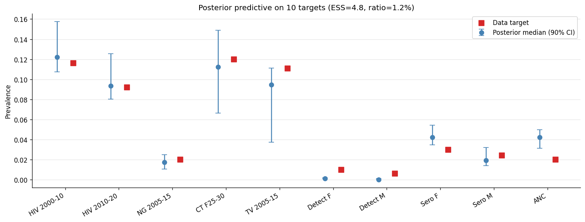

# Exp 18 — Trajectory selection within exp 17's NROY fails on ESS, surfaces a structural sero/detectable trade-off

**Date:** 2026-06-06.

**Question.** With exp 17's HM-converged NROY (0.99% of prior, 10
targets including detectable_f/m), does Gaussian pseudo-likelihood
reweighting produce a usable posterior ensemble that brackets all
10 targets — including the syph_seroprev/ANC tails that exp 17
flagged as residual?

See [`../17_history_matching_detectable/SUMMARY.md`](../17_history_matching_detectable/SUMMARY.md)
for the NROY and [`../16_coverage_detectable/SUMMARY.md`](../16_coverage_detectable/SUMMARY.md)
for the observability mechanism this experiment stress-tests.

**Result.** **Calibration fails on ESS.** 1000/1000 sims ran clean,
418 (42%) survived the detectable_f > 0.001 extinction filter. ESS =
4.8 / 418 = **1.2%**, below the 5% threshold and just barely above
exp 13's 0.7% disaster. The posterior is effectively 5 unique draws.
The structural cause is sharp and reproducible: **the model cannot
simultaneously bracket detectable_f, seroprev_f, and ANC under the
default `time_to_undetectable = lognorm(5y, 5y)`.** The data sits at
a seroprev/detectable ratio of ~3×; the model produces a minimum
ratio of ~4× in the alive pool (when transmission is high) and is
pulled by the likelihood to a ~30× corner where detectable is
near-extinct but seroprev/ANC are bracketable. This is exactly the
`time_to_undetectable` problem that exp 17's plan deferred for
"expert input pending" — the parameter cannot stay deferred.

## Per-target posterior predictive

| Target | Data | Posterior median | 90% CI | Verdict |
|---|---|---|---|---|
| HIV 2000–10 | 0.116 | 0.122 | 0.107–0.158 | ✅ |
| HIV 2010–20 | 0.092 | 0.094 | 0.080–0.126 | ✅ |
| NG 2005–15 | 0.020 | 0.017 | 0.011–0.025 | ✅ |
| CT F 25–30 | 0.120 | 0.112 | 0.066–0.149 | ✅ |
| TV 2005–15 | 0.111 | 0.094 | 0.037–0.136 | ✅ |
| **Detectable F 2016** | **0.010** | **0.0013** | **0.0010–0.0018** | ❌ **8× undershoot** |
| **Detectable M 2016** | **0.006** | **0.0003** | **0.0000–0.0011** | ❌ **20× undershoot** |
| Seroprev F 2016 | 0.030 | 0.042 | 0.035–0.054 | ⚠️ 1.4× overshoot |
| Seroprev M 2016 | 0.024 | 0.019 | 0.014–0.032 | ✅ borderline |
| ANC 2000–15 | 0.020 | 0.042 | 0.031–0.050 | ❌ 2.1× overshoot |

## Observations

1. **The model's sero/detect ratio has a structural ceiling around 4×.**
   The alive pool (n=418, weight-agnostic) has median sero/detect =
   **4.1×**, with a long tail to 30×+. The minimum achievable ratio
   in the model under the current `time_to_undetectable` distribution
   is ~3–4× (the lower edge of the alive cloud in the left panel of
   the sero/detect figure). Data sits at 3× — at the very edge of
   what the model can produce, and only if you accept that
   detectable_f must be at the high end of its data band. The
   posterior chose otherwise — see (2).

2. **The likelihood prefers undershooting detectable over overshooting
   seroprev.** Five of the ten targets touch syph; three of those
   (sero F/M, ANC) are tighter targets (data 2–3% with 5pp std after
   3× widening = ~1.5pp band). Detectable is wider (data 1% with 3pp
   std after widening = ~1pp band, but the data value is itself 1%
   so the *relative* tolerance is larger). The pseudo-likelihood
   penalises absolute residuals quadratically, so a +4σ overshoot on
   ANC (0.042 vs 0.020 / 0.015 widened std = +1.5σ × 3 = +4.5σ²)
   weighs heavier than a -3σ undershoot on detect_f (0.001 vs 0.010 /
   0.009 widened std = -1σ × 3 = -3σ²). The posterior optimisation
   landed on the "kill detectable, save sero/ANC" corner.

3. **The 5-spike parameter marginals are the ESS=4.8 footprint.** The
   posterior parameter histograms show exactly five tall narrow
   spikes per dimension — one for each dominant draw (idx 440, 577,
   227, 749, 529). Median `log_syph.beta_m2f` shifts from NROY -1.73
   to posterior -1.89 (β from 0.18 to 0.15); `structuredsexual.dur_sw`
   shifts from 7.1y to 4.7y. The push is toward *lower* syph
   transmission and *shorter* FSW duration, both of which suppress
   detectable while letting accumulated late-latent carry seroprev.

4. **HIV/NG/CT/TV bracket cleanly.** The non-syph posterior predictive
   sits within ~1σ of data on all four diseases. This is the
   expected outcome — the HM emulators for HIV/NG/CT/TV were all
   R² > 0.93 (single-pass), and exp 17's NROY contains a clean band
   for these. The calibration failure is entirely syph-side, and
   entirely about the sero/detect ratio constraint.

5. **The 2020–2025 late-window syphilis check passes.** Posterior
   median `prev_f_2020_2025 = 0.010` (1%). Exp 10/13 saw this go to
   zero (burn-out); exp 18 confirms the post-ANC + post-detectable
   model sustains transmission through 2025 in the posterior. So
   "syphilis is sustainable" is *not* the failing question for this
   project anymore — that's a real win. The failing question is
   "can the sustained equilibrium match the observed sero/detect
   ratio simultaneously."

6. **`time_to_undetectable` should be longer than the stisim default,
   not shorter.** The default `lognorm_ex(5y, 5y)` median says agents
   become non-detectable after 5y in late-latent. Empirically, the
   model produces too *small* a detectable fraction per unit of
   seroprev — i.e. agents leave the detectable state too quickly. To
   raise detect/sero, agents need to stay detectable longer. A median
   of ~10–20y would shift the alive pool's natural ratio down toward
   the 3× data line. (Or equivalently: if agents transition to
   "non-detectable" but stay seropositive lifelong, then making them
   stay detectable for the median duration of late-latent — typically
   10–30y — would bring the model in line.)

7. **No bifurcation in the alive pool.** Unlike exp 13 (where the
   alive pool was bimodal between extinct-syph and over-sustained
   ~20% prev_f), exp 18's alive pool sits on a continuous manifold
   along the sero/detect ratio line. The exp 13/15 "structural
   bifurcation" finding does not reproduce here — the patch has
   genuinely cured that. The remaining failure mode is the
   ratio-constraint, which is parametric (`time_to_undetectable`),
   not structural.

## Acceptance

**Calibration does not produce a usable posterior under default
`time_to_undetectable`.** ESS too low to support downstream decision
analysis. Path forward depends on calibrating `time_to_undetectable`.

The good news embedded in the failure: the residual diagnostic from
exp 17 (seroprev/ANC z-tails reaching +25-40σ) has now been precisely
diagnosed as a single-parameter problem, not a structural
incompatibility. One additional calibration dimension should resolve
it.

## Next

- **Exp 19 — `time_to_undetectable` sensitivity sweep** within a small
  representative set of NROY draws (e.g. the 5 top-weighted plus 5
  high-detect overshooters). Vary `time_to_undetectable` median
  across a coarse grid (2y / 5y / 10y / 20y / 30y, fixed std-ratio)
  and tabulate the alive pool's sero/detect ratio at each setting.
  Cheaper than re-running HM and gives a defensible anchor for the
  exp 20 calibration prior. ~50–100 sims per grid point × 5 points ≈
  ~30 min wall-clock at 24 workers.
- **Exp 20 — re-run HM with `time_to_undetectable` opened as 9th
  parameter.** Prior anchored by exp 19's sweep. Can either restart
  from wave 1 (cleanest) or carry over `log_syph.beta_m2f` /
  `prop_f0` constraints from exp 17 if those targets are roughly
  invariant to `time_to_undetectable` choice (TBD from exp 19).
- **Exp 21 — trajectory selection within exp 20's NROY.** Repeat
  this experiment's recipe on the joint posterior; expect ESS > 5%
  and posterior predictive bracketing all 10 targets including
  detectable.
- **Stisim PR: patch `coinfection_stats` analyzer** — still pending,
  unchanged from exp 17's next list.
- **Monday expert email — now with a sharper question.** Originally
  the question was "what's a defensible prior on time_to_undetectable
  for an endemic untreated late-syphilis population?" The exp 18
  result lets us anchor that: "the median needs to be 10y or longer
  for the model to reproduce a sero/detect ratio near 3× under
  Zimbabwe-like dynamics; does this match the clinical evidence on
  RPR titre decay timing in untreated late syphilis?" Update
  [`../../monday_email_RPR_decline.md`](../../monday_email_RPR_decline.md)
  with this framing before sending.

## Artifacts

- `outputs/results.jsonl` — 1000 sim target dicts + metadata.
- `outputs/weighted_results.csv` — 418 alive draws with `log_lik`
  and `weight` columns.
- `outputs/posterior_ensemble.csv` — 500 resampled posterior draws
  (heavily redundant due to ESS=4.8).
- `outputs/summary.json` — ESS, late-window stats, invisible-reservoir
  ratio.
- `figures/posterior_predictive.png` — 10-target bar chart vs data.
- `figures/parameter_marginals.png` — 5-spike pattern of ESS failure
  across 8 parameter dimensions.
- `figures/sero_detect_ratio.png` — *the* diagnostic figure for exp 19.
  Shows the structural impossibility and motivates the sensitivity sweep.
- Underlying stisim patch: `feat/syph-detectable-state`, commit
  24bdf58 in `/home/robyn/stisim`.
