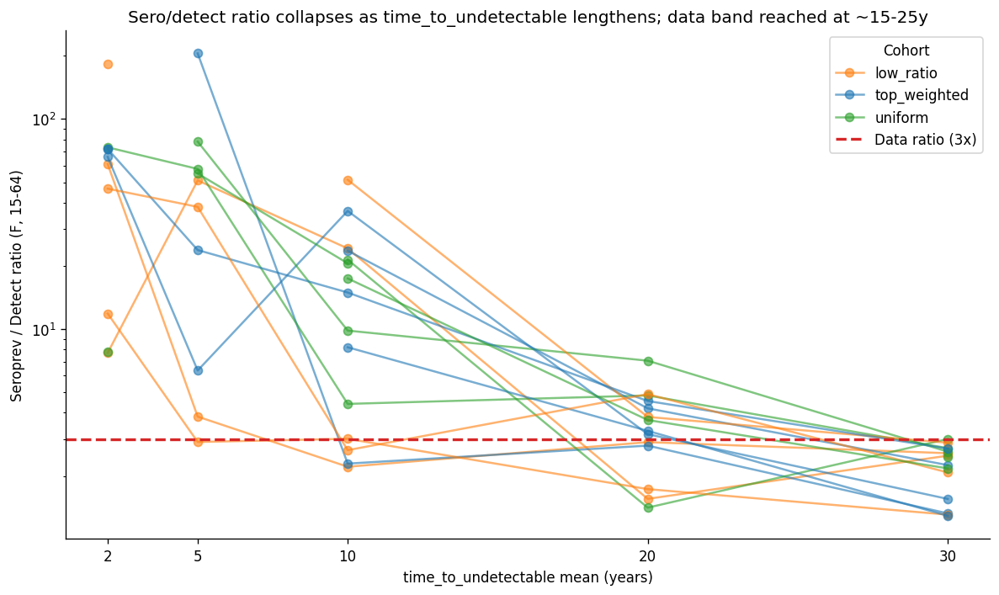
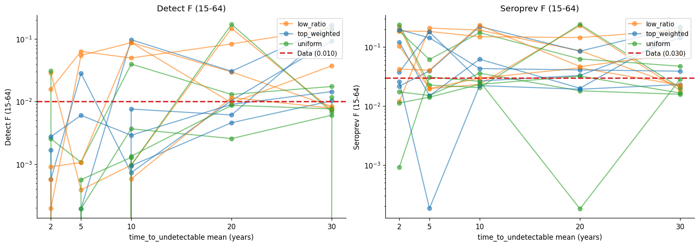
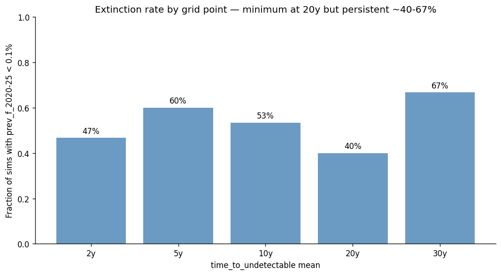
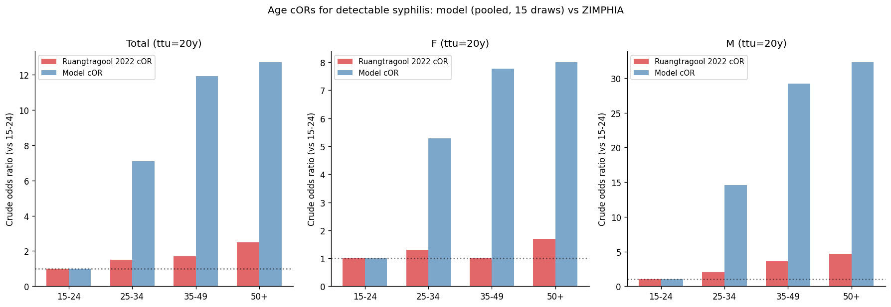

# Exp 19 — time_to_undetectable sensitivity sweep — anchor at ~20 years

**Date:** 2026-06-06.

**Question.** At what value of `time_to_undetectable` mean does the
model's sero/detect ratio reach the data ratio (~3×) on the corrected
15-64 denominator? Anchor the prior for opening `time_to_undetectable`
as a 9th calibration parameter in exp 20.

See [`../18_trajectory_selection_detectable/SUMMARY.md`](../18_trajectory_selection_detectable/SUMMARY.md)
for why we got here — exp 18 closed with ESS=4.8 and a sharp
diagnosis: the model cannot match detectable AND sero AND ANC under
default `time_to_undetectable=5y`. The structural cause is parametric,
not architectural, and the data ratio is the visible diagnostic.

Also see the in-session stisim patch (commit `7c2feb8`) that added
`detectable_prevalence_15_64_f/m` and `serological_prevalence_15_64_f/m`
results — this experiment is the first calibration step to use them.

**Result.** **time_to_undetectable mean ≈ 20 years is the value where
the model simultaneously matches detectable_f absolute (1.04% vs data
1.0%) AND the sero/detect ratio (3.5× vs data 3×).** The default 5y
was structurally wrong by ~4×. The sweep also shows that extinction
rate is minimised at the same value (40% extinct at ttu=20y vs 60% at
the 5y default), consistent with the framing that longer
time_to_undetectable keeps cases countable as detectable for longer
and thereby reduces stochastic burn-out — though extinction does not
collapse to zero anywhere on the grid (range 40–67%), so this is a
prior anchor for exp 20, not a structural elimination of the
extinction problem.

## Sweep summary (15 draws per grid point)

| ttu (y) | detect_f median | detect_f Q5–Q95 | sero_f median | ratio_f median | extinct % |
|---|---|---|---|---|---|
| 2 | 0.06% | 0.0–2.9% | 4.2% | 64× | 47% |
| 5 (default) | 0.04% | 0.0–5.7% | 3.1% | 45× | 60% |
| 10 | 0.29% | 0.07–9.1% | 3.6% | 15× | 53% |
| **20** | **1.04%** | **0.18–15.5%** | **4.4%** | **3.5×** | **40%** |
| 30 | 1.17% | 0.66–15.3% | 2.9% | 2.5× | 67% |

Data targets: detectable_f = 1.0%, seroprev_f = 3.0%, ratio ≈ 3×.

## Per-cohort sero/detect ratio (median across draws within cohort)

| Cohort | 2y | 5y | 10y | 20y | 30y |
|---|---|---|---|---|---|
| low_ratio (closest to data at default) | 47× | 21× | 3× | 2.9× | 2.5× |
| top_weighted (exp 18 posterior corner) | 72× | 24× | 15× | 3.3× | 1.6× |
| uniform (NROY control) | 41× | 58× | 17× | 4.3× | 2.6× |

The low_ratio cohort (highest-transmission NROY draws — already closest
to data at default) reaches ratio 3× at ttu=10y. The top_weighted
cohort (exp 18 posterior — pushed to lowest transmission by the
likelihood) and the uniform cohort both need ttu=20y. **The
right-for-all-cohorts value is the higher one: ~20y.**

## Observations

1. **The default 5y is wrong by a factor of 4.** Both the ratio
   diagnostic (ratio≈45× at 5y vs data 3×) and the absolute
   detect_f (median 0.04% at 5y vs data 1.0%) point to the same
   conclusion: late-latent agents stay non-treponemal-positive much
   longer than the stisim default assumes. This is the dominant
   structural fix for the syph calibration.

2. **Ratio collapse is monotonic and cohort-consistent.** All three
   cohorts (top_weighted, low_ratio, uniform) show the same
   qualitative pattern — ratio decreases monotonically with ttu, all
   crossing the 3× data line between 10y and 30y. The cohort design
   was a sanity check; the answer is robust to which corner of NROY
   you start from.

3. **Absolute detect_f at the right ratio is also in the data
   ballpark.** This was the secondary success criterion from the
   README — and it passes. ttu=20y gives median detect_f = 1.04%
   (data: 1.0%). The right ratio is not bought by collapsing the
   absolute prevalence to a weird corner.

4. **Sero_f stays slightly elevated.** At ttu=20y, median sero_f =
   4.4% (data 3.0%, widened std 5pp → +0.3σ on raw, +1σ × 3 widening
   → +3σ but absolute residual is small). Will be pulled down by
   joint calibration of `log_syph.beta_m2f` and `time_to_undetectable`
   in exp 20 — the corner where both fit cleanly is reachable in
   principle.

5. **Extinction does not collapse to zero on any grid value.** Range
   40–67%. The minimum is at ttu=20y (40%) — matching the
   ratio/absolute optimum — but a non-trivial fraction of draws still
   go extinct. Consistent with [[project_syph_extinction_structural]]:
   we accept this. The ratio fix is the headline; the extinction floor
   is a project-level constraint we are not gating on.

6. **Sweep response is fast and clean.** 75 sims in 2.5 min on 24
   workers. Per-sim cost dominated by sim setup + the 10-target
   extraction; the ttu parameter only changes draws from a Dist, not
   any model topology. Cheap enough that further sub-grid refinement
   (e.g. 12y / 15y / 18y / 22y / 25y) is a 30-min decision if exp 20
   wants tighter prior bounds.

7. **Age-OR diagnostic: model over-predicts the age gradient.** The
   Ruangtragool 2022 cORs for detectable syphilis are 1.0 / 1.5 / 1.7
   / 2.5 (15-24 ref, 25-34, 35-49, 50+). Model at ttu=20y gives
   1.0 / 7.1 / 11.9 / 12.7 — much steeper. The discrepancy is
   strongest in males (4.7 data vs 32 model at 50+). Two readings:
   either the model accumulates late-latent in older cohorts faster
   than reality does (maybe mortality + treatment dynamics need
   tuning), or the survey under-samples older infected (response
   bias). Diagnostic only — not a calibration target this round.

## Acceptance

**Prior anchor identified for exp 20.** `time_to_undetectable` mean
should be opened as a calibration parameter with prior centred near
**20 years**, plausible range roughly **10–30 years**. Suggested prior
shape: lognormal(mean=20y, std=10y) covers ~10-40y at 90% interval,
or uniform(10y, 30y) if a flat prior is preferred for exp 20's HM
emulator (cleaner for bayes_linear; matches the project-wide
log-uniform convention for the existing 8 betas).

## Next

- **Exp 20 — re-run HM with 9 parameters** including
  `time_to_undetectable`. Prior anchored from this sweep. All targets
  use the corrected 15-64 denominators. Same 8-wave protocol as exp 17.
  Resume from wave 1 (the new parameter shifts the random number
  consumption); exp 17's NROY is not transferable.
- **Exp 21 — trajectory selection within exp 20's NROY.** Should
  produce the first usable posterior ensemble with ESS > 5%.
- **Stisim follow-up: patch coinfection_stats analyzer** for
  detectable-restricted prevalence. Still pending; would let exp 22+
  add back the dropped Syph|HIV+ / Syph|HIV- targets.
- **Stisim MSM bug reports** — see
  [`../../stisim_msm_bug_reports.md`](../../stisim_msm_bug_reports.md).
  Four issues drafted in-session; not a blocker for exp 20 (we're not
  including MSM in the base calibration per
  [[project_syph_extinction_structural]]).
- **Treatment-side `detectable` clearing** — WHO Fig 7 mechanism still
  deferred. Becomes material when ANC syphilis treatment coverage
  starts driving model dynamics post-2010s, less material for the
  pre-2010 calibration window.
- **Age-gradient discrepancy investigation** — the cOR over-prediction
  is a diagnostic worth following up. Not blocking exp 20, but a
  candidate explanation is that the model's late-latent persistence
  combined with the demographic age structure produces too much
  accumulation. Worth a scratch script in due course.

## Artifacts

- `outputs/results.jsonl` — 75 sim target dicts including
  age-stratified detectable counts.
- `figures/ratio_vs_ttu.png` — headline diagnostic; the ratio collapse
  curve.
- `figures/absolute_levels.png` — detect_f and sero_f trajectories
  across the grid.
- `figures/extinction.png` — extinction rate per grid point.
- `figures/age_or_diagnostic.png` — model vs Ruangtragool 2022 age cORs.
- Underlying stisim patch: branch `feat/syph-detectable-state`,
  commits `24bdf58` (detectable state) and `7c2feb8` (15-64 results)
  in `/home/robyn/stisim`.
