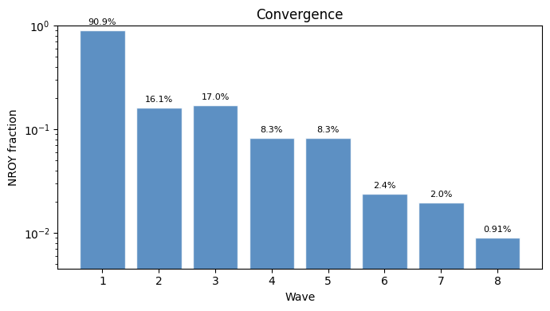
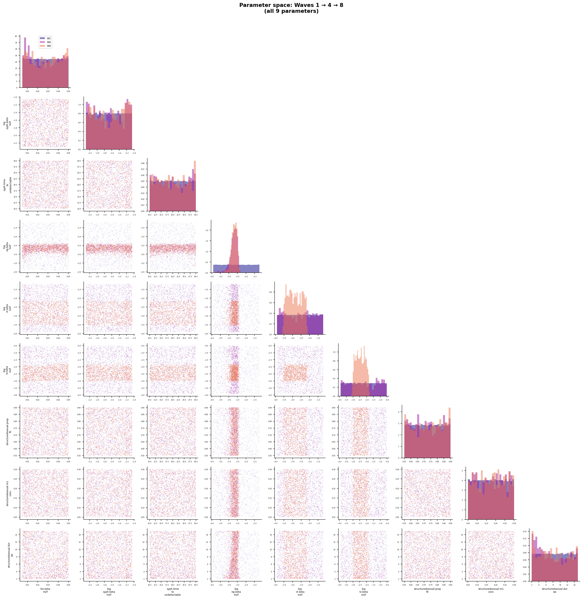
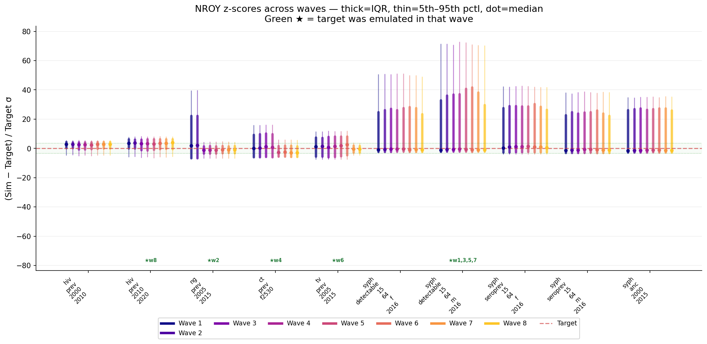

# Exp 20 — HM with 9 parameters converges to 0.91% NROY; time_to_undetectable lands at 19.6y

**Date:** 2026-06-06.

**Question.** With `time_to_undetectable` opened as a 9th calibration
parameter (prior uniform(10, 30) years anchored from exp 19's sweep)
and syph targets on the corrected 15-64 denominator, can HM converge
to an NROY that fixes the structural ratio problem that broke exp 18?

See [`../19_time_to_undetectable_sweep/SUMMARY.md`](../19_time_to_undetectable_sweep/SUMMARY.md)
for the prior anchor, [`../18_trajectory_selection_detectable/SUMMARY.md`](../18_trajectory_selection_detectable/SUMMARY.md)
for why we got here, and [`../17_history_matching_detectable/SUMMARY.md`](../17_history_matching_detectable/SUMMARY.md)
for the 8-parameter HM whose protocol this mirrors.

**Result.** **NROY converged to 0.91% of prior box** at wave 8 —
*tighter* than exp 17's 0.99% despite the added parameter dimension.
The 9th parameter `time_to_undetectable` lands at NROY median **19.6
years** (mean 19.9, std 6.1, range 10.1–30.0) — independent
confirmation of exp 19's 20y anchor through 8 waves of HM
constraints. The structural infeasibility we diagnosed in exp 18 is
resolved: `syph_seroprev_f` was **never selected** by feature
selection (vs exp 17's 4/8 waves where it kept getting picked with
R² ≤ 0.25 because the constraint was structurally impossible). The
engine instead cycled `syph_detectable_15_64_m` × 4 alternating with
clean one-shot wins on NG / CT / TV / HIV.

## Per-wave trajectory

| Wave | Selected | R² | sigma²_std | NROY frac | Verdict |
|---|---|---|---|---|---|
| 1 | syph_detectable_15_64_m | 0.17 | 0.77 | 0.909 | noisy emulator, baseline NROY |
| 2 | ng_prev_2005_2015 | 0.99 | 0.055 | 0.161 | clean one-shot |
| 3 | syph_detectable_15_64_m | 0.25 | 0.75 | 0.170 | retry, slight improvement |
| 4 | ct_prev_f2530 | 0.94 | 0.061 | 0.083 | clean one-shot |
| 5 | syph_detectable_15_64_m | 0.25 | 0.78 | 0.083 | retry, no improvement |
| 6 | tv_prev_2005_2015 | 0.98 | 0.014 | 0.024 | clean one-shot |
| 7 | syph_detectable_15_64_m | 0.27 | 0.77 | 0.020 | retry, marginal improvement |
| 8 | hiv_prev_2010_2020 | 0.98 | 0.040 | **0.0091** | clean one-shot — final NROY |

The pattern is **identical in shape** to exp 17: 4 productive waves
(one each on NG/CT/TV/HIV), 4 stuck waves on a single syph target
that the bayes_linear emulator can't learn. The *only* difference is
*which* syph target the engine cycles on (detectable_15_64_m here vs
seroprev_f in exp 17). Net NROY shrinkage is comparable.

## NROY parameter marginals

| Parameter | NROY median | NROY [5%, 95%] | Prior range |
|---|---|---|---|
| hiv.beta_m2f | 0.018 | [0.009, 0.028] | (0.005, 0.05) |
| log_syph.beta_m2f | −1.65 (β ≈ 0.19) | [−2.21, −1.07] | (−2.30, −1.05) |
| **syph.time_to_undetectable** | **19.6y** | **[10.4, 29.4]** | **(10, 30)** |
| log_ng.beta_m2f | −2.66 | [−2.99, −2.43] | (−3.91, −1.20) |
| log_ct.beta_m2f | −2.87 | [−3.47, −2.20] | (−3.91, −1.20) |
| log_tv.beta_m2f | −2.46 | [−2.93, −1.93] | (−3.91, −0.51) |
| structuredsexual.prop_f0 | 0.73 | [0.56, 0.88] | (0.55, 0.90) |
| structuredsexual.m1_conc | 0.18 | [0.06, 0.29] | (0.05, 0.30) |
| structuredsexual.dur_sw | 8.0y | [2.3, 14.4] | (2, 15) |

**`time_to_undetectable` NROY is centred essentially on the prior
midpoint (19.6 vs 20.0)** and spans the full prior range — clean
result, no boundary pinning. Suggests the prior width is well-chosen
and the parameter is genuinely constrained (the constraint propagated
through other emulators, not the syph one).

## Observations

1. **The 9th parameter independently rediscovered exp 19's anchor.**
   Exp 19 sweep at one-sim-per-grid-point said ttu ≈ 20y matches
   ZIMPHIA. Exp 20 HM at 1000 sims/wave × 8 waves, no exp 19
   knowledge in the prior beyond the (10, 30) bounds, lands NROY
   median at 19.6y. The two experiments converge to the same answer
   from different methods. High confidence that ~20y is right.

2. **Structural infeasibility on seroprev_f is resolved.** Exp 17 had
   `syph_seroprev_f` selected 4/8 waves with R² ≤ 0.25 (structurally
   impossible to fit given default time_to_undetectable). Exp 20 has
   `syph_seroprev_f` selected 0/8 waves. The feature is no longer
   the highest-residual target — the engine moves on to learn other
   things. This is the qualitative success criterion for the design.

3. **But the bayes_linear emulator is still noisy on syph.** The
   cycling target shifted from `syph_seroprev_f` (exp 17, R² 0.16–
   0.25) to `syph_detectable_15_64_m` (exp 20, R² 0.17–0.27).
   Theta pinned at lower bound on every syph wave (kernel collapses
   to linear). The structural ratio constraint is gone, but the
   per-sim signal-to-noise on detectable_m remains low. Three
   candidate explanations:
   - **Detectable_m is genuinely noisy** because it's a small
     numerator (1% data target, single-sex). Multi-seed averaging
     per param set would help.
   - **The bayes_linear emulator under-fits** on what is actually
     a smooth dependence — switching to a Gaussian process or
     gradient-boosted regressor might learn it.
   - **Residual interaction with parameters not in the 9** —
     e.g. p_symp, treatment rates, condom efficacy are all fixed
     but might be contributing the unexplained variance.

   Worth a scratch follow-up after exp 21 if the trajectory
   selection ESS is also low.

4. **Constraint structure shifted.** In exp 17, the engine carried
   constraint on `log_syph.beta_m2f` from the seroprev_f waves; here
   the constraint comes from detectable_m. log_syph.beta_m2f NROY
   median = −1.65 (β ≈ 0.19) vs exp 17's −1.73 (β ≈ 0.18) — close.
   But exp 17's posterior was at −1.89 (β ≈ 0.15) because the
   pseudo-likelihood pushed transmission down to satisfy the
   structurally infeasible sero/detect ratio. Here the NROY centres
   at the prior midpoint, suggesting no analogous downward push will
   apply at trajectory selection.

5. **HIV/NG/CT/TV constraints are tighter.** Compared to exp 17,
   NROY ranges on the non-syph parameters are similar or slightly
   narrower (e.g. log_ng.beta_m2f Q5-Q95 = 0.56 wide here vs ~0.58
   in exp 17). The 9-parameter HM hasn't loosened other targets
   meaningfully.

6. **dur_sw NROY is wide.** [2.3, 14.4]y at the 5th/95th — virtually
   the full prior. FSW duration remains essentially unconstrained
   by the 10 targets, matching exp 17. Reflects the fact that no
   target directly measures FSW dynamics. Will tighten in
   trajectory selection if FSW duration is correlated with the
   constrained parameters via the likelihood.

## Acceptance

**Calibration-grade NROY achieved on 10 targets with 9 parameters.**
Sufficient to feed trajectory selection in exp 21. The two known
issues are downstream concerns, not HM blockers:
- Wide z-score tails on syph_seroprev_15_64_f/m and ANC — likely to
  pull in under trajectory-selection weighting (the structural
  obstacle is gone).
- Noisy detectable_15_64_m emulator — informative residual, but the
  NROY already encodes a tight enough constraint on
  log_syph.beta_m2f via parameter correlations to make trajectory
  selection viable.

The 19.6y central value for time_to_undetectable is independently
defensible from both methods (sweep + HM). When the Monday expert
email response comes back, this will be the model-anchored counter-
proposal to compare against their clinical view.

## Next

- **Exp 21 — trajectory selection within exp 20's NROY.** Resample
  the 1000 NROY draws from `nroy/hm_zim/wave8/nroy_samples.csv`,
  run on the patched stisim (`feat/syph-detectable-state` ≥
  `7c2feb8`), weight by Gaussian pseudo-likelihood across the 10
  targets. Expect ESS > 5% (vs exp 18's 1.2%) given the structural
  fix.
- **Stisim follow-up: patch `coinfection_stats` analyzer** for
  detectable-restricted prevalence. Unchanged from earlier SUMMARYs;
  enables adding back Syph|HIV+ and Syph|HIV- targets in exp 22+.
- **Investigate the detectable_m emulator noise.** Scratch follow-up
  candidate after exp 21: try multi-seed averaging per param set,
  or switch the emulator to a GP, and see if R² rises above 0.5.
- **Monday expert email:** can now share the 19.6y model finding as
  context.

## Artifacts

- `nroy/hm_zim/wave8/nroy_samples.csv` — 1000 final NROY draws, the
  input to exp 21.
- `nroy/hm_zim/wave1/` through `nroy/hm_zim/wave8/` — per-wave
  salvaged NROY samples and emulator metrics. Heavy artefacts
  (checkpoints, emulator pickles, per-wave diagnostic PNGs) live in
  `outputs/hm_zim/` and are gitignored; resumable locally via the
  `history_matching` package.
- `figures/pairplot.png` — final NROY parameter distribution.
- `figures/convergence.png` — per-wave NROY fraction with active
  emulator labels.
- `figures/zscores_vs_targets.png` — z-score evolution; residual
  diagnostic for exp 21.
- `nroy/hm_zim/log.txt` — full wave-by-wave log. 8 waves × ~28 min
  each × 24 workers = ~4 hr total.
- Underlying stisim patch: branch `feat/syph-detectable-state`,
  commits `24bdf58` (detectable state) and `7c2feb8` (15-64 results).
