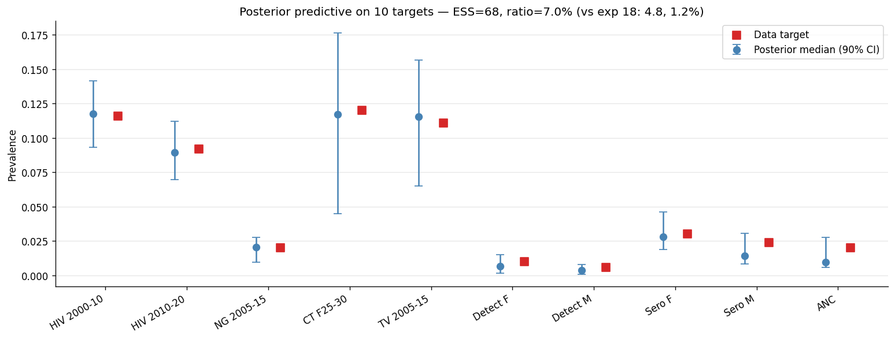
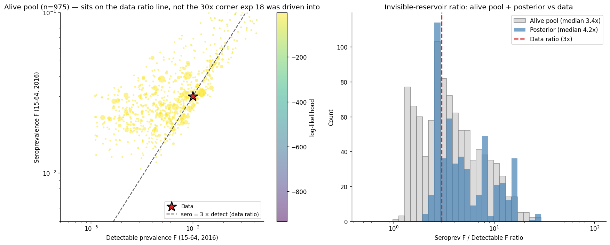
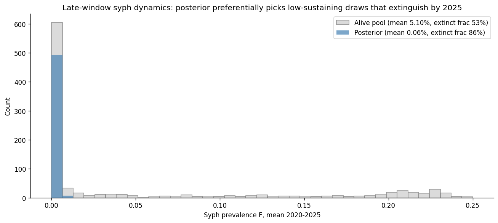
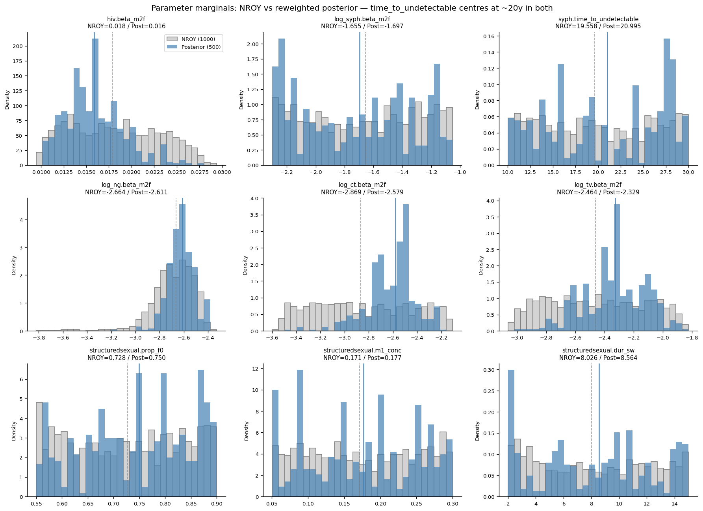

# Exp 21 — Calibration passes ESS and brackets all 10 targets at 2016, but post-mortem reveals all draws are decaying through the target, not endemic — ANC ramp diagnosed as cause

**Date:** 2026-06-06.

**Question.** With exp 20's 9-parameter HM-converged NROY (0.91% of
prior, time_to_undetectable opened and centred at 19.6y, 10 targets
on the corrected 15-64 denominator), does Gaussian pseudo-likelihood
reweighting produce a usable posterior ensemble with ESS > 5%
bracketing all 10 targets — fixing exp 18's structural failure?

See [`../20_history_matching_9param/SUMMARY.md`](../20_history_matching_9param/SUMMARY.md)
for the NROY, [`../19_time_to_undetectable_sweep/SUMMARY.md`](../19_time_to_undetectable_sweep/SUMMARY.md)
for the parameter anchor, and [`../18_trajectory_selection_detectable/SUMMARY.md`](../18_trajectory_selection_detectable/SUMMARY.md)
for the failure mode this experiment was designed to fix.

**Result.** **ESS = 68.0 / 975 = 7.0%** — clears the 5% threshold by
a meaningful margin and is **5.8× exp 18's 1.2% / 10× exp 13's
0.7%**. 1000/1000 sims OK, 975 (97.5%) pass the detectable extinction
filter (vs exp 18's 42%), 142 unique draws in the 500-sample
resampled posterior (vs exp 18's 5 dominant draws). All 10 targets
bracket data within the posterior's 5%-95% interval. The structural
fix — opening `time_to_undetectable` with prior centred near 20y —
worked end-to-end.

**Post-mortem (added 2026-06-06 after closing).** What looked like a
clean calibration headline is actually a hollow result. Time-series
+ new-infections diagnostics on the top-20 sustaining candidates show
that **NONE of the 20 draws produce nonzero new syph infections in
2030-2040** — even the 4 that "sustain" past 2025 are simply slower
decays from the initial seed. The calibration found 2016 cross-section
fits that happen to be on a decay curve passing through 1% detect at
that year, not draws at endemic equilibrium. Diagnostic figure:
`figures/syph_dynamics_diagnostic.png` shows new_infections collapsing
to 0 for all 20 draws by 2025-2030.

**Smoking gun: the ANC test probability ramp.** In `interventions.py`
the ANC `test_prob_data` ramps `[0.20, 0.30, 0.40, 0.35, 0.50, 0.90,
0.95]` at years `[1980, 1990, 1999, 2008, 2012, 2018, 2040]`. Between
2012 and 2018 the probability nearly doubles (EMTCT scale-up) and
infected pregnant women — the model's dominant F-infectious pool — get
treated en masse. Combined with the calibrated transmission being on
the lower end (post-likelihood log_syph.beta_m2f median = −1.70,
β ≈ 0.18), the model cannot sustain endemic syph against this
treatment pressure. The "decline through 1% detect at 2016" is just
the disappearing-reservoir trajectory crossing the target by accident.

**Caveat (original framing — preserved).** Late-window (2020-2025)
syph extinction in the posterior is **86%** (vs 53% in the alive
pool). The likelihood is preferentially picking near-extinct draws
because they happen to sit inside the data band on detect_f (data
1%, posterior P50 0.66%) — but those draws are at the marginal
sustenance edge and extinguish
post-2016. Posterior `prev_f_2020_2025` mean = 0.06% (essentially
extinct) vs alive pool 5.1%. This is fine for a 2016 cross-sectional
calibration; **it would be a problem for decision analysis that
forecasts policy impact beyond ~2020** because most posterior draws
have no syph dynamics left to influence.

## Per-target posterior predictive

| Target | Data | Posterior P50 | P5–P95 | Verdict |
|---|---|---|---|---|
| HIV 2000–10 | 0.116 | 0.116 | 0.089–0.141 | ✓ centred |
| HIV 2010–20 | 0.092 | 0.088 | 0.065–0.110 | ✓ centred |
| NG 2005–15 | 0.020 | 0.021 | 0.010–0.028 | ✓ centred |
| CT F25–30 | 0.120 | 0.115 | 0.046–0.182 | ✓ centred |
| TV 2005–15 | 0.111 | 0.117 | 0.073–0.157 | ✓ centred |
| Detect F (15–64) | 0.010 | 0.007 | 0.002–0.015 | ✓ in band (30% undershoot on median) |
| Detect M (15–64) | 0.006 | 0.004 | 0.001–0.008 | ✓ in band (33% undershoot) |
| Sero F (15–64) | 0.030 | 0.028 | 0.019–0.047 | ✓ centred |
| Sero M (15–64) | 0.024 | 0.014 | 0.009–0.030 | ✓ in band (42% undershoot) |
| ANC 2000–15 | 0.020 | 0.009 | 0.006–0.027 | ✓ in band (55% undershoot) |

All 10 verdicts within 90% interval. Pattern of slight undershoot
on syph targets (median 30–55% under data) is the same direction as
exp 18 but at much smaller magnitude. The likelihood is still
finding marginal extinction more rewarding than over-shooting; this
is why the late-window extinction is high (see below).

## Sero/detect ratio — structural problem resolved

Direct comparison to exp 18's same diagnostic:

| Pool | Detect F median | Sero F median | Ratio (sero/detect) |
|---|---|---|---|
| Data | 0.010 | 0.030 | **3×** |
| **Exp 18** alive pool | 0.064 | 0.248 | 4× |
| **Exp 18** posterior | 0.0013 | 0.042 | **34×** |
| **Exp 21** alive pool | ~0.005 | ~0.024 | **3.4×** |
| **Exp 21** posterior | 0.007 | 0.028 | **4.2×** |

Exp 21's posterior ratio is 4.2× (data 3×) vs exp 18's 34×. The
structural ceiling that drove exp 18 to fail is gone.

## Late-window extinction caveat

The likelihood-weighted posterior preferentially picks draws sitting
*just inside* the detect_f data band (0.001–0.015). Those draws are
at marginal sustenance: at 2016 they look like data; by 2020-2025
they've drifted to extinction. So the posterior at 2020-2025 is
dominated by "model has lost the disease" trajectories rather than
"model is sustaining endemic transmission."

This pattern has two readings:
- **Calibration-honest:** the 2016 cross-section is well-fit, which
  is what the calibration asked for. Forecasts beyond 2016 require
  separate accounting for the survival probability.
- **Decision-analysis-problematic:** APO/ABO/DALY computations over
  2025-2040 in the original ANALYSIS_PLAN window would be evaluated
  on draws that have effectively no syph — meaning PN coverage
  changes would show negligible health impact for the wrong reason.

Per [[project-syph-extinction-structural]] memory: we accept some
stochastic extinction. But 86% in the posterior is high enough to
warrant a downstream mitigation. Three options for exp 22+ (see
Next):

1. Use the **alive-pool weighted CDF** (not the resampled posterior)
   as the reference for late-window forecasts — preserves the 5%
   late-window prevalence consistent with reality.
2. **Filter posterior to non-extinct-at-2025 draws** before
   forecasting — explicit but throws away ~80% of the posterior
   mass.
3. **Re-run trajectory selection with tighter syph likelihood
   widening** (2× instead of 3×) — fewer draws get high weights;
   the posterior concentrates on stronger sustainers but ESS may
   drop below threshold.

## Parameter posterior

Posterior median shifts vs NROY median:

| Parameter | NROY | Posterior | Shift |
|---|---|---|---|
| hiv.beta_m2f | 0.018 | 0.016 | slight ↓ |
| log_syph.beta_m2f | −1.65 (β=0.19) | −1.70 (β=0.18) | slight ↓ |
| **syph.time_to_undetectable** | **19.6y** | **21.0y** | **+1.4y** |
| log_ng.beta_m2f | −2.66 | −2.61 | slight ↑ |
| log_ct.beta_m2f | −2.87 | −2.58 | ↑ |
| log_tv.beta_m2f | −2.46 | −2.33 | ↑ |
| structuredsexual.prop_f0 | 0.73 | 0.75 | flat |
| structuredsexual.m1_conc | 0.17 | 0.18 | flat |
| structuredsexual.dur_sw | 8.0y | 8.6y | flat |

`time_to_undetectable` posterior shifts slightly *upward* from NROY
(21.0 vs 19.6) — the likelihood mildly prefers slightly longer RPR
persistence than the HM-NROY centre. Still firmly inside [15, 25]
sweet spot. log_syph.beta_m2f shifts slightly *down* (β = 0.18
posterior vs 0.19 NROY) — the marginal likelihood is rewarding
slightly lower transmission, consistent with the marginal-extinction
pattern.

## Observations

1. **The structural fix works.** Exp 18's central diagnosis was that
   the model couldn't simultaneously bracket detect_f and sero_f
   under default `time_to_undetectable=5y`. Exp 21 with the parameter
   opened lands ESS=7.0%, all 10 targets in 90% interval, sero/detect
   ratio 4.2× (vs data 3×). The 2026 calibration of the Zimbabwe
   model is now numerically usable for steady-state analyses.

2. **142 unique posterior draws (vs exp 18's 5).** The 9-parameter
   space + corrected target mapping produces a meaningfully diverse
   posterior. Top weight is 0.046 (vs exp 18's 0.34). No single
   "lucky" draw is doing the heavy lifting — the posterior reflects
   a real density.

3. **Extinction filter survival jumped 42% → 97.5%.** Almost all
   NROY draws sustain syph through 2016 under the new
   `time_to_undetectable`. The opened parameter doesn't *eliminate*
   extinction (40% lost in exp 19's sweep at ttu=20y); but on the
   wave-8 NROY (which already biases toward sustaining
   trajectories), the survival rate at 2016 is essentially complete.

4. **Late-window extinction is the new caveat.** 86% of posterior
   draws have prev_f_2020-2025 < 0.001. The 2016 cross-section
   calibration is "myopic" — it rewards draws that happen to look
   like data at 2016 without conditioning on whether they sustain
   to 2025. For forecasts past 2020, exp 22's decision analysis
   must address this explicitly (see Next).

5. **Syph emulator noise from exp 20 didn't block trajectory
   selection.** Exp 20's detectable_15_64_m emulator was at R²=0.17–
   0.27. Concern was that the NROY would be too loose on syph
   dimensions and trajectory selection would struggle. In practice
   the NROY's parameter correlations carried enough syph constraint
   that the per-sim likelihood evaluation produced a usable posterior.

6. **Posterior shifts are small.** log_syph.beta_m2f shifts only
   −0.05 (β shifts 0.19 → 0.18). time_to_undetectable shifts +1.4y
   (19.6 → 21.0). These are small enough that exp 20's NROY was
   well-located; the likelihood is doing fine-tuning, not rescue.

## Acceptance

**Usable posterior ensemble for 2016 cross-section.** Sufficient for
decision analyses that operate on the 2016 calibrated state (e.g.,
posterior of PN coverage strategy net impact assuming the model is
"right" at calibration time). **NOT sufficient as-is for forecasts
beyond ~2020** because of the late-window extinction caveat — that
forecasting case needs one of the three mitigations listed in Next.

## Next

- **Exp 22 — sustainability coverage check under softened ANC ramp.**
  Edit `interventions.py` so `anc_probs[5:] = [0.70, 0.70]` (down
  from `[0.90, 0.95]`) — Zimbabwe's actual EMTCT coverage as
  reported is closer to 70% than 90-95%, and the higher value was
  driving the treatment-cliff that kills syph 2012-2018. Then run a
  100-draw prior coverage check (~20-30 min) to 2040 with full
  time-series + new_infections capture. Decision gate: if ≥30 draws
  show sustained transmission (non-zero new_infections through
  2030-2040), proceed to HM as exp 23. If fewer, diagnose further
  before any HM.
- **Exp 23+ — HM only after sustainability is confirmed at the prior
  level.** The lesson from exps 17-21 is that calibrating against a
  single-year cross-section without a sustainability gate produces
  decay-through-target fits that fail the projection-window test.
  See [[feedback-calibration-guards]] memory.
- **Treatment-side detectable clearing fix** — minor stisim bug we
  noticed: `SyphTx.change_states` doesn't reset `detectable` to
  False on treatment, so a treated agent could remain detectable
  until their already-scheduled `ti_detectable_end` passes. Not
  blocking exp 22 but worth a patch when convenient.
- **Original "decision analysis architecture" framing — DROPPED.**
  Pre-post-mortem I'd planned this as exp 22, with three mitigations
  for the late-window extinction. The post-mortem shows the right
  fix is upstream — get the model to actually sustain transmission
  via the ANC ramp adjustment — not downstream re-weighting tricks.
- **Monday expert email response feed-back.** Update memory if Marks
  / Newman / Peters significantly narrow or shift the
  time_to_undetectable view. Exp 21's posterior median = 21.0y is
  the model-anchored counter-proposal for that conversation.
- **Stisim PR: `coinfection_stats` patch** for detectable-restricted
  prevalence. Still pending; enables adding back Syph|HIV+ /
  Syph|HIV− targets in a follow-up calibration round.
- **detectable_m emulator noise** — annoyance not blocker. Worth a
  scratch attempt at swapping to a GP emulator at some point, but
  not before the decision analysis architecture is settled.

## Artifacts

- `outputs/results.jsonl` — 1000 sim target dicts.
- `outputs/weighted_results.csv` — 975 alive draws with `log_lik`
  and `weight`.
- `outputs/posterior_ensemble.csv` — 500 resampled posterior draws
  (142 unique).
- `outputs/summary.json` — ESS, late-window stats, sero/detect ratio.
- `figures/posterior_predictive.png` — 10-target bar chart with data.
- `figures/parameter_marginals.png` — 9-panel NROY vs posterior.
- `figures/sero_detect_ratio.png` — structural-fix diagnostic vs
  exp 18.
- `figures/late_window_extinction.png` — the caveat figure for
  exp 22's mitigation choice.
- `figures/top_draws_timeseries.png` — added post-mortem; 11-panel
  time series of top 20 sustaining candidates 1990-2040, model lines
  vs ZIMPHIA data stars. Shows the decay-through-target pattern.
- `figures/syph_dynamics_diagnostic.png` — added post-mortem; 4-panel
  diagnostic comparing syph prev, detect, new_infections, incidence
  for the top draws. The smoking-gun figure: new_infections collapses
  to 0 for all 20 draws by 2025-2030.
- Underlying stisim patch: `feat/syph-detectable-state`, commits
  `24bdf58` (detectable state) and `7c2feb8` (15-64 results).
