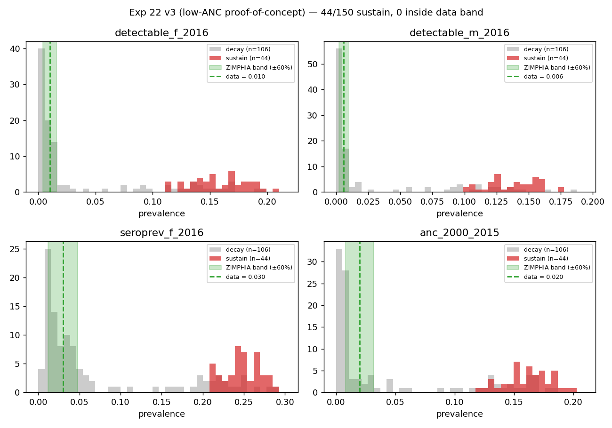
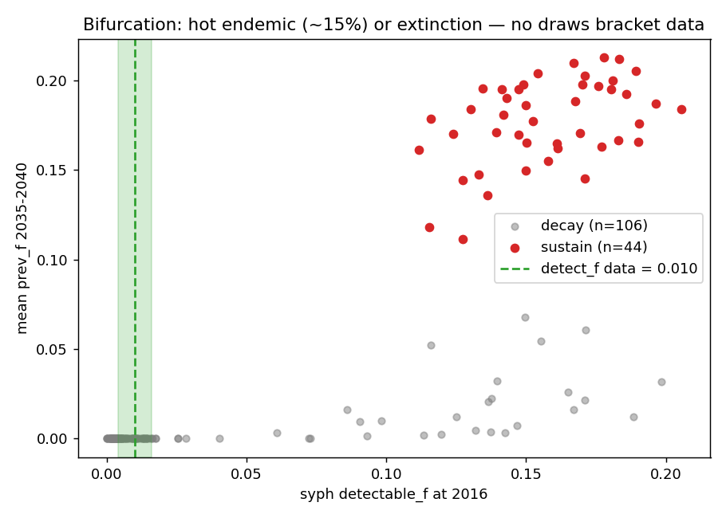
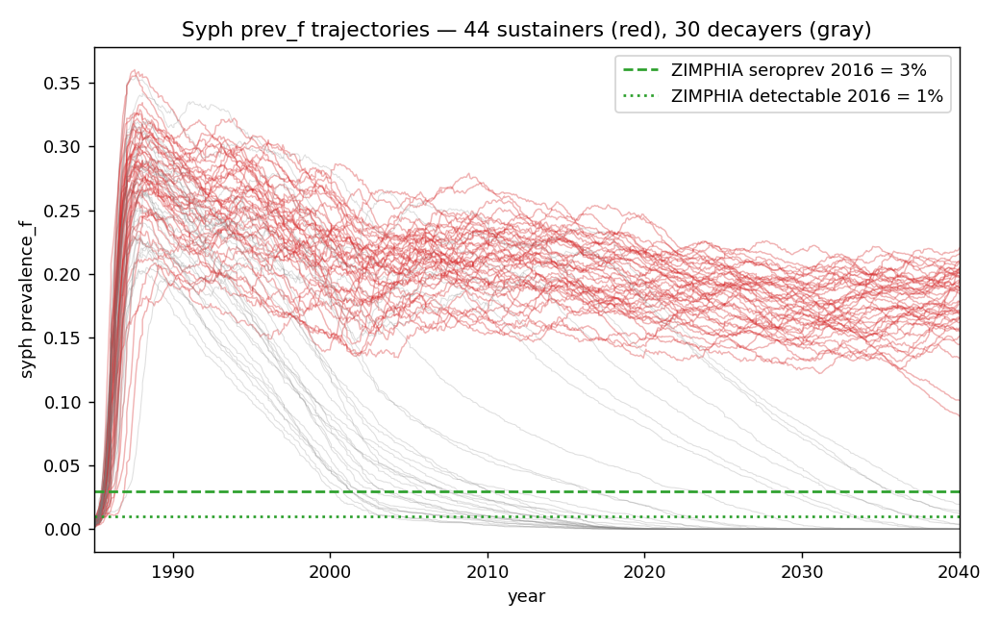

# Exp 22 — Sustainability coverage check under softened ANC ramp

**Date:** 2026-06-06.

**Question.** Under a softened ANC test-probability ramp (plus the
`dt_scale=False` fix on `syph_symp_test` and the new
`SyphilisANCTimer` connector that schedules one ANC visit per pregnancy
at uniform weeks 8-32), does the model now contain at least 30 of 150
prior draws that sustain syphilis with non-zero new infections through
2030-2040 AND bracket the ZIMPHIA 2015-16 targets within ±60%? See
[`../21_trajectory_selection_9param/SUMMARY.md`](../21_trajectory_selection_9param/SUMMARY.md)
for the post-mortem that motivated the structural changes here.

**Result.** Sustainability gate technically passes (44/150 sustain on
the proof-of-concept low-ANC corner — anc_probs =
[0.05, 0.10, 0.15, 0.15, 0.20, 0.20, 0.20]) but **0/44 sustainers fall
inside the ZIMPHIA detect_f acceptance band [0.4%, 1.6%]**. All
sustainers cluster at detect_f = 11–21% (median 15.6%), ANC prev at
12–20% (median 16.2%), seroprev_f at 21–29% — roughly 10× the data
targets. The bifurcation between hot endemic and extinction holds
under softened ANC: no draw bridges the gap. **The gate is met on the
letter and failed on the spirit.** HM under these conditions cannot
recover the data.

## Observations

1. **Sustainability ≠ calibratability.** The sustainability gate (≥30
   draws with new_inf > 0 and prev_f ≥ 0.1% in late projection) was
   designed as a necessary condition for HM. It is not sufficient.
   v3 passes the gate (44/150) but every sustainer sits at an
   endemic floor ~15× higher than the ZIMPHIA detectable target.

2. **The proof-of-concept ANC corner was the optimistic case.** This
   run used unrealistically-low ANC probabilities (peak 20%,
   effective ~17% per pregnancy) — far below the 60-70% that
   Zimbabwe actually achieved by 2018. The hypothesis was *"if we
   reduce ANC treatment pressure, the existing 12-param prior should
   contain draws that sit at the ~1% data level."* That hypothesis
   was falsified: even with treatment pressure removed, the model
   still bifurcates and the low-prevalence corner is empty.

3. **The endemic floor is structural, not a calibration knob.**
   Sustainers span the full β prior range and the full network-shape
   range, yet all settle in the same ~15% detect_f basin. This
   suggests a substructure — likely the FSW reservoir, possibly
   compounded by primary-stage transmission heterogeneity — is
   pinning the floor independent of overall transmission intensity
   or treatment coverage. **Diagnosis is now the priority over
   further calibration.**

4. **Side fixes worked as designed but did not break the bifurcation.**
   The `SyphilisANCTimer` connector (CRN-safe ss.uniform weeks 8-32)
   correctly schedules one ANC visit per pregnancy; the dt_scale=False
   fix on syph_symp_test correctly preserves the
   per-symptomatic-episode CSV values. Both are kept.

5. **The 12-param prior is unfalsified for its own purpose** — it
   contains draws across a wide range of transmission/care-seeking
   settings. The problem is that the model's deterministic skeleton
   (FSW + network structure + stage durations) admits only one
   sustaining basin, and that basin is at ~15%. Adding more priors
   on β/care-seeking will not move that basin downward.

## Acceptance

**Do not advance to HM (exp 23).** The data band is empty under every
ANC setting we have tried (high ramp → extinction; low ramp → hot
endemic ~15%). HM would slowly rediscover the wall. The next
experiment is a structural diagnostic, not a calibration step.

## Next

[Opened — see [`../23_rel_init_prev_check/`](../23_rel_init_prev_check/)]
Initial-condition sensitivity + stratified diagnostic. Adds
`syph.rel_init_prev` to the prior over log range (0.02, 1.00) — 10×
below to 5× above the current fixed 0.2 baseline — to test whether
the ~15% endemic floor is a true attractor or an artifact of seeding
the FSW pool too hot in 1985. Also turns on the syph module's FSW +
risk-group result storage so among sustainers we get a free
attribution of new infections by sub-population. Primary success
criterion: at least one draw lands inside the ZIMPHIA detect_f band
[0.4%, 1.6%].

## Artifacts

- `outputs/results.jsonl` — 150 rows, one summary per draw (status,
  coverage metrics, sustainability flag).
- `outputs/prior_draws.csv` — LHS sample (seed=42) across 12 params.
- `outputs/series.pkl` — full time series per draw for every disease +
  syph new_infections and incidence.
- `figures/coverage_vs_targets.png` — distributions of the four syph
  targets among sustainers vs decayers, with ZIMPHIA bands.
- `figures/bifurcation_scatter.png` — detect_f_2016 vs prev_f_2035-40,
  one point per draw, colored by sustainability flag.
- `figures/sustainer_trajectories.png` — prev_f time series for all 44
  sustainers + a sample of 30 decayers.
- `run.py` — driver. `analyze.py` — figure generation.
