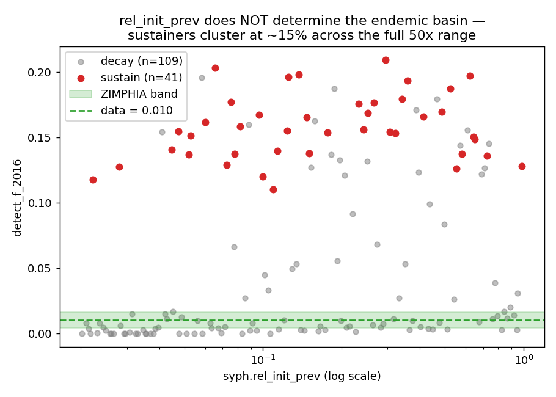
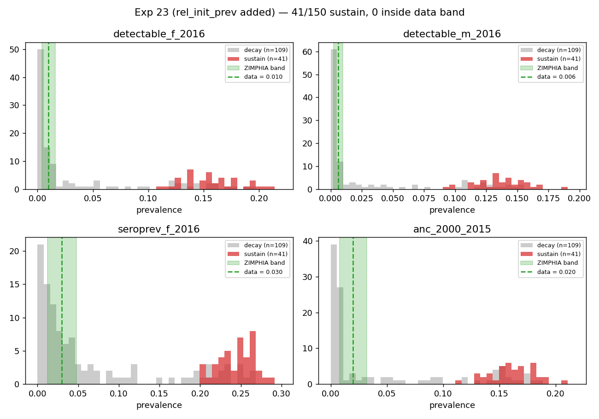
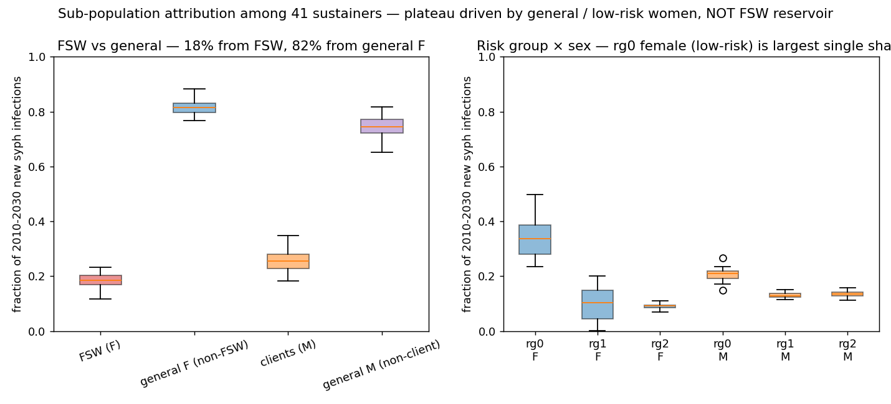

# Exp 23 — Initial-condition sensitivity + stratified diagnostic

**Date:** 2026-06-07.

**Question.** Two linked questions: (1) is the ~15% endemic floor an
attractor of the model dynamics or an artifact of seeding the FSW
pool too hot in 1985? — added `syph.rel_init_prev` to the prior over
log range (0.02, 1.00), 10× below to 5× above the current fixed 0.2
baseline. (2) Among sustaining draws, what sub-population pins the
floor? — enabled `store_sw=True` and `store_risk_groups=True` on the
syph module to get free per-step `new_infections_sw`,
`new_infections_not_sw`, `new_infections_client`,
`new_infections_not_client`, and risk-group breakdowns.

**Result.** **Both hypotheses surface clean answers.**

1. **The ~15% endemic floor is a true dynamical attractor.** Among
   the 41/150 sustainers, `rel_init_prev` spans the full prior range
   [0.022, 0.988] — including draws seeded **11× below** the baseline.
   Detectable_f at 2016 distribution is essentially identical to exp
   22 (median 0.155, range 0.11-0.21). Seeding does not move the
   basin.
2. **The plateau is NOT driven by FSW.** Among sustainers,
   cumulative 2010-2030 new infections attribute:
   - FSW (female):       median 18% (p10-p90: 16-22%)
   - General F (non-FSW): median 82%
   - Clients (male):     median 25%
   - General M (non-client): median 75%

   By risk-group × sex: **low-risk F (rg0_female) is 34%** — the
   largest single share among sustainers. The endemic floor is
   sustained primarily by transmission within the general / low-risk
   women, not by an FSW reservoir.

## Observations

1. **Hypothesis (B) is closed out.** Even draws with
   `rel_init_prev = 0.022` (FSW seeded at ~0.04% latent in 1985)
   equilibrate at ~15% detectable_f by 2016. The basin is set by
   the deterministic skeleton (R₀ at low prev > 1), not by initial
   conditions.

2. **Hypothesis (A) is confirmed *but the substructure surprised*.**
   Going in, the candidate "lever" was FSW network size /
   duration / partner-acquisition. Stratified results say no: only
   ~18% of plateau-era new infections originate among FSW.

3. **Low-risk women dominate the transmission floor.** rg0_female
   alone is 34% of new infections; combined non-FSW women are 82%.
   This points to a candidate explanation: latent-stage transmission
   with `time_to_undetectable ~ 20 years` makes a large pool of
   long-latent infectious agents in the general population, and at
   the prevailing partner-acquisition rate the implied R₀ in that
   pool is comfortably above 1. The basin sits where it does because
   that R₀ stabilises there.

4. **`detect_f` exactly tracks exp 22.** Adding a 13th parameter
   (rel_init_prev) and re-LHS-sampling produced the same coverage
   metrics — sustainers all in [11%, 21%], 0 in band, median ANC
   prev 16%, median seroprev 25%. The bifurcation is robust to the
   parameter space tested.

5. **Naming inconsistency flagged for forward fix.** The model
   results `detectable_prevalence_*` and `serological_prevalence_*`
   are confusing because both RPR and trep RDTs are "serological
   tests." Going forward, results will be renamed to `nontrep_*`
   and `trep_*` (see SUMMARY's Next section). This experiment's
   outputs use the old names; the rename is forward-only.

6. **ANC test audit, no bug.** The `dual_dx` product (used post-2012
   in `syph_anc_rdt`) correctly fires 95% positive on
   `sus_not_naive` agents — matching the trep-only HIV-syph rapid
   that treats sero-reverters as "treponemal positive, presumed
   infected." This biologically matches field practice and doesn't
   change transmission (sero-reverters are already susceptible). No
   intervention-side bug to fix.

## Acceptance

The structural diagnosis is complete: the basin is set by general-
population transmission dynamics, very likely driven by an over-long
infectious latent window combined with non-trivial low-risk partner
change. **Next experiment targets stage-specific transmission
parameters, not network knobs.**

## Next

[Pending — see `../24_<slug>/`] Calibration restructure to lower the
endemic basin. Top candidate levers, in order of biological
defensibility:

- **`rel_trans_latent`** — the most direct lever. Currently in the
  stisim default, latent infections transmit at some `rel_trans_latent`
  multiplier of primary β. Reducing this collapses the long-window
  contribution to R₀ without touching network structure.
- **Latent-stage natural-history bound** — `time_to_undetectable`
  currently set to ~20y, but in the model `detectable=True` also
  means "still infectious as latent." Decoupling these (e.g.
  defining a separate `time_to_non_infectious_latent` ~ 4y, matching
  WHO/CDC "early latent" infectiousness window) would let latent
  agents remain seropositive but stop transmitting — directly
  shrinking the latent reservoir.
- **Low-risk partner-acquisition rate** — fallback if the above
  don't suffice. Would touch the network rather than the disease.

Also queued for exp 24's scaffolding: the stisim result-name rename
(`detectable_*` → `nontrep_*`, `serological_*` → `trep_*`) lands as
a prerequisite commit, and exp 24's run.py uses the new names from
the start.

## Artifacts

- `outputs/results.jsonl` — 150 rows, one summary per draw.
- `outputs/prior_draws.csv` — 13-dim LHS sample (seed=42).
- `outputs/series.pkl` — per-draw time series including stratified
  new_infections by FSW/client and by risk-group × sex.
- `figures/init_prev_vs_detectf.png` — sustainers' detect_f_2016
  plotted against the sampled rel_init_prev.
- `figures/coverage_vs_targets.png` — 4-panel coverage comparison.
- `figures/subpop_attribution.png` — sub-population attribution
  boxplots among sustainers.
- `run.py` — driver. `analyze.py` — figure generation.
