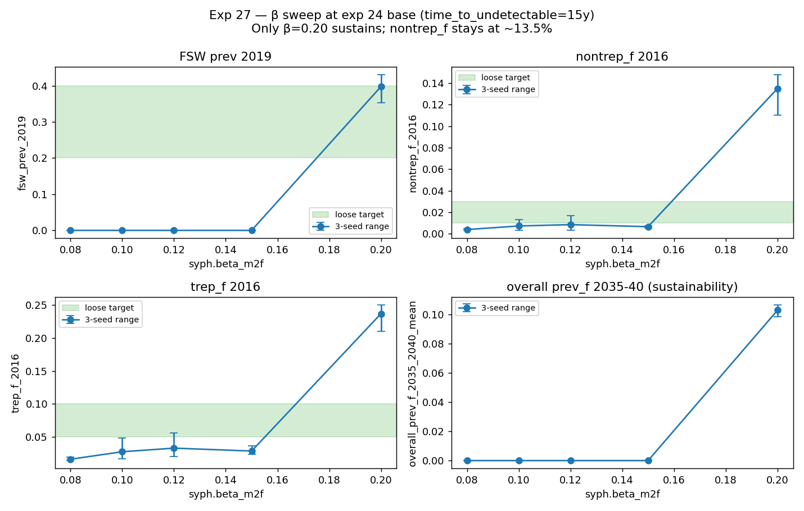
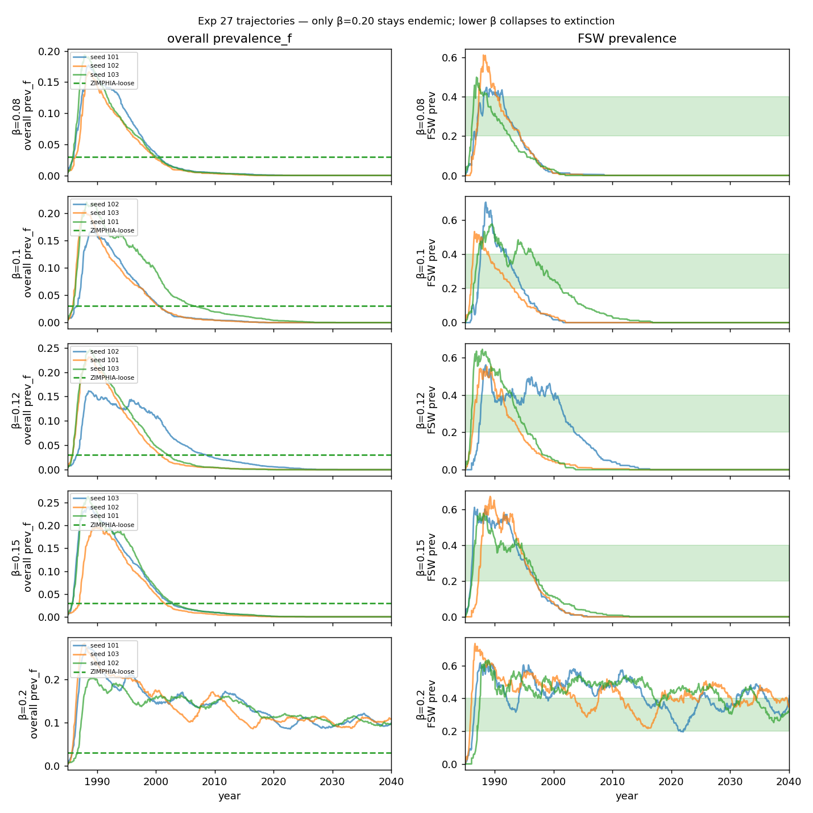
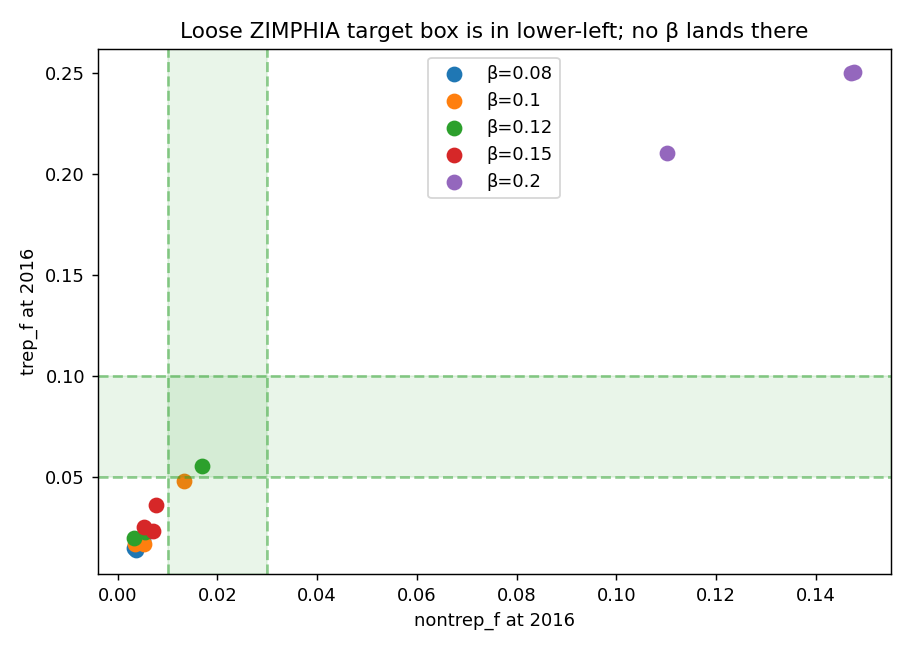

# Exp 27 — β sweep with time_to_undetectable=15y: bistable, only β=0.20 sustains

**Date:** 2026-06-07.

**Question.** At exp 24's hand-pick base, with `time_to_undetectable`
shortened from 20y to 15y (cuts the late-latent nontrep-positive
window by 5 years), what is the lowest `syph.beta_m2f` that still
sustains? And where does general nontrep_f land at that floor?

**Result.** **Sharp bistability** between hot endemic (β=0.20) and
extinction (β ∈ {0.08, 0.10, 0.12, 0.15}). **No intermediate basin
exists.** At the only sustaining β:

| β | FSW prev 2019 | nontrep_f 2016 | trep_f 2016 | primary % | sec % | sustained |
|---|---|---|---|---|---|---|
| **0.20** | 0.397 | **0.135** | **0.237** | 63% | 35% | yes (4/6 targets) |
| 0.15 | 0.000 | 0.007 | 0.028 | — | — | no |
| 0.12 | 0.000 | 0.009 | 0.033 | — | — | no |
| 0.10 | 0.000 | 0.007 | 0.027 | — | — | no |
| 0.08 | 0.000 | 0.004 | 0.016 | — | — | no |

## Observations

1. **time_to_undetectable 20y → 15y reduced nontrep_f by only ~10%
   at the sustaining β.** Exp 24's 0.151 → exp 27's 0.135. The late-
   latent stock effect is real but smaller than hoped. The remaining
   ~13.5% nontrep_f is driven by ongoing infection-treatment-
   reinfection dynamics in the active stages, not by the long
   late-latent tail.

2. **Stage shares still right at the sustaining β.** Primary 63%,
   secondary 35%. The disease natural-history is fine — same
   confirmation as exps 23/24/26.

3. **β ≤ 0.15 collapses to extinction.** Per-seed numbers at β=0.15
   (FSW=0 across all 3 seeds, nontrep_f ≈ 0.5-0.8%) show the model
   passing through the loose nontrep_f target band on its way down,
   but this is the same decay-through-target pattern that
   [[feedback-calibration-guards]] is designed to catch — these
   trajectories visit the band transiently while dying.

4. **The bifurcation is robust to β.** Whether at exp 22's PoC ANC,
   exp 24's realistic ANC, or this β sweep, the model offers only
   "hot endemic" or "extinction." No third equilibrium near 1-3%
   nontrep_f exists under the current network architecture +
   disease-side parameters.

5. **Therefore parameter-only knobs are exhausted.** Each lever we
   have left moves the system between the same two basins; none
   creates a new basin in the loose target band.

## Acceptance

**The parameter-only calibration path is closed.** With the loose
targets (nontrep_f 1-3%, trep_f 5-10%), the model's only sustaining
configuration sits at nontrep_f=13.5% and trep_f=24% — 4-5× above
the loose ceilings, despite stage shares and FSW prev being right.

## Next

Decision point for Robyn:

- **Option A: Accept exp 24's configuration as the calibration
  baseline** with relaxed-relaxed targets (nontrep_f ≤ 15%,
  trep_f ≤ 25%). The model captures the qualitative right story —
  concentrated, sustained, primary-driven — but with absolute levels
  ~5× the data. Decision-analysis on interventions can proceed if
  we explicitly document this scale mismatch and interpret
  intervention effects in relative terms (% reduction) rather than
  absolute prevalence.
- **Option B: Open the marital-MF condom-use lever**
  (Robyn's earlier idea, deferred). This is the structural change
  that would actually shift the FSW:gen concentration ratio away
  from 2.7 toward the data-implied 10. Scope: edit `data/condom_use.csv`
  (or its MF-network slice) to push condom use in stable
  client-wife partnerships much higher. Single test, then iterate.
- **Option C: Add `p_nontrep_persists` to the syph module** —
  Remco's "75% never sero-revert" hypothesis. Would let some
  agents stay nontrep+ for life while reducing the late-latent
  pool that drops out. Unclear whether this alone would shift the
  trep:nontrep ratio enough.

My recommendation: **B**. The diagnosis points there
unambiguously, and the user has been holding it back as the
"break-glass" option.

## Artifacts

- `outputs/results.json` — per-seed + aggregated
- `outputs/sweep_summary_all.csv` — 3-seed mean per β (all runs)
- `outputs/sweep_summary_sustained.csv` — only sustained runs
- `outputs/series.pkl` — time series per (β, seed)
- `figures/sweep_summary.png` — 4-panel β vs metrics with target bands
- `figures/trajectories_by_beta.png` — overall + FSW prev trajectories
- `figures/nontrep_vs_trep.png` — cross-section scatter vs loose target box
- `run.py` — parallelized sweep driver
- `analyze.py` — figure generation
