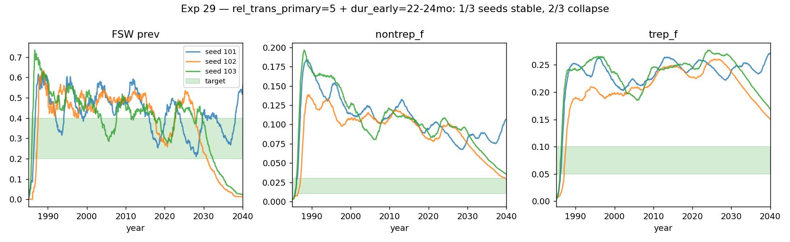

# Exp 29 — rel_trans_primary=5 + extended early latent

**Date:** 2026-06-07.

**Question.** Layering three structural changes onto exp 28's hand-pick
config — `rel_trans_primary=5` (vs default 1), `dur_early` extended
12-14mo → 22-24mo (WHO Europe early-latent boundary), plus the
SyphTx-clears-nontrep patch from exp 28 — does the model land in the
loose target band (FSW prev 0.20-0.40, nontrep_f 0.01-0.03, trep_f
0.05-0.10, primary 45-65%, sec 25-45%, sustained)?

**Result.** **Fragility increased; the parameter combination put us
on the basin boundary.** 3-seed split:

| seed | FSW prev 2019 | nontrep_f 2016 | trep_f 2016 | 2035-40 fate |
|---|---|---|---|---|
| 101 | 0.30 (stable) | 0.109 | 0.254 | FSW 33%, sustained |
| 102 | 0.30 (transient) | 0.104 | 0.248 | **collapsed to 6% FSW** |
| 103 | 0.36 (transient) | 0.107 | 0.249 | **collapsed to 10% FSW** |

## Observations

1. **At the one stable seed, FSW prev moved IN to band** (0.40 → 0.33)
   and overall prev_f dropped (10% → 5%). Right direction on both.

2. **Stage shares unchanged.** Primary 63%, secondary 35% — same as
   exp 28. Confirms (again) that disease natural-history is fine.

3. **nontrep_f and trep_f barely moved.** The active-stage component
   of these stocks isn't sensitive to rel_trans_primary alone.

4. **Higher fragility.** With rel_trans_primary=5, transmission is
   concentrated in the 6-week primary window. Treatment removes
   active cases quickly → less reservoir → stochastic extinction
   risk goes up. 2 of 3 seeds crashed despite hitting the right
   2016 cross-section.

## Acceptance

The fragility makes this configuration unusable as-is — a calibration
that crashes 2/3 of the time isn't reliable. But the directional
finding is meaningful: rel_trans_primary IS a real lever, just
applied here too aggressively.

## Next

[Done — see [`../30_lhs_definitive/SUMMARY.md`](../30_lhs_definitive/SUMMARY.md)]
LHS 300 draws across all 14 priors (including rel_trans_primary
opened on log-prior 1-10) to find the configuration that actually
hits the loose targets — if one exists in our prior space at all.

## Artifacts

- `outputs/results.json` — per-seed + 3-seed mean
- `outputs/stage_shares.csv`
- `outputs/series.pkl`
- `figures/trajectories.png`
- `run.py`, `analyze.py`
