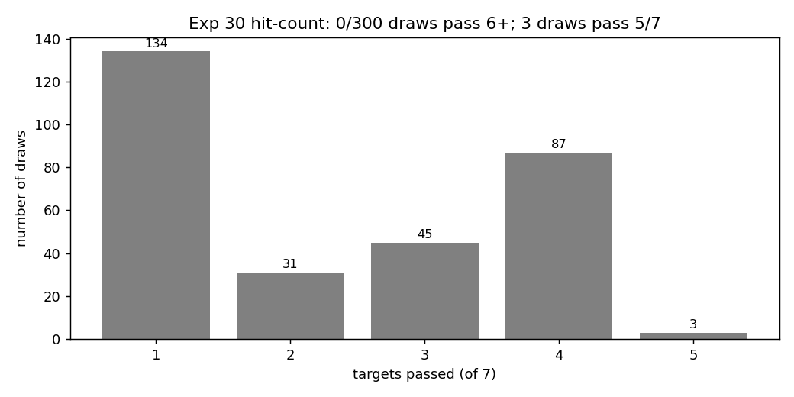
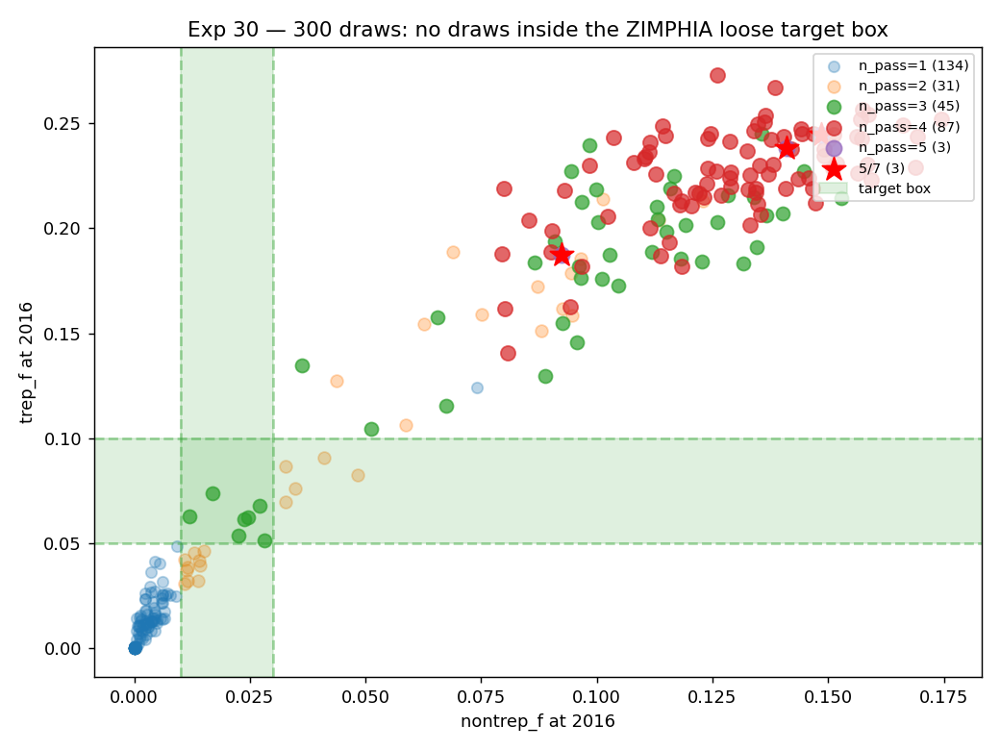
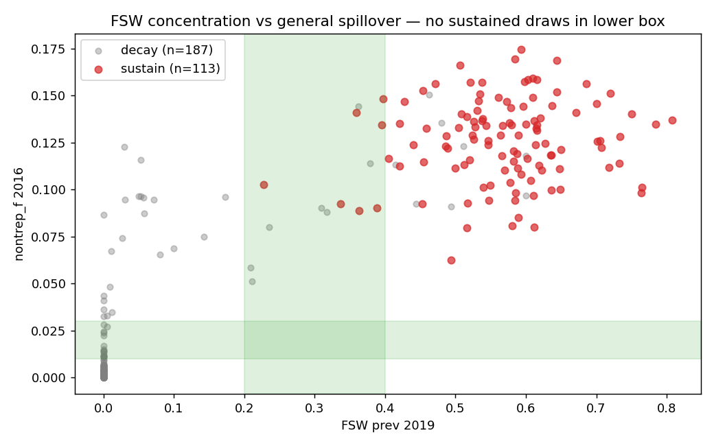

# Exp 30 — Definitive LHS sweep over 14 priors

**Date:** 2026-06-07.

**Question.** With all structural fixes in place — nontrep/trep
result rename, SyphTx clears nontrep on early-stage treatment,
trep BoolState with 80% lifetime persistence + window-period
clearing, dur_early extended to 22-24mo, rel_trans_primary opened
as a calibration prior, defensible ANC ramp, boosted FSW
care-seeking — does ANY configuration in our 14-dim prior space
produce reasonable concentrated-sustained syph dynamics matching
the loose ZIMPHIA target band?

**Result.** **Definitive miss. 0/300 draws pass 6+ of 7 targets.
3 draws pass 5/7 — every one missing on exactly the
`nontrep_band` and `trep_band` (general-population prevalence
magnitude), passing everything else (FSW prev, stage shares,
sustainability).**

| n_pass | draws |
|---|---|
| 1/7 | 134 |
| 2/7 | 31 |
| 3/7 | 45 |
| 4/7 | 87 |
| **5/7** | **3** |
| 6/7 | **0** |
| 7/7 | **0** |

## Top 3 draws (5/7 — all missing nontrep + trep bands)

| draw | FSW prev 2019 | nontrep_f 2016 | trep_f 2016 | prim % | sec % | el % | sustained |
|---|---|---|---|---|---|---|---|
| 74 | 0.337 | 0.092 | 0.187 | 53% | 45% | 2% | yes |
| 78 | 0.359 | 0.141 | 0.238 | 56% | 41% | 3% | yes |
| 213 | 0.350 | 0.118 | 0.211 | 57% | 39% | 2% | yes |

The cleanest configuration the model can produce is draw 74:
**FSW concentrated at 34%, sustained, primary-dominant — but
general nontrep_f ~9% (3× ZIMPHIA loose ceiling) and trep_f ~19%
(2× loose ceiling)**.

## Observations

1. **Structural finding holds.** Across 300 LHS draws spanning
   14 dimensions including stage transmissibility (rel_trans_primary
   ∈ [1, 10] log-scale) and ANC pressure, the model cannot place
   even one draw in the loose nontrep band [0.01, 0.03] while
   sustaining concentrated FSW dynamics. The concentration ratio
   (FSW:general) tops out around 3-4×, vs ZIMPHIA-implied 10×.

2. **What does land in band.** FSW prev band, primary share band,
   secondary share band, early-latent ≤15%, sustainability — these
   are all achievable. The model captures the qualitative shape
   correctly.

3. **What doesn't land.** Absolute general nontrep_f and trep_f
   are 3-10× hot regardless of parameters. The bottleneck is
   network architecture (clients' stable partnerships with general F),
   not parameter values.

4. **Implication.** Parameter-only calibration is exhausted. The
   remaining levers are structural (architecture — e.g.
   risk-stratified clients, condom-use changes in stable
   client-wife pairs, network-rewiring) or interpretive (accept
   that the model is qualitatively right and report intervention
   effects in relative terms).

## Acceptance

**The 14-dim prior space does not contain a configuration that
matches ZIMPHIA at loose tolerance.** Draw 74 is the cleanest
parameter-only baseline available.

## Next

[Opened — see [`../31_draw74_rel_trans_tweaks/SUMMARY.md`](../31_draw74_rel_trans_tweaks/SUMMARY.md)]
Take draw 74 and apply targeted rel_trans tweaks (rel_trans_primary
up, half-life extended) to test whether a hand-pick around draw 74
moves into band.

Pending decision: how to proceed beyond parameter-only calibration.
The project needs an ENSEMBLE for decision analysis (Robyn:
"we can't do reasonable decision analysis with one parameter set"),
so options are now:

- **Open structural levers** (marital-MF condom, client risk
  stratification) to shift the concentration ratio.
- **Build an ensemble from the 4/5-pass cluster** in this sweep
  (87 draws at 4/7 + 3 at 5/7 ≈ 90 candidate draws), accepting
  the absolute scale mismatch but capturing parameter uncertainty.
- **Hybrid**: structural fix to lower the floor + ensemble around
  the new operating point.

## Artifacts

- `outputs/results.jsonl` — 300 rows, all summaries
- `outputs/results.json` — aggregate distribution + definitive_pass flag
- `outputs/prior_draws.csv` — 14-dim LHS sample (seed=42)
- `figures/hit_count_dist.png` — bar chart of pass counts
- `figures/nontrep_vs_trep.png` — scatter vs ZIMPHIA target box
- `figures/fsw_vs_nontrep.png` — concentration vs spillover plane
- `run.py`, `analyze.py`
