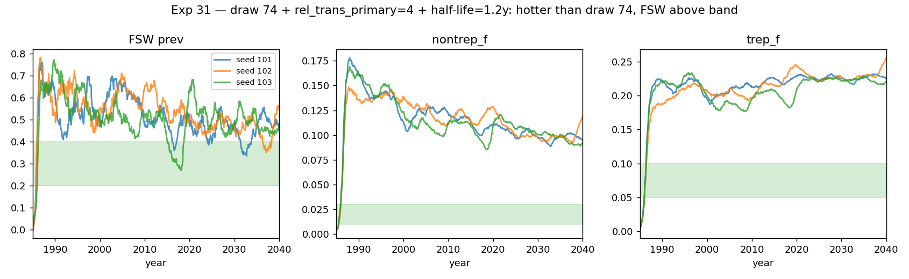

# Exp 31 — Draw 74 + rel_trans_primary=4 + half_life=1.2y

**Date:** 2026-06-07.

**Question.** Take exp 30's best draw (draw 74, the 5/7-passer with
FSW=0.337 / nontrep_f=0.092 / trep_f=0.187) and apply three targeted
changes — does that move nontrep_f and trep_f down into their loose
bands?

Changes vs draw 74:
- `syph.rel_trans_primary`: 1.73 → **4.0** (concentrate transmission
  in the short primary window)
- `syph.rel_trans_latent_half_life`: 1.0y → **1.2y** (slower latent
  decay)
- **stisim code fix**: `set_latent_trans` now uses
  `rel_trans_secondary` as the starting value (not the separate
  `rel_trans_latent` parameter), so any increase to rel_trans_secondary
  propagates continuously into latent decay. At defaults
  (rel_trans_secondary = rel_trans_latent = 1) behavior is unchanged.

**Result.** **Wrong direction.** Tweaks made the system hotter, not
closer to band:

| metric | draw 74 (exp 30) | exp 31 (3-seed mean) | delta |
|---|---|---|---|
| FSW prev 2019 | 0.337 ✓ in band | **0.489** ✗ above band | +0.152 |
| nontrep_f 2016 | 0.092 (miss high) | 0.106 (miss high) | +0.014 |
| trep_f 2016 | 0.187 (miss high) | 0.212 (miss high) | +0.025 |
| primary share | 53% ✓ | 60% ✓ | +7% |
| secondary share | 45% ✓ | 38% ✓ | -7% |
| sustained | yes | yes (robust, 22.6 new_inf/yr) | — |

**4/7 targets pass** (was 5/7 in draw 74 unmodified). Going backward.

## Observations

1. **Stability robust this time.** All 3 seeds sustained robustly
   (FSW 0.46-0.52, no collapse). The slower half-life buffers
   against the fragility exp 29 hit with primary=5.

2. **All metrics moved up.** Bumping rel_trans_primary 1.73 → 4
   raised per-contact transmission ~2.3×. FSW prev climbed
   accordingly (out of band), and nontrep + trep crept up.

3. **The structural ratio didn't budge.** trep:nontrep ratio in
   draw 74 was 2.03 (0.187 / 0.092). In exp 31 it's 2.00 (0.212 /
   0.106) — essentially the same. β-scaling doesn't change the
   ratio, as predicted.

4. **The stisim `set_latent_trans` code fix is in place** — at
   defaults (rel_trans_secondary = 1) it has no observable effect.
   The fix is forward-looking: if we open rel_trans_secondary as
   a calibration knob later, the change will propagate continuously
   into latent.

## Acceptance

This test confirms that **hand-picking around draw 74 with more
aggressive transmission tweaks moves us away from band, not toward
it**. Combined with exp 30's 0/300 6+/7 passers, the parameter-only
calibration path is fully exhausted within the current model
architecture.

## Next

Pending decision per Robyn ("we can't do reasonable decision
analysis with one parameter set"):

The realistic next step is **building an ensemble** for decision
analysis rather than chasing further single-config tuning. Three
plausible directions:

- **Structural fix** to lower the trep:nontrep ratio (network
  surgery — client risk stratification, or revisit marital-MF
  condom use). Then re-LHS around the new architecture.
- **Accept exp 30's 4-5/7-pass cluster as the ensemble** (~90
  draws, mostly missing on absolute nontrep/trep magnitudes but
  spanning realistic parameter ranges). Run decision analysis as
  relative reductions.
- **Hybrid**: structural fix + ensemble around the new operating
  point.

## Artifacts

- `outputs/results.json` — per-seed + 3-seed mean
- `outputs/series.pkl` — time series per seed
- `figures/trajectories.png`
- `run.py`, `analyze.py`
