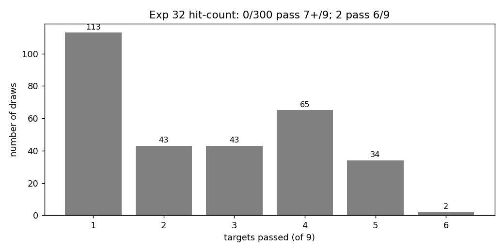
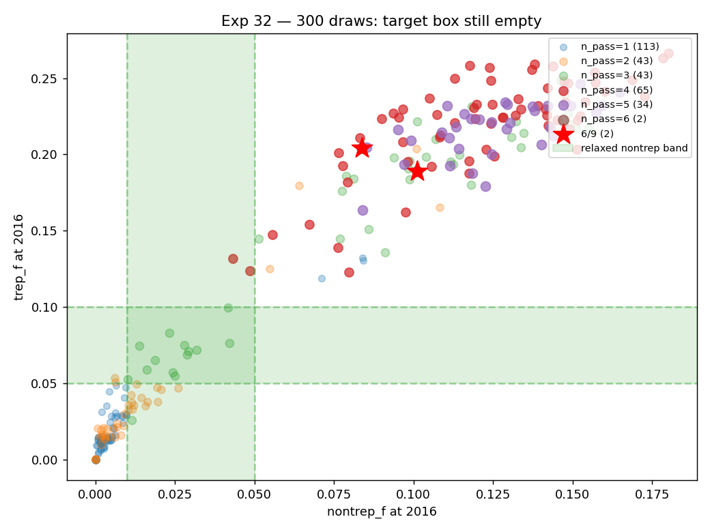
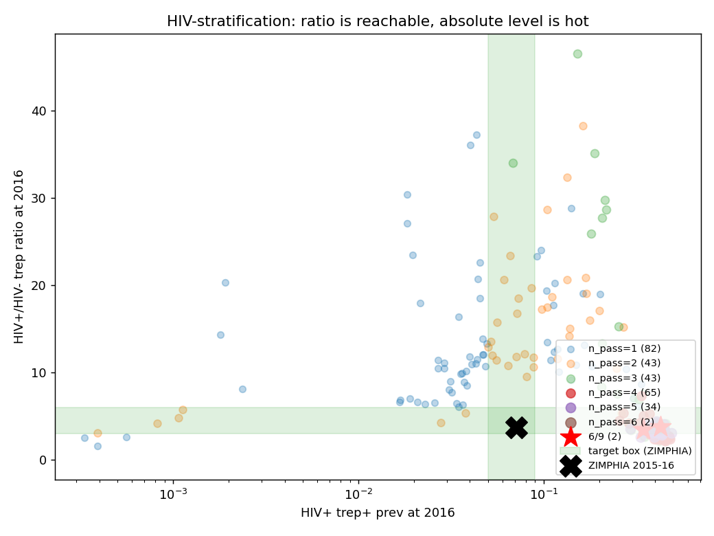
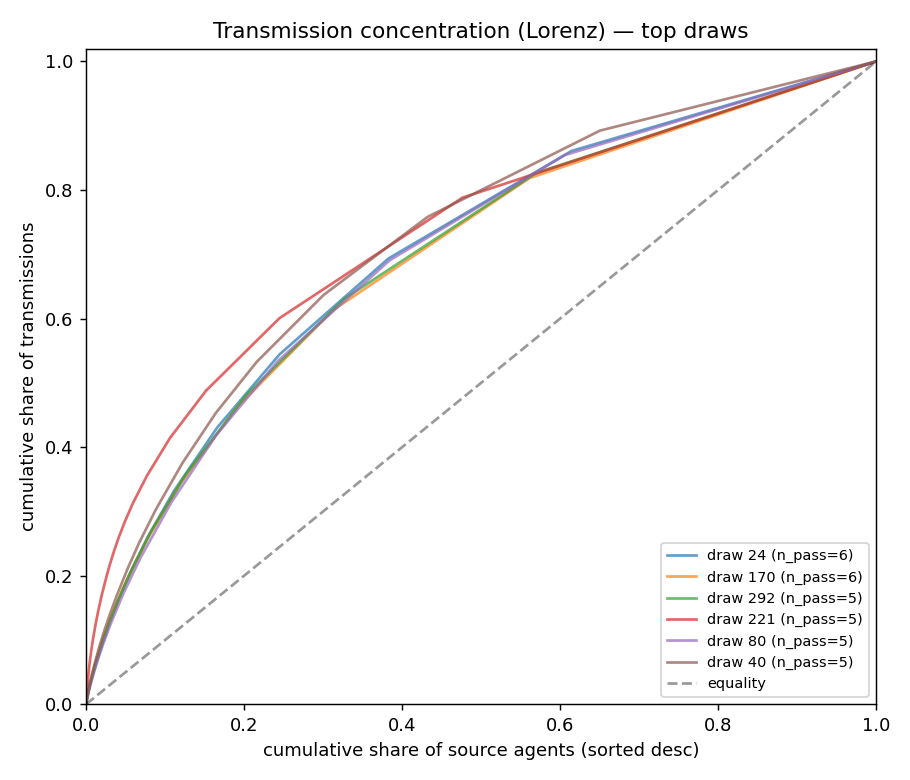
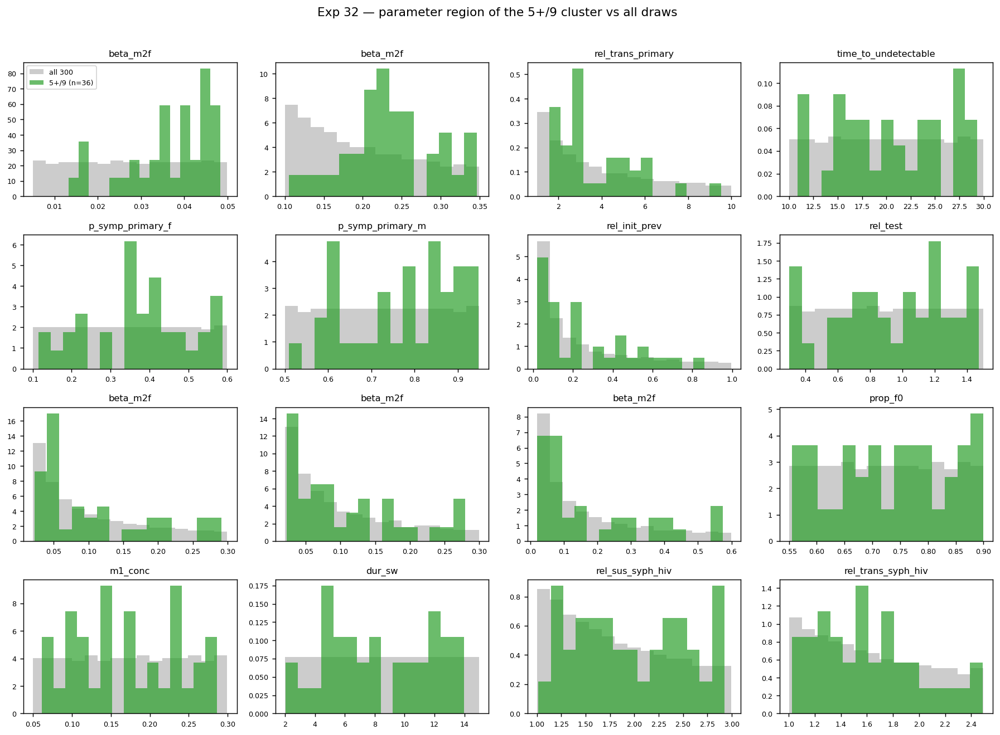

# Exp 32 — LHS over 16 priors with HIV-stratified syph

**Date:** 2026-06-07.

**Question.** Exp 30's 14-dim LHS found 0/300 passing 6+/7 targets,
with the 5/7 cluster missing on absolute nontrep + trep magnitudes
in the general population. The targets didn't include HIV-stratified
syphilis prevalence, and the model's HIV→syph connector defaults
`rel_sus_syph_hiv=1` and `rel_trans_syph_hiv=1` — leaving no
mechanical pathway for HIV+ adults to carry elevated syph prev
beyond shared-network exposure. ZIMPHIA 2015-16 shows HIV+ at
3.7×/7× HIV- on trep/active. Does opening the connector and adding
HIV-stratified targets find a configuration in the 16-dim space that
passes the augmented target set?

**Result.** **The HIV-coupling lever works: the model can reproduce
ZIMPHIA's 3.7× HIV+/HIV- trep gradient (64/300 draws hit [3.0, 6.0]).
But absolute prevalence ceiling unchanged — 0/300 pass 7+/9, 2 pass
6/9. The architectural bottleneck is now mechanistically attributable
to a self-sustaining general-population transmission engine that the
FSW-to-wife leak alone doesn't explain.**

## Per-target pass rate

| target | all 300 | 5+/9 cluster (n=36) |
|---|---|---|
| early_lat_band ≤ 0.15 | 100% | 100% |
| secondary_band [0.25, 0.45] | 38% | 100% |
| sustained (new_inf 2030-2040 > 0) | 38% | 100% |
| primary_band [0.45, 0.65] | 35% | 97% |
| **hiv_trep_ratio_band [3.0, 6.0]** | **21%** | **89%** |
| fsw_band [0.20, 0.40] | 3% | 19% |
| nontrep_band [0.01, 0.05] | 10% | **0%** |
| trep_band [0.05, 0.10] | 5% | **0%** |
| hiv_pos_trep_band [0.05, 0.09] | 6% | **0%** |

The 5+/9 cluster is structurally correct on shape (sustained,
primary-dominated, HIV-gradient right) but consistently 3-5× hot on
absolute general-population prevalence — same finding as exp 30,
now confirmed in expanded prior space.

## Top draws (6+/9, plus 5/9 cluster head)

| draw | n_pass | FSW prev 2019 | nontrep_f | trep_f | HIV+ trep | HIV+/HIV- | prim % | sec % | sustained |
|---|---|---|---|---|---|---|---|---|---|
| 24 | 6 | 0.400 | 0.101 | 0.189 | 0.346 | 3.43 | 61% | 37% | 15.5/yr |
| 170 | 6 | 0.220 | 0.084 | 0.204 | 0.427 | 3.73 | 59% | 39% | 20.2/yr |
| 5 | 5 | 0.544 | 0.123 | 0.179 | 0.364 | 3.96 | 61% | 37% | 12.1/yr |
| 0 | 5 | 0.810 | 0.125 | 0.200 | 0.398 | 4.07 | 58% | 40% | 21.5/yr |
| 40 | 5 | 0.474 | 0.129 | 0.233 | 0.447 | 4.06 | 59% | 39% | 24.3/yr |

## Transmission matrix (draw 24, 2010-2025, n=2307)

| pathway | share |
|---|---|
| F_fsw → M_client | 28% |
| M_client → F_fsw | 23% |
| **M_client → F_other** (expected leak) | **17%** |
| M_other → F_other (general-pop circulation) | 12% |
| **F_fsw → M_other** (FSW partner non-clients) | **8%** |
| F_other → M_other | 6% |
| M_other → F_fsw | 3% |
| F_other → M_client | 2% |

FSW↔client core: 51%. Client-to-general-F leak: 17%. **General-pop
engine (M_other ↔ F_other + F_fsw → M_other → F_other): 32%.**

## Observations

1. **The HIV-coupling lever works.** 64/300 draws hit the [3.0, 6.0]
   HIV+/HIV- trep ratio band, and 89% of the 5+/9 cluster pass it.
   ZIMPHIA's 3.7× is squarely reachable. Mechanistically, opening
   `rel_sus_syph_hiv` and `rel_trans_syph_hiv` to log-scale priors
   [1.0, 3.0] and [1.0, 2.5] gives the model what it needs to
   produce the gradient.

2. **Absolute HIV+ trep prev still misses.** ZIMPHIA target [0.05,
   0.09] is unreachable because absolute trep_f is already 0.15-0.25.
   When the model passes the gradient target, HIV+ trep lands at
   0.35-0.45 — saturated. The two targets (absolute HIV+ and ratio)
   are coupled to general prev and can't both be hit in current
   architecture.

3. **The FSW leak isn't only via clients.** 8% of plateau-era
   transmissions go F_fsw → M_other — non-client males catching from
   FSW. Those non-clients then re-spread (M_other → F_other = 12%).
   The FSW-mediated cascade reaches general F via two paths: direct
   client→wife (17%) and indirect FSW→non-client M→F (≈ 8% × forward).

4. **There's a self-sustaining general-population engine.** ~32% of
   transmissions happen entirely outside the FSW-client core
   (M_other ↔ F_other plus the FSW→M_other channel feeding it).
   Even if we fully suppressed the client→wife leak, general-pop
   circulation would keep prev hot. This is the residual structural
   bottleneck exp 30 couldn't diagnose.

5. **Lorenz / superspreader concentration is too flat.** Top 50% of
   transmissions come from ~20-22% of source agents (across the 5+/9
   cluster). Real syph epi suggests something closer to top 20% of
   agents carrying 80% of transmissions. The model spreads infection
   too evenly across the population — independent signal from the
   FSW-vs-general concentration gap.

   

6. **Parameter region of the 5+/9 cluster.** The top cluster
   concentrates in: `syph.beta_m2f` mid-to-high (0.15-0.30),
   `syph.rel_trans_primary` mid-to-high (3-8), `time_to_undetectable`
   18-28 yrs, `prop_f0` low (0.55-0.65 — fewer F in low-risk),
   `dur_sw` high (10-15 yr), and modest `rel_sus_syph_hiv` (1.5-2.5).
   No single parameter pins the cluster — the constraint comes from
   the joint structure.

   

## Acceptance

The expanded sweep confirms exp 30's structural conclusion at higher
resolution. **The 16-dim prior space, even with HIV-syph coupling
opened, does not contain a configuration matching ZIMPHIA at loose
tolerance on absolute general-population prevalence.** The 5+/9
cluster (36 draws) is the structurally-correct candidate ensemble:
sustained, primary-dominated, HIV-gradient right, FSW concentration
≈ 0.3-0.5 — missing only on absolute general-pop trep/nontrep
magnitudes (3-5× hot).

Per-target attribution adds the missing diagnosis: **the residual
gap is driven by a self-sustaining general-pop transmission engine
(~32% of plateau transmissions) that survives any FSW-leak fix.**

## Next

[Pending] Exp 33 — choose between two structural levers, then
re-sweep:

- **A: Restrict FSW partnerships to clients only.** Removes the
  F_fsw → M_other channel (8% direct + downstream amplification).
  Tests whether closing the FSW exit route closes the general-pop
  engine, or whether M_other ↔ F_other self-sustains independently.
  Lighter lift; reversible.

- **B: Open client risk-stratification.** Partition clients into
  high-risk (concurrent, high-frequency) and low-risk (married,
  infrequent). Currently all homogeneous. Could concentrate
  transmission and reduce per-capita leak to wives. Heavier; design
  decisions about how to partition.

Or — given the 36-draw 5+/9 cluster is structurally-correct on
shape, **accept it as the decision-analysis ensemble** and report PN
impact as relative reductions, with the absolute-scale mismatch
documented explicitly.

## Artifacts

- `outputs/results.jsonl` — 300 rows, all summaries + HIV-stratified
- `outputs/results.json` — aggregate distribution + definitive_pass
- `outputs/prior_draws.csv` — 16-dim LHS sample (seed=42)
- `outputs/events/` — per-sim transmission-event aggregates
  (`src_count` for Lorenz, `matrix` for transmission flow). 300
  files, one per draw (e.g. `events_0024.json`).
- `figures/hit_count_dist.png` — 9-target pass histogram
- `figures/nontrep_vs_trep.png` — scatter vs ZIMPHIA target box
- `figures/hiv_strat.png` — HIV+ trep vs HIV+/HIV- ratio plane with
  ZIMPHIA point
- `figures/per_target_pass.png` — per-target pass rate all vs 5+/9
- `figures/lorenz_top_draws.png` — superspreader concentration
- `figures/param_region_top.png` — prior distribution of top cluster
- `run.py`, `analyze.py`, `config.yaml`
