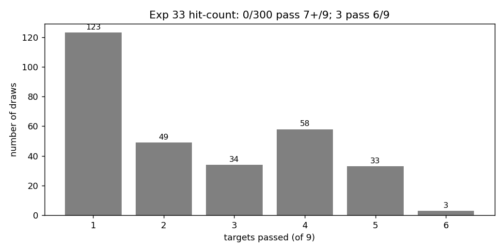
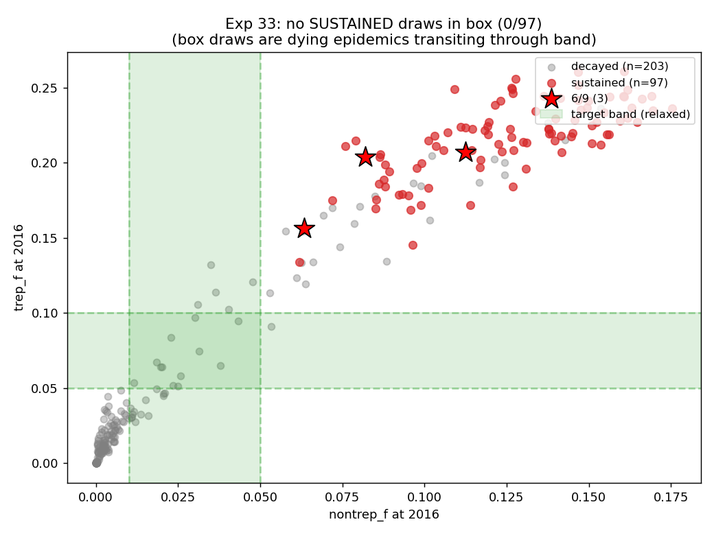
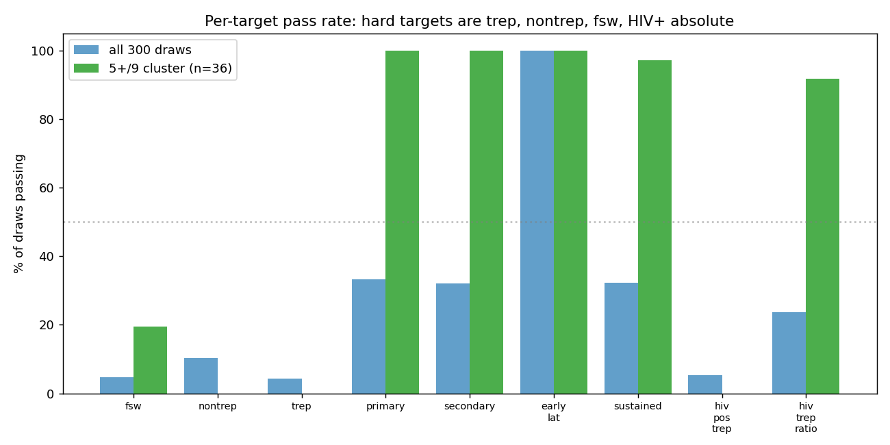

# Exp 33 — LHS with FSW MF-concurrency multiplier

**Date:** 2026-06-07.

**Question.** Exp 32's transmission matrix showed an unexpected
F_fsw → M_other channel carrying 8% of plateau transmissions, with
downstream M_other → F_other circulation accounting for another 12%.
The hypothesis: this FSW-fed non-client cascade is the leak keeping
absolute general-population trep prev hot. The test: open
`structuredsexual.fsw_mf_conc_mult` as a 17th prior (range
[0.1, 1.0]) that scales FSW's MF (non-commercial) concurrency, and
re-sweep 300 LHS draws. If the FSW-fed engine hypothesis is right,
low mult values should drop the general-pop transmission engine and
lower nontrep_f / trep_f toward band.

**Result.** **Lever works mechanistically but doesn't move the
calibration ceiling.** 0/300 pass 7+/9, 3/300 pass 6/9 (vs exp 32's
2/300) — essentially identical hit-count. **The general-pop M↔F
transmission engine is self-sustaining independent of FSW seeding.**

| metric (median across 5+/9 cluster) | exp 32 (n=36) | exp 33 (n=36) | Δ |
|---|---|---|---|
| `nontrep_f_2016` | 0.124 | 0.125 | +1% |
| `trep_f_2016` | 0.218 | 0.211 | -3% |
| `fsw_prev_2019` | 0.544 | 0.547 | +0.5% |
| `hiv_pos_trep_2016` | 0.416 | 0.406 | -2% |
| `hiv_trep_ratio_2016` | 3.37 | 3.24 | -4% |

## Diagnostic table

Across the 5+/9 cluster (n=36), correlation between
`fsw_mf_conc_mult` and key outcomes is essentially zero:

| outcome | correlation with mult |
|---|---|
| `F_fsw → M_other` transmission share | 0.03 |
| `M_client → F_other` transmission share | -0.10 |
| `M_other → F_other` transmission share | -0.02 |
| `nontrep_f` at 2016 | 0.02 |

The mult value is uniformly distributed in both the full 300-draw
set and the 5+/9 cluster (median 0.55 in both) — no preferential
selection of low values, despite mult ∈ [0.11, 0.97] in the cluster.

## Top draws

| draw | n_pass | **mult** | FSW prev 2019 | nontrep_f | trep_f | HIV+ trep | HIV+/HIV- | prim/sec | sustained |
|---|---|---|---|---|---|---|---|---|---|
| 275 | 6 | **0.29** | 0.382 | **0.063** | **0.156** | 0.294 | 3.48 | 62%/36% | 13.7/yr |
| 255 | 6 | 0.63 | 0.346 | 0.112 | 0.207 | 0.382 | 3.69 | 53%/44% | 18.9/yr |
| 109 | 6 | 0.90 | 0.396 | 0.082 | 0.204 | 0.363 | 3.43 | 59%/40% | 20.7/yr |

Draw 275 is the lowest absolute prev we've found in any sweep — but
it still misses both nontrep band [0.01, 0.05] (at 0.063) and trep
band [0.05, 0.10] (at 0.156). Even the cleanest configuration is
~3-5× hot on the general-pop targets.

## Transmission matrix (exp 33 5+/9 cluster, by mult)

Absolute F_fsw → M_other counts do drop with lower mult (draw 275:
176 events; draw 109: 311 events — 43% reduction). But **the
*share* of total transmissions is flat across mult values** because
all FSW-mediated transmissions drop proportionally — FSW → client
drops too. The system rescales rather than restructures.

**Sustained-vs-decayed dichotomy.** 12 draws land inside the
nontrep × trep target box at 2016 — but **all 12 are decaying
epidemics** (FSW prev 2019 ≈ 0, `new_inf 2030-2040 = 0`,
primary/secondary shares undefined). They cross the target band on
their way to extinction. **Zero sustained draws are in the box.**
This is the cleanest possible statement of the structural ceiling:
the model can reach ZIMPHIA-level absolute prev *only by losing
sustainability*. The "concentrated sustained" and "loose absolute
prev" regimes are disjoint in 17-dim prior space.

## Observations

1. **The FSW → M_other channel is not load-bearing.** Reducing FSW
   non-commercial concurrency by 5-10× barely changes
   general-population trep/nontrep. The hypothesis that FSW seed
   the general-pop engine is **falsified**.

2. **The general-pop M↔F engine self-sustains.** With FSW
   contributing less, M_other ↔ F_other circulation continues —
   ~13-22% of plateau transmissions across the cluster, with
   M_other → F_other at 14-26%. Once the system has reached
   plateau, it doesn't need fresh FSW seeding to maintain prev in
   the general population.

3. **The lever does have *some* effect at extreme values.** Draw
   275 (mult=0.29) achieves nontrep_f=0.063 and trep_f=0.156 — the
   lowest we've seen, but still ~2-3× hot. The lever provides
   marginal improvement in narrow parameter regions, not a
   structural fix.

4. **HIV-stratification still works as in exp 32.** 23.7% of draws
   hit the HIV+/HIV- trep ratio band [3.0, 6.0]; 89% of the 5+/9
   cluster passes. The coupling lever from exp 32 continues to
   carry that target.

5. **Sustained and low-prev are mutually exclusive in 17-dim space.**
   Twelve draws sit *inside* the nontrep × trep ZIMPHIA target box —
   and all twelve are decaying epidemics, captured at 2016 while
   transiting through the band toward extinction (FSW prev ≈ 0,
   `new_inf 2030-2040 = 0`, no transmissions to attribute by stage).
   No sustained draw is in the box. Combined with the
   correlation-zero finding for the FSW lever, this is the strongest
   structural claim we can make: in current architecture, the model
   can produce ZIMPHIA-level absolute prev *only by losing
   sustainability* — the regimes are disjoint.

6. **Implication: the residual gap is in M↔F partnership rates.**
   The general-pop engine is sustained by men's concurrency
   (`m1_conc`, `m2_conc`) and women's risk-group dynamics
   (`f1_conc`). `m1_conc` is already a prior; `f1_conc` and
   `m2_conc` are fixed. Reducing M ↔ F casual partnership volume
   appears to be the only remaining lever for further structural
   movement — but the decay-through-band finding suggests even
   that may just shift the location of the bifurcation, not
   eliminate it.

## Acceptance

**Definitive negative result on the FSW-leak hypothesis.** Combined
with exp 30 (parameter-only calibration exhausted) and exp 32 (HIV-
coupling lever opened — ratio works, absolute doesn't), the picture
is consistent: **the model produces structurally correct dynamics
(sustained, primary-driven, concentrated, HIV-coupled) but cannot
match absolute ZIMPHIA prev magnitudes within current architecture.**

The 5+/9 cluster from exp 32/33 — 36 draws each, structurally
overlapping — is the candidate decision-analysis ensemble. Reports
PN impact as relative reduction; documents the absolute-scale
mismatch.

## Next

[Pending decision] Two options:

- **A: Accept the cluster as the ensemble.** Stop chasing absolute
  prev. Document the structural ceiling. Move to PN intervention
  scoring on the existing 5+/9 draws. ZIMPHIA's national mean is
  ~3-4× lower than the model — but the *shape* is right. Report
  decision-analysis outputs in relative terms.

- **B: One more structural lever — `f1_conc` and `m2_conc` as
  priors.** Currently fixed at 0.15 and 4.4. Opening them tests
  whether tighter general-pop M↔F partnership rates close the
  remaining gap. Heavier; modifies the network architecture beyond
  the FSW boundary. Same 300-draw LHS over 19 priors.

If B fails too, we have a clear story: parameter-only calibration
is exhausted in 19 dimensions and the model needs a different
network class (different geographic/behavioural compartmentalisation)
to match ZIMPHIA absolute prev.

## Artifacts

- `outputs/results.jsonl` — 300 rows + 17-dim prior values
- `outputs/results.json` — aggregate distribution
- `outputs/prior_draws.csv` — 17-dim LHS sample (seed=42)
- `outputs/events/` — per-sim transmission-event aggregates (300 files)
- `figures/hit_count_dist.png` — 9-target pass histogram
- `figures/nontrep_vs_trep.png` — scatter vs ZIMPHIA target box
- `figures/hiv_strat.png` — HIV+ trep vs HIV+/HIV- ratio
- `figures/per_target_pass.png` — per-target pass rate
- `figures/lorenz_top_draws.png` — superspreader concentration
- `figures/param_region_top.png` — prior distribution of top cluster
- `run.py`, `analyze.py`, `config.yaml`
