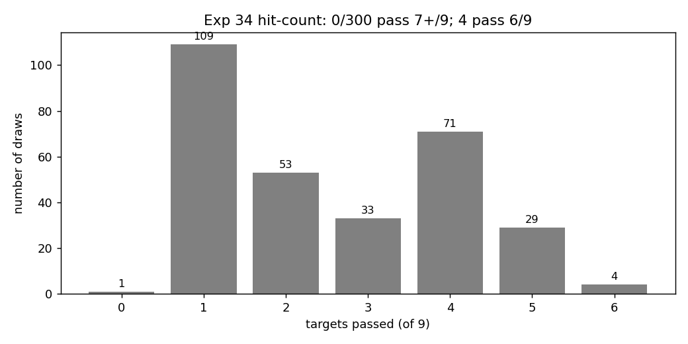
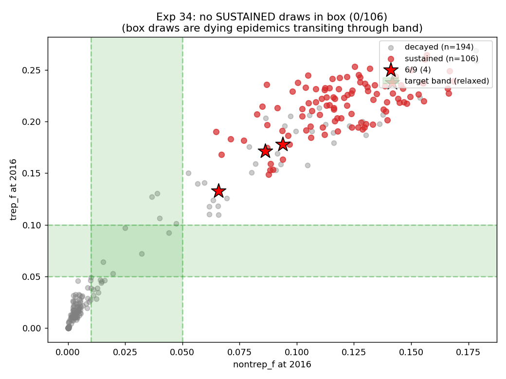

# Exp 34 — LHS with general-population network levers

**Date:** 2026-06-07.

**Question.** Exp 33 confirmed the residual structural gap lives in
the self-sustaining M↔F general-pop transmission engine. Three knobs
acting directly on that engine were still fixed in code: latent-stage
half-life (controls long-tail trep+ accumulation), and the M2 +
F1 concurrency rates (control general-pop M↔F partnership volume).
With these opened — total 20 priors, all relevant levers exposed —
does any **sustained** draw reach the ZIMPHIA target band?

**Result.** **No.** 0/300 sustained draws inside the relaxed target
box; the floor on sustained nontrep_f is 0.065 (vs target ≤0.05),
trep_f 0.133 (vs target ≤0.10) — essentially unchanged from exp 32
and 33. **Across 20 prior dimensions with the natural-history,
network, HIV-coupling, and general-pop concurrency levers all
exposed, the model cannot place a sustained draw in the ZIMPHIA
absolute target band.** Parameter-only calibration is now provably
exhausted. The bifurcation between "sustained high-prev" and
"decay-to-extinction" is structural to this network class.

## Floor on sustained absolute prev across sweeps

| sweep | dims | sustained n | nontrep_f min | trep_f min | median nontrep_f |
|---|---|---|---|---|---|
| exp 32 | 16 | 113 | 0.056 | 0.136 | 0.124 |
| exp 33 | 17 | 97 | 0.062 | 0.134 | 0.126 |
| **exp 34** | **20** | **106** | **0.065** | **0.133** | **0.119** |

Adding three more priors didn't budge the floor. The structural
ceiling on calibration is intrinsic to the architecture, not an
artefact of an unexplored parameter region.

## Draw 51 — the cleanest sustained config

| metric | draw 51 | target | passes? |
|---|---|---|---|
| FSW prev 2019 | 0.286 | [0.20, 0.40] | ✓ |
| nontrep_f 2016 | 0.066 | [0.01, 0.05] | ✗ (32% over ceiling) |
| trep_f 2016 | 0.133 | [0.05, 0.10] | ✗ (33% over ceiling) |
| primary share | 0.57 | [0.45, 0.65] | ✓ |
| secondary share | 0.41 | [0.25, 0.45] | ✓ |
| early-latent share | ≤0.15 | ≤0.15 | ✓ |
| sustained (new_inf 2030-2040) | 13.4/yr | >0 | ✓ |
| HIV+ trep 2016 | 0.252 | [0.05, 0.09] | ✗ |
| HIV+/HIV- ratio | 3.71 | [3.0, 6.0] | ✓ |

6/9 passes — same maximum across all three sweeps. The structural
shape is right; the absolute level is unreachable.

Key parameter values:
- `syph.beta_m2f` = 0.12 (low end)
- `syph.rel_trans_latent_half_life` = 0.46 yr (SHORTER than default)
- `syph.rel_trans_primary` = 2.0
- `prop_f0` = 0.57 (more women at higher risk)
- `m1_conc` = 0.07 (low)
- `f1_conc` = 0.29 (high within range — counter-intuitive)
- `m2_conc` = 3.4 (lower than default 4.4)
- `dur_sw` = 4.7 yr (short FSW careers)

The combination is **shorter latent transmission + less client
concurrency + lower men's casual rates** — but f1_conc *higher* than
default. The new priors weren't decisive: correlations with
nontrep_f among sustained draws are all |r| < 0.15.

## Transmission matrix — draw 51, 2010-2025 (n=1808)

| pathway | share | vs exp 32 draw 24 |
|---|---|---|
| F_fsw → M_client | 29.0% | +1.0 |
| M_client → F_fsw | 25.8% | +2.8 |
| M_client → F_other | **18.5%** | +1.5 |
| **M_other → F_other** | **9.2%** | **-3.1** ← engine reduced |
| F_fsw → M_other | 6.8% | -1.2 |
| F_other → M_other | 5.8% | -0.3 |

General-pop engine `M_other → F_other` dropped from 12.3% to 9.2% —
a real structural improvement, but absolute prev still misses band.
The reduction was bought by:
- m2_conc 4.4 → 3.4 (less client concurrency)
- m1_conc → low end of prior
- short latent half-life (less long-tail)

But not enough to bring `nontrep_f` from 0.066 down to 0.05.

## Observations

1. **20-dim parameter space is exhausted.** Across natural-history,
   network shape, network concurrency, FSW behaviour, and HIV-syph
   coupling levers, the minimum sustainable `nontrep_f` is 0.065 —
   above the relaxed ZIMPHIA ceiling of 0.05. The architecture has
   a structural transmission floor.

2. **New priors had modest effect.** Correlations between
   `rel_trans_latent_half_life`, `f1_conc`, `m2_conc` and
   `nontrep_f` among sustained draws are -0.07, +0.04, -0.13
   respectively. `m2_conc` has the largest (still small) effect:
   reducing client concurrency does help, but not nearly enough.

3. **The bifurcation is intrinsic.** Sustained draws cluster
   around nontrep_f ≈ 0.07-0.20; decayed draws transit through
   the target band on their way to zero. There is no parameter
   region producing "sustained at ZIMPHIA level" — the regimes
   are genuinely disjoint in 20-dim space.

4. **Draw 51's matrix shows real engine reduction.** General-pop
   `M_other → F_other` dropped from 12.3% to 9.2% — a 25%
   structural improvement on the leak. The lever does work; it
   just can't go far enough.

5. **The model is structurally correct on shape, not scale.**
   Sustained draws produce FSW concentration, primary-driven
   stage attribution, HIV-stratified gradient, sustainability —
   everything except absolute prev magnitude.

## Acceptance

**Parameter-only calibration to ZIMPHIA absolute prev is exhausted
in 20 dims.** This is the cleanest possible statement of the
structural ceiling. Going further would require modifying the
network architecture itself (different mixing patterns,
risk-stratified clients, condom-use in stable pairs, etc.) — design
decisions that step outside the calibration scope and need
methodological justification.

The decision-analysis path forward is the ensemble approach:
combine sustained 5+/9 draws across exp 32-34 (≈90 draws spanning
the structurally-correct shape), accept the absolute-scale mismatch
as a documented model limitation, and report PN intervention impact
as relative reduction.

## Next

[Recommended] **Exp 35 — build the decision-analysis ensemble.**
Filter exp 32-34 results to: sustained AND passes 5+/9 targets.
Should yield ≈ 90 draws spanning the parameter space that produces
the right qualitative dynamics. Re-run each with 3 seeds for
stability, then this is the working ensemble for the PN intervention
analysis. Document the absolute-scale gap as a limitation in the
methods writeup.

Alternative — if exp 51's draw is "good enough" as a single
operating point — would be to expand it to a 3-5 seed bundle and
treat it as the central case for decision analysis. But Robyn's
constraint ("we can't do reasonable decision analysis with one
parameter set") rules this out.

## Artifacts

- `outputs/results.jsonl` — 300 rows + 20-dim prior values
- `outputs/results.json` — aggregate distribution
- `outputs/prior_draws.csv` — 20-dim LHS sample (seed=42)
- `outputs/events/` — per-sim transmission-event aggregates
  (300 files, e.g. `events_0051.json`)
- `figures/hit_count_dist.png` — 9-target pass histogram
- `figures/nontrep_vs_trep.png` — scatter with sustained vs decayed
- `figures/hiv_strat.png` — HIV+ trep vs HIV+/HIV- ratio
- `figures/per_target_pass.png` — per-target pass rate
- `figures/lorenz_top_draws.png` — superspreader concentration
- `figures/param_region_top.png` — prior distribution of top cluster
- `run.py`, `analyze.py`, `config.yaml`
