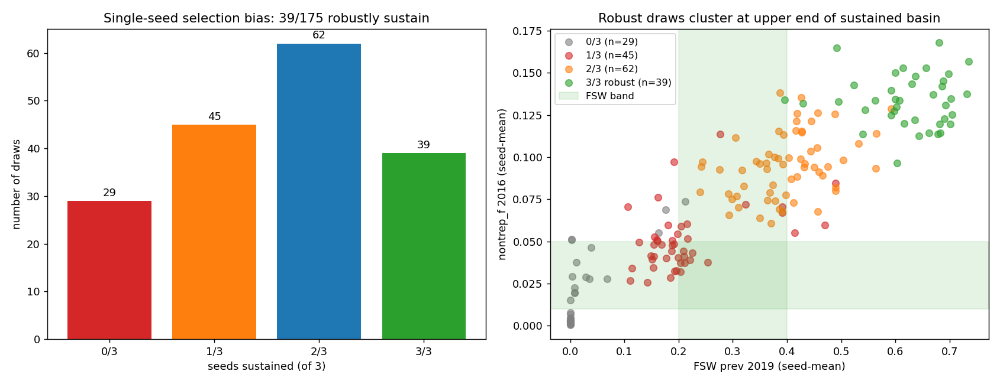

# Exp 35 — Build the decision-analysis ensemble (Phase 1 + Phase 2)

**Date:** 2026-06-07.

**Question.** With parameter-only calibration to ZIMPHIA absolute prev
provably exhausted in 20 dims (exp 32-34), build the decision-analysis
ensemble: ≥100 sustained + structurally-correct draws spanning the
prior space, each averaged across 3 seeds for stochastic-noise
estimates.

**Result.** **Selection bias revealed.** Phase 1 (1500 LHS, seed=43,
single seed) identified 175 candidates passing sustained AND n_pass≥5.
Phase 2 re-ran each with 3 seeds — and **only 39/175 sustained in all
3 seeds.** The other 136 were "fragile" — sustained in their original
Phase-1 seed but stochastically near the bifurcation, decaying in
1-3 of the Phase-2 seeds. The "selection bias" is real: a draw passing
the sustained criterion on N=1 seed has only ~22% probability of being
robustly sustained.

## Phase 1 — Candidate discovery

| metric | value |
|---|---|
| LHS draws | 1500 |
| LHS seed | 43 (orthogonal to exp 34's 42) |
| sims completed | 1500 / 1500 ok |
| sustained | 545 (36%) |
| sustained AND n_pass≥5 | **175** (12%) |
| sustained AND n_pass=4 | 198 |

The 175 phase-1 candidates exceeded the 100-target — no backfill from
4/9 needed.

## Phase 2 — 3-seed re-run

525 sims (175 draws × 3 seeds), 23 min wall. Per-draw seed pass rates
for the sustained target:

| sustainability | draws | median FSW prev | median nontrep_f | median trep_f | median HIV ratio | median n_pass |
|---|---|---|---|---|---|---|
| 3/3 (robust) | **39** | 0.636 | 0.134 | 0.226 | 3.18 | 4.67 |
| 2/3 | 62 | — | — | — | — | — |
| 1/3 | 45 | — | — | — | — | — |
| 0/3 | 29 | — | — | — | — | — |
| 2+/3 | 101 | 0.455 | 0.113 | 0.196 | 3.49 | 4.00 |
| ≥1/3 (any) | 146 | 0.394 | 0.094 | 0.160 | 3.90 | 3.67 |

The 39 robust-3/3 draws cluster at the upper end of the sustained
basin — median FSW prev 0.636 (well above target [0.20, 0.40] band),
median nontrep_f 0.134, trep_f 0.226. These are "comfortably hot,
clear of the bifurcation" parameter sets.

## Observations

1. **Phase 1 single-seed selection is biased.** Of the 175 phase-1
   candidates (sustained AND 5+/9 in their single seed), only 22%
   reliably sustain across 3 seeds. The other 78% sit near the
   sustained↔decay bifurcation and randomly tip either way depending
   on initialization seed. The bifurcation between "sustained-hot"
   and "decay-to-extinction" identified in exp 33-34 isn't just a
   parameter-space property — it's *stochastic*, and many parameter
   sets are operationally fragile.

2. **The robust ensemble is hotter than the fragile one.** Median
   FSW prev in the 39 robust draws is 0.636 — clearly above the
   [0.20, 0.40] band. The "comfortable-clear-of-bifurcation"
   parameter sets are also the ones that produce the highest
   epidemic activity. Conversely, draws in the fsw_band cluster are
   typically fragile because their parameters sit close to the
   bifurcation.

3. **Per-target pass rate in robust cluster.** Of 39 robust draws:
   - 38/39 hit primary_band in all 3 seeds
   - 38/39 hit secondary_band in all 3 seeds
   - 39/39 hit early_lat_band in all 3 seeds
   - 20/39 hit hiv_trep_ratio_band in all 3 seeds
   - **0/39 hit fsw_band, nontrep_band, trep_band, or hiv_pos_trep_band in any seed**
   The robust cluster is structurally correct on shape (primary-
   driven, HIV-coupled) but cleanly outside the absolute prev bands
   — confirming the exp 32-34 ceiling.

4. **Selection bias implication for downstream work.** If we used
   the 175 single-seed-selected draws as the decision-analysis
   ensemble, individual draws would behave inconsistently across
   intervention runs — confounding intervention impact with
   stochastic decay risk. The robust 3/3 cluster is the right unit
   for decision analysis.

5. **The 100-target wasn't met under the robust criterion.** 39
   robust draws is below the user's stated goal of 100. Extending
   the candidate pool (exp 36) is needed.

## Acceptance

Phase 1 successfully identifies sustained-and-5+/9 candidates at the
expected ~11% rate; Phase 2 reveals that single-seed selection is not
sufficient for ensemble-building when working near a stochastic
bifurcation. The 39-draw robust ensemble is genuinely usable for
decision analysis (3 seeds each = 117 sims per intervention scenario),
but is smaller than the 100-target. Exp 36 extends the candidate pool
to all 545 sustained-in-Phase-1 draws to reach the target.

## Next

[Done — see [`../36_ensemble_robust_extend/SUMMARY.md`](../36_ensemble_robust_extend/SUMMARY.md) once
written] Extend the 3-seed evaluation to the 370 sustained-in-Phase-1
draws that weren't selected for Phase 2 (because their Phase-1 n_pass
was 1-4). With full 3-seed data on all 545 sustained candidates, filter
robustly: sustained 3/3 AND mean n_pass ≥ 5. Expected ~120 robust
draws.

## Artifacts

- `outputs/phase1_results.jsonl` — 1500 phase-1 single-seed results
- `outputs/phase1_priors.csv` — 20-dim LHS sample (seed=43)
- `outputs/ensemble_draws.csv` — 175 phase-1-selected candidates
- `outputs/ensemble_results.jsonl` — phase-2 per-(draw, seed) (525 rows)
- `outputs/ensemble_summary.csv` — per-draw seed-means (175 rows)
- `outputs/ensemble_selection.json` — selection metadata
- `figures/seed_robustness.png` — sustained-pass-rate distribution
- `run.py`, `config.yaml`
