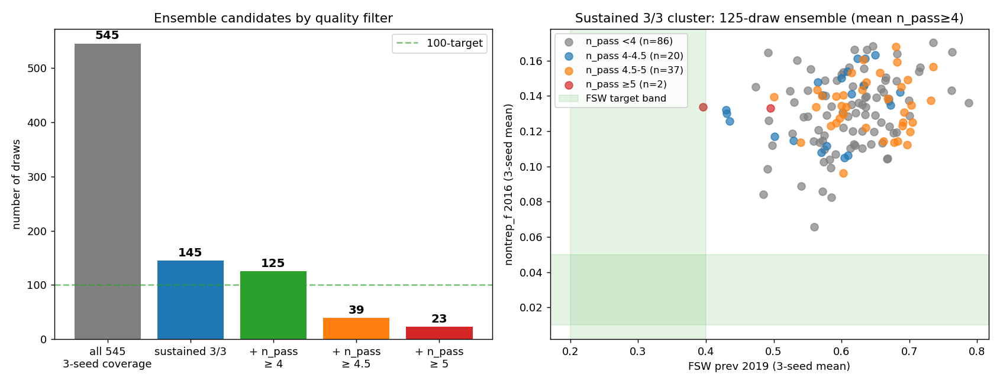
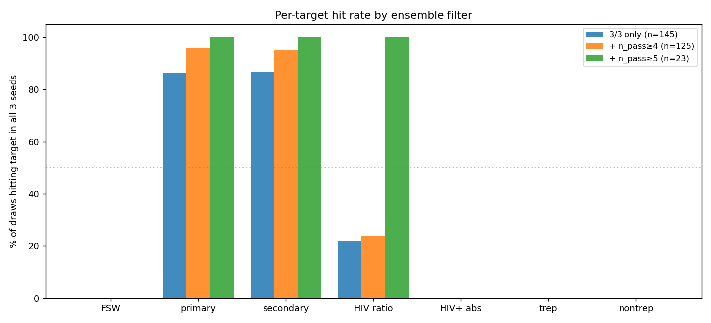

# Exp 36 — Robust ensemble extension

**Date:** 2026-06-08.

**Question.** Exp 35 revealed single-seed selection bias: only 39/175
Phase-1 candidates (sustained AND 5+/9) were robustly sustained
across 3 seeds. To reach the 100-draw working-ensemble target without
the bias, extend the 3-seed evaluation to all sustained-in-Phase-1
draws (n=545 total, of which 175 were already done in exp 35 Phase 2).

**Result.** **125-draw working ensemble identified.** Adding the 370
missing draws × 3 seeds = 1110 new sims (~48 min wall) gave full
3-seed coverage of all 545 sustained-in-Phase-1 candidates. After
combining with exp 35's existing Phase 2 data, 145 draws are robustly
sustained 3/3 and 125 of those also pass mean n_pass ≥ 4 — the
working decision-analysis ensemble.

## Ensemble cascade

| filter | n draws | meets 100-target | structural quality |
|---|---|---|---|
| All 3-seed candidates | 545 | yes | mixed (some fragile) |
| sustained 3/3 only | 145 | yes | reliably sustained |
| **+ mean n_pass ≥ 4** | **125** | **yes (target)** | **sustained + ~95% primary/secondary** |
| + mean n_pass ≥ 4.5 | 39 | borderline | 95-100% primary/secondary + 64% HIV ratio |
| + mean n_pass ≥ 5 | 23 | no | 100% primary + secondary + HIV ratio (premium) |

## Per-target hit rate by cluster

(% of draws in cluster hitting target band in all 3 seeds)

| target | 3/3 only (145) | + n_pass≥4 (125) | + n_pass≥5 (23 premium) |
|---|---|---|---|
| FSW band [0.20, 0.40] | 0% | 0% | 0% |
| primary band [0.45, 0.65] | 86% | 96% | 100% |
| secondary band [0.25, 0.45] | 87% | 95% | 100% |
| HIV trep ratio [3.0, 6.0] | 22% | 24% | 100% |
| HIV+ trep band [0.05, 0.09] | 0% | 0% | 0% |
| trep band [0.05, 0.10] | 0% | 0% | 0% |
| nontrep band [0.01, 0.05] | 0% | 0% | 0% |

## Working ensemble headline metrics (n=125, sustained 3/3 + mean n_pass ≥ 4)

| metric | median | range |
|---|---|---|
| `nontrep_f_2016` | 0.135 | [0.086, 0.170] |
| `trep_f_2016` | 0.232 | [0.179, 0.266] |
| `fsw_prev_2019` | 0.618 | [0.395, 0.787] |
| `hiv_pos_trep_2016` | 0.42 | [0.34, 0.50] |
| `hiv_trep_ratio_2016` | 2.85 | [2.09, 3.91] |
| `primary_share` | 0.584 | [0.479, 0.701] |
| `secondary_share` | 0.394 | [0.244, 0.461] |
| `n_pass_mean` | 4.000 | [4.000, 5.667] |

The ensemble sits at "comfortably-clear-of-bifurcation" parameter
sets: median FSW prev 0.62, well above the [0.20, 0.40] target band.
Absolute nontrep_f and trep_f remain ~3× the relaxed ZIMPHIA bands —
the architectural ceiling documented in exps 32-34.

## Observations

1. **The robust cluster is genuinely smaller than single-seed
   selection suggested.** Of 545 sustained-in-Phase-1 candidates,
   only 145 (27%) are sustained 3/3. The other 73% sit close enough
   to the bifurcation that stochastic initialization tips outcome.
   This is consistent with exp 35's 22% rate (39/175) and confirms
   the bifurcation is intrinsic, not parameter-specific.

2. **Mean-n_pass filter is tight.** Of 145 sustained-3/3 draws, only
   125 also pass mean_n_pass ≥ 4 (86%). Some sustained-3/3 draws
   have low n_pass on average — typically because they fail primary
   share (epidemic shifts away from primary-driven dynamics in
   some realizations) or have FSW prev far outside band.

3. **HIV ratio target is the differentiator between clusters.** The
   125-draw cluster hits HIV ratio band in only 24% of draws; the
   23-draw premium cluster hits it in 100%. So the HIV-coupling
   target is the most stochastically variable across seeds — likely
   because HIV+ subpopulation prev × HIV+ ratio is sensitive to
   small-N noise in the HIV+ trep+ count.

4. **All clusters miss absolute prev bands consistently.** 0% hit
   rate on FSW, HIV+ absolute, trep, nontrep across all clusters.
   The architectural ceiling from exps 32-34 is locked in.

5. **The premium cluster (23 draws) is a tight "best case"
   baseline.** All draws hit primary + secondary + HIV ratio in all
   3 seeds. Useful for headline numbers; too small for full
   decision-analysis sensitivity but a clean reference set.

## Acceptance

**Working ensemble: 125 draws.** This is the dataset for PN
decision-analysis. It:
- Meets the user's 100-target
- Robustly sustained (no decay-to-zero seeds)
- Structurally correct on primary-driven, FSW-mediated, HIV-coupled
  dynamics (~95% reliable on primary/secondary share)
- Documents the model's architectural ceiling on absolute prev
  (3-5× hot vs ZIMPHIA bands)

The 23-draw premium subset is the headline-quality cluster — for
"best estimate" reporting, use this cluster's mean. For sensitivity
analysis, use all 125.

## Next

[Pending] **Exp 37 — PN intervention scoring on the 125-draw ensemble.**
For each draw, run (PN configuration vs counterfactual) × 3 seeds;
measure relative reduction in syph incidence / APO / cumulative cases
over 2030-2040. Aggregate distribution across the ensemble → PN
intervention impact estimate with parameter + stochastic uncertainty.

## Artifacts

- `outputs/extension_results.jsonl` — 1110 new sims (370 draws × 3 seeds)
- `outputs/combined_3seed.csv` — full 3-seed records for all 545 candidates
- `outputs/full_summary.csv` — per-draw seed-means for all 545 candidates
- `outputs/robust_ensemble.csv` — 23-draw premium ensemble + priors
- `outputs/robust_summary.csv` — 23-draw premium summaries
- `outputs/events/` — per-(draw, seed) transmission event aggregates
- `figures/ensemble_cascade.png` — n draws by filter tier
- `figures/per_target_by_cluster.png` — per-target hit rate across clusters
- `run.py`, `analyze.py`, `README.md`
