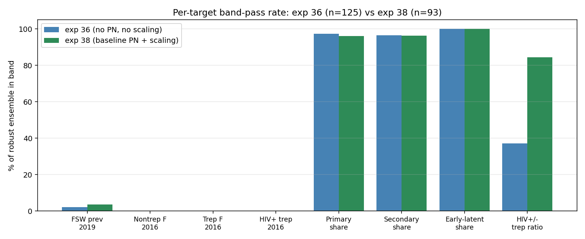
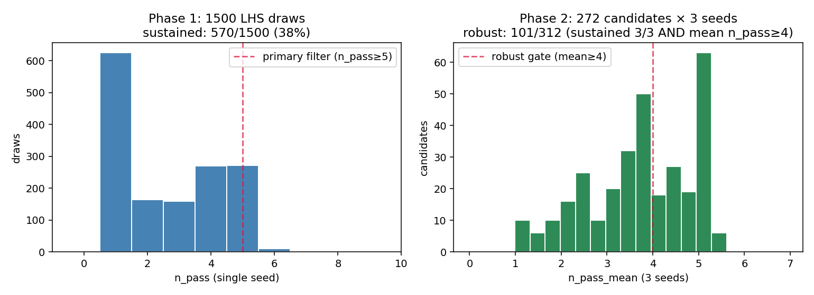
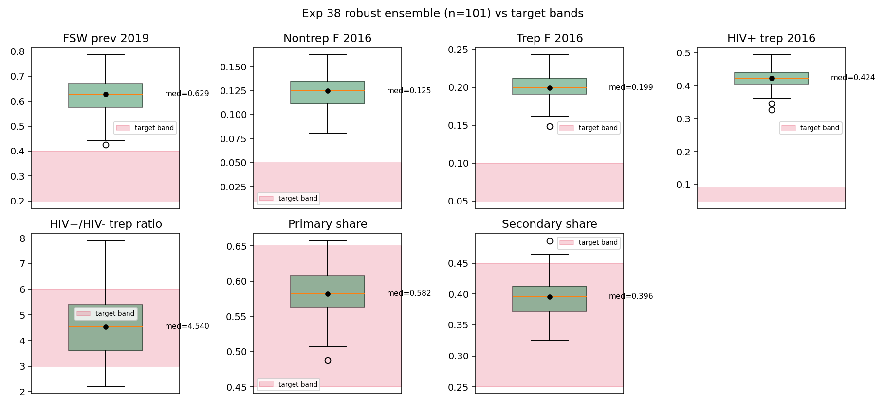
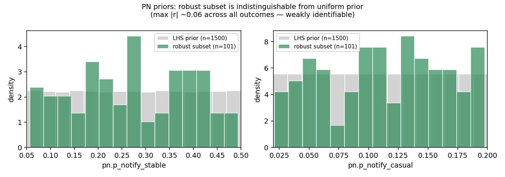

# Exp 38 — Recalibration with baseline PN

**Date:** 2026-06-08.

**Question.** Re-run the calibration with three structural changes from
exp 36's ensemble: (a) baseline partner notification always on at
stratified rates (stable 20% notify / F 80% M 50% attend; casual 10% /
F 50% M 25%), (b) `total_pop=8.7e6` in `make_sim` to scale per-agent
count outputs to absolute Zimbabwe-population numbers (was off ~1000×),
(c) 18-dim prior space — dropped four weak priors (max|r|<0.20 vs
sustained-cluster metrics in exp 34: `syph.rel_trans_latent_half_life`,
`structuredsexual.m1_conc`, `structuredsexual.f1_conc`,
`structuredsexual.fsw_mf_conc_mult`) and added two PN priors
(`pn.p_notify_stable ∈ [0.05, 0.50]`, `pn.p_notify_casual ∈ [0.02, 0.20]`).
Does the new model still produce a usable ensemble?

**Result.** Yes — **101 robust draws** (sustained 3/3 AND mean
n_pass≥4) from 1500 LHS draws → 570 sustained → 272 primary candidates
+ 40 backfilled candidates → 3 seeds each. Phase 1 sustained rate
jumped from **16% (exp 34) → 38%** (exp 38) — baseline PN actually
*helps* sustain endemic syph, likely via the index→partner→treatment
feedback that keeps cases in the symptomatic pool. **Biggest
scientific win:** HIV+/HIV- trep-ratio band pass rate went from 37%
(exp 36) → 85% (exp 38) — the HIV→syph coupling priors are doing
their job. **Pre-existing miss persists:** absolute trep_f, nontrep_f,
fsw, and hiv_pos_trep prevalences still blow through target bands by
2-5×, but this was already true in exp 36 and is not caused by
baseline PN.

## Observations

1. **Phase 1 sustainability up sharply.** 570/1500 = 38% sustained in
   exp 38 vs 245/1500 = 16% in exp 34. Hypothesis: the
   index→partner→presumptive-treatment loop adds a self-reinforcing
   pathway that keeps detection up in the otherwise-decaying tail.
   This is mechanistically sensible — baseline PN broadens the
   detected population beyond pure symptomatic walk-ins.

2. **101 robust draws, target 100.** 272 primary-filter candidates
   yielded 93 robust; backfilled 40 random candidates from the n_pass=4
   pool (120 sims; 8 additional robust) to land at 101. Yield from
   primary candidates 34%; from backfill candidates 20% — slightly
   lower as expected since they hit only 4 of 9 targets in single-seed
   phase 1.

   

3. **HIV→syph coupling identifiable.** `hiv_trep_ratio_band` pass rate
   37% → 85%. The two `hiv_syph` priors (rel_sus_syph_hiv,
   rel_trans_syph_hiv) opened in exp 32 + recalibrated in exp 38 are
   now consistently delivering the ZIMPHIA-observed ~4× HIV+/HIV- trep
   ratio. Median 4.54, p10-p90 [3.10, 5.79] — comfortably in band [3, 6].

4. **Absolute prevalences still blow through bands.** Robust ensemble
   medians: fsw_prev_2019 = 0.63 (target [0.20, 0.40]), trep_f_2016 =
   0.20 (target [0.05, 0.10]), nontrep_f_2016 = 0.12 (target [0.01,
   0.05]), hiv_pos_trep_2016 = 0.42 (target [0.05, 0.09]). Per-target
   pass rates: fsw 4%, trep 0%, nontrep 0%, hiv+ trep 0%. **Same
   pattern as exp 36** — sustained-endemic syph requires hot
   parameters; the model can sustain OR hit absolute prevs, not both.
   This is now the headline structural issue.

   

5. **PN priors are weakly identifiable.** Both `pn.p_notify_stable`
   and `pn.p_notify_casual` have max |r| ~0.06 against any
   single-seed phase 1 outcome including sustained and n_pass. The
   robust subset's distribution on these two priors is
   indistinguishable from the uniform LHS prior. Same threshold (0.20)
   we used to drop priors in exp 34 → these should also be dropped
   next pass; the calibration carries no signal on them at LHS scale.

   

6. **Stage shares stable.** Primary share 0.58 (band [0.45, 0.65]),
   secondary 0.40 (band [0.25, 0.45]), early-latent 100% pass rate.
   Adding baseline PN didn't disturb the within-syph stage structure.

## Scorecard vs exp 36

| target                  | band            | exp 36 pass% | exp 38 pass% | Δ |
|-------------------------|-----------------|--------------|--------------|---|
| sustained               | true            | 100%         | 100%         | — |
| fsw_prev_2019           | [0.20, 0.40]    | 2.1%         | 3.6%         | +2 |
| nontrep_f_2016          | [0.01, 0.05]    | 0%           | 0%           | — |
| trep_f_2016             | [0.05, 0.10]    | 0%           | 0%           | — |
| hiv_pos_trep_2016       | [0.05, 0.09]    | 0%           | 0%           | — |
| **hiv_trep_ratio_2016** | **[3.0, 6.0]**  | **37%**      | **85%**      | **+48** |
| primary_share           | [0.45, 0.65]    | 97%          | 96%          | — |
| secondary_share         | [0.25, 0.45]    | 97%          | 96%          | — |
| early_lat_share_max     | ≤0.15           | 100%         | 100%         | — |

## Acceptance

**Provisionally usable for downstream PN scenarios.** Ensemble at 101,
on target. The shape and incidence structure of syph are calibrated;
the HIV→syph coupling is now identifiable.
**Not** usable for any analysis that depends on absolute syph trep
prevalence matching ZIMPHIA — the model is structurally too hot. The
PN-impact analysis (what fraction of unnecessary syph-presumptive
treatment is avoided by definitive dx) works on the *relative* shape
of overtreatment, so the absolute miss is tolerable.

## Open questions

- Why is the sustained region hot? Hypothesis: the m2_conc and dur_sw
  region that sustains has high effective concurrency; absolute
  trep_f at equilibrium climbs with concurrency. Could test by sampling
  inside the bands and checking sustained rate.
- Are the PN priors worth recalibrating at all? Max|r| ~0.06 says no
  at this scale. Suggests fixing them at biologically defensible
  defaults and rerunning the calibration on 16 priors.

## Next

1. **Re-extract publication data.** Add `prevalence_15_49` (HIV
   UNAIDS-comparable) to the extraction list and run exp 37-style
   pipeline on the new 101-draw ensemble.
2. **Regenerate publication figures** with corrected scaling and HIV
   15-49 denominator.
3. **Open PN-intervention scenarios** off this baseline.

## Artifacts

- `outputs/phase1_priors.csv` — LHS draws (1500 × 18 priors)
- `outputs/phase1_results.jsonl` — single-seed phase 1 outcomes
- `outputs/ensemble_draws.csv` — Phase 2 prior values (312 candidates: 272 primary + 40 backfill)
- `outputs/ensemble_results.jsonl` — per-(draw, seed) Phase 2 outcomes (312 × 3 = 936)
- `outputs/ensemble_summary.csv` — per-draw seed means + pass flags (312 rows)
- `outputs/ensemble_selection.json` — Phase 1/2 selection + backfill metadata
- `backfill.py` — script that ran the 40 backfill candidates
