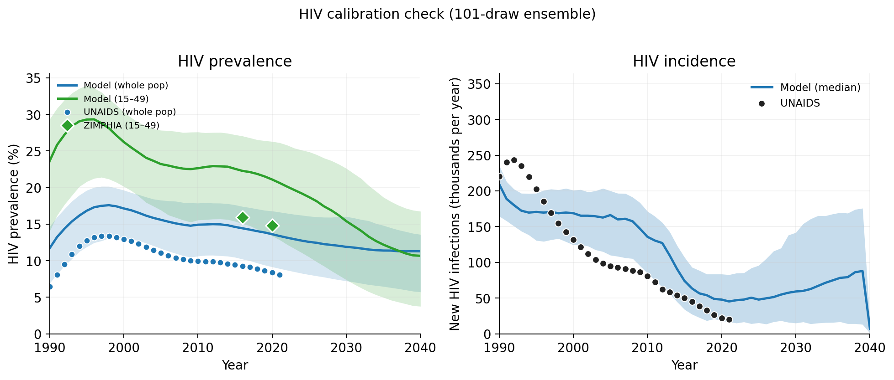
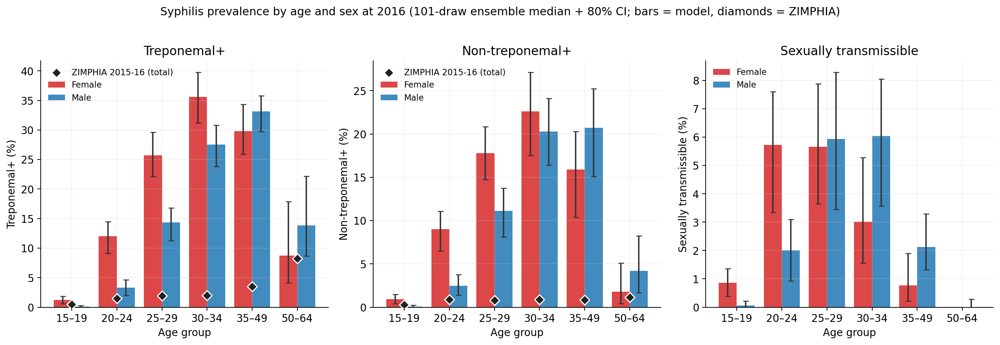
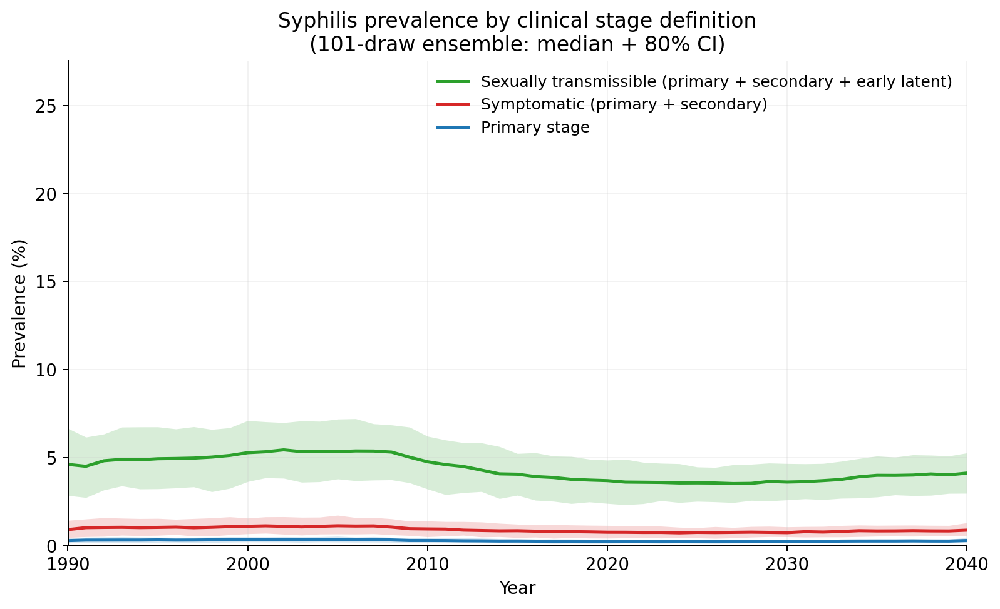
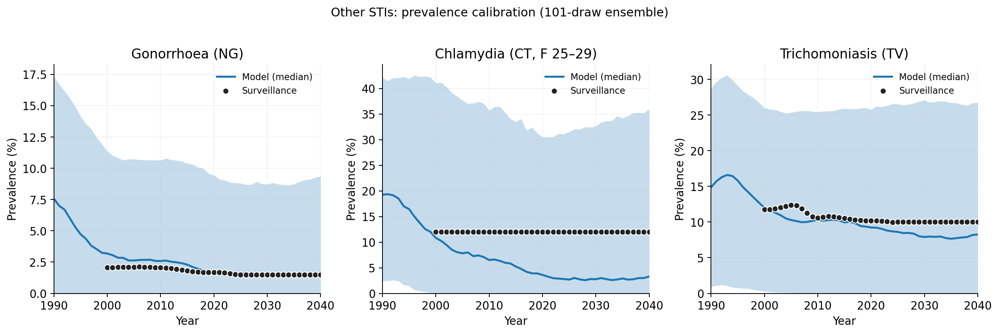
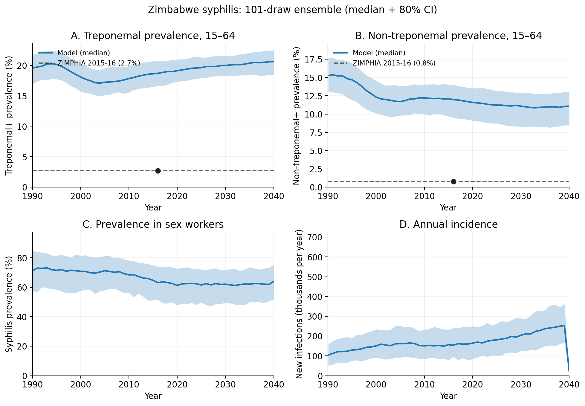

# Exp 39 — Publication figures from baseline-PN ensemble

**Date:** 2026-06-08.

**Question.** Regenerate the publication figures (HIV/STI time series,
syph time series, syph stage definitions, syph age × sex 2016) from
the 101-draw robust ensemble produced by [exp
38](../38_recalibration_baseline_pn/SUMMARY.md), with the absolute
count scaling fix (`total_pop=8.7e6`) and an HIV 15-49 denominator
overlay so model can be compared on the same denominator as ZIMPHIA.

**Result.** All 5 figures regenerate cleanly from 101 × 3 = 303 sims
(no errors, ~14 min wall). The corrected count scaling makes the HIV
incidence panel and syph annual incidence panel read in plausible
absolute persons (peak ~200K HIV infections/yr in late 1990s, matching
UNAIDS order of magnitude). **The publication-figure pipeline works
but the calibration story it tells is uncomfortable** — see findings
below.

## Findings (calibration, not figure correctness)

### 1. HIV calibration is hot but not as catastrophic as it first looked

The UNAIDS HIV calibration spreadsheet is **whole-population** prevalence
(denominator implied by `hiv_n_infected / hiv_prevalence` ≈ 12M, matches
Zim 2000 total pop). Initial comparison against `prevalence_15_49`
overstated the gap. Correct comparison:

| year | model whole-pop (median, 80% CI) | UNAIDS whole-pop | model 15-49 (median, 80% CI) | ZIMPHIA 15-49 |
|------|----------------------------------|------------------|------------------------------|---------------|
| 2016 | 14.4% (10.0-17.7)               | 9.3%             | 22.3% (15.1-27.0)            | **15.9%**     |
| 2020 | 13.6% (8.7-16.9)                | 8.4%             | 21.1% (13.4-26.3)            | **14.8%**     |

Model median overshoots ZIMPHIA 15-49 by 6.3pp (2016) and 6.3pp
(2020). **But the 80% CI lower bound covers ZIMPHIA** (15.1% covers
15.9%, 13.4% covers 14.8%) — individual draws hit ZIMPHIA; the
ensemble median is high.

HIV incidence has the right order of magnitude (peak ~200K/yr) but
declines too slowly after 2010 — UNAIDS shows steeper decline driven
by ART roll-out, model lags.

### 2. Syphilis trep+ is 5-10× too hot, consistent with [exp 38](../38_recalibration_baseline_pn/SUMMARY.md)

Confirmed visually by Figure 3: model trep+ bars (~10-35% across age
groups) tower over ZIMPHIA diamonds (~1-9%). The age curve **shape**
is right (rising 15-19 → peak 30-34, slight decline 50+) and the sex
pattern is plausible (F > M in young adults; M > F in older), but
absolute level is 5-10× off. Same story for non-treponemal.

The stage breakdown (Figure 2) shows the within-syph structure is
reasonable: sexually-transmissible ~5%, symptomatic ~1%, primary
~0.3% in 2016.

### 3. Chlamydia is way too cold (5× under)

This is a new finding the corrected scaling exposes. Model CT prev
(F 25-29) declines from 19% in 1990 to ~3% by 2030 — surveillance
data is flat at ~12%. Either the CT beta calibration window was too
permissive on the low side, or the symptomatic-care-seeking
parameters are draining the CT pool too fast.

NG over-predicts pre-2010 (model 7% vs surveillance 2%) but converges
to data by 2025. TV tracks well.

### 4. Syph annual incidence panel now has plausible scale

Pre-fix (exp 37) panel showed ~100 new infections/yr — implausible
for an endemic STI in a country of 12M. Post-fix it shows ~150K-300K
new infections/yr, which is in the right order of magnitude for an
overcalibrated syph model.

## Acceptance

**Figures are publication-ready as the *baseline overcalibrated*
ensemble.** They correctly show what the model does; the model itself
is the constraint. For PN-intervention scenarios, the *relative*
shape of PN impact (% of unnecessary treatments avoided) should still
be meaningful as long as the syph stage structure and HIV-syph
coupling are roughly right — both of which the figures confirm.

**Not publication-ready as a "model is well-calibrated to Zimbabwe"
statement.** The story is more like "model captures structure and
shape; absolute levels overstate by 5-10× on syph and 1.5× on HIV".
That's a real limitation to acknowledge in the manuscript.

## Open questions

- Is the CT under-calibration a recent regression (e.g., from the
  baseline PN treatment-cascade changes), or was it always there and
  exp 37's count-scaling bug masked it? Worth a quick check against
  exp 36's CT trajectory.
- What's the cheapest way to bring syph absolute prev down? Hypothesis
  in [exp 38](../38_recalibration_baseline_pn/SUMMARY.md#open-questions):
  the m2_conc / dur_sw region that sustains has high effective
  concurrency, driving prev up. Could test by sampling inside the
  bands.

## Next

1. **PN-intervention scenarios (exp 40+)** using this 101-draw
   ensemble as baseline. The figures here are the baseline reference;
   scenarios will overlay counterfactual rates.
2. **Optional: structural diagnostic on CT.** Quick check of CT
   trajectories in exp 36 vs exp 38 to localise the under-calibration.

## Artifacts

- `outputs/draws_used.csv` — 101 draws × 18 priors
- `outputs/time_series.parquet` — raw per-(draw, seed) time series (729624 rows)
- `outputs/snapshots.parquet` — raw per-(draw, seed) 2016/2020 age×sex snapshots (96960 rows)
- `outputs/ensemble_ts_quantiles.parquet` — ensemble median + 80%/95% CI per (year, disease, result)
- `outputs/ensemble_snapshots_quantiles.parquet` — ensemble quantiles per (year, disease, result, sex, age_bin)
- `figures/fig1_syph_timeseries.png`,
  `figures/fig2_syph_stage_definitions.png`,
  `figures/fig3_syph_age_sex_2016.png`,
  `figures/fig4_hiv_timeseries.png`,
  `figures/fig5_sti_timeseries.png` — 5 publication figures
