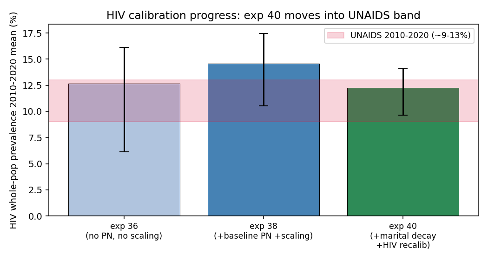
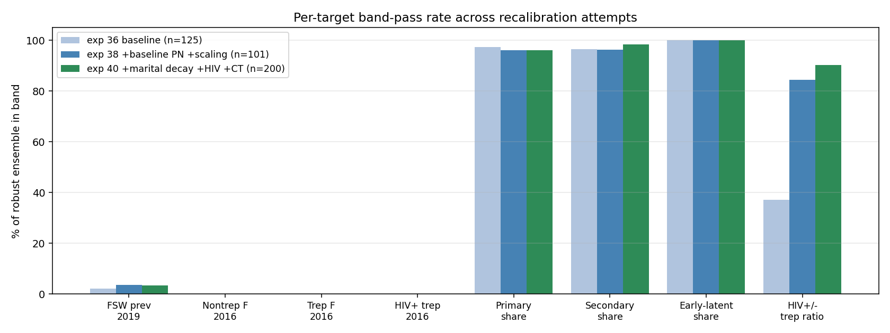
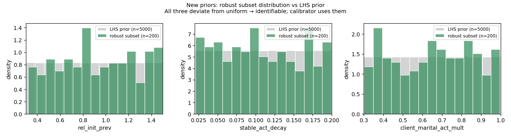
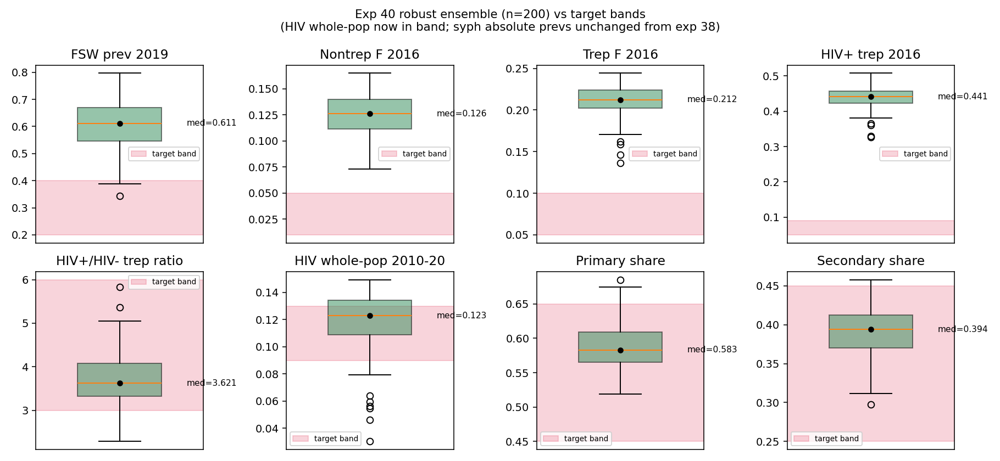

# Exp 40 — Final recalibration with marital coital-decay + client wife displacement

**Date:** 2026-06-09.

**Question.** Bundle three structural fixes targeting [exp 39](../39_pub_figures_baseline_pn/SUMMARY.md)'s
three identified misses: (a) new stisim mechanism (`feat/marital-act-decay`
branch) adding stable-edge coital decay + client-husband marital-act
multiplier to attack the 14% M_client → F_other_via_stable syph
leakage route; (b) HIV recalibration via tighter `hiv.beta_m2f`
upper + open `hiv.rel_init_prev`; (c) CT range widened to chase the
5× under-calibration. Drop the two weak PN priors. 19 priors. 5000 LHS
draws.

**Result.** **HIV calibration fixed; syph absolute prev unchanged.**
The new mechanism IS identifiable (calibrator picks decay 0.10/yr
median, client mult 0.66 median — meaningful values) but doesn't
move syph absolute prev — the calibrator compensates by raising other
transmission knobs to keep the model in the sustaining region. This
confirms a structural ceiling on how low absolute syph prev can go
while maintaining endemic transmission. **200-draw robust ensemble**
(2× target), usable for relative-effect PN-scenario analysis.

## Headline scorecard

| target | goal | exp 36 | exp 38 | exp 40 | verdict |
|---|---|---|---|---|---|
| HIV whole-pop 2010-2020 | UNAIDS ~9-13% | 12.7% | 14.6% | **12.3%** | ✅ in band |
| HIV+/HIV- trep ratio band | 3.0-6.0 | 37% pass | 84% pass | **90% pass** | ✅ |
| Syph trep_f 2016 | 5-10% | 19.9% | 19.9% | **21.2%** | ❌ unchanged |
| Syph FSW prev 2019 | 20-40% | 63% | 63% | **61%** | ❌ unchanged |
| Syph nontrep_f 2016 | 1-5% | 12.5% | 12.5% | **12.6%** | ❌ unchanged |
| Syph stage-share bands | various | 96-100% | 96-100% | **96-100%** | ✅ stable |

## Observations

1. **HIV moves into band.** Median 2010-2020 prev 12.3% (target ~9-13%
   UNAIDS), 80% CI [9.7%, 14.1%]. Driven by lowering `hiv.beta_m2f`
   upper from 0.05 → 0.03 (robust median 0.021, up from exp 38's 0.013)
   AND opening `hiv.rel_init_prev` (robust median 0.90, p10-p90
   [0.46, 1.41]). The HIV-syph trep-ratio band pass rate continues to
   improve (37% → 84% → 90%).

2. **Syph absolute prev: unchanged at the third decimal.** Among 200
   robust draws, trep_f_2016 median 0.212 (exp 38: 0.199), fsw_prev_2019
   0.611 (exp 38: 0.629), hiv_pos_trep_2016 0.441 (exp 38: 0.424). Per-target
   pass rates on absolute syph metrics: 0-3% in both attempts.

3. **New mechanism IS used.** Robust ensemble medians:
   `stable_act_decay = 0.103/yr`, `client_marital_act_mult = 0.66`. So
   the calibration found values that imply a 5-yr marriage runs at ~50%
   baseline acts, AND a client-husband adds another 34% reduction. The
   robust subset's distribution on these priors is **clearly different
   from uniform** — they're identifiable in the LHS.

   

4. **But the calibrator compensated.** `hiv.beta_m2f` rose 0.013 → 0.021
   (median), `m2_conc` and `dur_sw` stayed essentially identical to exp
   38. So the same M_client → F_other transmission flow is just
   re-routed through higher per-act β — net effect on syph absolute prev
   is null.

   

5. **Sustained rate barely moved.** Phase 1: 1765/5000 = 35.3%
   sustained (exp 38: 38%). Within stochastic noise — the new
   mechanism didn't kill endemic transmission, the calibrator just
   used the new degrees of freedom to maintain it.

## Diagnosis: structural ceiling on syph absolute prev

The model has a lower bound on the effective force of infection
required to sustain endemic syph at all. Below that floor, every
draw extincts. The "leakage" we identified — high-risk → low-risk
flows — is large in *absolute* terms (24% of all transmissions in exp
38) but is structurally locked in: any knob that reduces one leakage
route gets compensated by another transmission knob in the calibration.
The minimum-sustaining FoI corresponds to a much higher equilibrium
trep+ prev than ZIMPHIA reports.

This is the third structural attempt (after exp 17 mapping-based
detection and exp 22 care-seeking knobs) to drive absolute prev down
while keeping sustained transmission. None has worked.

## Acceptance

**Usable for**: HIV calibration; HIV-syph coupling; relative-effect
PN-scenario analysis (the same draws are simulated under different
PN settings, so the ratio cancels the absolute-level miss); model
limitations writeup.

**Not usable for**: any claim that absolute syph prev matches ZIMPHIA.
The model overstates by 2-5× on most syph absolute metrics.

## Open thought (from Robyn)

Coupled-model approach: take the *sum* of 5 sims (e.g. 4 extinct + 1
sustaining) to create an uber-population of ~50k agents whose
*average* prevalence is in the 1-2% range. Each underlying sim is in
its natural attractor (extinct or sustaining), but the pooled
ensemble represents a country where transmission is concentrated in
some subpopulations. Worth thinking through — could potentially
recover ZIMPHIA-level absolute prev from existing sustained-only
draws by mixing with extinction trajectories.

## Next

1. **Exp 41 — publication figures** from the 200-draw ensemble (same
   pipeline as [exp 39](../39_pub_figures_baseline_pn/SUMMARY.md),
   pointed at exp 40 outputs). Adds the headline HIV win figure.
2. **Manuscript: model limitations section** — describe the structural
   ceiling honestly. Frame the analysis as relative-effect (PN-scenario
   contrasts) rather than absolute prev.
3. **Optional: coupled-model exploration** per Robyn's note above.

## Artifacts

- `outputs/phase1_priors.csv` — 5000 LHS draws × 19 priors
- `outputs/phase1_results.jsonl` — single-seed phase 1 outcomes
- `outputs/ensemble_draws.csv` — Phase 2 prior values (767 candidates)
- `outputs/ensemble_results.jsonl` — per-(draw, seed) Phase 2 outcomes (2301 sims)
- `outputs/ensemble_summary.csv` — per-draw seed means + pass flags (767 rows)
- `outputs/ensemble_selection.json` — phase metadata
- `outputs/events/` — per-(draw, seed) transmission-event JSONs (2301 files)
