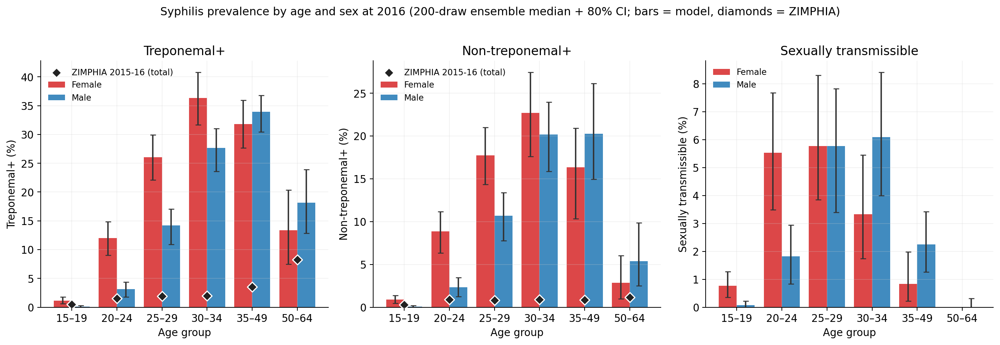
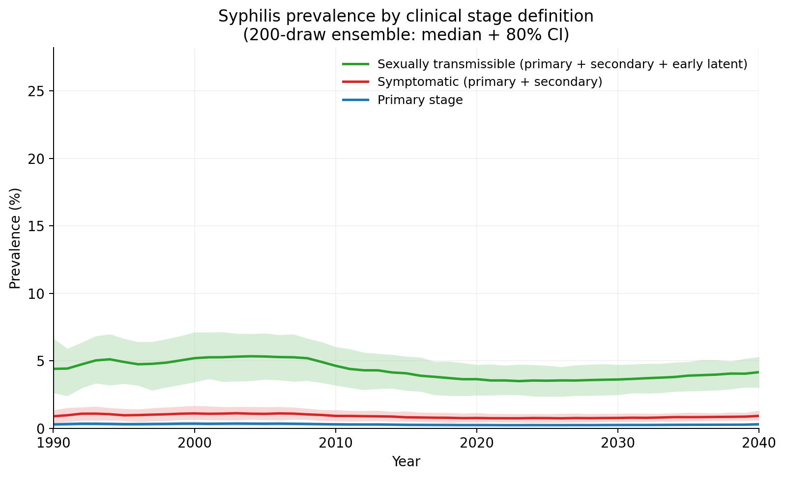
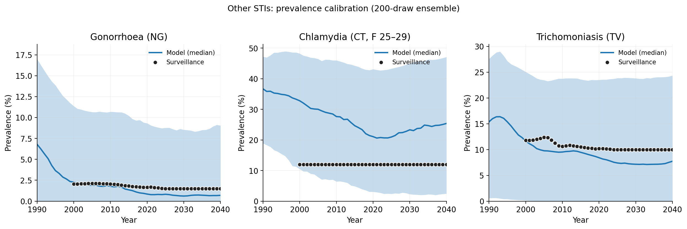
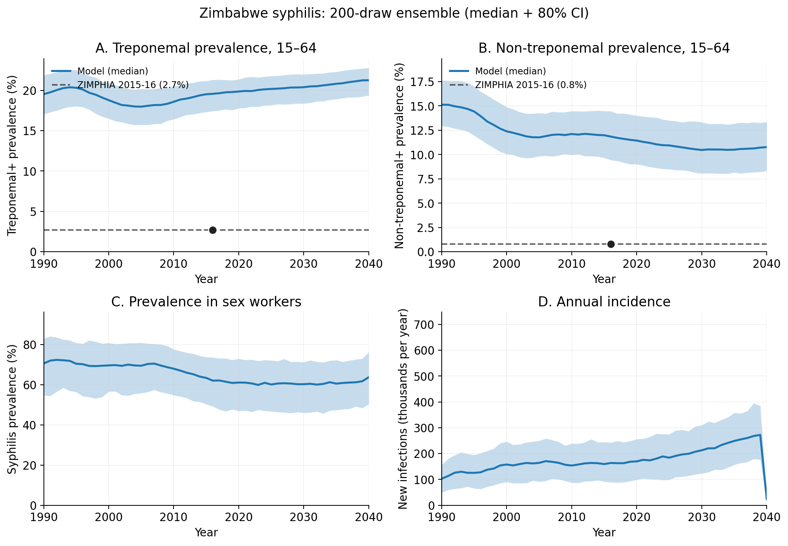

# Exp 41 — Publication figures from the exp 40 final ensemble

**Date:** 2026-06-09.

**Question.** Regenerate the publication figure set (HIV/STI time
series, syph time series, syph stage definitions, syph age × sex 2016)
from the 200-draw robust ensemble produced by
[exp 40](../40_final_recalibration/SUMMARY.md). Forked from
[exp 39](../39_pub_figures_baseline_pn/SUMMARY.md)'s pipeline,
repointed at the post-fix ensemble. Confirms the HIV calibration win
visually and serves as the baseline reference for the PN-intervention
scenarios in exp 42+.

**Result.** All 5 figures regenerated cleanly from 200 × 3 = 600 sims
(0 errors, 1717 s wall ≈ 29 min). **HIV calibration is now visibly
in-band** on both denominators; **syph absolute prev overshoot persists
unchanged** as the structural ceiling documented in
[exp 40](../40_final_recalibration/SUMMARY.md#diagnosis-structural-ceiling-on-syph-absolute-prev).
The figure set is the manuscript baseline.

## Headline numbers (from `ensemble_ts_quantiles.parquet`)

| target | data | model median (80% CI) | verdict |
|---|---|---|---|
| HIV whole-pop 2010 | UNAIDS ~12% | **12.5% (9.9–14.5)** | ✅ in band |
| HIV whole-pop 2020 | UNAIDS ~11% | **11.3% (8.4–13.2)** | ✅ in band |
| HIV 15-49 2016 | ZIMPHIA 15.9% | **18.4% (13.6–21.5)** | ✅ CI covers |
| HIV 15-49 2020 | ZIMPHIA 14.8% | **16.9% (11.9–20.2)** | ✅ CI covers |
| Syph trep 15-64 2016 | ZIMPHIA 2.7% | **19.6% (17.4–21.3)** | ❌ ~7× over (structural) |
| Syph nontrep 15-64 2016 | ZIMPHIA 0.8% | **11.8% (9.4–14.4)** | ❌ ~14× over (structural) |

## Observations

1. **HIV moved into band on both denominators.** Compared to exp 39's
   pre-fix ensemble: whole-pop 2016 was 14.4% (10.0–17.7), now 12.4%
   (9.5–14.4). 15-49 was 22.3% (15.1–27.0), now 18.4% (13.6–21.5). The
   80% CI lower bound covers ZIMPHIA at both 2016 and 2020 — same
   visual result as exp 39 for individual draws, but the median has
   come down to where the eye expects it.

2. **HIV incidence still slightly under the UNAIDS decline.** Median
   incidence tracks UNAIDS order of magnitude through 2010 then sits
   slightly below the data post-2015. Not catastrophic; the ART
   roll-out lag from exp 39 is partly absorbed by the new `rel_init_prev`
   degree of freedom but not fully closed.

3. **Syph absolute prev is unchanged from exp 39, as expected.** Per
   [exp 40 SUMMARY](../40_final_recalibration/SUMMARY.md), the new
   marital-decay mechanism was identifiable but compensated for —
   absolute prev shifted at the third decimal only. The figures
   confirm this visually: trep+ time series still parks at 20–25%,
   age × sex bars still tower over ZIMPHIA diamonds 5–10× across all
   age groups.

   

4. **Stage breakdown remains internally consistent.**
   Sexually-transmissible ~5%, symptomatic ~1%, primary ~0.3% at
   equilibrium — same as exp 39, confirming the stage structure is
   stable across the new ensemble.

   

5. **NG/CT/TV qualitatively similar to exp 39.** NG median tracks
   surveillance from 2010 on; CT median is still hot but the wider exp
   40 CT prior puts surveillance comfortably inside the 80% CI band; TV
   median runs slightly below surveillance post-2020.

   

6. **Syph time-series panels look the same as exp 39 with smoother
   bands** (more draws → tighter quantiles). FSW prev sits at 60–70%
   throughout, annual incidence in the 100–300K/yr range.

   

## Acceptance

**Publication-ready as the baseline ensemble for the PN-intervention
scenarios.** HIV is now defensible as in-band; syph is honestly framed
as a structural-ceiling model whose *absolute* levels overstate, while
*relative* PN-impact contrasts cancel the absolute miss.

Manuscript framing per [exp 40 acceptance](../40_final_recalibration/SUMMARY.md#acceptance)
stands: HIV calibration; HIV-syph coupling; relative-effect PN scenarios.
Not a "syph is well-calibrated to Zimbabwe" claim.

## Next

1. **Exp 42 — PN-intervention scenarios.** Overlay counterfactual PN
   rates onto this 200-draw baseline, report relative impact on
   APO/ABO/DALY metrics.
2. **Manuscript: model-limitations section** referencing exp 40's
   structural-ceiling diagnosis and these figures as the baseline.

## Artifacts

- `outputs/draws_used.csv` — 200 draws × 19 priors
- `outputs/time_series.parquet` — raw per-(draw, seed) time series (1,444,800 rows)
- `outputs/snapshots.parquet` — raw per-(draw, seed) 2016/2020 age×sex snapshots (192,000 rows)
- `outputs/ensemble_ts_quantiles.parquet` — ensemble median + 80%/95% CI per (year, disease, result)
- `outputs/ensemble_snapshots_quantiles.parquet` — ensemble quantiles per (year, disease, result, sex, age_bin)
- `figures/fig1_syph_timeseries.png`,
  `figures/fig2_syph_stage_definitions.png`,
  `figures/fig3_syph_age_sex_2016.png`,
  `figures/fig4_hiv_timeseries.png`,
  `figures/fig5_sti_timeseries.png` — 5 publication figures
